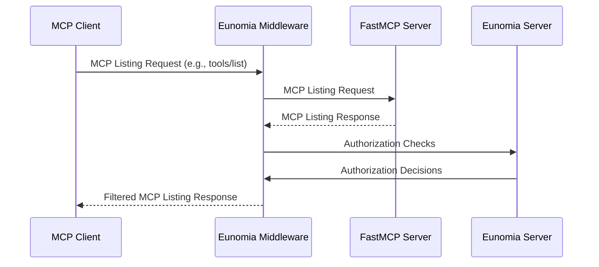
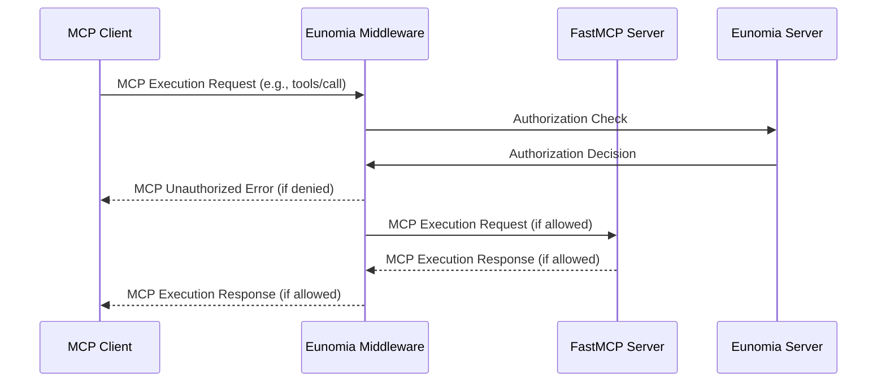
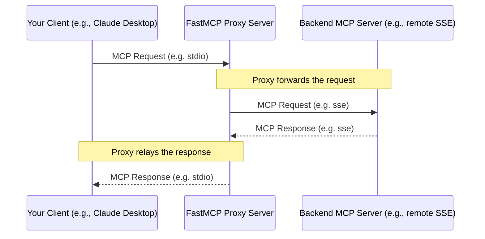

# null
Source: https://gofastmcp.com/changelog


<Update label="v2.10.5" description="2025-07-11">
  ## [v2.10.5: Middle Management](https://github.com/jlowin/fastmcp/releases/tag/v2.10.5)

  A maintenance release focused on OpenAPI refinements and middleware fixes, plus console improvements.

  ## What's Changed

  ### Enhancements 🔧

  * Fix Claude Code CLI detection for npm global installations by [@jlowin](https://github.com/jlowin) in [#1106](https://github.com/jlowin/fastmcp/pull/1106)
  * Fix OpenAPI parameter name collisions with location suffixing by [@jlowin](https://github.com/jlowin) in [#1107](https://github.com/jlowin/fastmcp/pull/1107)
  * Add mirrored component support for proxy servers by [@jlowin](https://github.com/jlowin) in [#1105](https://github.com/jlowin/fastmcp/pull/1105)

  ### Fixes 🐞

  * Fix OpenAPI deepObject style parameter encoding by [@jlowin](https://github.com/jlowin) in [#1122](https://github.com/jlowin/fastmcp/pull/1122)
  * xfail when github token is not set ('' or None) by [@jlowin](https://github.com/jlowin) in [#1123](https://github.com/jlowin/fastmcp/pull/1123)
  * fix: replace oneOf with anyOf in OpenAPI output schemas by [@MagnusS0](https://github.com/MagnusS0) in [#1119](https://github.com/jlowin/fastmcp/pull/1119)
  * Fix middleware list result types by [@jlowin](https://github.com/jlowin) in [#1125](https://github.com/jlowin/fastmcp/pull/1125)
  * Improve console width for logo by [@jlowin](https://github.com/jlowin) in [#1126](https://github.com/jlowin/fastmcp/pull/1126)

  ### Docs 📚

  * Improve transport + integration docs by [@jlowin](https://github.com/jlowin) in [#1103](https://github.com/jlowin/fastmcp/pull/1103)
  * Update proxy.mdx by [@coldfire-x](https://github.com/coldfire-x) in [#1108](https://github.com/jlowin/fastmcp/pull/1108)

  ### Other Changes 🦾

  * Update github remote server tests with secret by [@jlowin](https://github.com/jlowin) in [#1112](https://github.com/jlowin/fastmcp/pull/1112)

  ## New Contributors

  * [@coldfire-x](https://github.com/coldfire-x) made their first contribution in [#1108](https://github.com/jlowin/fastmcp/pull/1108)
  * [@MagnusS0](https://github.com/MagnusS0) made their first contribution in [#1119](https://github.com/jlowin/fastmcp/pull/1119)

  **Full Changelog**: [v2.10.4...v2.10.5](https://github.com/jlowin/fastmcp/compare/v2.10.4...v2.10.5)
</Update>

<Update label="v2.10.4" description="2025-07-09">
  ## [v2.10.4: Transport-ation](https://github.com/jlowin/fastmcp/releases/tag/v2.10.4)

  A quick fix to ensure the CLI accepts "streamable-http" as a valid transport option.

  ## What's Changed

  ### Fixes 🐞

  * Ensure the CLI accepts "streamable-http" as a valid transport by [@jlowin](https://github.com/jlowin) in [#1099](https://github.com/jlowin/fastmcp/pull/1099)

  **Full Changelog**: [v2.10.3...v2.10.4](https://github.com/jlowin/fastmcp/compare/v2.10.3...v2.10.4)
</Update>

<Update label="v2.10.3" description="2025-07-09">
  ## [v2.10.3: CLI Me a River](https://github.com/jlowin/fastmcp/releases/tag/v2.10.3)

  A major CLI overhaul featuring a complete refactor from typer to cyclopts, new IDE integrations, and comprehensive OpenAPI improvements.

  ## What's Changed

  ### New Features 🎉

  * Refactor CLI from typer to cyclopts and add comprehensive tests by [@jlowin](https://github.com/jlowin) in [#1062](https://github.com/jlowin/fastmcp/pull/1062)
  * Add output schema support for OpenAPI tools by [@jlowin](https://github.com/jlowin) in [#1073](https://github.com/jlowin/fastmcp/pull/1073)

  ### Enhancements 🔧

  * Add Cursor support via CLI integration by [@jlowin](https://github.com/jlowin) in [#1052](https://github.com/jlowin/fastmcp/pull/1052)
  * Add Claude Code install integration by [@jlowin](https://github.com/jlowin) in [#1053](https://github.com/jlowin/fastmcp/pull/1053)
  * Generate MCP JSON config output from CLI as new `fastmcp install` command by [@jlowin](https://github.com/jlowin) in [#1056](https://github.com/jlowin/fastmcp/pull/1056)
  * Use isawaitable instead of iscoroutine by [@jlowin](https://github.com/jlowin) in [#1059](https://github.com/jlowin/fastmcp/pull/1059)
  * feat: Add `--path` Option to CLI for HTTP/SSE Route by [@davidbk-legit](https://github.com/davidbk-legit) in [#1087](https://github.com/jlowin/fastmcp/pull/1087)
  * Fix concurrent proxy client operations with session isolation by [@jlowin](https://github.com/jlowin) in [#1083](https://github.com/jlowin/fastmcp/pull/1083)

  ### Fixes 🐞

  * Refactor Client context management to avoid concurrency issue by [@hopeful0](https://github.com/hopeful0) in [#1054](https://github.com/jlowin/fastmcp/pull/1054)
  * Keep json schema \$defs on transform by [@strawgate](https://github.com/strawgate) in [#1066](https://github.com/jlowin/fastmcp/pull/1066)
  * Ensure fastmcp version copy is plaintext by [@jlowin](https://github.com/jlowin) in [#1071](https://github.com/jlowin/fastmcp/pull/1071)
  * Fix single-element list unwrapping in tool content by [@jlowin](https://github.com/jlowin) in [#1074](https://github.com/jlowin/fastmcp/pull/1074)
  * Fix max recursion error when pruning OpenAPI definitions by [@dimitribarbot](https://github.com/dimitribarbot) in [#1092](https://github.com/jlowin/fastmcp/pull/1092)
  * Fix OpenAPI tool name registration when modified by mcp\_component\_fn by [@jlowin](https://github.com/jlowin) in [#1096](https://github.com/jlowin/fastmcp/pull/1096)

  ### Docs 📚

  * Docs: add example of more concise way to use bearer auth by [@neilconway](https://github.com/neilconway) in [#1055](https://github.com/jlowin/fastmcp/pull/1055)
  * Update favicon by [@jlowin](https://github.com/jlowin) in [#1058](https://github.com/jlowin/fastmcp/pull/1058)
  * Update environment note by [@jlowin](https://github.com/jlowin) in [#1075](https://github.com/jlowin/fastmcp/pull/1075)
  * Add fastmcp version --copy documentation by [@jlowin](https://github.com/jlowin) in [#1076](https://github.com/jlowin/fastmcp/pull/1076)

  ### Other Changes 🦾

  * Remove asserts and add documentation following #1054 by [@jlowin](https://github.com/jlowin) in [#1057](https://github.com/jlowin/fastmcp/pull/1057)
  * Add --copy flag for fastmcp version by [@jlowin](https://github.com/jlowin) in [#1063](https://github.com/jlowin/fastmcp/pull/1063)
  * Fix docstring format for fastmcp.client.Client by [@neilconway](https://github.com/neilconway) in [#1094](https://github.com/jlowin/fastmcp/pull/1094)

  ## New Contributors

  * [@neilconway](https://github.com/neilconway) made their first contribution in [#1055](https://github.com/jlowin/fastmcp/pull/1055)
  * [@davidbk-legit](https://github.com/davidbk-legit) made their first contribution in [#1087](https://github.com/jlowin/fastmcp/pull/1087)
  * [@dimitribarbot](https://github.com/dimitribarbot) made their first contribution in [#1092](https://github.com/jlowin/fastmcp/pull/1092)

  **Full Changelog**: [v2.10.2...v2.10.3](https://github.com/jlowin/fastmcp/compare/v2.10.2...v2.10.3)
</Update>

<Update label="v2.10.2" description="2025-07-05">
  ## [v2.10.2: Forward March](https://github.com/jlowin/fastmcp/releases/tag/v2.10.2)

  The headline feature of this release is the ability to "forward" advanced MCP interactions like logging, progress, and elicitation through proxy servers. If the remote server requests an elicitation, the proxy client will pass that request to the new, "ultimate" client.

  ## What's Changed

  ### New Features 🎉

  * Proxy support advanced MCP features by [@hopeful0](https://github.com/hopeful0) in [#1022](https://github.com/jlowin/fastmcp/pull/1022)

  ### Enhancements 🔧

  * Re-add splash screen by [@jlowin](https://github.com/jlowin) in [#1027](https://github.com/jlowin/fastmcp/pull/1027)
  * Reduce banner padding by [@jlowin](https://github.com/jlowin) in [#1030](https://github.com/jlowin/fastmcp/pull/1030)
  * Allow per-server timeouts in MCPConfig by [@cegersdoerfer](https://github.com/cegersdoerfer) in [#1031](https://github.com/jlowin/fastmcp/pull/1031)
  * Support 'scp' claim for OAuth scopes in BearerAuthProvider by [@jlowin](https://github.com/jlowin) in [#1033](https://github.com/jlowin/fastmcp/pull/1033)
  * Add path expansion to image/audio/file by [@jlowin](https://github.com/jlowin) in [#1038](https://github.com/jlowin/fastmcp/pull/1038)
  * Ensure multi-client configurations use new ProxyClient by [@jlowin](https://github.com/jlowin) in [#1045](https://github.com/jlowin/fastmcp/pull/1045)

  ### Fixes 🐞

  * Expose stateless\_http kwarg for mcp.run() by [@jlowin](https://github.com/jlowin) in [#1018](https://github.com/jlowin/fastmcp/pull/1018)
  * Avoid propagating logs by [@jlowin](https://github.com/jlowin) in [#1042](https://github.com/jlowin/fastmcp/pull/1042)

  ### Docs 📚

  * Clean up docs by [@jlowin](https://github.com/jlowin) in [#1028](https://github.com/jlowin/fastmcp/pull/1028)
  * Docs: clarify server URL paths for ChatGPT integration by [@thap2331](https://github.com/thap2331) in [#1017](https://github.com/jlowin/fastmcp/pull/1017)

  ### Other Changes 🦾

  * Split giant openapi test file into smaller files by [@jlowin](https://github.com/jlowin) in [#1034](https://github.com/jlowin/fastmcp/pull/1034)
  * Add comprehensive OpenAPI 3.0 vs 3.1 compatibility tests by [@jlowin](https://github.com/jlowin) in [#1035](https://github.com/jlowin/fastmcp/pull/1035)
  * Update banner and use console.log by [@jlowin](https://github.com/jlowin) in [#1041](https://github.com/jlowin/fastmcp/pull/1041)

  ## New Contributors

  * [@cegersdoerfer](https://github.com/cegersdoerfer) made their first contribution in [#1031](https://github.com/jlowin/fastmcp/pull/1031)
  * [@hopeful0](https://github.com/hopeful0) made their first contribution in [#1022](https://github.com/jlowin/fastmcp/pull/1022)
  * [@thap2331](https://github.com/thap2331) made their first contribution in [#1017](https://github.com/jlowin/fastmcp/pull/1017)

  **Full Changelog**: [v2.10.1...v2.10.2](https://github.com/jlowin/fastmcp/compare/v2.10.1...v2.10.2)
</Update>

<Update label="v2.10.1" description="2025-07-02">
  ## [v2.10.1: Revert to Sender](https://github.com/jlowin/fastmcp/releases/tag/v2.10.1)

  A quick patch to revert the CLI banner that was added in v2.10.0.

  ## What's Changed

  ### Docs 📚

  * Update changelog.mdx by [@jlowin](https://github.com/jlowin) in [#1009](https://github.com/jlowin/fastmcp/pull/1009)
  * Revert "Add CLI banner" by [@jlowin](https://github.com/jlowin) in [#1011](https://github.com/jlowin/fastmcp/pull/1011)

  **Full Changelog**: [v2.10.0...v2.10.1](https://github.com/jlowin/fastmcp/compare/v2.10.0...v2.10.1)
</Update>

<Update label="v2.10.0" description="2024-07-01">
  ## [v2.10.0: Great Spec-tations](https://github.com/jlowin/fastmcp/releases/tag/v2.10.0)

  FastMCP 2.10 brings full compliance with the 6/18/2025 MCP spec update, introducing elicitation support for dynamic server-client communication and output schemas for structured tool responses. Please note that due to these changes, this release also includes a breaking change to the return signature of `client.call_tool()`.

  ### Elicitation Support

  Elicitation allows MCP servers to request additional information from clients during tool execution, enabling more interactive and dynamic server behavior. This opens up new possibilities for tools that need user input or confirmation during execution.

  ### Output Schemas

  Tools can now define structured output schemas, ensuring that responses conform to expected formats and making tool integration more predictable and type-safe.

  ## What's Changed

  ### New Features 🎉

  * MCP 6/18/25: Add output schema to tools by [@jlowin](https://github.com/jlowin) in [#901](https://github.com/jlowin/fastmcp/pull/901)
  * MCP 6/18/25: Elicitation support by [@jlowin](https://github.com/jlowin) in [#889](https://github.com/jlowin/fastmcp/pull/889)

  ### Enhancements 🔧

  * Update types + tests for SDK changes by [@jlowin](https://github.com/jlowin) in [#888](https://github.com/jlowin/fastmcp/pull/888)
  * MCP 6/18/25: Update auth primitives by [@jlowin](https://github.com/jlowin) in [#966](https://github.com/jlowin/fastmcp/pull/966)
  * Add OpenAPI extensions support to HTTPRoute by [@maddymanu](https://github.com/maddymanu) in [#977](https://github.com/jlowin/fastmcp/pull/977)
  * Add title field support to FastMCP components by [@jlowin](https://github.com/jlowin) in [#982](https://github.com/jlowin/fastmcp/pull/982)
  * Support implicit Elicitation acceptance by [@jlowin](https://github.com/jlowin) in [#983](https://github.com/jlowin/fastmcp/pull/983)
  * Support 'no response' elicitation requests by [@jlowin](https://github.com/jlowin) in [#992](https://github.com/jlowin/fastmcp/pull/992)
  * Add Support for Configurable Algorithms by [@sstene1](https://github.com/sstene1) in [#997](https://github.com/jlowin/fastmcp/pull/997)

  ### Fixes 🐞

  * Improve stdio error handling to raise connection failures immediately by [@jlowin](https://github.com/jlowin) in [#984](https://github.com/jlowin/fastmcp/pull/984)
  * Fix type hints for FunctionResource:fn by [@CfirTsabari](https://github.com/CfirTsabari) in [#986](https://github.com/jlowin/fastmcp/pull/986)
  * Update link to OpenAI MCP example by [@mossbanay](https://github.com/mossbanay) in [#985](https://github.com/jlowin/fastmcp/pull/985)
  * Fix output schema generation edge case by [@jlowin](https://github.com/jlowin) in [#995](https://github.com/jlowin/fastmcp/pull/995)
  * Refactor array parameter formatting to reduce code duplication by [@jlowin](https://github.com/jlowin) in [#1007](https://github.com/jlowin/fastmcp/pull/1007)
  * Fix OpenAPI array parameter explode handling by [@jlowin](https://github.com/jlowin) in [#1008](https://github.com/jlowin/fastmcp/pull/1008)

  ### Breaking Changes 🛫

  * MCP 6/18/25: Upgrade to mcp 1.10 by [@jlowin](https://github.com/jlowin) in [#887](https://github.com/jlowin/fastmcp/pull/887)

  ### Docs 📚

  * Update middleware imports and documentation by [@jlowin](https://github.com/jlowin) in [#999](https://github.com/jlowin/fastmcp/pull/999)
  * Update OpenAI docs by [@jlowin](https://github.com/jlowin) in [#1001](https://github.com/jlowin/fastmcp/pull/1001)
  * Add CLI banner by [@jlowin](https://github.com/jlowin) in [#1005](https://github.com/jlowin/fastmcp/pull/1005)

  ### Examples & Contrib 💡

  * Component Manager by [@gorocode](https://github.com/gorocode) in [#976](https://github.com/jlowin/fastmcp/pull/976)

  ### Other Changes 🦾

  * Minor auth improvements by [@jlowin](https://github.com/jlowin) in [#967](https://github.com/jlowin/fastmcp/pull/967)
  * Add .ccignore for copychat by [@jlowin](https://github.com/jlowin) in [#1000](https://github.com/jlowin/fastmcp/pull/1000)

  ## New Contributors

  * [@maddymanu](https://github.com/maddymanu) made their first contribution in [#977](https://github.com/jlowin/fastmcp/pull/977)
  * [@github0hello](https://github.com/github0hello) made their first contribution in [#979](https://github.com/jlowin/fastmcp/pull/979)
  * [@tommitt](https://github.com/tommitt) made their first contribution in [#975](https://github.com/jlowin/fastmcp/pull/975)
  * [@CfirTsabari](https://github.com/CfirTsabari) made their first contribution in [#986](https://github.com/jlowin/fastmcp/pull/986)
  * [@mossbanay](https://github.com/mossbanay) made their first contribution in [#985](https://github.com/jlowin/fastmcp/pull/985)
  * [@sstene1](https://github.com/sstene1) made their first contribution in [#997](https://github.com/jlowin/fastmcp/pull/997)

  **Full Changelog**: [v2.9.2...v2.10.0](https://github.com/jlowin/fastmcp/compare/v2.9.2...v2.10.0)
</Update>

<Update label="v2.9.2" description="2024-06-26">
  ## [v2.9.2: Safety Pin](https://github.com/jlowin/fastmcp/releases/tag/v2.9.2)

  This is a patch release to pin `mcp` below 1.10, which includes changes related to the 6/18/2025 MCP spec update and could potentially break functionality for some FastMCP users.

  ## What's Changed

  ### Docs 📚

  * Fix version badge for messages by [@jlowin](https://github.com/jlowin) in [#960](https://github.com/jlowin/fastmcp/pull/960)

  ### Dependencies 📦

  * Pin mcp dependency by [@jlowin](https://github.com/jlowin) in [#962](https://github.com/jlowin/fastmcp/pull/962)

  **Full Changelog**: [v2.9.1...v2.9.2](https://github.com/jlowin/fastmcp/compare/v2.9.1...v2.9.2)
</Update>

<Update label="v2.9.1" description="2024-06-26">
  ## [v2.9.1: Call Me Maybe](https://github.com/jlowin/fastmcp/releases/tag/v2.9.1)

  FastMCP 2.9.1 introduces automatic MCP list change notifications, allowing servers to notify clients when tools, resources, or prompts are dynamically updated. This enables more responsive and adaptive MCP integrations.

  ## What's Changed

  ### New Features 🎉

  * Add automatic MCP list change notifications and client message handling by [@jlowin](https://github.com/jlowin) in [#939](https://github.com/jlowin/fastmcp/pull/939)

  ### Enhancements 🔧

  * Add debug logging to bearer token authentication by [@jlowin](https://github.com/jlowin) in [#952](https://github.com/jlowin/fastmcp/pull/952)

  ### Fixes 🐞

  * Fix duplicate error logging in exception handlers by [@jlowin](https://github.com/jlowin) in [#938](https://github.com/jlowin/fastmcp/pull/938)
  * Fix parameter location enum handling in OpenAPI parser by [@jlowin](https://github.com/jlowin) in [#953](https://github.com/jlowin/fastmcp/pull/953)
  * Fix external schema reference handling in OpenAPI parser by [@jlowin](https://github.com/jlowin) in [#954](https://github.com/jlowin/fastmcp/pull/954)

  ### Docs 📚

  * Update changelog for 2.9 release by [@jlowin](https://github.com/jlowin) in [#929](https://github.com/jlowin/fastmcp/pull/929)
  * Regenerate API references by [@zzstoatzz](https://github.com/zzstoatzz) in [#935](https://github.com/jlowin/fastmcp/pull/935)
  * Regenerate API references by [@zzstoatzz](https://github.com/zzstoatzz) in [#947](https://github.com/jlowin/fastmcp/pull/947)
  * Regenerate API references by [@zzstoatzz](https://github.com/zzstoatzz) in [#949](https://github.com/jlowin/fastmcp/pull/949)

  ### Examples & Contrib 💡

  * Add `create_thread` tool to bsky MCP server by [@zzstoatzz](https://github.com/zzstoatzz) in [#927](https://github.com/jlowin/fastmcp/pull/927)
  * Update `mount_example.py` to work with current fastmcp API by [@rajephon](https://github.com/rajephon) in [#957](https://github.com/jlowin/fastmcp/pull/957)

  ## New Contributors

  * [@rajephon](https://github.com/rajephon) made their first contribution in [#957](https://github.com/jlowin/fastmcp/pull/957)

  **Full Changelog**: [v2.9.0...v2.9.1](https://github.com/jlowin/fastmcp/compare/v2.9.0...v2.9.1)
</Update>

<Update label="v2.9.0" description="2024-06-23">
  ## [v2.9.0: Stuck in the Middleware With You](https://github.com/jlowin/fastmcp/releases/tag/v2.9.0)

  FastMCP 2.9 introduces two important features that push beyond the basic MCP protocol: MCP Middleware and server-side type conversion.

  ### MCP Middleware

  MCP middleware lets you intercept and modify requests and responses at the protocol level, giving you powerful capabilities for logging, authentication, validation, and more. This is particularly useful for building production-ready MCP servers that need sophisticated request handling.

  ### Server-side Type Conversion

  This release also introduces server-side type conversion for prompt arguments, ensuring that data is properly formatted before being passed to your functions. This reduces the burden on individual tools and prompts to handle type validation and conversion.

  ## What's Changed

  ### New Features 🎉

  * Add File utility for binary data by [@gorocode](https://github.com/gorocode) in [#843](https://github.com/jlowin/fastmcp/pull/843)
  * Consolidate prefix logic into FastMCP methods by [@jlowin](https://github.com/jlowin) in [#861](https://github.com/jlowin/fastmcp/pull/861)
  * Add MCP Middleware by [@jlowin](https://github.com/jlowin) in [#870](https://github.com/jlowin/fastmcp/pull/870)
  * Implement server-side type conversion for prompt arguments by [@jlowin](https://github.com/jlowin) in [#908](https://github.com/jlowin/fastmcp/pull/908)

  ### Enhancements 🔧

  * Fix tool description indentation issue by [@zfflxx](https://github.com/zfflxx) in [#845](https://github.com/jlowin/fastmcp/pull/845)
  * Add version parameter to FastMCP constructor by [@mkyutani](https://github.com/mkyutani) in [#842](https://github.com/jlowin/fastmcp/pull/842)
  * Update version to not be positional by [@jlowin](https://github.com/jlowin) in [#848](https://github.com/jlowin/fastmcp/pull/848)
  * Add key to component by [@jlowin](https://github.com/jlowin) in [#869](https://github.com/jlowin/fastmcp/pull/869)
  * Add session\_id property to Context for data sharing by [@jlowin](https://github.com/jlowin) in [#881](https://github.com/jlowin/fastmcp/pull/881)
  * Fix CORS documentation example by [@jlowin](https://github.com/jlowin) in [#895](https://github.com/jlowin/fastmcp/pull/895)

  ### Fixes 🐞

  * "report\_progress missing passing related\_request\_id causes notifications not working" by [@alexsee](https://github.com/alexsee) in [#838](https://github.com/jlowin/fastmcp/pull/838)
  * Fix JWT issuer validation to support string values per RFC 7519 by [@jlowin](https://github.com/jlowin) in [#892](https://github.com/jlowin/fastmcp/pull/892)
  * Fix BearerAuthProvider audience type annotations by [@jlowin](https://github.com/jlowin) in [#894](https://github.com/jlowin/fastmcp/pull/894)

  ### Docs 📚

  * Add CLAUDE.md development guidelines by [@jlowin](https://github.com/jlowin) in [#880](https://github.com/jlowin/fastmcp/pull/880)
  * Update context docs for session\_id property by [@jlowin](https://github.com/jlowin) in [#882](https://github.com/jlowin/fastmcp/pull/882)
  * Add API reference by [@zzstoatzz](https://github.com/zzstoatzz) in [#893](https://github.com/jlowin/fastmcp/pull/893)
  * Fix API ref rendering by [@zzstoatzz](https://github.com/zzstoatzz) in [#900](https://github.com/jlowin/fastmcp/pull/900)
  * Simplify docs nav by [@jlowin](https://github.com/jlowin) in [#902](https://github.com/jlowin/fastmcp/pull/902)
  * Add fastmcp inspect command by [@jlowin](https://github.com/jlowin) in [#904](https://github.com/jlowin/fastmcp/pull/904)
  * Update client docs by [@jlowin](https://github.com/jlowin) in [#912](https://github.com/jlowin/fastmcp/pull/912)
  * Update docs nav by [@jlowin](https://github.com/jlowin) in [#913](https://github.com/jlowin/fastmcp/pull/913)
  * Update integration documentation for Claude Desktop, ChatGPT, and Claude Code by [@jlowin](https://github.com/jlowin) in [#915](https://github.com/jlowin/fastmcp/pull/915)
  * Add http as an alias for streamable http by [@jlowin](https://github.com/jlowin) in [#917](https://github.com/jlowin/fastmcp/pull/917)
  * Clean up parameter documentation by [@jlowin](https://github.com/jlowin) in [#918](https://github.com/jlowin/fastmcp/pull/918)
  * Add middleware examples for timing, logging, rate limiting, and error handling by [@jlowin](https://github.com/jlowin) in [#919](https://github.com/jlowin/fastmcp/pull/919)
  * ControlFlow → FastMCP rename by [@jlowin](https://github.com/jlowin) in [#922](https://github.com/jlowin/fastmcp/pull/922)

  ### Examples & Contrib 💡

  * Add contrib.mcp\_mixin support for annotations by [@rsp2k](https://github.com/rsp2k) in [#860](https://github.com/jlowin/fastmcp/pull/860)
  * Add ATProto (Bluesky) MCP Server Example by [@zzstoatzz](https://github.com/zzstoatzz) in [#916](https://github.com/jlowin/fastmcp/pull/916)
  * Fix path in atproto example pyproject by [@zzstoatzz](https://github.com/zzstoatzz) in [#920](https://github.com/jlowin/fastmcp/pull/920)
  * Remove uv source in example by [@zzstoatzz](https://github.com/zzstoatzz) in [#921](https://github.com/jlowin/fastmcp/pull/921)

  ## New Contributors

  * [@alexsee](https://github.com/alexsee) made their first contribution in [#838](https://github.com/jlowin/fastmcp/pull/838)
  * [@zfflxx](https://github.com/zfflxx) made their first contribution in [#845](https://github.com/jlowin/fastmcp/pull/845)
  * [@mkyutani](https://github.com/mkyutani) made their first contribution in [#842](https://github.com/jlowin/fastmcp/pull/842)
  * [@gorocode](https://github.com/gorocode) made their first contribution in [#843](https://github.com/jlowin/fastmcp/pull/843)
  * [@rsp2k](https://github.com/rsp2k) made their first contribution in [#860](https://github.com/jlowin/fastmcp/pull/860)
  * [@owtaylor](https://github.com/owtaylor) made their first contribution in [#897](https://github.com/jlowin/fastmcp/pull/897)
  * [@Jason-CKY](https://github.com/Jason-CKY) made their first contribution in [#906](https://github.com/jlowin/fastmcp/pull/906)

  **Full Changelog**: [v2.8.1...v2.9.0](https://github.com/jlowin/fastmcp/compare/v2.8.1...v2.9.0)
</Update>

<Update label="v2.8.1" description="2024-06-15">
  ## [v2.8.1: Sound Judgement](https://github.com/jlowin/fastmcp/releases/tag/v2.8.1)

  2.8.1 introduces audio support, as well as minor fixes and updates for deprecated features.

  ### Audio Support

  This release adds support for audio content in MCP tools and resources, expanding FastMCP's multimedia capabilities beyond text and images.

  ## What's Changed

  ### New Features 🎉

  * Add audio support by [@jlowin](https://github.com/jlowin) in [#833](https://github.com/jlowin/fastmcp/pull/833)

  ### Enhancements 🔧

  * Add flag for disabling deprecation warnings by [@jlowin](https://github.com/jlowin) in [#802](https://github.com/jlowin/fastmcp/pull/802)
  * Add examples to Tool Arg Param transformation by [@strawgate](https://github.com/strawgate) in [#806](https://github.com/jlowin/fastmcp/pull/806)

  ### Fixes 🐞

  * Restore .settings access as deprecated by [@jlowin](https://github.com/jlowin) in [#800](https://github.com/jlowin/fastmcp/pull/800)
  * Ensure handling of false http kwargs correctly; removed unused kwarg by [@jlowin](https://github.com/jlowin) in [#804](https://github.com/jlowin/fastmcp/pull/804)
  * Bump mcp 1.9.4 by [@jlowin](https://github.com/jlowin) in [#835](https://github.com/jlowin/fastmcp/pull/835)

  ### Docs 📚

  * Update changelog for 2.8.0 by [@jlowin](https://github.com/jlowin) in [#794](https://github.com/jlowin/fastmcp/pull/794)
  * Update welcome docs by [@jlowin](https://github.com/jlowin) in [#808](https://github.com/jlowin/fastmcp/pull/808)
  * Update headers in docs by [@jlowin](https://github.com/jlowin) in [#809](https://github.com/jlowin/fastmcp/pull/809)
  * Add MCP group to tutorials by [@jlowin](https://github.com/jlowin) in [#810](https://github.com/jlowin/fastmcp/pull/810)
  * Add Community section to documentation by [@zzstoatzz](https://github.com/zzstoatzz) in [#819](https://github.com/jlowin/fastmcp/pull/819)
  * Add 2.8 update by [@jlowin](https://github.com/jlowin) in [#821](https://github.com/jlowin/fastmcp/pull/821)
  * Embed YouTube videos in community showcase by [@zzstoatzz](https://github.com/zzstoatzz) in [#820](https://github.com/jlowin/fastmcp/pull/820)

  ### Other Changes 🦾

  * Ensure http args are passed through by [@jlowin](https://github.com/jlowin) in [#803](https://github.com/jlowin/fastmcp/pull/803)
  * Fix install link in readme by [@jlowin](https://github.com/jlowin) in [#836](https://github.com/jlowin/fastmcp/pull/836)

  **Full Changelog**: [v2.8.0...v2.8.1](https://github.com/jlowin/fastmcp/compare/v2.8.0...v2.8.1)
</Update>

<Update label="v2.8.0" description="2024-06-10">
  ## [v2.8.0: Transform and Roll Out](https://github.com/jlowin/fastmcp/releases/tag/v2.8.0)

  FastMCP 2.8.0 introduces powerful new ways to customize and control your MCP servers!

  ### Tool Transformation

  The highlight of this release is first-class [**Tool Transformation**](/patterns/tool-transformation), a new feature that lets you create enhanced variations of existing tools. You can now easily rename arguments, hide parameters, modify descriptions, and even wrap tools with custom validation or post-processing logic—all without rewriting the original code. This makes it easier than ever to adapt generic tools for specific LLM use cases or to simplify complex APIs. Huge thanks to [@strawgate](https://github.com/strawgate) for partnering on this, starting with [#591](https://github.com/jlowin/fastmcp/discussions/591) and [#599](https://github.com/jlowin/fastmcp/pull/599) and continuing offline.

  ### Component Control

  This release also gives you more granular control over which components are exposed to clients. With new [**tag-based filtering**](/servers/server#tag-based-filtering), you can selectively enable or disable tools, resources, and prompts based on tags, perfect for managing different environments or user permissions. Complementing this, every component now supports being [programmatically enabled or disabled](/servers/tools#disabling-tools), offering dynamic control over your server's capabilities.

  ### Tools-by-Default

  Finally, to improve compatibility with a wider range of LLM clients, this release changes the default behavior for OpenAPI integration: all API endpoints are now converted to `Tools` by default. This is a **breaking change** but pragmatically necessitated by the fact that the majority of MCP clients available today are, sadly, only compatible with MCP tools. Therefore, this change significantly simplifies the out-of-the-box experience and ensures your entire API is immediately accessible to any tool-using agent.

  ## What's Changed

  ### New Features 🎉

  * First-class tool transformation by [@jlowin](https://github.com/jlowin) in [#745](https://github.com/jlowin/fastmcp/pull/745)
  * Support enable/disable for all FastMCP components (tools, prompts, resources, templates) by [@jlowin](https://github.com/jlowin) in [#781](https://github.com/jlowin/fastmcp/pull/781)
  * Add support for tag-based component filtering by [@jlowin](https://github.com/jlowin) in [#748](https://github.com/jlowin/fastmcp/pull/748)
  * Allow tag assignments for OpenAPI by [@jlowin](https://github.com/jlowin) in [#791](https://github.com/jlowin/fastmcp/pull/791)

  ### Enhancements 🔧

  * Create common base class for components by [@jlowin](https://github.com/jlowin) in [#776](https://github.com/jlowin/fastmcp/pull/776)
  * Move components to own file; add resource by [@jlowin](https://github.com/jlowin) in [#777](https://github.com/jlowin/fastmcp/pull/777)
  * Update FastMCP component with **eq** and **repr** by [@jlowin](https://github.com/jlowin) in [#779](https://github.com/jlowin/fastmcp/pull/779)
  * Remove open-ended and server-specific settings by [@jlowin](https://github.com/jlowin) in [#750](https://github.com/jlowin/fastmcp/pull/750)

  ### Fixes 🐞

  * Ensure client is only initialized once by [@jlowin](https://github.com/jlowin) in [#758](https://github.com/jlowin/fastmcp/pull/758)
  * Fix field validator for resource by [@jlowin](https://github.com/jlowin) in [#778](https://github.com/jlowin/fastmcp/pull/778)
  * Ensure proxies can overwrite remote tools without falling back to the remote by [@jlowin](https://github.com/jlowin) in [#782](https://github.com/jlowin/fastmcp/pull/782)

  ### Breaking Changes 🛫

  * Treat all openapi routes as tools by [@jlowin](https://github.com/jlowin) in [#788](https://github.com/jlowin/fastmcp/pull/788)
  * Fix issue with global OpenAPI tags by [@jlowin](https://github.com/jlowin) in [#792](https://github.com/jlowin/fastmcp/pull/792)

  ### Docs 📚

  * Minor docs updates by [@jlowin](https://github.com/jlowin) in [#755](https://github.com/jlowin/fastmcp/pull/755)
  * Add 2.7 update by [@jlowin](https://github.com/jlowin) in [#756](https://github.com/jlowin/fastmcp/pull/756)
  * Reduce 2.7 image size by [@jlowin](https://github.com/jlowin) in [#757](https://github.com/jlowin/fastmcp/pull/757)
  * Update updates.mdx by [@jlowin](https://github.com/jlowin) in [#765](https://github.com/jlowin/fastmcp/pull/765)
  * Hide docs sidebar scrollbar by default by [@jlowin](https://github.com/jlowin) in [#766](https://github.com/jlowin/fastmcp/pull/766)
  * Add "stop vibe testing" to tutorials by [@jlowin](https://github.com/jlowin) in [#767](https://github.com/jlowin/fastmcp/pull/767)
  * Add docs links by [@jlowin](https://github.com/jlowin) in [#768](https://github.com/jlowin/fastmcp/pull/768)
  * Fix: updated variable name under Gemini remote client by [@yrangana](https://github.com/yrangana) in [#769](https://github.com/jlowin/fastmcp/pull/769)
  * Revert "Hide docs sidebar scrollbar by default" by [@jlowin](https://github.com/jlowin) in [#770](https://github.com/jlowin/fastmcp/pull/770)
  * Add updates by [@jlowin](https://github.com/jlowin) in [#773](https://github.com/jlowin/fastmcp/pull/773)
  * Add tutorials by [@jlowin](https://github.com/jlowin) in [#783](https://github.com/jlowin/fastmcp/pull/783)
  * Update LLM-friendly docs by [@jlowin](https://github.com/jlowin) in [#784](https://github.com/jlowin/fastmcp/pull/784)
  * Update oauth.mdx by [@JeremyCraigMartinez](https://github.com/JeremyCraigMartinez) in [#787](https://github.com/jlowin/fastmcp/pull/787)
  * Add changelog by [@jlowin](https://github.com/jlowin) in [#789](https://github.com/jlowin/fastmcp/pull/789)
  * Add tutorials by [@jlowin](https://github.com/jlowin) in [#790](https://github.com/jlowin/fastmcp/pull/790)
  * Add docs for tag-based filtering by [@jlowin](https://github.com/jlowin) in [#793](https://github.com/jlowin/fastmcp/pull/793)

  ### Other Changes 🦾

  * Create dependabot.yml by [@jlowin](https://github.com/jlowin) in [#759](https://github.com/jlowin/fastmcp/pull/759)
  * Bump astral-sh/setup-uv from 3 to 6 by [@dependabot](https://github.com/dependabot) in [#760](https://github.com/jlowin/fastmcp/pull/760)
  * Add dependencies section to release by [@jlowin](https://github.com/jlowin) in [#761](https://github.com/jlowin/fastmcp/pull/761)
  * Remove extra imports for MCPConfig by [@Maanas-Verma](https://github.com/Maanas-Verma) in [#763](https://github.com/jlowin/fastmcp/pull/763)
  * Split out enhancements in release notes by [@jlowin](https://github.com/jlowin) in [#764](https://github.com/jlowin/fastmcp/pull/764)

  ## New Contributors

  * [@dependabot](https://github.com/dependabot) made their first contribution in [#760](https://github.com/jlowin/fastmcp/pull/760)
  * [@Maanas-Verma](https://github.com/Maanas-Verma) made their first contribution in [#763](https://github.com/jlowin/fastmcp/pull/763)
  * [@JeremyCraigMartinez](https://github.com/JeremyCraigMartinez) made their first contribution in [#787](https://github.com/jlowin/fastmcp/pull/787)

  **Full Changelog**: [v2.7.1...v2.8.0](https://github.com/jlowin/fastmcp/compare/v2.7.1...v2.8.0)
</Update>

<Update label="v2.7.1" description="2024-06-08">
  ## [v2.7.1: The Bearer Necessities](https://github.com/jlowin/fastmcp/releases/tag/v2.7.1)

  This release primarily contains a fix for parsing string tokens that are provided to FastMCP clients.

  ### New Features 🎉

  * Respect cache setting, set default to 1 second by [@jlowin](https://github.com/jlowin) in [#747](https://github.com/jlowin/fastmcp/pull/747)

  ### Fixes 🐞

  * Ensure event store is properly typed by [@jlowin](https://github.com/jlowin) in [#753](https://github.com/jlowin/fastmcp/pull/753)
  * Fix passing token string to client auth & add auth to MCPConfig clients by [@jlowin](https://github.com/jlowin) in [#754](https://github.com/jlowin/fastmcp/pull/754)

  ### Docs 📚

  * Docs : fix client to mcp\_client in Gemini example by [@yrangana](https://github.com/yrangana) in [#734](https://github.com/jlowin/fastmcp/pull/734)
  * update add tool docstring by [@strawgate](https://github.com/strawgate) in [#739](https://github.com/jlowin/fastmcp/pull/739)
  * Fix contrib link by [@richardkmichael](https://github.com/richardkmichael) in [#749](https://github.com/jlowin/fastmcp/pull/749)

  ### Other Changes 🦾

  * Switch Pydantic defaults to kwargs by [@strawgate](https://github.com/strawgate) in [#731](https://github.com/jlowin/fastmcp/pull/731)
  * Fix Typo in CLI module by [@wfclark5](https://github.com/wfclark5) in [#737](https://github.com/jlowin/fastmcp/pull/737)
  * chore: fix prompt docstring by [@danb27](https://github.com/danb27) in [#752](https://github.com/jlowin/fastmcp/pull/752)
  * Add accept to excluded headers by [@jlowin](https://github.com/jlowin) in [#751](https://github.com/jlowin/fastmcp/pull/751)

  ### New Contributors

  * [@wfclark5](https://github.com/wfclark5) made their first contribution in [#737](https://github.com/jlowin/fastmcp/pull/737)
  * [@richardkmichael](https://github.com/richardkmichael) made their first contribution in [#749](https://github.com/jlowin/fastmcp/pull/749)
  * [@danb27](https://github.com/danb27) made their first contribution in [#752](https://github.com/jlowin/fastmcp/pull/752)

  **Full Changelog**: [v2.7.0...v2.7.1](https://github.com/jlowin/fastmcp/compare/v2.7.0...v2.7.1)
</Update>

<Update label="v2.7.0" description="2024-06-05">
  ## [v2.7.0: Pare Programming](https://github.com/jlowin/fastmcp/releases/tag/v2.7.0)

  This is primarily a housekeeping release to remove or deprecate cruft that's accumulated since v1. Primarily, this release refactors FastMCP's internals in preparation for features planned in the next few major releases. However please note that as a result, this release has some minor breaking changes (which is why it's 2.7, not 2.6.2, in accordance with repo guidelines) though not to the core user-facing APIs.

  ### Breaking Changes 🛫

  * decorators return the objects they create, not the decorated function
  * websockets is an optional dependency
  * methods on the server for automatically converting functions into tools/resources/prompts have been deprecated in favor of using the decorators directly

  ### New Features 🎉

  * allow passing flags to servers by [@zzstoatzz](https://github.com/zzstoatzz) in [#690](https://github.com/jlowin/fastmcp/pull/690)
  * replace $ref pointing to `#/components/schemas/` with `#/$defs/\` by [@phateffect](https://github.com/phateffect) in [#697](https://github.com/jlowin/fastmcp/pull/697)
  * Split Tool into Tool and FunctionTool by [@jlowin](https://github.com/jlowin) in [#700](https://github.com/jlowin/fastmcp/pull/700)
  * Use strict basemodel for Prompt; relax from\_function deprecation by [@jlowin](https://github.com/jlowin) in [#701](https://github.com/jlowin/fastmcp/pull/701)
  * Formalize resource/functionresource replationship by [@jlowin](https://github.com/jlowin) in [#702](https://github.com/jlowin/fastmcp/pull/702)
  * Formalize template/functiontemplate split by [@jlowin](https://github.com/jlowin) in [#703](https://github.com/jlowin/fastmcp/pull/703)
  * Support flexible @tool decorator call patterns by [@jlowin](https://github.com/jlowin) in [#706](https://github.com/jlowin/fastmcp/pull/706)
  * Ensure deprecation warnings have stacklevel=2 by [@jlowin](https://github.com/jlowin) in [#710](https://github.com/jlowin/fastmcp/pull/710)
  * Allow naked prompt decorator by [@jlowin](https://github.com/jlowin) in [#711](https://github.com/jlowin/fastmcp/pull/711)

  ### Fixes 🐞

  * Updates / Fixes for Tool Content Conversion by [@strawgate](https://github.com/strawgate) in [#642](https://github.com/jlowin/fastmcp/pull/642)
  * Fix pr labeler permissions by [@jlowin](https://github.com/jlowin) in [#708](https://github.com/jlowin/fastmcp/pull/708)
  * remove -n auto by [@jlowin](https://github.com/jlowin) in [#709](https://github.com/jlowin/fastmcp/pull/709)
  * Fix links in README.md by [@alainivars](https://github.com/alainivars) in [#723](https://github.com/jlowin/fastmcp/pull/723)

  Happily, this release DOES permit the use of "naked" decorators to align with Pythonic practice:

  ```python
  @mcp.tool
  def my_tool():
      ...
  ```

  **Full Changelog**: [v2.6.2...v2.7.0](https://github.com/jlowin/fastmcp/compare/v2.6.2...v2.7.0)
</Update>

<Update label="v2.6.1" description="2024-06-03">
  ## [v2.6.1: Blast Auth (second ignition)](https://github.com/jlowin/fastmcp/releases/tag/v2.6.1)

  This is a patch release to restore py.typed in #686.

  ### Docs 📚

  * Update readme by [@jlowin](https://github.com/jlowin) in [#679](https://github.com/jlowin/fastmcp/pull/679)
  * Add gemini tutorial by [@jlowin](https://github.com/jlowin) in [#680](https://github.com/jlowin/fastmcp/pull/680)
  * Fix : fix path error to CLI Documentation by [@yrangana](https://github.com/yrangana) in [#684](https://github.com/jlowin/fastmcp/pull/684)
  * Update auth docs by [@jlowin](https://github.com/jlowin) in [#687](https://github.com/jlowin/fastmcp/pull/687)

  ### Other Changes 🦾

  * Remove deprecation notice by [@jlowin](https://github.com/jlowin) in [#677](https://github.com/jlowin/fastmcp/pull/677)
  * Delete server.py by [@jlowin](https://github.com/jlowin) in [#681](https://github.com/jlowin/fastmcp/pull/681)
  * Restore py.typed by [@jlowin](https://github.com/jlowin) in [#686](https://github.com/jlowin/fastmcp/pull/686)

  ### New Contributors

  * [@yrangana](https://github.com/yrangana) made their first contribution in [#684](https://github.com/jlowin/fastmcp/pull/684)

  **Full Changelog**: [v2.6.0...v2.6.1](https://github.com/jlowin/fastmcp/compare/v2.6.0...v2.6.1)
</Update>

<Update label="v2.6.0" description="2024-06-02">
  ## [v2.6.0: Blast Auth](https://github.com/jlowin/fastmcp/releases/tag/v2.6.0)

  ### New Features 🎉

  * Introduce MCP client oauth flow by [@jlowin](https://github.com/jlowin) in [#478](https://github.com/jlowin/fastmcp/pull/478)
  * Support providing tools at init by [@jlowin](https://github.com/jlowin) in [#647](https://github.com/jlowin/fastmcp/pull/647)
  * Simplify code for running servers in processes during tests by [@jlowin](https://github.com/jlowin) in [#649](https://github.com/jlowin/fastmcp/pull/649)
  * Add basic bearer auth for server and client by [@jlowin](https://github.com/jlowin) in [#650](https://github.com/jlowin/fastmcp/pull/650)
  * Support configuring bearer auth from env vars by [@jlowin](https://github.com/jlowin) in [#652](https://github.com/jlowin/fastmcp/pull/652)
  * feat(tool): add support for excluding arguments from tool definition by [@deepak-stratforge](https://github.com/deepak-stratforge) in [#626](https://github.com/jlowin/fastmcp/pull/626)
  * Add docs for server + client auth by [@jlowin](https://github.com/jlowin) in [#655](https://github.com/jlowin/fastmcp/pull/655)

  ### Fixes 🐞

  * fix: Support concurrency in FastMcpProxy (and Client) by [@Sillocan](https://github.com/Sillocan) in [#635](https://github.com/jlowin/fastmcp/pull/635)
  * Ensure Client.close() cleans up client context appropriately by [@jlowin](https://github.com/jlowin) in [#643](https://github.com/jlowin/fastmcp/pull/643)
  * Update client.mdx: ClientError namespace by [@mjkaye](https://github.com/mjkaye) in [#657](https://github.com/jlowin/fastmcp/pull/657)

  ### Docs 📚

  * Make FastMCPTransport support simulated Streamable HTTP Transport (didn't work) by [@jlowin](https://github.com/jlowin) in [#645](https://github.com/jlowin/fastmcp/pull/645)
  * Document exclude\_args by [@jlowin](https://github.com/jlowin) in [#653](https://github.com/jlowin/fastmcp/pull/653)
  * Update welcome by [@jlowin](https://github.com/jlowin) in [#673](https://github.com/jlowin/fastmcp/pull/673)
  * Add Anthropic + Claude desktop integration guides by [@jlowin](https://github.com/jlowin) in [#674](https://github.com/jlowin/fastmcp/pull/674)
  * Minor docs design updates by [@jlowin](https://github.com/jlowin) in [#676](https://github.com/jlowin/fastmcp/pull/676)

  ### Other Changes 🦾

  * Update test typing by [@jlowin](https://github.com/jlowin) in [#646](https://github.com/jlowin/fastmcp/pull/646)
  * Add OpenAI integration docs by [@jlowin](https://github.com/jlowin) in [#660](https://github.com/jlowin/fastmcp/pull/660)

  ### New Contributors

  * [@Sillocan](https://github.com/Sillocan) made their first contribution in [#635](https://github.com/jlowin/fastmcp/pull/635)
  * [@deepak-stratforge](https://github.com/deepak-stratforge) made their first contribution in [#626](https://github.com/jlowin/fastmcp/pull/626)
  * [@mjkaye](https://github.com/mjkaye) made their first contribution in [#657](https://github.com/jlowin/fastmcp/pull/657)

  **Full Changelog**: [v2.5.2...v2.6.0](https://github.com/jlowin/fastmcp/compare/v2.5.2...v2.6.0)
</Update>

<Update label="v2.5.2" description="2024-05-29">
  ## [v2.5.2: Stayin' Alive](https://github.com/jlowin/fastmcp/releases/tag/v2.5.2)

  ### New Features 🎉

  * Add graceful error handling for unreachable mounted servers by [@davenpi](https://github.com/davenpi) in [#605](https://github.com/jlowin/fastmcp/pull/605)
  * Improve type inference from client transport by [@jlowin](https://github.com/jlowin) in [#623](https://github.com/jlowin/fastmcp/pull/623)
  * Add keep\_alive param to reuse subprocess by [@jlowin](https://github.com/jlowin) in [#624](https://github.com/jlowin/fastmcp/pull/624)

  ### Fixes 🐞

  * Fix handling tools without descriptions by [@jlowin](https://github.com/jlowin) in [#610](https://github.com/jlowin/fastmcp/pull/610)
  * Don't print env vars to console when format is wrong by [@jlowin](https://github.com/jlowin) in [#615](https://github.com/jlowin/fastmcp/pull/615)
  * Ensure behavior-affecting headers are excluded when forwarding proxies/openapi by [@jlowin](https://github.com/jlowin) in [#620](https://github.com/jlowin/fastmcp/pull/620)

  ### Docs 📚

  * Add notes about uv and claude desktop by [@jlowin](https://github.com/jlowin) in [#597](https://github.com/jlowin/fastmcp/pull/597)

  ### Other Changes 🦾

  * add init\_timeout for mcp client by [@jfouret](https://github.com/jfouret) in [#607](https://github.com/jlowin/fastmcp/pull/607)
  * Add init\_timeout for mcp client (incl settings) by [@jlowin](https://github.com/jlowin) in [#609](https://github.com/jlowin/fastmcp/pull/609)
  * Support for uppercase letters at the log level by [@ksawaray](https://github.com/ksawaray) in [#625](https://github.com/jlowin/fastmcp/pull/625)

  ### New Contributors

  * [@jfouret](https://github.com/jfouret) made their first contribution in [#607](https://github.com/jlowin/fastmcp/pull/607)
  * [@ksawaray](https://github.com/ksawaray) made their first contribution in [#625](https://github.com/jlowin/fastmcp/pull/625)

  **Full Changelog**: [v2.5.1...v2.5.2](https://github.com/jlowin/fastmcp/compare/v2.5.1...v2.5.2)
</Update>

<Update label="v2.5.1" description="2024-05-24">
  ## [v2.5.1: Route Awakening (Part 2)](https://github.com/jlowin/fastmcp/releases/tag/v2.5.1)

  ### Fixes 🐞

  * Ensure content-length is always stripped from client headers by [@jlowin](https://github.com/jlowin) in [#589](https://github.com/jlowin/fastmcp/pull/589)

  ### Docs 📚

  * Fix redundant section of docs by [@jlowin](https://github.com/jlowin) in [#583](https://github.com/jlowin/fastmcp/pull/583)

  **Full Changelog**: [v2.5.0...v2.5.1](https://github.com/jlowin/fastmcp/compare/v2.5.0...v2.5.1)
</Update>

<Update label="v2.5.0" description="2024-05-24">
  ## [v2.5.0: Route Awakening](https://github.com/jlowin/fastmcp/releases/tag/v2.5.0)

  This release introduces completely new tools for generating and customizing MCP servers from OpenAPI specs and FastAPI apps, including popular requests like mechanisms for determining what routes map to what MCP components; renaming routes; and customizing the generated MCP components.

  ### New Features 🎉

  * Add FastMCP 1.0 server support for in-memory Client / Testing by [@jlowin](https://github.com/jlowin) in [#539](https://github.com/jlowin/fastmcp/pull/539)
  * Minor addition: add transport to stdio server in mcpconfig, with default by [@jlowin](https://github.com/jlowin) in [#555](https://github.com/jlowin/fastmcp/pull/555)
  * Raise an error if a Client is created with no servers in config by [@jlowin](https://github.com/jlowin) in [#554](https://github.com/jlowin/fastmcp/pull/554)
  * Expose model preferences in `Context.sample` for flexible model selection. by [@davenpi](https://github.com/davenpi) in [#542](https://github.com/jlowin/fastmcp/pull/542)
  * Ensure custom routes are respected by [@jlowin](https://github.com/jlowin) in [#558](https://github.com/jlowin/fastmcp/pull/558)
  * Add client method to send cancellation notifications by [@davenpi](https://github.com/davenpi) in [#563](https://github.com/jlowin/fastmcp/pull/563)
  * Enhance route map logic for include/exclude OpenAPI routes by [@jlowin](https://github.com/jlowin) in [#564](https://github.com/jlowin/fastmcp/pull/564)
  * Add tag-based route maps by [@jlowin](https://github.com/jlowin) in [#565](https://github.com/jlowin/fastmcp/pull/565)
  * Add advanced control of openAPI route creation by [@jlowin](https://github.com/jlowin) in [#566](https://github.com/jlowin/fastmcp/pull/566)
  * Make error masking configurable by [@jlowin](https://github.com/jlowin) in [#550](https://github.com/jlowin/fastmcp/pull/550)
  * Ensure client headers are passed through to remote servers by [@jlowin](https://github.com/jlowin) in [#575](https://github.com/jlowin/fastmcp/pull/575)
  * Use lowercase name for headers when comparing by [@jlowin](https://github.com/jlowin) in [#576](https://github.com/jlowin/fastmcp/pull/576)
  * Permit more flexible name generation for OpenAPI servers by [@jlowin](https://github.com/jlowin) in [#578](https://github.com/jlowin/fastmcp/pull/578)
  * Ensure that tools/templates/prompts are compatible with callable objects by [@jlowin](https://github.com/jlowin) in [#579](https://github.com/jlowin/fastmcp/pull/579)

  ### Docs 📚

  * Add version badge for prefix formats by [@jlowin](https://github.com/jlowin) in [#537](https://github.com/jlowin/fastmcp/pull/537)
  * Add versioning note to docs by [@jlowin](https://github.com/jlowin) in [#551](https://github.com/jlowin/fastmcp/pull/551)
  * Bump 2.3.6 references to 2.4.0 by [@jlowin](https://github.com/jlowin) in [#567](https://github.com/jlowin/fastmcp/pull/567)

  **Full Changelog**: [v2.4.0...v2.5.0](https://github.com/jlowin/fastmcp/compare/v2.4.0...v2.5.0)
</Update>

<Update label="v2.4.0" description="2024-05-21">
  ## [v2.4.0: Config and Conquer](https://github.com/jlowin/fastmcp/releases/tag/v2.4.0)

  **Note**: this release includes a backwards-incompatible change to how resources are prefixed when mounted in composed servers. However, it is only backwards-incompatible if users were running tests or manually loading resources by prefixed key; LLMs should not have any issue discovering the new route. See [Resource Prefix Formats](https://gofastmcp.com/servers/composition#resource-prefix-formats) for more.

  ### New Features 🎉

  * Allow \* Methods and all routes as tools shortcuts by [@jlowin](https://github.com/jlowin) in [#520](https://github.com/jlowin/fastmcp/pull/520)
  * Improved support for config dicts by [@jlowin](https://github.com/jlowin) in [#522](https://github.com/jlowin/fastmcp/pull/522)
  * Support creating clients from MCP config dicts, including multi-server clients by [@jlowin](https://github.com/jlowin) in [#527](https://github.com/jlowin/fastmcp/pull/527)
  * Make resource prefix format configurable by [@jlowin](https://github.com/jlowin) in [#534](https://github.com/jlowin/fastmcp/pull/534)

  ### Fixes 🐞

  * Avoid hanging on initializing server session by [@jlowin](https://github.com/jlowin) in [#523](https://github.com/jlowin/fastmcp/pull/523)

  ### Breaking Changes 🛫

  * Remove customizable separators; improve resource separator by [@jlowin](https://github.com/jlowin) in [#526](https://github.com/jlowin/fastmcp/pull/526)

  ### Docs 📚

  * Improve client documentation by [@jlowin](https://github.com/jlowin) in [#517](https://github.com/jlowin/fastmcp/pull/517)

  ### Other Changes 🦾

  * Ensure openapi path params are handled properly by [@jlowin](https://github.com/jlowin) in [#519](https://github.com/jlowin/fastmcp/pull/519)
  * better error when missing lifespan by [@zzstoatzz](https://github.com/zzstoatzz) in [#521](https://github.com/jlowin/fastmcp/pull/521)

  **Full Changelog**: [v2.3.5...v2.4.0](https://github.com/jlowin/fastmcp/compare/v2.3.5...v2.4.0)
</Update>

<Update label="v2.3.5" description="2024-05-20">
  ## [v2.3.5: Making Progress](https://github.com/jlowin/fastmcp/releases/tag/v2.3.5)

  ### New Features 🎉

  * support messages in progress notifications by [@rickygenhealth](https://github.com/rickygenhealth) in [#471](https://github.com/jlowin/fastmcp/pull/471)
  * feat: Add middleware option in server.run by [@Maxi91f](https://github.com/Maxi91f) in [#475](https://github.com/jlowin/fastmcp/pull/475)
  * Add lifespan property to app by [@jlowin](https://github.com/jlowin) in [#483](https://github.com/jlowin/fastmcp/pull/483)
  * Update `fastmcp run` to work with remote servers by [@jlowin](https://github.com/jlowin) in [#491](https://github.com/jlowin/fastmcp/pull/491)
  * Add FastMCP.as\_proxy() by [@jlowin](https://github.com/jlowin) in [#490](https://github.com/jlowin/fastmcp/pull/490)
  * Infer sse transport from urls containing /sse by [@jlowin](https://github.com/jlowin) in [#512](https://github.com/jlowin/fastmcp/pull/512)
  * Add progress handler to client by [@jlowin](https://github.com/jlowin) in [#513](https://github.com/jlowin/fastmcp/pull/513)
  * Store the initialize result on the client by [@jlowin](https://github.com/jlowin) in [#509](https://github.com/jlowin/fastmcp/pull/509)

  ### Fixes 🐞

  * Remove patch and use upstream SSEServerTransport by [@jlowin](https://github.com/jlowin) in [#425](https://github.com/jlowin/fastmcp/pull/425)

  ### Docs 📚

  * Update transport docs by [@jlowin](https://github.com/jlowin) in [#458](https://github.com/jlowin/fastmcp/pull/458)
  * update proxy docs + example by [@zzstoatzz](https://github.com/zzstoatzz) in [#460](https://github.com/jlowin/fastmcp/pull/460)
  * doc(asgi): Change custom route example to PlainTextResponse by [@mcw0933](https://github.com/mcw0933) in [#477](https://github.com/jlowin/fastmcp/pull/477)
  * Store FastMCP instance on app.state.fastmcp\_server by [@jlowin](https://github.com/jlowin) in [#489](https://github.com/jlowin/fastmcp/pull/489)
  * Improve AGENTS.md overview by [@jlowin](https://github.com/jlowin) in [#492](https://github.com/jlowin/fastmcp/pull/492)
  * Update release numbers for anticipated version by [@jlowin](https://github.com/jlowin) in [#516](https://github.com/jlowin/fastmcp/pull/516)

  ### Other Changes 🦾

  * run tests on all PRs by [@jlowin](https://github.com/jlowin) in [#468](https://github.com/jlowin/fastmcp/pull/468)
  * add null check by [@zzstoatzz](https://github.com/zzstoatzz) in [#473](https://github.com/jlowin/fastmcp/pull/473)
  * strict typing for `server.py` by [@zzstoatzz](https://github.com/zzstoatzz) in [#476](https://github.com/jlowin/fastmcp/pull/476)
  * Doc(quickstart): Fix import statements by [@mai-nakagawa](https://github.com/mai-nakagawa) in [#479](https://github.com/jlowin/fastmcp/pull/479)
  * Add labeler by [@jlowin](https://github.com/jlowin) in [#484](https://github.com/jlowin/fastmcp/pull/484)
  * Fix flaky timeout test by increasing timeout (#474) by [@davenpi](https://github.com/davenpi) in [#486](https://github.com/jlowin/fastmcp/pull/486)
  * Skipping `test_permission_error` if runner is root. by [@ZiadAmerr](https://github.com/ZiadAmerr) in [#502](https://github.com/jlowin/fastmcp/pull/502)
  * allow passing full uvicorn config by [@zzstoatzz](https://github.com/zzstoatzz) in [#504](https://github.com/jlowin/fastmcp/pull/504)
  * Skip timeout tests on windows by [@jlowin](https://github.com/jlowin) in [#514](https://github.com/jlowin/fastmcp/pull/514)

  ### New Contributors

  * [@rickygenhealth](https://github.com/rickygenhealth) made their first contribution in [#471](https://github.com/jlowin/fastmcp/pull/471)
  * [@Maxi91f](https://github.com/Maxi91f) made their first contribution in [#475](https://github.com/jlowin/fastmcp/pull/475)
  * [@mcw0933](https://github.com/mcw0933) made their first contribution in [#477](https://github.com/jlowin/fastmcp/pull/477)
  * [@mai-nakagawa](https://github.com/mai-nakagawa) made their first contribution in [#479](https://github.com/jlowin/fastmcp/pull/479)
  * [@ZiadAmerr](https://github.com/ZiadAmerr) made their first contribution in [#502](https://github.com/jlowin/fastmcp/pull/502)

  **Full Changelog**: [v2.3.4...v2.3.5](https://github.com/jlowin/fastmcp/compare/v2.3.4...v2.3.5)
</Update>

<Update label="v2.3.4" description="2024-05-15">
  ## [v2.3.4: Error Today, Gone Tomorrow](https://github.com/jlowin/fastmcp/releases/tag/v2.3.4)

  ### New Features 🎉

  * logging stack trace for easier debugging by [@jbkoh](https://github.com/jbkoh) in [#413](https://github.com/jlowin/fastmcp/pull/413)
  * add missing StreamableHttpTransport in client exports by [@yihuang](https://github.com/yihuang) in [#408](https://github.com/jlowin/fastmcp/pull/408)
  * Improve error handling for tools and resources by [@jlowin](https://github.com/jlowin) in [#434](https://github.com/jlowin/fastmcp/pull/434)
  * feat: add support for removing tools from server by [@davenpi](https://github.com/davenpi) in [#437](https://github.com/jlowin/fastmcp/pull/437)
  * Prune titles from JSONSchemas by [@jlowin](https://github.com/jlowin) in [#449](https://github.com/jlowin/fastmcp/pull/449)
  * Declare toolsChanged capability for stdio server. by [@davenpi](https://github.com/davenpi) in [#450](https://github.com/jlowin/fastmcp/pull/450)
  * Improve handling of exceptiongroups when raised in clients by [@jlowin](https://github.com/jlowin) in [#452](https://github.com/jlowin/fastmcp/pull/452)
  * Add timeout support to client by [@jlowin](https://github.com/jlowin) in [#455](https://github.com/jlowin/fastmcp/pull/455)

  ### Fixes 🐞

  * Pin to mcp 1.8.1 to resolve callback deadlocks with SHTTP by [@jlowin](https://github.com/jlowin) in [#427](https://github.com/jlowin/fastmcp/pull/427)
  * Add reprs for OpenAPI objects by [@jlowin](https://github.com/jlowin) in [#447](https://github.com/jlowin/fastmcp/pull/447)
  * Ensure openapi defs for structured objects are loaded properly by [@jlowin](https://github.com/jlowin) in [#448](https://github.com/jlowin/fastmcp/pull/448)
  * Ensure tests run against correct python version by [@jlowin](https://github.com/jlowin) in [#454](https://github.com/jlowin/fastmcp/pull/454)
  * Ensure result is only returned if a new key was found by [@jlowin](https://github.com/jlowin) in [#456](https://github.com/jlowin/fastmcp/pull/456)

  ### Docs 📚

  * Add documentation for tool removal by [@jlowin](https://github.com/jlowin) in [#440](https://github.com/jlowin/fastmcp/pull/440)

  ### Other Changes 🦾

  * Deprecate passing settings to the FastMCP instance by [@jlowin](https://github.com/jlowin) in [#424](https://github.com/jlowin/fastmcp/pull/424)
  * Add path prefix to test by [@jlowin](https://github.com/jlowin) in [#432](https://github.com/jlowin/fastmcp/pull/432)

  ### New Contributors

  * [@jbkoh](https://github.com/jbkoh) made their first contribution in [#413](https://github.com/jlowin/fastmcp/pull/413)
  * [@davenpi](https://github.com/davenpi) made their first contribution in [#437](https://github.com/jlowin/fastmcp/pull/437)

  **Full Changelog**: [v2.3.3...v2.3.4](https://github.com/jlowin/fastmcp/compare/v2.3.3...v2.3.4)
</Update>

<Update label="v2.3.3" description="2024-05-10">
  ## [v2.3.3: SSE you later](https://github.com/jlowin/fastmcp/releases/tag/v2.3.3)

  This is a hotfix for a bug introduced in 2.3.2 that broke SSE servers

  ### Fixes 🐞

  * Fix bug that sets message path and sse path to same value by [@jlowin](https://github.com/jlowin) in [#405](https://github.com/jlowin/fastmcp/pull/405)

  ### Docs 📚

  * Update composition docs by [@jlowin](https://github.com/jlowin) in [#403](https://github.com/jlowin/fastmcp/pull/403)

  ### Other Changes 🦾

  * Add test for no prefix when importing by [@jlowin](https://github.com/jlowin) in [#404](https://github.com/jlowin/fastmcp/pull/404)

  **Full Changelog**: [v2.3.2...v2.3.3](https://github.com/jlowin/fastmcp/compare/v2.3.2...v2.3.3)
</Update>

<Update label="v2.3.2" description="2024-05-10">
  ## [v2.3.2: Stuck in the Middleware With You](https://github.com/jlowin/fastmcp/releases/tag/v2.3.2)

  ### New Features 🎉

  * Allow users to pass middleware to starlette app constructors by [@jlowin](https://github.com/jlowin) in [#398](https://github.com/jlowin/fastmcp/pull/398)
  * Deprecate transport-specific methods on FastMCP server by [@jlowin](https://github.com/jlowin) in [#401](https://github.com/jlowin/fastmcp/pull/401)

  ### Docs 📚

  * Update CLI docs by [@jlowin](https://github.com/jlowin) in [#402](https://github.com/jlowin/fastmcp/pull/402)

  ### Other Changes 🦾

  * Adding 23 tests for CLI by [@didier-durand](https://github.com/didier-durand) in [#394](https://github.com/jlowin/fastmcp/pull/394)

  **Full Changelog**: [v2.3.1...v2.3.2](https://github.com/jlowin/fastmcp/compare/v2.3.1...v2.3.2)
</Update>

<Update label="v2.3.1" description="2024-05-09">
  ## [v2.3.1: For Good-nests Sake](https://github.com/jlowin/fastmcp/releases/tag/v2.3.1)

  This release primarily patches a long-standing bug with nested ASGI SSE servers.

  ### Fixes 🐞

  * Fix tool result serialization when the tool returns a list by [@strawgate](https://github.com/strawgate) in [#379](https://github.com/jlowin/fastmcp/pull/379)
  * Ensure FastMCP handles nested SSE and SHTTP apps properly in ASGI frameworks by [@jlowin](https://github.com/jlowin) in [#390](https://github.com/jlowin/fastmcp/pull/390)

  ### Docs 📚

  * Update transport docs by [@jlowin](https://github.com/jlowin) in [#377](https://github.com/jlowin/fastmcp/pull/377)
  * Add llms.txt to docs by [@jlowin](https://github.com/jlowin) in [#384](https://github.com/jlowin/fastmcp/pull/384)
  * Fixing various text typos by [@didier-durand](https://github.com/didier-durand) in [#385](https://github.com/jlowin/fastmcp/pull/385)

  ### Other Changes 🦾

  * Adding a few tests to Image type by [@didier-durand](https://github.com/didier-durand) in [#387](https://github.com/jlowin/fastmcp/pull/387)
  * Adding tests for TimedCache by [@didier-durand](https://github.com/didier-durand) in [#388](https://github.com/jlowin/fastmcp/pull/388)

  ### New Contributors

  * [@didier-durand](https://github.com/didier-durand) made their first contribution in [#385](https://github.com/jlowin/fastmcp/pull/385)

  **Full Changelog**: [v2.3.0...v2.3.1](https://github.com/jlowin/fastmcp/compare/v2.3.0...v2.3.1)
</Update>

<Update label="v2.3.0" description="2024-05-08">
  ## [v2.3.0: Stream Me Up, Scotty](https://github.com/jlowin/fastmcp/releases/tag/v2.3.0)

  ### New Features 🎉

  * Add streaming support for HTTP transport by [@jlowin](https://github.com/jlowin) in [#365](https://github.com/jlowin/fastmcp/pull/365)
  * Support streaming HTTP transport in clients by [@jlowin](https://github.com/jlowin) in [#366](https://github.com/jlowin/fastmcp/pull/366)
  * Add streaming support to CLI by [@jlowin](https://github.com/jlowin) in [#367](https://github.com/jlowin/fastmcp/pull/367)

  ### Fixes 🐞

  * Fix streaming transport initialization by [@jlowin](https://github.com/jlowin) in [#368](https://github.com/jlowin/fastmcp/pull/368)

  ### Docs 📚

  * Update transport documentation for streaming support by [@jlowin](https://github.com/jlowin) in [#369](https://github.com/jlowin/fastmcp/pull/369)

  **Full Changelog**: [v2.2.10...v2.3.0](https://github.com/jlowin/fastmcp/compare/v2.2.10...v2.3.0)
</Update>

<Update label="v2.2.10" description="2024-05-06">
  ## [v2.2.10: That's JSON Bourne](https://github.com/jlowin/fastmcp/releases/tag/v2.2.10)

  ### Fixes 🐞

  * Disable automatic JSON parsing of tool args by [@jlowin](https://github.com/jlowin) in [#341](https://github.com/jlowin/fastmcp/pull/341)
  * Fix prompt test by [@jlowin](https://github.com/jlowin) in [#342](https://github.com/jlowin/fastmcp/pull/342)

  ### Other Changes 🦾

  * Update docs.json by [@jlowin](https://github.com/jlowin) in [#338](https://github.com/jlowin/fastmcp/pull/338)
  * Add test coverage + tests on 4 examples by [@alainivars](https://github.com/alainivars) in [#306](https://github.com/jlowin/fastmcp/pull/306)

  ### New Contributors

  * [@alainivars](https://github.com/alainivars) made their first contribution in [#306](https://github.com/jlowin/fastmcp/pull/306)

  **Full Changelog**: [v2.2.9...v2.2.10](https://github.com/jlowin/fastmcp/compare/v2.2.9...v2.2.10)
</Update>

<Update label="v2.2.9" description="2024-05-06">
  ## [v2.2.9: Str-ing the Pot (Hotfix)](https://github.com/jlowin/fastmcp/releases/tag/v2.2.9)

  This release is a hotfix for the issue detailed in #330

  ### Fixes 🐞

  * Prevent invalid resource URIs by [@jlowin](https://github.com/jlowin) in [#336](https://github.com/jlowin/fastmcp/pull/336)
  * Coerce numbers to str by [@jlowin](https://github.com/jlowin) in [#337](https://github.com/jlowin/fastmcp/pull/337)

  ### Docs 📚

  * Add client badge by [@jlowin](https://github.com/jlowin) in [#327](https://github.com/jlowin/fastmcp/pull/327)
  * Update bug.yml by [@jlowin](https://github.com/jlowin) in [#328](https://github.com/jlowin/fastmcp/pull/328)

  ### Other Changes 🦾

  * Update quickstart.mdx example to include import by [@discdiver](https://github.com/discdiver) in [#329](https://github.com/jlowin/fastmcp/pull/329)

  ### New Contributors

  * [@discdiver](https://github.com/discdiver) made their first contribution in [#329](https://github.com/jlowin/fastmcp/pull/329)

  **Full Changelog**: [v2.2.8...v2.2.9](https://github.com/jlowin/fastmcp/compare/v2.2.8...v2.2.9)
</Update>

<Update label="v2.2.8" description="2024-05-05">
  ## [v2.2.8: Parse and Recreation](https://github.com/jlowin/fastmcp/releases/tag/v2.2.8)

  ### New Features 🎉

  * Replace custom parsing with TypeAdapter by [@jlowin](https://github.com/jlowin) in [#314](https://github.com/jlowin/fastmcp/pull/314)
  * Handle \*args/\*\*kwargs appropriately for various components by [@jlowin](https://github.com/jlowin) in [#317](https://github.com/jlowin/fastmcp/pull/317)
  * Add timeout-graceful-shutdown as a default config for SSE app by [@jlowin](https://github.com/jlowin) in [#323](https://github.com/jlowin/fastmcp/pull/323)
  * Ensure prompts return descriptions by [@jlowin](https://github.com/jlowin) in [#325](https://github.com/jlowin/fastmcp/pull/325)

  ### Fixes 🐞

  * Ensure that tool serialization has a graceful fallback by [@jlowin](https://github.com/jlowin) in [#310](https://github.com/jlowin/fastmcp/pull/310)

  ### Docs 📚

  * Update docs for clarity by [@jlowin](https://github.com/jlowin) in [#312](https://github.com/jlowin/fastmcp/pull/312)

  ### Other Changes 🦾

  * Remove is\_async attribute by [@jlowin](https://github.com/jlowin) in [#315](https://github.com/jlowin/fastmcp/pull/315)
  * Dry out retrieving context kwarg by [@jlowin](https://github.com/jlowin) in [#316](https://github.com/jlowin/fastmcp/pull/316)

  **Full Changelog**: [v2.2.7...v2.2.8](https://github.com/jlowin/fastmcp/compare/v2.2.7...v2.2.8)
</Update>

<Update label="v2.2.7" description="2024-05-03">
  ## [v2.2.7: You Auth to Know Better](https://github.com/jlowin/fastmcp/releases/tag/v2.2.7)

  ### New Features 🎉

  * use pydantic\_core.to\_json by [@jlowin](https://github.com/jlowin) in [#290](https://github.com/jlowin/fastmcp/pull/290)
  * Ensure openapi descriptions are included in tool details by [@jlowin](https://github.com/jlowin) in [#293](https://github.com/jlowin/fastmcp/pull/293)
  * Bump mcp to 1.7.1 by [@jlowin](https://github.com/jlowin) in [#298](https://github.com/jlowin/fastmcp/pull/298)
  * Add support for tool annotations by [@jlowin](https://github.com/jlowin) in [#299](https://github.com/jlowin/fastmcp/pull/299)
  * Add auth support by [@jlowin](https://github.com/jlowin) in [#300](https://github.com/jlowin/fastmcp/pull/300)
  * Add low-level methods to client by [@jlowin](https://github.com/jlowin) in [#301](https://github.com/jlowin/fastmcp/pull/301)
  * Add method for retrieving current starlette request to FastMCP context by [@jlowin](https://github.com/jlowin) in [#302](https://github.com/jlowin/fastmcp/pull/302)
  * get\_starlette\_request → get\_http\_request by [@jlowin](https://github.com/jlowin) in [#303](https://github.com/jlowin/fastmcp/pull/303)
  * Support custom Serializer for Tools by [@strawgate](https://github.com/strawgate) in [#308](https://github.com/jlowin/fastmcp/pull/308)
  * Support proxy mount by [@jlowin](https://github.com/jlowin) in [#309](https://github.com/jlowin/fastmcp/pull/309)

  ### Other Changes 🦾

  * Improve context injection type checks by [@jlowin](https://github.com/jlowin) in [#291](https://github.com/jlowin/fastmcp/pull/291)
  * add readme to smarthome example by [@zzstoatzz](https://github.com/zzstoatzz) in [#294](https://github.com/jlowin/fastmcp/pull/294)

  **Full Changelog**: [v2.2.6...v2.2.7](https://github.com/jlowin/fastmcp/compare/v2.2.6...v2.2.7)
</Update>

<Update label="v2.2.6" description="2024-04-30">
  ## [v2.2.6: The REST is History](https://github.com/jlowin/fastmcp/releases/tag/v2.2.6)

  ### New Features 🎉

  * Added feature : Load MCP server using config by [@sandipan1](https://github.com/sandipan1) in [#260](https://github.com/jlowin/fastmcp/pull/260)
  * small typing fixes by [@zzstoatzz](https://github.com/zzstoatzz) in [#237](https://github.com/jlowin/fastmcp/pull/237)
  * Expose configurable timeout for OpenAPI by [@jlowin](https://github.com/jlowin) in [#279](https://github.com/jlowin/fastmcp/pull/279)
  * Lower websockets pin for compatibility by [@jlowin](https://github.com/jlowin) in [#286](https://github.com/jlowin/fastmcp/pull/286)
  * Improve OpenAPI param handling by [@jlowin](https://github.com/jlowin) in [#287](https://github.com/jlowin/fastmcp/pull/287)

  ### Fixes 🐞

  * Ensure openapi tool responses are properly converted by [@jlowin](https://github.com/jlowin) in [#283](https://github.com/jlowin/fastmcp/pull/283)
  * Fix OpenAPI examples by [@jlowin](https://github.com/jlowin) in [#285](https://github.com/jlowin/fastmcp/pull/285)
  * Fix client docs for advanced features, add tests for logging by [@jlowin](https://github.com/jlowin) in [#284](https://github.com/jlowin/fastmcp/pull/284)

  ### Other Changes 🦾

  * add testing doc by [@jlowin](https://github.com/jlowin) in [#264](https://github.com/jlowin/fastmcp/pull/264)
  * \#267 Fix openapi template resource to support multiple path parameters by [@jeger-at](https://github.com/jeger-at) in [#278](https://github.com/jlowin/fastmcp/pull/278)

  ### New Contributors

  * [@sandipan1](https://github.com/sandipan1) made their first contribution in [#260](https://github.com/jlowin/fastmcp/pull/260)
  * [@jeger-at](https://github.com/jeger-at) made their first contribution in [#278](https://github.com/jlowin/fastmcp/pull/278)

  **Full Changelog**: [v2.2.5...v2.2.6](https://github.com/jlowin/fastmcp/compare/v2.2.5...v2.2.6)
</Update>

<Update label="v2.2.5" description="2024-04-26">
  ## [v2.2.5: Context Switching](https://github.com/jlowin/fastmcp/releases/tag/v2.2.5)

  ### New Features 🎉

  * Add tests for tool return types; improve serialization behavior by [@jlowin](https://github.com/jlowin) in [#262](https://github.com/jlowin/fastmcp/pull/262)
  * Support context injection in resources, templates, and prompts (like tools) by [@jlowin](https://github.com/jlowin) in [#263](https://github.com/jlowin/fastmcp/pull/263)

  ### Docs 📚

  * Update wildcards to 2.2.4 by [@jlowin](https://github.com/jlowin) in [#257](https://github.com/jlowin/fastmcp/pull/257)
  * Update note in templates docs by [@jlowin](https://github.com/jlowin) in [#258](https://github.com/jlowin/fastmcp/pull/258)
  * Significant documentation and test expansion for tool input types by [@jlowin](https://github.com/jlowin) in [#261](https://github.com/jlowin/fastmcp/pull/261)

  **Full Changelog**: [v2.2.4...v2.2.5](https://github.com/jlowin/fastmcp/compare/v2.2.4...v2.2.5)
</Update>

<Update label="v2.2.4" description="2024-04-25">
  ## [v2.2.4: The Wild Side, Actually](https://github.com/jlowin/fastmcp/releases/tag/v2.2.4)

  The wildcard URI templates exposed in v2.2.3 were blocked by a server-level check which is removed in this release.

  ### New Features 🎉

  * Allow customization of inspector proxy port, ui port, and version by [@jlowin](https://github.com/jlowin) in [#253](https://github.com/jlowin/fastmcp/pull/253)

  ### Fixes 🐞

  * fix: unintended type convert by [@cutekibry](https://github.com/cutekibry) in [#252](https://github.com/jlowin/fastmcp/pull/252)
  * Ensure openapi resources return valid responses by [@jlowin](https://github.com/jlowin) in [#254](https://github.com/jlowin/fastmcp/pull/254)
  * Ensure servers expose template wildcards by [@jlowin](https://github.com/jlowin) in [#256](https://github.com/jlowin/fastmcp/pull/256)

  ### Docs 📚

  * Update README.md Grammar error by [@TechWithTy](https://github.com/TechWithTy) in [#249](https://github.com/jlowin/fastmcp/pull/249)

  ### Other Changes 🦾

  * Add resource template tests by [@jlowin](https://github.com/jlowin) in [#255](https://github.com/jlowin/fastmcp/pull/255)

  ### New Contributors

  * [@TechWithTy](https://github.com/TechWithTy) made their first contribution in [#249](https://github.com/jlowin/fastmcp/pull/249)
  * [@cutekibry](https://github.com/cutekibry) made their first contribution in [#252](https://github.com/jlowin/fastmcp/pull/252)

  **Full Changelog**: [v2.2.3...v2.2.4](https://github.com/jlowin/fastmcp/compare/v2.2.3...v2.2.4)
</Update>

<Update label="v2.2.3" description="2024-04-25">
  ## [v2.2.3: The Wild Side](https://github.com/jlowin/fastmcp/releases/tag/v2.2.3)

  ### New Features 🎉

  * Add wildcard params for resource templates by [@jlowin](https://github.com/jlowin) in [#246](https://github.com/jlowin/fastmcp/pull/246)

  ### Docs 📚

  * Indicate that Image class is for returns by [@jlowin](https://github.com/jlowin) in [#242](https://github.com/jlowin/fastmcp/pull/242)
  * Update mermaid diagram by [@jlowin](https://github.com/jlowin) in [#243](https://github.com/jlowin/fastmcp/pull/243)

  ### Other Changes 🦾

  * update version badges by [@jlowin](https://github.com/jlowin) in [#248](https://github.com/jlowin/fastmcp/pull/248)

  **Full Changelog**: [v2.2.2...v2.2.3](https://github.com/jlowin/fastmcp/compare/v2.2.2...v2.2.3)
</Update>

<Update label="v2.2.2" description="2024-04-24">
  ## [v2.2.2: Prompt and Circumstance](https://github.com/jlowin/fastmcp/releases/tag/v2.2.2)

  ### New Features 🎉

  * Add prompt support by [@jlowin](https://github.com/jlowin) in [#235](https://github.com/jlowin/fastmcp/pull/235)

  ### Fixes 🐞

  * Ensure that resource templates are properly exposed by [@jlowin](https://github.com/jlowin) in [#238](https://github.com/jlowin/fastmcp/pull/238)

  ### Docs 📚

  * Update docs for prompts by [@jlowin](https://github.com/jlowin) in [#236](https://github.com/jlowin/fastmcp/pull/236)

  ### Other Changes 🦾

  * Add prompt tests by [@jlowin](https://github.com/jlowin) in [#239](https://github.com/jlowin/fastmcp/pull/239)

  **Full Changelog**: [v2.2.1...v2.2.2](https://github.com/jlowin/fastmcp/compare/v2.2.1...v2.2.2)
</Update>

<Update label="v2.2.1" description="2024-04-23">
  ## [v2.2.1: Template for Success](https://github.com/jlowin/fastmcp/releases/tag/v2.2.1)

  ### New Features 🎉

  * Add resource templates by [@jlowin](https://github.com/jlowin) in [#230](https://github.com/jlowin/fastmcp/pull/230)

  ### Fixes 🐞

  * Ensure that resource templates are properly exposed by [@jlowin](https://github.com/jlowin) in [#231](https://github.com/jlowin/fastmcp/pull/231)

  ### Docs 📚

  * Update docs for resource templates by [@jlowin](https://github.com/jlowin) in [#232](https://github.com/jlowin/fastmcp/pull/232)

  ### Other Changes 🦾

  * Add resource template tests by [@jlowin](https://github.com/jlowin) in [#233](https://github.com/jlowin/fastmcp/pull/233)

  **Full Changelog**: [v2.2.0...v2.2.1](https://github.com/jlowin/fastmcp/compare/v2.2.0...v2.2.1)
</Update>

<Update label="v2.2.0" description="2024-04-22">
  ## [v2.2.0: Compose Yourself](https://github.com/jlowin/fastmcp/releases/tag/v2.2.0)

  ### New Features 🎉

  * Add support for mounting FastMCP servers by [@jlowin](https://github.com/jlowin) in [#175](https://github.com/jlowin/fastmcp/pull/175)
  * Add support for duplicate behavior == ignore by [@jlowin](https://github.com/jlowin) in [#169](https://github.com/jlowin/fastmcp/pull/169)

  ### Breaking Changes 🛫

  * Refactor MCP composition by [@jlowin](https://github.com/jlowin) in [#176](https://github.com/jlowin/fastmcp/pull/176)

  ### Docs 📚

  * Improve integration documentation by [@jlowin](https://github.com/jlowin) in [#184](https://github.com/jlowin/fastmcp/pull/184)
  * Improve documentation by [@jlowin](https://github.com/jlowin) in [#185](https://github.com/jlowin/fastmcp/pull/185)

  ### Other Changes 🦾

  * Add transport kwargs for mcp.run() and fastmcp run by [@jlowin](https://github.com/jlowin) in [#161](https://github.com/jlowin/fastmcp/pull/161)
  * Allow resource templates to have optional / excluded arguments by [@jlowin](https://github.com/jlowin) in [#164](https://github.com/jlowin/fastmcp/pull/164)
  * Update resources.mdx by [@jlowin](https://github.com/jlowin) in [#165](https://github.com/jlowin/fastmcp/pull/165)

  ### New Contributors

  * [@kongqi404](https://github.com/kongqi404) made their first contribution in [#181](https://github.com/jlowin/fastmcp/pull/181)

  **Full Changelog**: [v2.1.2...v2.2.0](https://github.com/jlowin/fastmcp/compare/v2.1.2...v2.2.0)
</Update>

<Update label="v2.1.2" description="2024-04-14">
  ## [v2.1.2: Copy That, Good Buddy](https://github.com/jlowin/fastmcp/releases/tag/v2.1.2)

  The main improvement in this release is a fix that allows FastAPI / OpenAPI-generated servers to be mounted as sub-servers.

  ### Fixes 🐞

  * Ensure objects are copied properly and test mounting fastapi by [@jlowin](https://github.com/jlowin) in [#153](https://github.com/jlowin/fastmcp/pull/153)

  ### Docs 📚

  * Fix broken links in docs by [@jlowin](https://github.com/jlowin) in [#154](https://github.com/jlowin/fastmcp/pull/154)

  ### Other Changes 🦾

  * Update README.md by [@jlowin](https://github.com/jlowin) in [#149](https://github.com/jlowin/fastmcp/pull/149)
  * Only apply log config to FastMCP loggers by [@jlowin](https://github.com/jlowin) in [#155](https://github.com/jlowin/fastmcp/pull/155)
  * Update pyproject.toml by [@jlowin](https://github.com/jlowin) in [#156](https://github.com/jlowin/fastmcp/pull/156)

  **Full Changelog**: [v2.1.1...v2.1.2](https://github.com/jlowin/fastmcp/compare/v2.1.1...v2.1.2)
</Update>

<Update label="v2.1.1" description="2024-04-14">
  ## [v2.1.1: Doc Holiday](https://github.com/jlowin/fastmcp/releases/tag/v2.1.1)

  FastMCP's docs are now available at gofastmcp.com.

  ### Docs 📚

  * Add docs by [@jlowin](https://github.com/jlowin) in [#136](https://github.com/jlowin/fastmcp/pull/136)
  * Add docs link to readme by [@jlowin](https://github.com/jlowin) in [#137](https://github.com/jlowin/fastmcp/pull/137)
  * Minor docs updates by [@jlowin](https://github.com/jlowin) in [#138](https://github.com/jlowin/fastmcp/pull/138)

  ### Fixes 🐞

  * fix branch name in example by [@zzstoatzz](https://github.com/zzstoatzz) in [#140](https://github.com/jlowin/fastmcp/pull/140)

  ### Other Changes 🦾

  * smart home example by [@zzstoatzz](https://github.com/zzstoatzz) in [#115](https://github.com/jlowin/fastmcp/pull/115)
  * Remove mac os tests by [@jlowin](https://github.com/jlowin) in [#142](https://github.com/jlowin/fastmcp/pull/142)
  * Expand support for various method interactions by [@jlowin](https://github.com/jlowin) in [#143](https://github.com/jlowin/fastmcp/pull/143)
  * Update docs and add\_resource\_fn by [@jlowin](https://github.com/jlowin) in [#144](https://github.com/jlowin/fastmcp/pull/144)
  * Update description by [@jlowin](https://github.com/jlowin) in [#145](https://github.com/jlowin/fastmcp/pull/145)
  * Support openapi 3.0 and 3.1 by [@jlowin](https://github.com/jlowin) in [#147](https://github.com/jlowin/fastmcp/pull/147)

  **Full Changelog**: [v2.1.0...v2.1.1](https://github.com/jlowin/fastmcp/compare/v2.1.0...v2.1.1)
</Update>

<Update label="v2.1.0" description="2024-04-13">
  ## [v2.1.0: Tag, You're It](https://github.com/jlowin/fastmcp/releases/tag/v2.1.0)

  The primary motivation for this release is the fix in #128 for Claude desktop compatibility, but the primary new feature of this release is per-object tags. Currently these are for bookkeeping only but will become useful in future releases.

  ### New Features 🎉

  * Add tags for all core MCP objects by [@jlowin](https://github.com/jlowin) in [#121](https://github.com/jlowin/fastmcp/pull/121)
  * Ensure that openapi tags are transferred to MCP objects by [@jlowin](https://github.com/jlowin) in [#124](https://github.com/jlowin/fastmcp/pull/124)

  ### Fixes 🐞

  * Change default mounted tool separator from / to \_ by [@jlowin](https://github.com/jlowin) in [#128](https://github.com/jlowin/fastmcp/pull/128)
  * Enter mounted app lifespans by [@jlowin](https://github.com/jlowin) in [#129](https://github.com/jlowin/fastmcp/pull/129)
  * Fix CLI that called mcp instead of fastmcp by [@jlowin](https://github.com/jlowin) in [#128](https://github.com/jlowin/fastmcp/pull/128)

  ### Breaking Changes 🛫

  * Changed configuration for duplicate resources/tools/prompts by [@jlowin](https://github.com/jlowin) in [#121](https://github.com/jlowin/fastmcp/pull/121)
  * Improve client return types by [@jlowin](https://github.com/jlowin) in [#123](https://github.com/jlowin/fastmcp/pull/123)

  ### Other Changes 🦾

  * Add tests for tags in server decorators by [@jlowin](https://github.com/jlowin) in [#122](https://github.com/jlowin/fastmcp/pull/122)
  * Clean up server tests by [@jlowin](https://github.com/jlowin) in [#125](https://github.com/jlowin/fastmcp/pull/125)

  **Full Changelog**: [v2.0.0...v2.1.0](https://github.com/jlowin/fastmcp/compare/v2.0.0...v2.1.0)
</Update>

<Update label="v2.0.0" description="2024-04-11">
  ## [v2.0.0: Second to None](https://github.com/jlowin/fastmcp/releases/tag/v2.0.0)

  ### New Features 🎉

  * Support mounting FastMCP instances as sub-MCPs by [@jlowin](https://github.com/jlowin) in [#99](https://github.com/jlowin/fastmcp/pull/99)
  * Add in-memory client for calling FastMCP servers (and tests) by [@jlowin](https://github.com/jlowin) in [#100](https://github.com/jlowin/fastmcp/pull/100)
  * Add MCP proxy server by [@jlowin](https://github.com/jlowin) in [#105](https://github.com/jlowin/fastmcp/pull/105)
  * Update FastMCP for upstream changes by [@jlowin](https://github.com/jlowin) in [#107](https://github.com/jlowin/fastmcp/pull/107)
  * Generate FastMCP servers from OpenAPI specs and FastAPI by [@jlowin](https://github.com/jlowin) in [#110](https://github.com/jlowin/fastmcp/pull/110)
  * Reorganize all client / transports by [@jlowin](https://github.com/jlowin) in [#111](https://github.com/jlowin/fastmcp/pull/111)
  * Add sampling and roots by [@jlowin](https://github.com/jlowin) in [#117](https://github.com/jlowin/fastmcp/pull/117)

  ### Fixes 🐞

  * Fix bug with tools that return lists by [@jlowin](https://github.com/jlowin) in [#116](https://github.com/jlowin/fastmcp/pull/116)

  ### Other Changes 🦾

  * Add back FastMCP CLI by [@jlowin](https://github.com/jlowin) in [#108](https://github.com/jlowin/fastmcp/pull/108)
  * Update Readme for v2 by [@jlowin](https://github.com/jlowin) in [#112](https://github.com/jlowin/fastmcp/pull/112)
  * fix deprecation warnings by [@zzstoatzz](https://github.com/zzstoatzz) in [#113](https://github.com/jlowin/fastmcp/pull/113)
  * Readme by [@jlowin](https://github.com/jlowin) in [#118](https://github.com/jlowin/fastmcp/pull/118)
  * FastMCP 2.0 by [@jlowin](https://github.com/jlowin) in [#119](https://github.com/jlowin/fastmcp/pull/119)

  **Full Changelog**: [v1.0...v2.0.0](https://github.com/jlowin/fastmcp/compare/v1.0...v2.0.0)
</Update>

<Update label="v1.0" description="2024-04-11">
  ## [v1.0: It's Official](https://github.com/jlowin/fastmcp/releases/tag/v1.0)

  This release commemorates FastMCP 1.0, which is included in the official Model Context Protocol SDK:

  ```python
  from mcp.server.fastmcp import FastMCP
  ```

  To the best of my knowledge, v1 is identical to the upstream version included with `mcp`.

  ### Docs 📚

  * Update readme to redirect to the official SDK by [@jlowin](https://github.com/jlowin) in [#79](https://github.com/jlowin/fastmcp/pull/79)

  ### Other Changes 🦾

  * fix: use Mount instead of Route for SSE message handling by [@samihamine](https://github.com/samihamine) in [#77](https://github.com/jlowin/fastmcp/pull/77)

  ### New Contributors

  * [@samihamine](https://github.com/samihamine) made their first contribution in [#77](https://github.com/jlowin/fastmcp/pull/77)

  **Full Changelog**: [v0.4.1...v1.0](https://github.com/jlowin/fastmcp/compare/v0.4.1...v1.0)
</Update>

<Update label="v0.4.1" description="2024-12-09">
  ## [v0.4.1: String Theory](https://github.com/jlowin/fastmcp/releases/tag/v0.4.1)

  ### Fixes 🐞

  * fix: handle strings containing numbers correctly by [@sd2k](https://github.com/sd2k) in [#63](https://github.com/jlowin/fastmcp/pull/63)

  ### Docs 📚

  * patch: Update pyproject.toml license by [@leonkozlowski](https://github.com/leonkozlowski) in [#67](https://github.com/jlowin/fastmcp/pull/67)

  ### Other Changes 🦾

  * Avoid new try\_eval\_type unavailable with older pydantic by [@jurasofish](https://github.com/jurasofish) in [#57](https://github.com/jlowin/fastmcp/pull/57)
  * Decorator typing by [@jurasofish](https://github.com/jurasofish) in [#56](https://github.com/jlowin/fastmcp/pull/56)

  ### New Contributors

  * [@leonkozlowski](https://github.com/leonkozlowski) made their first contribution in [#67](https://github.com/jlowin/fastmcp/pull/67)

  **Full Changelog**: [v0.4.0...v0.4.1](https://github.com/jlowin/fastmcp/compare/v0.4.0...v0.4.1)
</Update>

<Update label="v0.4.0" description="2024-12-05">
  ## [v0.4.0: Nice to MIT You](https://github.com/jlowin/fastmcp/releases/tag/v0.4.0)

  This is a relatively small release in terms of features, but the version is bumped to 0.4 to reflect that the code is being relicensed from Apache 2.0 to MIT. This is to facilitate FastMCP's inclusion in the official MCP SDK.

  ### New Features 🎉

  * Add pyright + tests by [@jlowin](https://github.com/jlowin) in [#52](https://github.com/jlowin/fastmcp/pull/52)
  * add pgvector memory example by [@zzstoatzz](https://github.com/zzstoatzz) in [#49](https://github.com/jlowin/fastmcp/pull/49)

  ### Fixes 🐞

  * fix: use stderr for logging by [@sd2k](https://github.com/sd2k) in [#51](https://github.com/jlowin/fastmcp/pull/51)

  ### Docs 📚

  * Update ai-labeler.yml by [@jlowin](https://github.com/jlowin) in [#48](https://github.com/jlowin/fastmcp/pull/48)
  * Relicense from Apache 2.0 to MIT by [@jlowin](https://github.com/jlowin) in [#54](https://github.com/jlowin/fastmcp/pull/54)

  ### Other Changes 🦾

  * fix warning and flake by [@zzstoatzz](https://github.com/zzstoatzz) in [#47](https://github.com/jlowin/fastmcp/pull/47)

  ### New Contributors

  * [@sd2k](https://github.com/sd2k) made their first contribution in [#51](https://github.com/jlowin/fastmcp/pull/51)

  **Full Changelog**: [v0.3.5...v0.4.0](https://github.com/jlowin/fastmcp/compare/v0.3.5...v0.4.0)
</Update>

<Update label="v0.3.5" description="2024-12-03">
  ## [v0.3.5: Windows of Opportunity](https://github.com/jlowin/fastmcp/releases/tag/v0.3.5)

  This release is highlighted by the ability to handle complex JSON objects as MCP inputs and improved Windows compatibility.

  ### New Features 🎉

  * Set up multiple os tests by [@jlowin](https://github.com/jlowin) in [#44](https://github.com/jlowin/fastmcp/pull/44)
  * Changes to accomodate windows users. by [@justjoehere](https://github.com/justjoehere) in [#42](https://github.com/jlowin/fastmcp/pull/42)
  * Handle complex inputs by [@jurasofish](https://github.com/jurasofish) in [#31](https://github.com/jlowin/fastmcp/pull/31)

  ### Docs 📚

  * Make AI labeler more conservative by [@jlowin](https://github.com/jlowin) in [#46](https://github.com/jlowin/fastmcp/pull/46)

  ### Other Changes 🦾

  * Additional Windows Fixes for Dev running and for importing modules in a server by [@justjoehere](https://github.com/justjoehere) in [#43](https://github.com/jlowin/fastmcp/pull/43)

  ### New Contributors

  * [@justjoehere](https://github.com/justjoehere) made their first contribution in [#42](https://github.com/jlowin/fastmcp/pull/42)
  * [@jurasofish](https://github.com/jurasofish) made their first contribution in [#31](https://github.com/jlowin/fastmcp/pull/31)

  **Full Changelog**: [v0.3.4...v0.3.5](https://github.com/jlowin/fastmcp/compare/v0.3.4...v0.3.5)
</Update>

<Update label="v0.3.4" description="2024-12-02">
  ## [v0.3.4: URL's Well That Ends Well](https://github.com/jlowin/fastmcp/releases/tag/v0.3.4)

  ### Fixes 🐞

  * Handle missing config file when installing by [@jlowin](https://github.com/jlowin) in [#37](https://github.com/jlowin/fastmcp/pull/37)
  * Remove BaseURL reference and use AnyURL by [@jlowin](https://github.com/jlowin) in [#40](https://github.com/jlowin/fastmcp/pull/40)

  **Full Changelog**: [v0.3.3...v0.3.4](https://github.com/jlowin/fastmcp/compare/v0.3.3...v0.3.4)
</Update>

<Update label="v0.3.3" description="2024-12-02">
  ## [v0.3.3: Dependence Day](https://github.com/jlowin/fastmcp/releases/tag/v0.3.3)

  ### New Features 🎉

  * Surge example by [@zzstoatzz](https://github.com/zzstoatzz) in [#29](https://github.com/jlowin/fastmcp/pull/29)
  * Support Python dependencies in Server by [@jlowin](https://github.com/jlowin) in [#34](https://github.com/jlowin/fastmcp/pull/34)

  ### Docs 📚

  * add `Contributing` section to README by [@zzstoatzz](https://github.com/zzstoatzz) in [#32](https://github.com/jlowin/fastmcp/pull/32)

  **Full Changelog**: [v0.3.2...v0.3.3](https://github.com/jlowin/fastmcp/compare/v0.3.2...v0.3.3)
</Update>

<Update label="v0.3.2" date="2024-12-01" description="Green with ENVy">
  ## [v0.3.2: Green with ENVy](https://github.com/jlowin/fastmcp/releases/tag/v0.3.2)

  ### New Features 🎉

  * Support env vars when installing by [@jlowin](https://github.com/jlowin) in [#27](https://github.com/jlowin/fastmcp/pull/27)

  ### Docs 📚

  * Remove top level env var by [@jlowin](https://github.com/jlowin) in [#28](https://github.com/jlowin/fastmcp/pull/28)

  **Full Changelog**: [v0.3.1...v0.3.2](https://github.com/jlowin/fastmcp/compare/v0.3.1...v0.3.2)
</Update>

<Update label="v0.3.1" description="2024-12-01">
  ## [v0.3.1](https://github.com/jlowin/fastmcp/releases/tag/v0.3.1)

  ### New Features 🎉

  * Update README.md by [@jlowin](https://github.com/jlowin) in [#23](https://github.com/jlowin/fastmcp/pull/23)
  * add rich handler and dotenv loading for settings by [@zzstoatzz](https://github.com/zzstoatzz) in [#22](https://github.com/jlowin/fastmcp/pull/22)
  * print exception when server can't start by [@jlowin](https://github.com/jlowin) in [#25](https://github.com/jlowin/fastmcp/pull/25)

  ### Docs 📚

  * Update README.md by [@jlowin](https://github.com/jlowin) in [#24](https://github.com/jlowin/fastmcp/pull/24)

  ### Other Changes 🦾

  * Remove log by [@jlowin](https://github.com/jlowin) in [#26](https://github.com/jlowin/fastmcp/pull/26)

  **Full Changelog**: [v0.3.0...v0.3.1](https://github.com/jlowin/fastmcp/compare/v0.3.0...v0.3.1)
</Update>

<Update label="v0.3.0" description="2024-12-01">
  ## [v0.3.0: Prompt and Circumstance](https://github.com/jlowin/fastmcp/releases/tag/v0.3.0)

  ### New Features 🎉

  * Update README by [@jlowin](https://github.com/jlowin) in [#3](https://github.com/jlowin/fastmcp/pull/3)
  * Make log levels strings by [@jlowin](https://github.com/jlowin) in [#4](https://github.com/jlowin/fastmcp/pull/4)
  * Make content method a function by [@jlowin](https://github.com/jlowin) in [#5](https://github.com/jlowin/fastmcp/pull/5)
  * Add template support by [@jlowin](https://github.com/jlowin) in [#6](https://github.com/jlowin/fastmcp/pull/6)
  * Refactor resources module by [@jlowin](https://github.com/jlowin) in [#7](https://github.com/jlowin/fastmcp/pull/7)
  * Clean up cli imports by [@jlowin](https://github.com/jlowin) in [#8](https://github.com/jlowin/fastmcp/pull/8)
  * Prepare to list templates by [@jlowin](https://github.com/jlowin) in [#11](https://github.com/jlowin/fastmcp/pull/11)
  * Move image to separate module by [@jlowin](https://github.com/jlowin) in [#9](https://github.com/jlowin/fastmcp/pull/9)
  * Add support for request context, progress, logging, etc. by [@jlowin](https://github.com/jlowin) in [#12](https://github.com/jlowin/fastmcp/pull/12)
  * Add context tests and better runtime loads by [@jlowin](https://github.com/jlowin) in [#13](https://github.com/jlowin/fastmcp/pull/13)
  * Refactor tools + resourcemanager by [@jlowin](https://github.com/jlowin) in [#14](https://github.com/jlowin/fastmcp/pull/14)
  * func → fn everywhere by [@jlowin](https://github.com/jlowin) in [#15](https://github.com/jlowin/fastmcp/pull/15)
  * Add support for prompts by [@jlowin](https://github.com/jlowin) in [#16](https://github.com/jlowin/fastmcp/pull/16)
  * Create LICENSE by [@jlowin](https://github.com/jlowin) in [#18](https://github.com/jlowin/fastmcp/pull/18)
  * Update cli file spec by [@jlowin](https://github.com/jlowin) in [#19](https://github.com/jlowin/fastmcp/pull/19)
  * Update readmeUpdate README by [@jlowin](https://github.com/jlowin) in [#20](https://github.com/jlowin/fastmcp/pull/20)
  * Use hatchling for version by [@jlowin](https://github.com/jlowin) in [#21](https://github.com/jlowin/fastmcp/pull/21)

  ### Other Changes 🦾

  * Add echo server by [@jlowin](https://github.com/jlowin) in [#1](https://github.com/jlowin/fastmcp/pull/1)
  * Add github workflows by [@jlowin](https://github.com/jlowin) in [#2](https://github.com/jlowin/fastmcp/pull/2)
  * typing updates by [@zzstoatzz](https://github.com/zzstoatzz) in [#17](https://github.com/jlowin/fastmcp/pull/17)

  ### New Contributors

  * [@jlowin](https://github.com/jlowin) made their first contribution in [#1](https://github.com/jlowin/fastmcp/pull/1)
  * [@zzstoatzz](https://github.com/zzstoatzz) made their first contribution in [#17](https://github.com/jlowin/fastmcp/pull/17)

  **Full Changelog**: [v0.2.0...v0.3.0](https://github.com/jlowin/fastmcp/compare/v0.2.0...v0.3.0)
</Update>

<Update label="v0.2.0" description="2024-11-30">
  ## [v0.2.0](https://github.com/jlowin/fastmcp/releases/tag/v0.2.0)

  **Full Changelog**: [v0.1.0...v0.2.0](https://github.com/jlowin/fastmcp/compare/v0.1.0...v0.2.0)
</Update>

<Update label="v0.1.0" description="2024-11-30">
  ## [v0.1.0](https://github.com/jlowin/fastmcp/releases/tag/v0.1.0)

  The very first release of FastMCP! 🎉

  **Full Changelog**: [Initial commits](https://github.com/jlowin/fastmcp/commits/v0.1.0)
</Update>


# Bearer Token Authentication
Source: https://gofastmcp.com/clients/auth/bearer

Authenticate your FastMCP client with a Bearer token.

export const VersionBadge = ({version}) => {
  return <code className="version-badge-container">
            <p className="version-badge">
                <span className="version-badge-label">New in version:</span> 
                <code className="version-badge-version">{version}</code>
            </p>
        </code>;
};

<VersionBadge version="2.6.0" />

<Tip>
  Bearer Token authentication is only relevant for HTTP-based transports.
</Tip>

You can configure your FastMCP client to use **bearer authentication** by supplying a valid access token. This is most appropriate for service accounts, long-lived API keys, CI/CD, applications where authentication is managed separately, or other non-interactive authentication methods.

A Bearer token is a JSON Web Token (JWT) that is used to authenticate a request. It is most commonly used in the `Authorization` header of an HTTP request, using the `Bearer` scheme:

```http
Authorization: Bearer <token>
```

## Client Usage

The most straightforward way to use a pre-existing Bearer token is to provide it as a string to the `auth` parameter of the `fastmcp.Client` or transport instance. FastMCP will automatically format it correctly for the `Authorization` header and bearer scheme.

<Tip>
  If you're using a string token, do not include the `Bearer` prefix. FastMCP will add it for you.
</Tip>

```python {5}
from fastmcp import Client

async with Client(
    "https://fastmcp.cloud/mcp", 
    auth="<your-token>",
) as client:
    await client.ping()
```

You can also supply a Bearer token to a transport instance, such as `StreamableHttpTransport` or `SSETransport`:

```python {6}
from fastmcp import Client
from fastmcp.client.transports import StreamableHttpTransport

transport = StreamableHttpTransport(
    "http://fastmcp.cloud/mcp", 
    auth="<your-token>",
)

async with Client(transport) as client:
    await client.ping()
```

## `BearerAuth` Helper

If you prefer to be more explicit and not rely on FastMCP to transform your string token, you can use the `BearerAuth` class yourself, which implements the `httpx.Auth` interface.

```python {6}
from fastmcp import Client
from fastmcp.client.auth import BearerAuth

async with Client(
    "https://fastmcp.cloud/mcp", 
    auth=BearerAuth(token="<your-token>"),
) as client:
    await client.ping()
```

## Custom Headers

If the MCP server expects a custom header or token scheme, you can manually set the client's `headers` instead of using the `auth` parameter by setting them on your transport:

```python {5}
from fastmcp import Client
from fastmcp.client.transports import StreamableHttpTransport

async with Client(
    transport=StreamableHttpTransport(
        "https://fastmcp.cloud/mcp", 
        headers={"X-API-Key": "<your-token>"},
    ),
) as client:
    await client.ping()
```


# OAuth Authentication
Source: https://gofastmcp.com/clients/auth/oauth

Authenticate your FastMCP client via OAuth 2.1.

export const VersionBadge = ({version}) => {
  return <code className="version-badge-container">
            <p className="version-badge">
                <span className="version-badge-label">New in version:</span> 
                <code className="version-badge-version">{version}</code>
            </p>
        </code>;
};

<VersionBadge version="2.6.0" />

<Tip>
  OAuth authentication is only relevant for HTTP-based transports and requires user interaction via a web browser.
</Tip>

When your FastMCP client needs to access an MCP server protected by OAuth 2.1, and the process requires user interaction (like logging in and granting consent), you should use the Authorization Code Flow. FastMCP provides the `fastmcp.client.auth.OAuth` helper to simplify this entire process.

This flow is common for user-facing applications where the application acts on behalf of the user.

## Client Usage

### Default Configuration

The simplest way to use OAuth is to pass the string `"oauth"` to the `auth` parameter of the `Client` or transport instance. FastMCP will automatically configure the client to use OAuth with default settings:

```python {4}
from fastmcp import Client

# Uses default OAuth settings
async with Client("https://fastmcp.cloud/mcp", auth="oauth") as client:
    await client.ping()
```

### `OAuth` Helper

To fully configure the OAuth flow, use the `OAuth` helper and pass it to the `auth` parameter of the `Client` or transport instance. `OAuth` manages the complexities of the OAuth 2.1 Authorization Code Grant with PKCE (Proof Key for Code Exchange) for enhanced security, and implements the full `httpx.Auth` interface.

```python {2, 4, 6}
from fastmcp import Client
from fastmcp.client.auth import OAuth

oauth = OAuth(mcp_url="https://fastmcp.cloud/mcp")

async with Client("https://fastmcp.cloud/mcp", auth=oauth) as client:
    await client.ping()
```

#### `OAuth` Parameters

* **`mcp_url`** (`str`): The full URL of the target MCP server endpoint. Used to discover OAuth server metadata
* **`scopes`** (`str | list[str]`, optional): OAuth scopes to request. Can be space-separated string or list of strings
* **`client_name`** (`str`, optional): Client name for dynamic registration. Defaults to `"FastMCP Client"`
* **`token_storage_cache_dir`** (`Path`, optional): Token cache directory. Defaults to `~/.fastmcp/oauth-mcp-client-cache/`
* **`additional_client_metadata`** (`dict[str, Any]`, optional): Extra metadata for client registration

## OAuth Flow

The OAuth flow is triggered when you use a FastMCP `Client` configured to use OAuth.

<Steps>
  <Step title="Token Check">
    The client first checks the `token_storage_cache_dir` for existing, valid tokens for the target server. If one is found, it will be used to authenticate the client.
  </Step>

  <Step title="OAuth Server Discovery">
    If no valid tokens exist, the client attempts to discover the OAuth server's endpoints using a well-known URI (e.g., `/.well-known/oauth-authorization-server`) based on the `mcp_url`.
  </Step>

  <Step title="Dynamic Client Registration">
    If the OAuth server supports it and the client isn't already registered (or credentials aren't cached), the client performs dynamic client registration according to RFC 7591.
  </Step>

  <Step title="Local Callback Server">
    A temporary local HTTP server is started on an available port. This server's address (e.g., `http://127.0.0.1:<port>/callback`) acts as the `redirect_uri` for the OAuth flow.
  </Step>

  <Step title="Browser Interaction">
    The user's default web browser is automatically opened, directing them to the OAuth server's authorization endpoint. The user logs in and grants (or denies) the requested `scopes`.
  </Step>

  <Step title="Authorization Code & Token Exchange">
    Upon approval, the OAuth server redirects the user's browser to the local callback server with an `authorization_code`. The client captures this code and exchanges it with the OAuth server's token endpoint for an `access_token` (and often a `refresh_token`) using PKCE for security.
  </Step>

  <Step title="Token Caching">
    The obtained tokens are saved to the `token_storage_cache_dir` for future use, eliminating the need for repeated browser interactions.
  </Step>

  <Step title="Authenticated Requests">
    The access token is automatically included in the `Authorization` header for requests to the MCP server.
  </Step>

  <Step title="Refresh Token">
    If the access token expires, the client will automatically use the refresh token to get a new access token.
  </Step>
</Steps>

## Token Management

### Token Storage

OAuth access tokens are automatically cached in `~/.fastmcp/oauth-mcp-client-cache/` and persist between application runs. Files are keyed by the OAuth server's base URL.

### Managing Cache

To clear the tokens for a specific server, instantiate a `FileTokenStorage` instance and call the `clear` method:

```python
from fastmcp.client.auth.oauth import FileTokenStorage

storage = FileTokenStorage(server_url="https://fastmcp.cloud/mcp")
await storage.clear()
```

To clear *all* tokens for all servers, call the `clear_all` method on the `FileTokenStorage` class:

```python
from fastmcp.client.auth.oauth import FileTokenStorage

FileTokenStorage.clear_all()
```


# The FastMCP Client
Source: https://gofastmcp.com/clients/client

Programmatic client for interacting with MCP servers through a well-typed, Pythonic interface.

export const VersionBadge = ({version}) => {
  return <code className="version-badge-container">
            <p className="version-badge">
                <span className="version-badge-label">New in version:</span> 
                <code className="version-badge-version">{version}</code>
            </p>
        </code>;
};

<VersionBadge version="2.0.0" />

The central piece of MCP client applications is the `fastmcp.Client` class. This class provides a **programmatic interface** for interacting with any Model Context Protocol (MCP) server, handling protocol details and connection management automatically.

The FastMCP Client is designed for deterministic, controlled interactions rather than autonomous behavior, making it ideal for:

* **Testing MCP servers** during development
* **Building deterministic applications** that need reliable MCP interactions
* **Creating the foundation for agentic or LLM-based clients** with structured, type-safe operations

All client operations require using the `async with` context manager for proper connection lifecycle management.

<Note>
  This is not an agentic client - it requires explicit function calls and provides direct control over all MCP operations. Use it as a building block for higher-level systems.
</Note>

## Creating a Client

Creating a client is straightforward. You provide a server source and the client automatically infers the appropriate transport mechanism.

```python
import asyncio
from fastmcp import Client, FastMCP

# In-memory server (ideal for testing)
server = FastMCP("TestServer")
client = Client(server)

# HTTP server
client = Client("https://example.com/mcp")

# Local Python script
client = Client("my_mcp_server.py")

async def main():
    async with client:
        # Basic server interaction
        await client.ping()
        
        # List available operations
        tools = await client.list_tools()
        resources = await client.list_resources()
        prompts = await client.list_prompts()
        
        # Execute operations
        result = await client.call_tool("example_tool", {"param": "value"})
        print(result)

asyncio.run(main())
```

## Client-Transport Architecture

The FastMCP Client separates concerns between protocol and connection:

* **`Client`**: Handles MCP protocol operations (tools, resources, prompts) and manages callbacks
* **`Transport`**: Establishes and maintains the connection (WebSockets, HTTP, Stdio, in-memory)

### Transport Inference

The client automatically infers the appropriate transport based on the input:

1. **`FastMCP` instance** → In-memory transport (perfect for testing)
2. **File path ending in `.py`** → Python Stdio transport
3. **File path ending in `.js`** → Node.js Stdio transport
4. **URL starting with `http://` or `https://`** → HTTP transport
5. **`MCPConfig` dictionary** → Multi-server client

```python
from fastmcp import Client, FastMCP

# Examples of transport inference
client_memory = Client(FastMCP("TestServer"))
client_script = Client("./server.py") 
client_http = Client("https://api.example.com/mcp")
```

<Tip>
  For testing and development, always prefer the in-memory transport by passing a `FastMCP` server directly to the client. This eliminates network complexity and separate processes.
</Tip>

## Configuration-Based Clients

<VersionBadge version="2.4.0" />

Create clients from MCP configuration dictionaries, which can include multiple servers. While there is no official standard for MCP configuration format, FastMCP follows established conventions used by tools like Claude Desktop.

### Configuration Format

```python
config = {
    "mcpServers": {
        "server_name": {
            # Remote HTTP/SSE server
            "transport": "http",  # or "sse" 
            "url": "https://api.example.com/mcp",
            "headers": {"Authorization": "Bearer token"},
            "auth": "oauth"  # or bearer token string
        },
        "local_server": {
            # Local stdio server
            "transport": "stdio",
            "command": "python",
            "args": ["./server.py", "--verbose"],
            "env": {"DEBUG": "true"},
            "cwd": "/path/to/server",
        }
    }
}
```

### Multi-Server Example

```python
config = {
    "mcpServers": {
        "weather": {"url": "https://weather-api.example.com/mcp"},
        "assistant": {"command": "python", "args": ["./assistant_server.py"]}
    }
}

client = Client(config)

async with client:
    # Tools are prefixed with server names
    weather_data = await client.call_tool("weather_get_forecast", {"city": "London"})
    response = await client.call_tool("assistant_answer_question", {"question": "What's the capital of France?"})
    
    # Resources use prefixed URIs
    icons = await client.read_resource("weather://weather/icons/sunny")
    templates = await client.read_resource("resource://assistant/templates/list")
```

## Connection Lifecycle

The client operates asynchronously and uses context managers for connection management:

```python
async def example():
    client = Client("my_mcp_server.py")
    
    # Connection established here
    async with client:
        print(f"Connected: {client.is_connected()}")
        
        # Make multiple calls within the same session
        tools = await client.list_tools()
        result = await client.call_tool("greet", {"name": "World"})
        
    # Connection closed automatically here
    print(f"Connected: {client.is_connected()}")
```

## Operations

FastMCP clients can interact with several types of server components:

### Tools

Tools are server-side functions that the client can execute with arguments.

```python
async with client:
    # List available tools
    tools = await client.list_tools()
    
    # Execute a tool
    result = await client.call_tool("multiply", {"a": 5, "b": 3})
    print(result.data)  # 15
```

See [Tools](/clients/tools) for detailed documentation.

### Resources

Resources are data sources that the client can read, either static or templated.

```python
async with client:
    # List available resources
    resources = await client.list_resources()
    
    # Read a resource
    content = await client.read_resource("file:///config/settings.json")
    print(content[0].text)
```

See [Resources](/clients/resources) for detailed documentation.

### Prompts

Prompts are reusable message templates that can accept arguments.

```python
async with client:
    # List available prompts
    prompts = await client.list_prompts()
    
    # Get a rendered prompt
    messages = await client.get_prompt("analyze_data", {"data": [1, 2, 3]})
    print(messages.messages)
```

See [Prompts](/clients/prompts) for detailed documentation.

### Server Connectivity

Use `ping()` to verify the server is reachable:

```python
async with client:
    await client.ping()
    print("Server is reachable")
```

## Client Configuration

Clients can be configured with additional handlers and settings for specialized use cases.

### Callback Handlers

The client supports several callback handlers for advanced server interactions:

```python
from fastmcp import Client
from fastmcp.client.logging import LogMessage

async def log_handler(message: LogMessage):
    print(f"Server log: {message.data}")

async def progress_handler(progress: float, total: float | None, message: str | None):
    print(f"Progress: {progress}/{total} - {message}")

async def sampling_handler(messages, params, context):
    # Integrate with your LLM service here
    return "Generated response"

client = Client(
    "my_mcp_server.py",
    log_handler=log_handler,
    progress_handler=progress_handler,
    sampling_handler=sampling_handler,
    timeout=30.0
)
```

The `Client` constructor accepts several configuration options:

* `transport`: Transport instance or source for automatic inference
* `log_handler`: Handle server log messages
* `progress_handler`: Monitor long-running operations
* `sampling_handler`: Respond to server LLM requests
* `roots`: Provide local context to servers
* `timeout`: Default timeout for requests (in seconds)

### Transport Configuration

For detailed transport configuration (headers, authentication, environment variables), see the [Transports](/clients/transports) documentation.

## Next Steps

Explore the detailed documentation for each operation type:

### Core Operations

* **[Tools](/clients/tools)** - Execute server-side functions and handle results
* **[Resources](/clients/resources)** - Access static and templated resources
* **[Prompts](/clients/prompts)** - Work with message templates and argument serialization

### Advanced Features

* **[Logging](/clients/logging)** - Handle server log messages
* **[Progress](/clients/progress)** - Monitor long-running operations
* **[Sampling](/clients/sampling)** - Respond to server LLM requests
* **[Roots](/clients/roots)** - Provide local context to servers

### Connection Details

* **[Transports](/clients/transports)** - Configure connection methods and parameters
* **[Authentication](/clients/auth/oauth)** - Set up OAuth and bearer token authentication

<Tip>
  The FastMCP Client is designed as a foundational tool. Use it directly for deterministic operations, or build higher-level agentic systems on top of its reliable, type-safe interface.
</Tip>


# User Elicitation
Source: https://gofastmcp.com/clients/elicitation

Handle server-initiated user input requests with structured schemas.

export const VersionBadge = ({version}) => {
  return <code className="version-badge-container">
            <p className="version-badge">
                <span className="version-badge-label">New in version:</span> 
                <code className="version-badge-version">{version}</code>
            </p>
        </code>;
};

<VersionBadge version="2.10.0" />

## What is Elicitation?

Elicitation allows MCP servers to request structured input from users during tool execution. Instead of requiring all inputs upfront, servers can interactively ask users for information as needed - like prompting for missing parameters, requesting clarification, or gathering additional context.

For example, a file management tool might ask "Which directory should I create?" or a data analysis tool might request "What date range should I analyze?"

## How FastMCP Makes Elicitation Easy

FastMCP's client provides a helpful abstraction layer that:

* **Converts JSON schemas to Python types**: The raw MCP protocol uses JSON schemas, but FastMCP automatically converts these to Python dataclasses
* **Provides structured constructors**: Instead of manually building dictionaries that match the schema, you get dataclass constructors that ensure correct structure
* **Handles type conversion**: FastMCP takes care of converting between JSON representations and Python objects
* **Runtime introspection**: You can inspect the generated dataclass fields to understand the expected structure

When you implement an elicitation handler, FastMCP gives you a dataclass type that matches the server's schema, making it easy to create properly structured responses without having to manually parse JSON schemas.

## Elicitation Handler

Provide an `elicitation_handler` function when creating the client. FastMCP automatically converts the server's JSON schema into a Python dataclass type, making it easy to construct the response:

```python
from fastmcp import Client
from fastmcp.client.elicitation import ElicitResult

async def elicitation_handler(message: str, response_type: type, params, context):
    # Present the message to the user and collect input
    user_input = input(f"{message}: ")
    
    # Create response using the provided dataclass type
    # FastMCP converted the JSON schema to this Python type for you
    response_data = response_type(value=user_input)
    
    # You can return data directly - FastMCP will implicitly accept the elicitation
    return response_data
    
    # Or explicitly return an ElicitResult for more control
    # return ElicitResult(action="accept", content=response_data)

client = Client(
    "my_mcp_server.py",
    elicitation_handler=elicitation_handler,
)
```

### Handler Parameters

The elicitation handler receives four parameters:

<Card icon="code" title="Elicitation Handler Parameters">
  <ResponseField name="message" type="str">
    The prompt message to display to the user
  </ResponseField>

  <ResponseField name="response_type" type="type">
    A Python dataclass type that FastMCP created from the server's JSON schema. Use this to construct your response with proper typing and IDE support. If the server requests an empty object (indicating no response), this will be `None`.
  </ResponseField>

  <ResponseField name="params" type="ElicitRequestParams">
    The original MCP elicitation request parameters, including the raw JSON schema in `params.requestedSchema` if you need it
  </ResponseField>

  <ResponseField name="context" type="RequestContext">
    Request context containing metadata about the elicitation request
  </ResponseField>
</Card>

### Response Actions

The handler can return data directly (which implicitly accepts the elicitation) or an `ElicitResult` object for more control over the response action:

<Card icon="code" title="ElicitResult Structure">
  <ResponseField name="action" type="Literal['accept', 'decline', 'cancel']">
    How the user responded to the elicitation request
  </ResponseField>

  <ResponseField name="content" type="dataclass instance | dict | None">
    The user's input data (required for "accept", omitted for "decline"/"cancel")
  </ResponseField>
</Card>

**Action Types:**

* **`accept`**: User provided valid input - include their data in the `content` field
* **`decline`**: User chose not to provide the requested information - omit `content`
* **`cancel`**: User cancelled the entire operation - omit `content`

## Basic Example

```python
from fastmcp import Client
from fastmcp.client.elicitation import ElicitResult

async def basic_elicitation_handler(message: str, response_type: type, params, context):
    print(f"Server asks: {message}")
    
    # Simple text input for demonstration
    user_response = input("Your response: ")
    
    if not user_response:
        # For non-acceptance, use ElicitResult explicitly
        return ElicitResult(action="decline")
    
    # Use the response_type dataclass to create a properly structured response
    # FastMCP handles the conversion from JSON schema to Python type
    # Return data directly - FastMCP will implicitly accept the elicitation
    return response_type(value=user_response)

client = Client(
    "my_mcp_server.py", 
    elicitation_handler=basic_elicitation_handler
)
```


# Server Logging
Source: https://gofastmcp.com/clients/logging

Receive and handle log messages from MCP servers.

export const VersionBadge = ({version}) => {
  return <code className="version-badge-container">
            <p className="version-badge">
                <span className="version-badge-label">New in version:</span> 
                <code className="version-badge-version">{version}</code>
            </p>
        </code>;
};

<VersionBadge version="2.0.0" />

MCP servers can emit log messages to clients. The client can handle these logs through a log handler callback.

## Log Handler

Provide a `log_handler` function when creating the client:

```python
from fastmcp import Client
from fastmcp.client.logging import LogMessage

async def log_handler(message: LogMessage):
    level = message.level.upper()
    logger = message.logger or 'server'
    data = message.data
    print(f"[{level}] {logger}: {data}")

client = Client(
    "my_mcp_server.py",
    log_handler=log_handler,
)
```

### Handler Parameters

The `log_handler` is called every time a log message is received. It receives a `LogMessage` object:

<Card icon="code" title="Log Handler Parameters">
  <ResponseField name="LogMessage" type="Log Message Object">
    <Expandable title="attributes">
      <ResponseField name="level" type="Literal[&#x22;debug&#x22;, &#x22;info&#x22;, &#x22;notice&#x22;, &#x22;warning&#x22;, &#x22;error&#x22;, &#x22;critical&#x22;, &#x22;alert&#x22;, &#x22;emergency&#x22;]">
        The log level
      </ResponseField>

      <ResponseField name="logger" type="str | None">
        The logger name (optional, may be None)
      </ResponseField>

      <ResponseField name="data" type="Any">
        The actual log message content
      </ResponseField>
    </Expandable>
  </ResponseField>
</Card>

```python
async def detailed_log_handler(message: LogMessage):
    if message.level == "error":
        print(f"ERROR: {message.data}")
    elif message.level == "warning":
        print(f"WARNING: {message.data}")
    else:
        print(f"{message.level.upper()}: {message.data}")
```

## Default Log Handling

If you don't provide a custom `log_handler`, FastMCP uses a default handler that emits a DEBUG-level FastMCP log for every log message received from the server, which is useful for visibility without polluting your own logs.

```python
client = Client("my_mcp_server.py")

async with client:
    # Server logs will be emitted at DEBUG level automatically
    await client.call_tool("some_tool")
```


# Message Handling
Source: https://gofastmcp.com/clients/messages

Handle MCP messages, requests, and notifications with custom message handlers.

export const VersionBadge = ({version}) => {
  return <code className="version-badge-container">
            <p className="version-badge">
                <span className="version-badge-label">New in version:</span> 
                <code className="version-badge-version">{version}</code>
            </p>
        </code>;
};

<VersionBadge version="2.9.1" />

MCP clients can receive various types of messages from servers, including requests that need responses and notifications that don't. The message handler provides a unified way to process all these messages.

## Function-Based Handler

The simplest way to handle messages is with a function that receives all messages:

```python
from fastmcp import Client

async def message_handler(message):
    """Handle all MCP messages from the server."""
    if hasattr(message, 'root'):
        method = message.root.method
        print(f"Received: {method}")
        
        # Handle specific notifications
        if method == "notifications/tools/list_changed":
            print("Tools have changed - might want to refresh tool cache")
        elif method == "notifications/resources/list_changed":
            print("Resources have changed")

client = Client(
    "my_mcp_server.py",
    message_handler=message_handler,
)
```

## Message Handler Class

For fine-grained targeting, FastMCP provides a `MessageHandler` class you can subclass to take advantage of specific hooks:

```python
from fastmcp import Client
from fastmcp.client.messages import MessageHandler
import mcp.types

class MyMessageHandler(MessageHandler):
    async def on_tool_list_changed(
        self, notification: mcp.types.ToolListChangedNotification
    ) -> None:
        """Handle tool list changes specifically."""
        print("Tool list changed - refreshing available tools")

client = Client(
    "my_mcp_server.py",
    message_handler=MyMessageHandler(),
)
```

### Available Handler Methods

All handler methods receive a single argument - the specific message type:

<Card icon="code" title="Message Handler Methods">
  <ResponseField name="on_message(message)" type="Any MCP message">
    Called for ALL messages (requests and notifications)
  </ResponseField>

  <ResponseField name="on_request(request)" type="mcp.types.ClientRequest">
    Called for requests that expect responses
  </ResponseField>

  <ResponseField name="on_notification(notification)" type="mcp.types.ServerNotification">
    Called for notifications (fire-and-forget)
  </ResponseField>

  <ResponseField name="on_tool_list_changed(notification)" type="mcp.types.ToolListChangedNotification">
    Called when the server's tool list changes
  </ResponseField>

  <ResponseField name="on_resource_list_changed(notification)" type="mcp.types.ResourceListChangedNotification">
    Called when the server's resource list changes
  </ResponseField>

  <ResponseField name="on_prompt_list_changed(notification)" type="mcp.types.PromptListChangedNotification">
    Called when the server's prompt list changes
  </ResponseField>

  <ResponseField name="on_progress(notification)" type="mcp.types.ProgressNotification">
    Called for progress updates during long-running operations
  </ResponseField>

  <ResponseField name="on_logging_message(notification)" type="mcp.types.LoggingMessageNotification">
    Called for log messages from the server
  </ResponseField>
</Card>

## Example: Handling Tool Changes

Here's a practical example of handling tool list changes:

```python
from fastmcp.client.messages import MessageHandler
import mcp.types

class ToolCacheHandler(MessageHandler):
    def __init__(self):
        self.cached_tools = []
    
    async def on_tool_list_changed(
        self, notification: mcp.types.ToolListChangedNotification
    ) -> None:
        """Clear tool cache when tools change."""
        print("Tools changed - clearing cache")
        self.cached_tools = []  # Force refresh on next access

client = Client("server.py", message_handler=ToolCacheHandler())
```

## Handling Requests

While the message handler receives server-initiated requests, for most use cases you should use the dedicated callback parameters instead:

* **Sampling requests**: Use [`sampling_handler`](/clients/sampling)
* **Progress requests**: Use [`progress_handler`](/clients/progress)
* **Log requests**: Use [`log_handler`](/clients/logging)

The message handler is primarily for monitoring and handling notifications rather than responding to requests.


# Progress Monitoring
Source: https://gofastmcp.com/clients/progress

Handle progress notifications from long-running server operations.

export const VersionBadge = ({version}) => {
  return <code className="version-badge-container">
            <p className="version-badge">
                <span className="version-badge-label">New in version:</span> 
                <code className="version-badge-version">{version}</code>
            </p>
        </code>;
};

<VersionBadge version="2.3.5" />

MCP servers can report progress during long-running operations. The client can receive these updates through a progress handler.

## Progress Handler

Set a progress handler when creating the client:

```python
from fastmcp import Client

async def my_progress_handler(
    progress: float, 
    total: float | None, 
    message: str | None
) -> None:
    if total is not None:
        percentage = (progress / total) * 100
        print(f"Progress: {percentage:.1f}% - {message or ''}")
    else:
        print(f"Progress: {progress} - {message or ''}")

client = Client(
    "my_mcp_server.py",
    progress_handler=my_progress_handler
)
```

### Handler Parameters

The progress handler receives three parameters:

<Card icon="code" title="Progress Handler Parameters">
  <ResponseField name="progress" type="float">
    Current progress value
  </ResponseField>

  <ResponseField name="total" type="float | None">
    Expected total value (may be None)
  </ResponseField>

  <ResponseField name="message" type="str | None">
    Optional status message (may be None)
  </ResponseField>
</Card>

## Per-Call Progress Handler

Override the progress handler for specific tool calls:

```python
async with client:
    # Override with specific progress handler for this call
    result = await client.call_tool(
        "long_running_task", 
        {"param": "value"}, 
        progress_handler=my_progress_handler
    )
```


# Prompts
Source: https://gofastmcp.com/clients/prompts

Use server-side prompt templates with automatic argument serialization.

export const VersionBadge = ({version}) => {
  return <code className="version-badge-container">
            <p className="version-badge">
                <span className="version-badge-label">New in version:</span> 
                <code className="version-badge-version">{version}</code>
            </p>
        </code>;
};

<VersionBadge version="2.0.0" />

Prompts are reusable message templates exposed by MCP servers. They can accept arguments to generate personalized message sequences for LLM interactions.

## Listing Prompts

Use `list_prompts()` to retrieve all available prompt templates:

```python
async with client:
    prompts = await client.list_prompts()
    # prompts -> list[mcp.types.Prompt]
    
    for prompt in prompts:
        print(f"Prompt: {prompt.name}")
        print(f"Description: {prompt.description}")
        if prompt.arguments:
            print(f"Arguments: {[arg.name for arg in prompt.arguments]}")
```

## Using Prompts

### Basic Usage

Request a rendered prompt using `get_prompt()` with the prompt name and arguments:

```python
async with client:
    # Simple prompt without arguments
    result = await client.get_prompt("welcome_message")
    # result -> mcp.types.GetPromptResult
    
    # Access the generated messages
    for message in result.messages:
        print(f"Role: {message.role}")
        print(f"Content: {message.content}")
```

### Prompts with Arguments

Pass arguments as a dictionary to customize the prompt:

```python
async with client:
    # Prompt with simple arguments
    result = await client.get_prompt("user_greeting", {
        "name": "Alice",
        "role": "administrator"
    })
    
    # Access the personalized messages
    for message in result.messages:
        print(f"Generated message: {message.content}")
```

## Automatic Argument Serialization

<VersionBadge version="2.9.0" />

FastMCP automatically serializes complex arguments to JSON strings as required by the MCP specification. This allows you to pass typed objects directly:

```python
from dataclasses import dataclass

@dataclass
class UserData:
    name: str
    age: int

async with client:
    # Complex arguments are automatically serialized
    result = await client.get_prompt("analyze_user", {
        "user": UserData(name="Alice", age=30),     # Automatically serialized to JSON
        "preferences": {"theme": "dark"},           # Dict serialized to JSON string
        "scores": [85, 92, 78],                     # List serialized to JSON string
        "simple_name": "Bob"                        # Strings passed through unchanged
    })
```

The client handles serialization using `pydantic_core.to_json()` for consistent formatting. FastMCP servers can automatically deserialize these JSON strings back to the expected types.

### Serialization Examples

```python
async with client:
    result = await client.get_prompt("data_analysis", {
        # These will be automatically serialized to JSON strings:
        "config": {
            "format": "csv",
            "include_headers": True,
            "delimiter": ","
        },
        "filters": [
            {"field": "age", "operator": ">", "value": 18},
            {"field": "status", "operator": "==", "value": "active"}
        ],
        # This remains a string:
        "report_title": "Monthly Analytics Report"
    })
```

## Working with Prompt Results

The `get_prompt()` method returns a `GetPromptResult` object containing a list of messages:

```python
async with client:
    result = await client.get_prompt("conversation_starter", {"topic": "climate"})
    
    # Access individual messages
    for i, message in enumerate(result.messages):
        print(f"Message {i + 1}:")
        print(f"  Role: {message.role}")
        print(f"  Content: {message.content.text if hasattr(message.content, 'text') else message.content}")
```

## Raw MCP Protocol Access

For access to the complete MCP protocol objects, use the `*_mcp` methods:

```python
async with client:
    # Raw MCP method returns full protocol object
    prompts_result = await client.list_prompts_mcp()
    # prompts_result -> mcp.types.ListPromptsResult
    
    prompt_result = await client.get_prompt_mcp("example_prompt", {"arg": "value"})
    # prompt_result -> mcp.types.GetPromptResult
```

## Multi-Server Clients

When using multi-server clients, prompts are accessible without prefixing (unlike tools):

```python
async with client:  # Multi-server client
    # Prompts from any server are directly accessible
    result1 = await client.get_prompt("weather_prompt", {"city": "London"})
    result2 = await client.get_prompt("assistant_prompt", {"query": "help"})
```

## Common Prompt Patterns

### System Messages

Many prompts generate system messages for LLM configuration:

```python
async with client:
    result = await client.get_prompt("system_configuration", {
        "role": "helpful assistant",
        "expertise": "python programming"
    })
    
    # Typically returns messages with role="system"
    system_message = result.messages[0]
    print(f"System prompt: {system_message.content}")
```

### Conversation Templates

Prompts can generate multi-turn conversation templates:

```python
async with client:
    result = await client.get_prompt("interview_template", {
        "candidate_name": "Alice",
        "position": "Senior Developer"
    })
    
    # Multiple messages for a conversation flow
    for message in result.messages:
        print(f"{message.role}: {message.content}")
```

<Tip>
  Prompt arguments and their expected types depend on the specific prompt implementation. Check the server's documentation or use `list_prompts()` to see available arguments for each prompt.
</Tip>


# Resource Operations
Source: https://gofastmcp.com/clients/resources

Access static and templated resources from MCP servers.

export const VersionBadge = ({version}) => {
  return <code className="version-badge-container">
            <p className="version-badge">
                <span className="version-badge-label">New in version:</span> 
                <code className="version-badge-version">{version}</code>
            </p>
        </code>;
};

<VersionBadge version="2.0.0" />

Resources are data sources exposed by MCP servers. They can be static files or dynamic templates that generate content based on parameters.

## Types of Resources

MCP servers expose two types of resources:

* **Static Resources**: Fixed content accessible via URI (e.g., configuration files, documentation)
* **Resource Templates**: Dynamic resources that accept parameters to generate content (e.g., API endpoints, database queries)

## Listing Resources

### Static Resources

Use `list_resources()` to retrieve all static resources available on the server:

```python
async with client:
    resources = await client.list_resources()
    # resources -> list[mcp.types.Resource]
    
    for resource in resources:
        print(f"Resource URI: {resource.uri}")
        print(f"Name: {resource.name}")
        print(f"Description: {resource.description}")
        print(f"MIME Type: {resource.mimeType}")
```

### Resource Templates

Use `list_resource_templates()` to retrieve available resource templates:

```python
async with client:
    templates = await client.list_resource_templates()
    # templates -> list[mcp.types.ResourceTemplate]
    
    for template in templates:
        print(f"Template URI: {template.uriTemplate}")
        print(f"Name: {template.name}")
        print(f"Description: {template.description}")
```

## Reading Resources

### Static Resources

Read a static resource using its URI:

```python
async with client:
    # Read a static resource
    content = await client.read_resource("file:///path/to/README.md")
    # content -> list[mcp.types.TextResourceContents | mcp.types.BlobResourceContents]
    
    # Access text content
    if hasattr(content[0], 'text'):
        print(content[0].text)
    
    # Access binary content
    if hasattr(content[0], 'blob'):
        print(f"Binary data: {len(content[0].blob)} bytes")
```

### Resource Templates

Read from a resource template by providing the URI with parameters:

```python
async with client:
    # Read a resource generated from a template
    # For example, a template like "weather://{{city}}/current"
    weather_content = await client.read_resource("weather://london/current")
    
    # Access the generated content
    print(weather_content[0].text)  # Assuming text JSON response
```

## Content Types

Resources can return different content types:

### Text Resources

```python
async with client:
    content = await client.read_resource("resource://config/settings.json")
    
    for item in content:
        if hasattr(item, 'text'):
            print(f"Text content: {item.text}")
            print(f"MIME type: {item.mimeType}")
```

### Binary Resources

```python
async with client:
    content = await client.read_resource("resource://images/logo.png")
    
    for item in content:
        if hasattr(item, 'blob'):
            print(f"Binary content: {len(item.blob)} bytes")
            print(f"MIME type: {item.mimeType}")
            
            # Save to file
            with open("downloaded_logo.png", "wb") as f:
                f.write(item.blob)
```

## Working with Multi-Server Clients

When using multi-server clients, resource URIs are automatically prefixed with the server name:

```python
async with client:  # Multi-server client
    # Access resources from different servers
    weather_icons = await client.read_resource("weather://weather/icons/sunny")
    templates = await client.read_resource("resource://assistant/templates/list")
    
    print(f"Weather icon: {weather_icons[0].blob}")
    print(f"Templates: {templates[0].text}")
```

## Raw MCP Protocol Access

For access to the complete MCP protocol objects, use the `*_mcp` methods:

```python
async with client:
    # Raw MCP methods return full protocol objects
    resources_result = await client.list_resources_mcp()
    # resources_result -> mcp.types.ListResourcesResult
    
    templates_result = await client.list_resource_templates_mcp()
    # templates_result -> mcp.types.ListResourceTemplatesResult
    
    content_result = await client.read_resource_mcp("resource://example")
    # content_result -> mcp.types.ReadResourceResult
```

## Common Resource URI Patterns

Different MCP servers may use various URI schemes:

```python
# File system resources
"file:///path/to/file.txt"

# Custom protocol resources  
"weather://london/current"
"database://users/123"

# Generic resource protocol
"resource://config/settings"
"resource://templates/email"
```

<Tip>
  Resource URIs and their formats depend on the specific MCP server implementation. Check the server's documentation for available resources and their URI patterns.
</Tip>


# Client Roots
Source: https://gofastmcp.com/clients/roots

Provide local context and resource boundaries to MCP servers.

export const VersionBadge = ({version}) => {
  return <code className="version-badge-container">
            <p className="version-badge">
                <span className="version-badge-label">New in version:</span> 
                <code className="version-badge-version">{version}</code>
            </p>
        </code>;
};

<VersionBadge version="2.0.0" />

Roots are a way for clients to inform servers about the resources they have access to. Servers can use this information to adjust behavior or provide more relevant responses.

## Setting Static Roots

Provide a list of roots when creating the client:

<CodeGroup>
  ```python Static Roots
  from fastmcp import Client

  client = Client(
      "my_mcp_server.py", 
      roots=["/path/to/root1", "/path/to/root2"]
  )
  ```

  ```python Dynamic Roots Callback
  from fastmcp import Client
  from fastmcp.client.roots import RequestContext

  async def roots_callback(context: RequestContext) -> list[str]:
      print(f"Server requested roots (Request ID: {context.request_id})")
      return ["/path/to/root1", "/path/to/root2"]

  client = Client(
      "my_mcp_server.py", 
      roots=roots_callback
  )
  ```
</CodeGroup>


# LLM Sampling
Source: https://gofastmcp.com/clients/sampling

Handle server-initiated LLM sampling requests.

export const VersionBadge = ({version}) => {
  return <code className="version-badge-container">
            <p className="version-badge">
                <span className="version-badge-label">New in version:</span> 
                <code className="version-badge-version">{version}</code>
            </p>
        </code>;
};

<VersionBadge version="2.0.0" />

MCP servers can request LLM completions from clients. The client handles these requests through a sampling handler callback.

## Sampling Handler

Provide a `sampling_handler` function when creating the client:

```python
from fastmcp import Client
from fastmcp.client.sampling import (
    SamplingMessage,
    SamplingParams,
    RequestContext,
)

async def sampling_handler(
    messages: list[SamplingMessage],
    params: SamplingParams,
    context: RequestContext
) -> str:
    # Your LLM integration logic here
    # Extract text from messages and generate a response
    return "Generated response based on the messages"

client = Client(
    "my_mcp_server.py",
    sampling_handler=sampling_handler,
)
```

### Handler Parameters

The sampling handler receives three parameters:

<Card icon="code" title="Sampling Handler Parameters">
  <ResponseField name="SamplingMessage" type="Sampling Message Object">
    <Expandable title="attributes">
      <ResponseField name="role" type="Literal[&#x22;user&#x22;, &#x22;assistant&#x22;]">
        The role of the message.
      </ResponseField>

      <ResponseField name="content" type="TextContent | ImageContent | AudioContent">
        The content of the message.

        TextContent is most common, and has a `.text` attribute.
      </ResponseField>
    </Expandable>
  </ResponseField>

  <ResponseField name="SamplingParams" type="Sampling Parameters Object">
    <Expandable title="attributes">
      <ResponseField name="messages" type="list[SamplingMessage]">
        The messages to sample from
      </ResponseField>

      <ResponseField name="modelPreferences" type="ModelPreferences | None">
        The server's preferences for which model to select. The client MAY ignore
        these preferences.

        <Expandable title="attributes">
          <ResponseField name="hints" type="list[ModelHint] | None">
            The hints to use for model selection.
          </ResponseField>

          <ResponseField name="costPriority" type="float | None">
            The cost priority for model selection.
          </ResponseField>

          <ResponseField name="speedPriority" type="float | None">
            The speed priority for model selection.
          </ResponseField>

          <ResponseField name="intelligencePriority" type="float | None">
            The intelligence priority for model selection.
          </ResponseField>
        </Expandable>
      </ResponseField>

      <ResponseField name="systemPrompt" type="str | None">
        An optional system prompt the server wants to use for sampling.
      </ResponseField>

      <ResponseField name="includeContext" type="IncludeContext | None">
        A request to include context from one or more MCP servers (including the caller), to
        be attached to the prompt.
      </ResponseField>

      <ResponseField name="temperature" type="float | None">
        The sampling temperature.
      </ResponseField>

      <ResponseField name="maxTokens" type="int">
        The maximum number of tokens to sample.
      </ResponseField>

      <ResponseField name="stopSequences" type="list[str] | None">
        The stop sequences to use for sampling.
      </ResponseField>

      <ResponseField name="metadata" type="dict[str, Any] | None">
        Optional metadata to pass through to the LLM provider.
      </ResponseField>
    </Expandable>
  </ResponseField>

  <ResponseField name="RequestContext" type="Request Context Object">
    <Expandable title="attributes">
      <ResponseField name="request_id" type="RequestId">
        Unique identifier for the MCP request
      </ResponseField>
    </Expandable>
  </ResponseField>
</Card>

## Basic Example

```python
from fastmcp import Client
from fastmcp.client.sampling import SamplingMessage, SamplingParams, RequestContext

async def basic_sampling_handler(
    messages: list[SamplingMessage],
    params: SamplingParams,
    context: RequestContext
) -> str:
    # Extract message content
    conversation = []
    for message in messages:
        content = message.content.text if hasattr(message.content, 'text') else str(message.content)
        conversation.append(f"{message.role}: {content}")

    # Use the system prompt if provided
    system_prompt = params.systemPrompt or "You are a helpful assistant."

    # Here you would integrate with your preferred LLM service
    # This is just a placeholder response
    return f"Response based on conversation: {' | '.join(conversation)}"

client = Client(
    "my_mcp_server.py",
    sampling_handler=basic_sampling_handler
)
```


# Tool Operations
Source: https://gofastmcp.com/clients/tools

Discover and execute server-side tools with the FastMCP client.

export const VersionBadge = ({version}) => {
  return <code className="version-badge-container">
            <p className="version-badge">
                <span className="version-badge-label">New in version:</span> 
                <code className="version-badge-version">{version}</code>
            </p>
        </code>;
};

<VersionBadge version="2.0.0" />

Tools are executable functions exposed by MCP servers. The FastMCP client provides methods to discover available tools and execute them with arguments.

## Discovering Tools

Use `list_tools()` to retrieve all tools available on the server:

```python
async with client:
    tools = await client.list_tools()
    # tools -> list[mcp.types.Tool]
    
    for tool in tools:
        print(f"Tool: {tool.name}")
        print(f"Description: {tool.description}")
        if tool.inputSchema:
            print(f"Parameters: {tool.inputSchema}")
```

## Executing Tools

### Basic Execution

Execute a tool using `call_tool()` with the tool name and arguments:

```python
async with client:
    # Simple tool call
    result = await client.call_tool("add", {"a": 5, "b": 3})
    # result -> CallToolResult with structured and unstructured data
    
    # Access structured data (automatically deserialized)
    print(result.data)  # 8 (int) or {"result": 8} for primitive types
    
    # Access traditional content blocks  
    print(result.content[0].text)  # "8" (TextContent)
```

### Advanced Execution Options

The `call_tool()` method supports additional parameters for timeout control and progress monitoring:

```python
async with client:
    # With timeout (aborts if execution takes longer than 2 seconds)
    result = await client.call_tool(
        "long_running_task", 
        {"param": "value"}, 
        timeout=2.0
    )
    
    # With progress handler (to track execution progress)
    result = await client.call_tool(
        "long_running_task",
        {"param": "value"},
        progress_handler=my_progress_handler
    )
```

**Parameters:**

* `name`: The tool name (string)
* `arguments`: Dictionary of arguments to pass to the tool (optional)
* `timeout`: Maximum execution time in seconds (optional, overrides client-level timeout)
* `progress_handler`: Progress callback function (optional, overrides client-level handler)

## Handling Results

<VersionBadge version="2.10.0" />

Tool execution returns a `CallToolResult` object with both structured and traditional content. FastMCP's standout feature is the `.data` property, which doesn't just provide raw JSON but actually hydrates complete Python objects including complex types like datetimes, UUIDs, and custom classes.

### CallToolResult Properties

<Card icon="code" title="CallToolResult Properties">
  <ResponseField name=".data" type="Any">
    **FastMCP exclusive**: Fully hydrated Python objects with complex type support (datetimes, UUIDs, custom classes). Goes beyond JSON to provide complete object reconstruction from output schemas.
  </ResponseField>

  <ResponseField name=".content" type="list[mcp.types.ContentBlock]">
    Standard MCP content blocks (`TextContent`, `ImageContent`, `AudioContent`, etc.) available from all MCP servers.
  </ResponseField>

  <ResponseField name=".structured_content" type="dict[str, Any] | None">
    Standard MCP structured JSON data as sent by the server, available from all MCP servers that support structured outputs.
  </ResponseField>

  <ResponseField name=".is_error" type="bool">
    Boolean indicating if the tool execution failed.
  </ResponseField>
</Card>

### Structured Data Access

FastMCP's `.data` property provides fully hydrated Python objects, not just JSON dictionaries. This includes complex type reconstruction:

```python
from datetime import datetime
from uuid import UUID

async with client:
    result = await client.call_tool("get_weather", {"city": "London"})
    
    # FastMCP reconstructs complete Python objects from the server's output schema
    weather = result.data  # Server-defined WeatherReport object
    print(f"Temperature: {weather.temperature}°C at {weather.timestamp}")
    print(f"Station: {weather.station_id}")
    print(f"Humidity: {weather.humidity}%")
    
    # The timestamp is a real datetime object, not a string!
    assert isinstance(weather.timestamp, datetime)
    assert isinstance(weather.station_id, UUID)
    
    # Compare with raw structured JSON (standard MCP)
    print(f"Raw JSON: {result.structured_content}")
    # {"temperature": 20, "timestamp": "2024-01-15T14:30:00Z", "station_id": "123e4567-..."}
    
    # Traditional content blocks (standard MCP)  
    print(f"Text content: {result.content[0].text}")
```

### Fallback Behavior

For tools without output schemas or when deserialization fails, `.data` will be `None`:

```python
async with client:
    result = await client.call_tool("legacy_tool", {"param": "value"})
    
    if result.data is not None:
        # Structured output available and successfully deserialized
        print(f"Structured: {result.data}")
    else:
        # No structured output or deserialization failed - use content blocks
        for content in result.content:
            if hasattr(content, 'text'):
                print(f"Text result: {content.text}")
            elif hasattr(content, 'data'):
                print(f"Binary data: {len(content.data)} bytes")
```

### Primitive Type Unwrapping

<Tip>
  FastMCP servers automatically wrap non-object results (like `int`, `str`, `bool`) in a `{"result": value}` structure to create valid structured outputs. FastMCP clients understand this convention and automatically unwrap the value in `.data` for convenience, so you get the original primitive value instead of a wrapper object.
</Tip>

```python
async with client:
    result = await client.call_tool("calculate_sum", {"a": 5, "b": 3})
    
    # FastMCP client automatically unwraps for convenience
    print(result.data)  # 8 (int) - the original value
    
    # Raw structured content shows the server-side wrapping
    print(result.structured_content)  # {"result": 8}
    
    # Other MCP clients would need to manually access ["result"]
    # value = result.structured_content["result"]  # Not needed with FastMCP!
```

## Error Handling

### Exception-Based Error Handling

By default, `call_tool()` raises a `ToolError` if the tool execution fails:

```python
from fastmcp.exceptions import ToolError

async with client:
    try:
        result = await client.call_tool("potentially_failing_tool", {"param": "value"})
        print("Tool succeeded:", result.data)
    except ToolError as e:
        print(f"Tool failed: {e}")
```

### Manual Error Checking

You can disable automatic error raising and manually check the result:

```python
async with client:
    result = await client.call_tool(
        "potentially_failing_tool", 
        {"param": "value"}, 
        raise_on_error=False
    )
    
    if result.is_error:
        print(f"Tool failed: {result.content[0].text}")
    else:
        print(f"Tool succeeded: {result.data}")
```

### Raw MCP Protocol Access

For complete control, use `call_tool_mcp()` which returns the raw MCP protocol object:

```python
async with client:
    result = await client.call_tool_mcp("potentially_failing_tool", {"param": "value"})
    # result -> mcp.types.CallToolResult
    
    if result.isError:
        print(f"Tool failed: {result.content}")
    else:
        print(f"Tool succeeded: {result.content}")
        # Note: No automatic deserialization with call_tool_mcp()
```

## Argument Handling

Arguments are passed as a dictionary to the tool:

```python
async with client:
    # Simple arguments
    result = await client.call_tool("greet", {"name": "World"})
    
    # Complex arguments
    result = await client.call_tool("process_data", {
        "config": {"format": "json", "validate": True},
        "items": [1, 2, 3, 4, 5],
        "metadata": {"source": "api", "version": "1.0"}
    })
```

<Tip>
  For multi-server clients, tool names are automatically prefixed with the server name (e.g., `weather_get_forecast` for a tool named `get_forecast` on the `weather` server).
</Tip>


# Client Transports
Source: https://gofastmcp.com/clients/transports

Configure how FastMCP Clients connect to and communicate with servers.

export const VersionBadge = ({version}) => {
  return <code className="version-badge-container">
            <p className="version-badge">
                <span className="version-badge-label">New in version:</span> 
                <code className="version-badge-version">{version}</code>
            </p>
        </code>;
};

<VersionBadge version="2.0.0" />

The FastMCP `Client` communicates with MCP servers through transport objects that handle the underlying connection mechanics. While the client can automatically select a transport based on what you pass to it, instantiating transports explicitly gives you full control over configuration—environment variables, authentication, session management, and more.

Think of transports as configurable adapters between your client code and MCP servers. Each transport type handles a different communication pattern: subprocesses with pipes, HTTP connections, or direct in-memory calls.

## Choosing the Right Transport

* **Use [STDIO Transport](#stdio-transport)** when you need to run local MCP servers with full control over their environment and lifecycle
* **Use [Remote Transports](#remote-transports)** when connecting to production services or shared MCP servers running independently
* **Use [In-Memory Transport](#in-memory-transport)** for testing FastMCP servers without subprocess or network overhead
* **Use [MCP JSON Configuration](#mcp-json-configuration-transport)** when you need to connect to multiple servers defined in configuration files

## STDIO Transport

STDIO (Standard Input/Output) transport communicates with MCP servers through subprocess pipes. This is the standard mechanism used by desktop clients like Claude Desktop and is the primary way to run local MCP servers.

### The Client Runs the Server

<Warning>
  **Critical Concept**: When using STDIO transport, your client actually launches and manages the server process. This is fundamentally different from network transports where you connect to an already-running server. Understanding this relationship is key to using STDIO effectively.
</Warning>

With STDIO transport, your client:

* Starts the server as a subprocess when you connect
* Manages the server's lifecycle (start, stop, restart)
* Controls the server's environment and configuration
* Communicates through stdin/stdout pipes

This architecture enables powerful local integrations but requires understanding environment isolation and process management.

### Environment Isolation

STDIO servers run in isolated environments by default. This is a security feature enforced by the MCP protocol to prevent accidental exposure of sensitive data.

When your client launches an MCP server:

* The server does NOT inherit your shell's environment variables
* API keys, paths, and other configuration must be explicitly passed
* The working directory and system paths may differ from your shell

To pass environment variables to your server, use the `env` parameter:

```python
from fastmcp import Client

# If your server needs environment variables (like API keys),
# you must explicitly pass them:
client = Client(
    "my_server.py",
    env={"API_KEY": "secret", "DEBUG": "true"}
)

# This won't work - the server runs in isolation:
# export API_KEY="secret"  # in your shell
# client = Client("my_server.py")  # server can't see API_KEY
```

### Basic Usage

To use STDIO transport, you create a transport instance with the command and arguments needed to run your server:

```python
from fastmcp.client.transports import StdioTransport

transport = StdioTransport(
    command="python",
    args=["my_server.py"]
)
client = Client(transport)
```

You can configure additional settings like environment variables, working directory, or command arguments:

```python
transport = StdioTransport(
    command="python",
    args=["my_server.py", "--verbose"],
    env={"LOG_LEVEL": "DEBUG"},
    cwd="/path/to/server"
)
client = Client(transport)
```

For convenience, the client can also infer STDIO transport from file paths, but this doesn't allow configuration:

```python
from fastmcp import Client

client = Client("my_server.py")  # Limited - no configuration options
```

### Environment Variables

Since STDIO servers don't inherit your environment, you need strategies for passing configuration. Here are two common approaches:

**Selective forwarding** passes only the variables your server actually needs:

```python
import os
from fastmcp.client.transports import StdioTransport

required_vars = ["API_KEY", "DATABASE_URL", "REDIS_HOST"]
env = {
    var: os.environ[var] 
    for var in required_vars 
    if var in os.environ
}

transport = StdioTransport(
    command="python",
    args=["server.py"],
    env=env
)
client = Client(transport)
```

**Loading from .env files** keeps configuration separate from code:

```python
from dotenv import dotenv_values
from fastmcp.client.transports import StdioTransport

env = dotenv_values(".env")
transport = StdioTransport(
    command="python",
    args=["server.py"],
    env=env
)
client = Client(transport)
```

### Session Persistence

STDIO transports maintain sessions across multiple client contexts by default (`keep_alive=True`). This improves performance by reusing the same subprocess for multiple connections, but can be controlled when you need isolation.

By default, the subprocess persists between connections:

```python
from fastmcp.client.transports import StdioTransport

transport = StdioTransport(
    command="python",
    args=["server.py"]
)
client = Client(transport)

async def efficient_multiple_operations():
    async with client:
        await client.ping()
    
    async with client:  # Reuses the same subprocess
        await client.call_tool("process_data", {"file": "data.csv"})
```

For complete isolation between connections, disable session persistence:

```python
transport = StdioTransport(
    command="python",
    args=["server.py"],
    keep_alive=False
)
client = Client(transport)
```

Use `keep_alive=False` when you need complete isolation (e.g., in test suites) or when server state could cause issues between connections.

### Specialized STDIO Transports

FastMCP provides convenience transports that are thin wrappers around `StdioTransport` with pre-configured commands:

* **`PythonStdioTransport`** - Uses `python` command for `.py` files
* **`NodeStdioTransport`** - Uses `node` command for `.js` files
* **`UvxStdioTransport`** - Uses `uvx` for Python packages (uses `env_vars` parameter)
* **`NpxStdioTransport`** - Uses `npx` for Node packages (uses `env_vars` parameter)

For most use cases, instantiate `StdioTransport` directly with your desired command. These specialized transports are primarily useful for client inference shortcuts.

## Remote Transports

Remote transports connect to MCP servers running as web services. This is a fundamentally different model from STDIO transports—instead of your client launching and managing a server process, you connect to an already-running service that manages its own environment and lifecycle.

### Streamable HTTP Transport

<VersionBadge version="2.3.0" />

Streamable HTTP is the recommended transport for production deployments, providing efficient bidirectional streaming over HTTP connections.

* **Class:** `StreamableHttpTransport`
* **Server compatibility:** FastMCP servers running with `mcp run --transport http`

The transport requires a URL and optionally supports custom headers for authentication and configuration:

```python
from fastmcp.client.transports import StreamableHttpTransport

# Basic connection
transport = StreamableHttpTransport(url="https://api.example.com/mcp")
client = Client(transport)

# With custom headers for authentication
transport = StreamableHttpTransport(
    url="https://api.example.com/mcp",
    headers={
        "Authorization": "Bearer your-token-here",
        "X-Custom-Header": "value"
    }
)
client = Client(transport)
```

For convenience, FastMCP also provides authentication helpers:

```python
from fastmcp.client.auth import BearerAuth

client = Client(
    "https://api.example.com/mcp",
    auth=BearerAuth("your-token-here")
)
```

### SSE Transport (Legacy)

Server-Sent Events transport is maintained for backward compatibility but is superseded by Streamable HTTP for new deployments.

* **Class:** `SSETransport`
* **Server compatibility:** FastMCP servers running with `mcp run --transport sse`

SSE transport supports the same configuration options as Streamable HTTP:

```python
from fastmcp.client.transports import SSETransport

transport = SSETransport(
    url="https://api.example.com/sse",
    headers={"Authorization": "Bearer token"}
)
client = Client(transport)
```

Use Streamable HTTP for new deployments unless you have specific infrastructure requirements for SSE.

## In-Memory Transport

In-memory transport connects directly to a FastMCP server instance within the same Python process. This eliminates both subprocess management and network overhead, making it ideal for testing and development.

* **Class:** `FastMCPTransport`

<Note>
  Unlike STDIO transports, in-memory servers have full access to your Python process's environment. They share the same memory space and environment variables as your client code—no isolation or explicit environment passing required.
</Note>

```python
from fastmcp import FastMCP, Client
import os

mcp = FastMCP("TestServer")

@mcp.tool
def greet(name: str) -> str:
    prefix = os.environ.get("GREETING_PREFIX", "Hello")
    return f"{prefix}, {name}!"

client = Client(mcp)

async with client:
    result = await client.call_tool("greet", {"name": "World"})
```

## MCP JSON Configuration Transport

<VersionBadge version="2.4.0" />

This transport supports the emerging MCP JSON configuration standard for defining multiple servers:

* **Class:** `MCPConfigTransport`

```python
config = {
    "mcpServers": {
        "weather": {
            "url": "https://weather.example.com/mcp",
            "transport": "http"
        },
        "assistant": {
            "command": "python",
            "args": ["./assistant.py"],
            "env": {"LOG_LEVEL": "INFO"}
        }
    }
}

client = Client(config)

async with client:
    # Tools are namespaced by server
    weather = await client.call_tool("weather_get_forecast", {"city": "NYC"})
    answer = await client.call_tool("assistant_ask", {"question": "What?"})
```

### Tool Transformation with FastMCP and MCPConfig

FastMCP supports basic tool transformations to be defined alongside the MCP Servers in the MCPConfig file.

```python
config = {
    "mcpServers": {
        "weather": {
            "url": "https://weather.example.com/mcp",
            "transport": "http",
            "tools": { }   #  <--- This is the tool transformation section
        }
    }
}
```

With these transformations, you can transform (change) the name, title, description, tags, enablement, and arguments of a tool.

For each argument the tool takes, you can transform (change) the name, description, default, visibility, whether it's required, and you can provide example values.

In the following example, we're transforming the `weather_get_forecast` tool to only retrieve the weather for `Miami` and hiding the `city` argument from the client.

```python
tool_transformations = {
    "weather_get_forecast": {
        "name": "miami_weather",
        "description": "Get the weather for Miami",
        "arguments": {
            "city": {
                "name": "city",
                "default": "Miami",
                "hide": True,
            }
        }
    }
}

config = {
    "mcpServers": {
        "weather": {
            "url": "https://weather.example.com/mcp",
            "transport": "http",
            "tools": tool_transformations
        }
    }
}
```

#### Allowlisting and Blocklisting Tools

Tools can be allowlisted or blocklisted from the client by applying `tags` to the tools on the server. In the following example, we're allowlisting only tools marked with the `forecast` tag, all other tools will be unavailable to the client.

```python
tool_transformations = {
    "weather_get_forecast": {
        "enabled": True,
        "tags": ["forecast"]
    }
}


config = {
    "mcpServers": {
        "weather": {
            "url": "https://weather.example.com/mcp",
            "transport": "http",
            "tools": tool_transformations,
            "include_tags": ["forecast"]
        }
    }
}
```


# Community Showcase
Source: https://gofastmcp.com/community/showcase

High-quality projects and examples from the FastMCP community

export const YouTubeEmbed = ({videoId, title}) => {
  return <iframe className="w-full aspect-video rounded-md" src={`https://www.youtube.com/embed/${videoId}`} title={title} frameBorder="0" allow="accelerometer; autoplay; clipboard-write; encrypted-media; gyroscope; picture-in-picture" allowFullScreen />;
};

## Featured Projects

Discover exemplary MCP servers and implementations created by our community. These projects demonstrate best practices and innovative uses of FastMCP.

### Learning Resources

<Card title="MCP Dummy Server" icon="graduation-cap" href="https://github.com/WaiYanNyeinNaing/mcp-dummy-server">
  A comprehensive educational example demonstrating FastMCP best practices with professional dual-transport server implementation, interactive test client, and detailed documentation.
</Card>

#### Video Tutorials

**Build Remote MCP Servers w/ Python & FastMCP** - Claude Integrations Tutorial by Greg + Code

<YouTubeEmbed videoId="bOYkbXP-GGo" title="Build Remote MCP Servers w/ Python & FastMCP" />

**FastMCP — the best way to build an MCP server with Python** - Tutorial by ZazenCodes

<YouTubeEmbed videoId="rnljvmHorQw" title="FastMCP — the best way to build an MCP server with Python" />

**Speedrun a MCP server for Claude Desktop (fastmcp)** - Tutorial by Nate from Prefect

<YouTubeEmbed videoId="67ZwpkUEtSI" title="Speedrun a MCP server for Claude Desktop (fastmcp)" />

### Community Examples

Have you built something interesting with FastMCP? We'd love to feature high-quality examples here! Start a [discussion on GitHub](https://github.com/jlowin/fastmcp/discussions) to share your project.

## Contributing

To get your project featured:

1. Ensure your project demonstrates best practices
2. Include comprehensive documentation
3. Add clear usage examples
4. Open a discussion in our [GitHub Discussions](https://github.com/jlowin/fastmcp/discussions)

We review submissions regularly and feature projects that provide value to the FastMCP community.

## Further Reading

* [Contrib Modules](/patterns/contrib) - Community-contributed modules that are distributed with FastMCP itself


# Running Your FastMCP Server
Source: https://gofastmcp.com/deployment/running-server

Learn how to run and deploy your FastMCP server using various transport protocols like STDIO, Streamable HTTP, and SSE.

export const VersionBadge = ({version}) => {
  return <code className="version-badge-container">
            <p className="version-badge">
                <span className="version-badge-label">New in version:</span> 
                <code className="version-badge-version">{version}</code>
            </p>
        </code>;
};

FastMCP servers can be run in different ways depending on your application's needs, from local command-line tools to persistent web services. This guide covers the primary methods for running your server, focusing on the available transport protocols: STDIO, Streamable HTTP, and SSE.

## The `run()` Method

FastMCP servers can be run directly from Python by calling the `run()` method on a `FastMCP` instance.

<Tip>
  For maximum compatibility, it's best practice to place the `run()` call within an `if __name__ == "__main__":` block. This ensures the server starts only when the script is executed directly, not when imported as a module.
</Tip>

```python {9-10} my_server.py
from fastmcp import FastMCP

mcp = FastMCP(name="MyServer")

@mcp.tool
def hello(name: str) -> str:
    return f"Hello, {name}!"

if __name__ == "__main__":
    mcp.run()
```

You can now run this MCP server by executing `python my_server.py`.

MCP servers can be run with a variety of different transport options, depending on your application's requirements. The `run()` method can take a `transport` argument and other transport-specific keyword arguments to configure how the server operates.

## The FastMCP CLI

FastMCP also provides a command-line interface for running servers without modifying the source code. After installing FastMCP, you can run your server directly from the command line:

```bash
fastmcp run server.py
```

<Tip>
  **Important**: When using `fastmcp run`, it **ignores** the `if __name__ == "__main__"` block entirely. Instead, it looks for a FastMCP object named `mcp`, `server`, or `app` and calls its `run()` method directly with the transport options you specify.

  This means you can use `fastmcp run` to override the transport specified in your code, which is particularly useful for testing or changing deployment methods without modifying the code.
</Tip>

You can specify transport options and other configuration:

```bash
fastmcp run server.py --transport sse --port 9000
```

### Dependency Management with CLI

When using the FastMCP CLI, you can pass additional options to configure how `uv` runs your server:

```bash
# Run with a specific Python version
fastmcp run server.py --python 3.11

# Run with additional packages
fastmcp run server.py --with pandas --with numpy

# Run with dependencies from a requirements file
fastmcp run server.py --with-requirements requirements.txt

# Combine multiple options
fastmcp run server.py --python 3.10 --with httpx --transport http

# Run within a specific project directory
fastmcp run server.py --project /path/to/project
```

<Note>
  When using `--python`, `--with`, `--project`, or `--with-requirements`, the server runs via `uv run` subprocess instead of using your local environment. The `uv` command will manage dependencies based on your project configuration.
</Note>

<Tip>
  The `--python` option is particularly useful when you need to run a server with a specific Python version that differs from your system's default. This addresses common compatibility issues where servers require a particular Python version to function correctly.
</Tip>

For development and testing, you can use the `dev` command to run your server with the MCP Inspector:

```bash
fastmcp dev server.py
```

The `dev` command also supports the same dependency management options:

```bash
# Dev server with specific Python version and packages
fastmcp dev server.py --python 3.11 --with pandas
```

See the [CLI documentation](/patterns/cli) for detailed information about all available commands and options.

### Passing Arguments to Servers

When servers accept command line arguments (using argparse, click, or other libraries), you can pass them after `--`:

```bash
fastmcp run config_server.py -- --config config.json
fastmcp run database_server.py -- --database-path /tmp/db.sqlite --debug
```

This is useful for servers that need configuration files, database paths, API keys, or other runtime options.

## Transport Options

Below is a comparison of available transport options to help you choose the right one for your needs:

| Transport           | Use Cases                                                                            | Recommendation                                                |
| ------------------- | ------------------------------------------------------------------------------------ | ------------------------------------------------------------- |
| **STDIO**           | Local tools, command-line scripts, and integrations with clients like Claude Desktop | Best for local tools and when clients manage server processes |
| **Streamable HTTP** | Web-based deployments, microservices, exposing MCP over a network                    | Recommended choice for web-based deployments                  |
| **SSE**             | Existing web-based deployments that rely on SSE                                      | Deprecated - prefer Streamable HTTP for new projects          |

### STDIO

The STDIO transport is the default and most widely compatible option for local MCP server execution. It is ideal for local tools, command-line integrations, and clients like Claude Desktop. However, it has the disadvantage of having to run the MCP code locally, which can introduce security concerns with third-party servers.

STDIO is the default transport, so you don't need to specify it when calling `run()`. However, you can specify it explicitly to make your intent clear:

```python {6}
from fastmcp import FastMCP

mcp = FastMCP()

if __name__ == "__main__":
    mcp.run(transport="stdio")
```

When using Stdio transport, you will typically *not* run the server yourself as a separate process. Rather, your *clients* will spin up a new server process for each session. As such, no additional configuration is required.

### Streamable HTTP

<VersionBadge version="2.3.0" />

Streamable HTTP is a modern, efficient transport for exposing your MCP server via HTTP. It is the recommended transport for web-based deployments.

To run a server using Streamable HTTP, you can use the `run()` method with the `transport` argument set to `"http"`. This will start a Uvicorn server on the default host (`127.0.0.1`), port (`8000`), and path (`/mcp/`).

<CodeGroup>
  ```python {6} server.py
  from fastmcp import FastMCP

  mcp = FastMCP()

  if __name__ == "__main__":
      mcp.run(transport="http")
  ```

  ```python {5} client.py
  import asyncio
  from fastmcp import Client

  async def example():
      async with Client("http://127.0.0.1:8000/mcp/") as client:
          await client.ping()

  if __name__ == "__main__":
      asyncio.run(example())
  ```
</CodeGroup>

<Tip>
  For backward compatibility, wherever `"http"` is accepted as a transport name, you can also pass `"streamable-http"` as a fully supported alias. This is particularly useful when upgrading from FastMCP 1.x in the official Python SDK and FastMCP \<= 2.9, where `"streamable-http"` was the standard name.
</Tip>

To customize the host, port, path, or log level, provide appropriate keyword arguments to the `run()` method.

<CodeGroup>
  ```python {8-11} server.py
  from fastmcp import FastMCP

  mcp = FastMCP()

  if __name__ == "__main__":
      mcp.run(
          transport="http",
          host="127.0.0.1",
          port=4200,
          path="/my-custom-path",
          log_level="debug",
      )
  ```

  ```python {5} client.py
  import asyncio
  from fastmcp import Client

  async def example():
      async with Client("http://127.0.0.1:4200/my-custom-path") as client:
          await client.ping()

  if __name__ == "__main__":
      asyncio.run(example())
  ```
</CodeGroup>

### SSE

<Warning>
  The SSE transport is deprecated and may be removed in a future version.
  New applications should use Streamable HTTP transport instead.
</Warning>

Server-Sent Events (SSE) is an HTTP-based protocol for server-to-client streaming. While FastMCP still supports SSE, it is deprecated and Streamable HTTP is preferred for new projects.

To run a server using SSE, you can use the `run()` method with the `transport` argument set to `"sse"`. This will start a Uvicorn server on the default host (`127.0.0.1`), port (`8000`), and with default SSE path (`/sse/`) and message path (`/messages/`).

<CodeGroup>
  ```python {6} server.py
  from fastmcp import FastMCP

  mcp = FastMCP()

  if __name__ == "__main__":
      mcp.run(transport="sse")
  ```

  ```python {3,7} client.py
  import asyncio
  from fastmcp import Client
  from fastmcp.client.transports import SSETransport

  async def example():
      async with Client(
          transport=SSETransport("http://127.0.0.1:8000/sse/")
      ) as client:
          await client.ping()

  if __name__ == "__main__":
      asyncio.run(example())
  ```
</CodeGroup>

<Tip>
  Notice that the client in the above example uses an explicit `SSETransport` to connect to the server. FastMCP will attempt to infer the appropriate transport from the provided configuration, but HTTP URLs are assumed to be Streamable HTTP (as of FastMCP 2.3.0).
</Tip>

To customize the host, port, or log level, provide appropriate keyword arguments to the `run()` method. You can also adjust the SSE path (which clients should connect to) and the message POST endpoint (which clients use to send subsequent messages).

<CodeGroup>
  ```python {8-12} server.py
  from fastmcp import FastMCP

  mcp = FastMCP()

  if __name__ == "__main__":
      mcp.run(
          transport="sse",
          host="127.0.0.1",
          port=4200,
          log_level="debug",
          path="/my-custom-sse-path",
      )
  ```

  ```python {7} client.py
  import asyncio
  from fastmcp import Client
  from fastmcp.client.transports import SSETransport

  async def example():
      async with Client(
          transport=SSETransport("http://127.0.0.1:4200/my-custom-sse-path")
      ) as client:
          await client.ping()

  if __name__ == "__main__":
      asyncio.run(example())
  ```
</CodeGroup>

## Async Usage

FastMCP provides both synchronous and asynchronous APIs for running your server. The `run()` method seen in previous examples is a synchronous method that internally uses `anyio.run()` to run the asynchronous server. For applications that are already running in an async context, FastMCP provides the `run_async()` method.

```python {10-12}
from fastmcp import FastMCP
import asyncio

mcp = FastMCP(name="MyServer")

@mcp.tool
def hello(name: str) -> str:
    return f"Hello, {name}!"

async def main():
    # Use run_async() in async contexts
    await mcp.run_async(transport="http")

if __name__ == "__main__":
    asyncio.run(main())
```

<Warning>
  The `run()` method cannot be called from inside an async function because it already creates its own async event loop internally. If you attempt to call `run()` from inside an async function, you'll get an error about the event loop already running.

  Always use `run_async()` inside async functions and `run()` in synchronous contexts.
</Warning>

Both `run()` and `run_async()` accept the same transport arguments, so all the examples above apply to both methods.

## Custom Routes

You can also add custom web routes to your FastMCP server, which will be exposed alongside the MCP endpoint. To do so, use the `@custom_route` decorator. Note that this is less flexible than using a full ASGI framework, but can be useful for adding simple endpoints like health checks to your standalone server.

```python
from fastmcp import FastMCP
from starlette.requests import Request
from starlette.responses import PlainTextResponse

mcp = FastMCP("MyServer")

@mcp.custom_route("/health", methods=["GET"])
async def health_check(request: Request) -> PlainTextResponse:
    return PlainTextResponse("OK")

if __name__ == "__main__":
    mcp.run()
```


# Installation
Source: https://gofastmcp.com/getting-started/installation


## Install FastMCP

We recommend using [uv](https://docs.astral.sh/uv/getting-started/installation/) to install and manage FastMCP.

If you plan to use FastMCP in your project, you can add it as a dependency with:

```bash
uv add fastmcp
```

Alternatively, you can install it directly with `pip` or `uv pip`:

<CodeGroup>
  ```bash uv
  uv pip install fastmcp
  ```

  ```bash pip
  pip install fastmcp
  ```
</CodeGroup>

### Verify Installation

To verify that FastMCP is installed correctly, you can run the following command:

```bash
fastmcp version
```

You should see output like the following:

```bash
$ fastmcp version

FastMCP version:   0.4.2.dev41+ga077727.d20250410
MCP version:                                1.6.0
Python version:                            3.12.2
Platform:            macOS-15.3.1-arm64-arm-64bit
FastMCP root path:            ~/Developer/fastmcp
```

## Upgrading from the Official MCP SDK

Upgrading from the official MCP SDK's FastMCP 1.0 to FastMCP 2.0 is generally straightforward. The core server API is highly compatible, and in many cases, changing your import statement from `from mcp.server.fastmcp import FastMCP` to `from fastmcp import FastMCP` will be sufficient.

```python {5}
# Before
# from mcp.server.fastmcp import FastMCP

# After
from fastmcp import FastMCP

mcp = FastMCP("My MCP Server")
```

<Warning>
  Prior to `fastmcp==2.3.0` and `mcp==1.8.0`, the 2.x API always mirrored the official 1.0 API. However, as the projects diverge, this can not be guaranteed. You may see deprecation warnings if you attempt to use 1.0 APIs in FastMCP 2.x. Please refer to this documentation for details on new capabilities.
</Warning>

## Versioning and Breaking Changes

While we make every effort not to introduce backwards-incompatible changes to our public APIs and behavior, FastMCP exists in a rapidly evolving MCP landscape. We're committed to bringing the most cutting-edge features to our users, which occasionally necessitates changes to existing functionality.

As a practice, breaking changes will only occur on minor version changes (e.g., 2.3.x to 2.4.0). A minor version change indicates either:

* A significant new feature set that warrants a new minor version
* Introducing breaking changes that may affect behavior on upgrade

For users concerned about stability in production environments, we recommend pinning FastMCP to a specific version in your dependencies.

Whenever possible, FastMCP will issue deprecation warnings when users attempt to use APIs that are either deprecated or destined for future removal. These warnings will be maintained for at least 1 minor version release, and may be maintained longer.

Note that the "public API" includes the public functionality of the `FastMCP` server, core FastMCP components like `Tool`, `Prompt`, `Resource`, and `ResourceTemplate`, and their respective public methods. It does not include private methods, utilities, or objects that are stored as private attributes, as we do not expect users to rely on those implementation details.

## Installing for Development

If you plan to contribute to FastMCP, you should begin by cloning the repository and using uv to install all dependencies (development dependencies are installed automatically):

```bash
git clone https://github.com/jlowin/fastmcp.git
cd fastmcp
uv sync
```

This will install all dependencies, including ones for development, and create a virtual environment, which you can activate and use as normal.

### Unit Tests

FastMCP has a comprehensive unit test suite, and all PR's must introduce and pass appropriate tests. To run the tests, use pytest:

```bash
pytest
```

### Pre-Commit Hooks

FastMCP uses pre-commit to manage code quality, including formatting, linting, and type-safety. All PRs must pass the pre-commit hooks, which are run as a part of the CI process. To install the pre-commit hooks, run:

```bash
uv run pre-commit install
```

Alternatively, to run pre-commit manually at any time, use:

```bash
pre-commit run --all-files
```


# Quickstart
Source: https://gofastmcp.com/getting-started/quickstart


Welcome! This guide will help you quickly set up FastMCP and run your first MCP server.

If you haven't already installed FastMCP, follow the [installation instructions](/getting-started/installation).

## Creating a FastMCP Server

A FastMCP server is a collection of tools, resources, and other MCP components. To create a server, start by instantiating the `FastMCP` class.

Create a new file called `my_server.py` and add the following code:

```python my_server.py
from fastmcp import FastMCP

mcp = FastMCP("My MCP Server")
```

That's it! You've created a FastMCP server, albeit a very boring one. Let's add a tool to make it more interesting.

## Adding a Tool

To add a tool that returns a simple greeting, write a function and decorate it with `@mcp.tool` to register it with the server:

```python my_server.py {5-7}
from fastmcp import FastMCP

mcp = FastMCP("My MCP Server")

@mcp.tool
def greet(name: str) -> str:
    return f"Hello, {name}!"
```

## Testing the Server

To test the server, create a FastMCP client and point it at the server object.

```python my_server.py {1-2, 10-17}
import asyncio
from fastmcp import FastMCP, Client

mcp = FastMCP("My MCP Server")

@mcp.tool
def greet(name: str) -> str:
    return f"Hello, {name}!"

client = Client(mcp)

async def call_tool(name: str):
    async with client:
        result = await client.call_tool("greet", {"name": name})
        print(result)

asyncio.run(call_tool("Ford"))
```

There are a few things to note here:

* Clients are asynchronous, so we need to use `asyncio.run` to run the client.
* We must enter a client context (`async with client:`) before using the client. You can make multiple client calls within the same context.

## Running the server

In order to run the server with Python, we need to add a `run` statement to the `__main__` block of the server file.

```python my_server.py {9-10}
from fastmcp import FastMCP

mcp = FastMCP("My MCP Server")

@mcp.tool
def greet(name: str) -> str:
    return f"Hello, {name}!"

if __name__ == "__main__":
    mcp.run()
```

This lets us run the server with `python my_server.py`, using the default `stdio` transport, which is the standard way to expose an MCP server to a client.

<Tip>
  Why do we need the `if __name__ == "__main__":` block?

  Within the FastMCP ecosystem, this line may be unnecessary. However, including it ensures that your FastMCP server runs for all users and clients in a consistent way and is therefore recommended as best practice.
</Tip>

### Interacting with the Python server

Now that the server can be executed with `python my_server.py`, we can interact with it like any other MCP server.

In a new file, create a client and point it at the server file:

```python my_client.py
import asyncio
from fastmcp import Client

client = Client("my_server.py")

async def call_tool(name: str):
    async with client:
        result = await client.call_tool("greet", {"name": name})
        print(result)

asyncio.run(call_tool("Ford"))
```

### Using the FastMCP CLI

To have FastMCP run the server for us, we can use the `fastmcp run` command. This will start the server and keep it running until it is stopped. By default, it will use the `stdio` transport, which is a simple text-based protocol for interacting with the server.

```bash
fastmcp run my_server.py:mcp
```

Note that FastMCP *does not* require the `__main__` block in the server file, and will ignore it if it is present. Instead, it looks for the server object provided in the CLI command (here, `mcp`). If no server object is provided, `fastmcp run` will automatically search for servers called "mcp", "app", or "server" in the file.

<Tip>
  We pointed our client at the server file, which is recognized as a Python MCP server and executed with `python my_server.py` by default. This executes the `__main__` block of the server file. There are other ways to run the server, which are described in the [server configuration](/servers/server#running-the-server) guide.
</Tip>


# Welcome to FastMCP 2.0!
Source: https://gofastmcp.com/getting-started/welcome

The fast, Pythonic way to build MCP servers and clients.

The [Model Context Protocol](https://modelcontextprotocol.io/) (MCP) is a new, standardized way to provide context and tools to your LLMs, and FastMCP makes building MCP servers and clients simple and intuitive. Create tools, expose resources, define prompts, and more with clean, Pythonic code:

```python {1}
from fastmcp import FastMCP

mcp = FastMCP("Demo 🚀")

@mcp.tool
def add(a: int, b: int) -> int:
    """Add two numbers"""
    return a + b

if __name__ == "__main__":
    mcp.run()
```

## Beyond the Protocol

FastMCP is the standard framework for working with the Model Context Protocol. FastMCP 1.0 was incorporated into the [official MCP Python SDK](https://github.com/modelcontextprotocol/python-sdk) in 2024.

This is FastMCP 2.0, the **actively maintained version** that provides a complete toolkit for working with the MCP ecosystem.

FastMCP 2.0 has a comprehensive set of features that go far beyond the core MCP specification, all in service of providing **the simplest path to production**. These include deployment, auth, clients, server proxying and composition, generating servers from REST APIs, dynamic tool rewriting, built-in testing tools, integrations, and more.

Ready to upgrade or get started? Follow the [installation instructions](/getting-started/installation), which include steps for upgrading from the official MCP SDK.

## What is MCP?

The Model Context Protocol lets you build servers that expose data and functionality to LLM applications in a secure, standardized way. It is often described as "the USB-C port for AI", providing a uniform way to connect LLMs to resources they can use. It may be easier to think of it as an API, but specifically designed for LLM interactions. MCP servers can:

* Expose data through `Resources` (think of these sort of like GET endpoints; they are used to load information into the LLM's context)
* Provide functionality through `Tools` (sort of like POST endpoints; they are used to execute code or otherwise produce a side effect)
* Define interaction patterns through `Prompts` (reusable templates for LLM interactions)
* And more!

FastMCP provides a high-level, Pythonic interface for building, managing, and interacting with these servers.

## Why FastMCP?

The MCP protocol is powerful but implementing it involves a lot of boilerplate - server setup, protocol handlers, content types, error management. FastMCP handles all the complex protocol details and server management, so you can focus on building great tools. It's designed to be high-level and Pythonic; in most cases, decorating a function is all you need.

FastMCP 2.0 has evolved into a comprehensive platform that goes far beyond basic protocol implementation. While 1.0 provided server-building capabilities (and is now part of the official MCP SDK), 2.0 offers a complete ecosystem including client libraries, authentication systems, deployment tools, integrations with major AI platforms, testing frameworks, and production-ready infrastructure patterns.

FastMCP aims to be:

🚀 **Fast**: High-level interface means less code and faster development

🍀 **Simple**: Build MCP servers with minimal boilerplate

🐍 **Pythonic**: Feels natural to Python developers

🔍 **Complete**: A comprehensive platform for all MCP use cases, from dev to prod

FastMCP is made with 💙 by [Prefect](https://www.prefect.io/).

## LLM-Friendly Docs

This documentation is also available in [llms.txt format](https://llmstxt.org/), which is a simple markdown standard that LLMs can consume easily.

There are two ways to access the LLM-friendly documentation:

* [llms.txt](https://gofastmcp.com/llms.txt) is essentially a sitemap, listing all the pages in the documentation.
* [llms-full.txt](https://gofastmcp.com/llms-full.txt) contains the entire documentation. Note this may exceed the context window of your LLM.

In addition, any page can be accessed as markdown by appending `.md` to the URL. For example, this page would become `https://gofastmcp.com/getting-started/welcome.md`, which you can view [here](/getting-started/welcome.md).

Finally, you can copy the contents of any page as markdown by pressing "Cmd+C" (or "Ctrl+C" on Windows) on your keyboard.


# Anthropic API 🤝 FastMCP
Source: https://gofastmcp.com/integrations/anthropic

Call FastMCP servers from the Anthropic API

export const VersionBadge = ({version}) => {
  return <code className="version-badge-container">
            <p className="version-badge">
                <span className="version-badge-label">New in version:</span> 
                <code className="version-badge-version">{version}</code>
            </p>
        </code>;
};

Anthropic's [Messages API](https://docs.anthropic.com/en/api/messages) supports MCP servers as remote tool sources. This tutorial will show you how to create a FastMCP server and deploy it to a public URL, then how to call it from the Messages API.

<Tip>
  Currently, the MCP connector only accesses **tools** from MCP servers—it queries the `list_tools` endpoint and exposes those functions to Claude. Other MCP features like resources and prompts are not currently supported. You can read more about the MCP connector in the [Anthropic documentation](https://docs.anthropic.com/en/docs/agents-and-tools/mcp-connector).
</Tip>

## Create a Server

First, create a FastMCP server with the tools you want to expose. For this example, we'll create a server with a single tool that rolls dice.

```python server.py
import random
from fastmcp import FastMCP

mcp = FastMCP(name="Dice Roller")

@mcp.tool
def roll_dice(n_dice: int) -> list[int]:
    """Roll `n_dice` 6-sided dice and return the results."""
    return [random.randint(1, 6) for _ in range(n_dice)]

if __name__ == "__main__":
    mcp.run(transport="http", port=8000)
```

## Deploy the Server

Your server must be deployed to a public URL in order for Anthropic to access it. The MCP connector supports both SSE and Streamable HTTP transports.

For development, you can use tools like `ngrok` to temporarily expose a locally-running server to the internet. We'll do that for this example (you may need to install `ngrok` and create a free account), but you can use any other method to deploy your server.

Assuming you saved the above code as `server.py`, you can run the following two commands in two separate terminals to deploy your server and expose it to the internet:

<CodeGroup>
  ```bash FastMCP server
  python server.py
  ```

  ```bash ngrok
  ngrok http 8000
  ```
</CodeGroup>

<Warning>
  This exposes your unauthenticated server to the internet. Only run this command in a safe environment if you understand the risks.
</Warning>

## Call the Server

To use the Messages API with MCP servers, you'll need to install the Anthropic Python SDK (not included with FastMCP):

```bash
pip install anthropic
```

You'll also need to authenticate with Anthropic. You can do this by setting the `ANTHROPIC_API_KEY` environment variable. Consult the Anthropic SDK documentation for more information.

```bash
export ANTHROPIC_API_KEY="your-api-key"
```

Here is an example of how to call your server from Python. Note that you'll need to replace `https://your-server-url.com` with the actual URL of your server. In addition, we use `/mcp/` as the endpoint because we deployed a streamable-HTTP server with the default path; you may need to use a different endpoint if you customized your server's deployment. **At this time you must also include the `extra_headers` parameter with the `anthropic-beta` header.**

```python {5, 13-22}
import anthropic
from rich import print

# Your server URL (replace with your actual URL)
url = 'https://your-server-url.com'

client = anthropic.Anthropic()

response = client.beta.messages.create(
    model="claude-sonnet-4-20250514",
    max_tokens=1000,
    messages=[{"role": "user", "content": "Roll a few dice!"}],
    mcp_servers=[
        {
            "type": "url",
            "url": f"{url}/mcp/",
            "name": "dice-server",
        }
    ],
    extra_headers={
        "anthropic-beta": "mcp-client-2025-04-04"
    }
)

print(response.content)
```

If you run this code, you'll see something like the following output:

```text
I'll roll some dice for you! Let me use the dice rolling tool.

I rolled 3 dice and got: 4, 2, 6

The results were 4, 2, and 6. Would you like me to roll again or roll a different number of dice?
```

## Authentication

<VersionBadge version="2.6.0" />

The MCP connector supports OAuth authentication through authorization tokens, which means you can secure your server while still allowing Anthropic to access it.

### Server Authentication

The simplest way to add authentication to the server is to use a bearer token scheme.

For this example, we'll quickly generate our own tokens with FastMCP's `RSAKeyPair` utility, but this may not be appropriate for production use. For more details, see the complete server-side [Bearer Auth](/servers/auth/bearer) documentation.

We'll start by creating an RSA key pair to sign and verify tokens.

```python
from fastmcp.server.auth.providers.bearer import RSAKeyPair

key_pair = RSAKeyPair.generate()
access_token = key_pair.create_token(audience="dice-server")
```

<Warning>
  FastMCP's `RSAKeyPair` utility is for development and testing only.
</Warning>

Next, we'll create a `BearerAuthProvider` to authenticate the server.

```python
from fastmcp import FastMCP
from fastmcp.server.auth import BearerAuthProvider

auth = BearerAuthProvider(
    public_key=key_pair.public_key,
    audience="dice-server",
)

mcp = FastMCP(name="Dice Roller", auth=auth)
```

Here is a complete example that you can copy/paste. For simplicity and the purposes of this example only, it will print the token to the console. **Do NOT do this in production!**

```python server.py [expandable]
from fastmcp import FastMCP
from fastmcp.server.auth import BearerAuthProvider
from fastmcp.server.auth.providers.bearer import RSAKeyPair
import random

key_pair = RSAKeyPair.generate()
access_token = key_pair.create_token(audience="dice-server")

auth = BearerAuthProvider(
    public_key=key_pair.public_key,
    audience="dice-server",
)

mcp = FastMCP(name="Dice Roller", auth=auth)

@mcp.tool
def roll_dice(n_dice: int) -> list[int]:
    """Roll `n_dice` 6-sided dice and return the results."""
    return [random.randint(1, 6) for _ in range(n_dice)]

if __name__ == "__main__":
    print(f"\n---\n\n🔑 Dice Roller access token:\n\n{access_token}\n\n---\n")
    mcp.run(transport="http", port=8000)
```

### Client Authentication

If you try to call the authenticated server with the same Anthropic code we wrote earlier, you'll get an error indicating that the server rejected the request because it's not authenticated.

```python
Error code: 400 - {
    "type": "error", 
    "error": {
        "type": "invalid_request_error", 
        "message": "MCP server 'dice-server' requires authentication. Please provide an authorization_token.",
    },
}
```

To authenticate the client, you can pass the token using the `authorization_token` parameter in your MCP server configuration:

```python {8, 21}
import anthropic
from rich import print

# Your server URL (replace with your actual URL)
url = 'https://your-server-url.com'

# Your access token (replace with your actual token)
access_token = 'your-access-token'

client = anthropic.Anthropic()

response = client.beta.messages.create(
    model="claude-sonnet-4-20250514",
    max_tokens=1000,
    messages=[{"role": "user", "content": "Roll a few dice!"}],
    mcp_servers=[
        {
            "type": "url",
            "url": f"{url}/mcp/",
            "name": "dice-server",
            "authorization_token": access_token
        }
    ],
    extra_headers={
        "anthropic-beta": "mcp-client-2025-04-04"
    }
)

print(response.content)
```

You should now see the dice roll results in the output.


# ChatGPT 🤝 FastMCP
Source: https://gofastmcp.com/integrations/chatgpt

Connect FastMCP servers to ChatGPT Deep Research

ChatGPT supports MCP servers through remote HTTP connections, allowing you to extend ChatGPT's capabilities with custom tools and knowledge from your FastMCP servers.

<Note>
  MCP integration with ChatGPT is currently limited to **Deep Research** functionality and is not available for general chat. This feature is available for ChatGPT Pro, Team, Enterprise, and Edu users.
</Note>

<Tip>
  OpenAI's official MCP documentation and examples are built with **FastMCP v2**! Check out their [simple Deep Research-style MCP server example](https://github.com/openai/sample-deep-research-mcp) for a quick reference similar to the one in this document, or their [more complete Deep Research example](https://github.com/openai/openai-cookbook/tree/main/examples/deep_research_api/how_to_build_a_deep_research_mcp_server) from the OpenAI Cookbook, which includes vector search and more.
</Tip>

## Deep Research

ChatGPT's Deep Research feature requires MCP servers to be internet-accessible HTTP endpoints with **exactly two specific tools**:

* **`search`**: For searching through your resources and returning matching IDs
* **`fetch`**: For retrieving the full content of specific resources by ID

<Warning>
  If your server doesn't implement both `search` and `fetch` tools with the correct signatures, ChatGPT will show the error: "This MCP server doesn't implement our specification". Both tools are required.
</Warning>

### Tool Descriptions Matter

Since ChatGPT needs to understand how to use your tools effectively, **write detailed tool descriptions**. The description teaches ChatGPT how to form queries, what parameters to use, and what to expect from your data. Poor descriptions lead to poor search results.

### Create a Server

A Deep Research-compatible server must implement these two required tools:

* **`search(query: str)`** - Takes a query of any kind and returns matching record IDs
* **`fetch(id: str)`** - Takes an ID and returns the record

**Critical**: Write detailed docstrings for both tools. These descriptions teach ChatGPT how to use your tools effectively. Poor descriptions lead to poor search results.

The `search` tool should take a query (of any kind!) and return IDs. The `fetch` tool should take an ID and return the record.

Here's a reference server implementation you can adapt (see also [OpenAI's sample server](https://github.com/openai/sample-deep-research-mcp) for comparison):

```python server.py [expandable]
import json
from pathlib import Path
from dataclasses import dataclass
from fastmcp import FastMCP

@dataclass
class Record:
    id: str
    title: str
    text: str
    metadata: dict

def create_server(
    records_path: Path | str,
    name: str | None = None,
    instructions: str | None = None,
) -> FastMCP:
    """Create a FastMCP server that can search and fetch records from a JSON file."""
    records = json.loads(Path(records_path).read_text())

    RECORDS = [Record(**r) for r in records]
    LOOKUP = {r.id: r for r in RECORDS}

    mcp = FastMCP(name=name or "Deep Research MCP", instructions=instructions)

    @mcp.tool()
    async def search(query: str):
        """
        Simple unranked keyword search across title, text, and metadata.
        Searches for any of the query terms in the record content.
        Returns a list of matching record IDs for ChatGPT to fetch.
        """
        toks = query.lower().split()
        ids = []
        for r in RECORDS:
            record_txt = " ".join(
                [r.title, r.text, " ".join(r.metadata.values())]
            ).lower()
            if any(t in record_txt for t in toks):
                ids.append(r.id)

        return {"ids": ids}

    @mcp.tool()
    async def fetch(id: str):
        """
        Fetch a record by ID.
        Returns the complete record data for ChatGPT to analyze and cite.
        """
        if id not in LOOKUP:
            raise ValueError(f"Unknown record ID: {id}")
        return LOOKUP[id]

    return mcp

if __name__ == "__main__":
    mcp = create_server("path/to/records.json")
    mcp.run(transport="http", port=8000)
```

### Deploy the Server

Your server must be deployed to a public URL in order for ChatGPT to access it.

For development, you can use tools like `ngrok` to temporarily expose a locally-running server to the internet. We'll do that for this example (you may need to install `ngrok` and create a free account), but you can use any other method to deploy your server.

Assuming you saved the above code as `server.py`, you can run the following two commands in two separate terminals to deploy your server and expose it to the internet:

<CodeGroup>
  ```bash FastMCP server
  python server.py
  ```

  ```bash ngrok
  ngrok http 8000
  ```
</CodeGroup>

<Warning>
  This exposes your unauthenticated server to the internet. Only run this command in a safe environment if you understand the risks.
</Warning>

### Connect to ChatGPT

Replace `https://your-server-url.com` with the actual URL of your server (such as your ngrok URL).

1. Open ChatGPT and go to **Settings** → **Connectors**
2. Click **Add custom connector**
3. Enter your server details:
   * **Name**: Library Catalog
   * **URL**: Your server URL, including the path.
     * **Note**: Ensure your URL includes the correct path for the transport you’re using. The defaults are /sse/ for SSE (e.g., [https://abc123.ngrok.io/sse/](https://abc123.ngrok.io/sse/)) and /mcp/ for HTTP (e.g., [https://abc123.ngrok.io/mcp/](https://abc123.ngrok.io/mcp/)).
   * **Description**: A library catalog for searching and retrieving books

#### Test the Connection

1. Start a new chat in ChatGPT
2. Click **Tools** → **Run deep research**
3. Select your **Library Catalog** connector as a source
4. Ask questions like:
   * "Search for Python programming books"
   * "Find books about AI and machine learning"
   * "Show me books by the Python Software Foundation"

ChatGPT will use your server's search and fetch tools to find relevant information and cite the sources in its response.

### Troubleshooting

#### "This MCP server doesn't implement our specification"

If you get this error, it most likely means that your server doesn't implement the required tools (`search` and `fetch`). To correct it, ensure that your server meets the service requirements.


# Claude Code 🤝 FastMCP
Source: https://gofastmcp.com/integrations/claude-code

Install and use FastMCP servers in Claude Code

export const LocalFocusTip = () => {
  return <Tip>
            <strong>This integration focuses on running local FastMCP server files with STDIO transport.</strong> For remote servers running with HTTP or SSE transport, use your client's native configuration - FastMCP's integrations focus on simplifying the complex local setup with dependencies and <code>uv</code> commands.
        </Tip>;
};

export const VersionBadge = ({version}) => {
  return <code className="version-badge-container">
            <p className="version-badge">
                <span className="version-badge-label">New in version:</span> 
                <code className="version-badge-version">{version}</code>
            </p>
        </code>;
};

<LocalFocusTip />

Claude Code supports MCP servers through multiple transport methods including STDIO, SSE, and HTTP, allowing you to extend Claude's capabilities with custom tools, resources, and prompts from your FastMCP servers.

## Requirements

This integration uses STDIO transport to run your FastMCP server locally. For remote deployments, you can run your FastMCP server with HTTP or SSE transport and configure it directly using Claude Code's built-in MCP management commands.

## Create a Server

The examples in this guide will use the following simple dice-rolling server, saved as `server.py`.

```python server.py
import random
from fastmcp import FastMCP

mcp = FastMCP(name="Dice Roller")

@mcp.tool
def roll_dice(n_dice: int) -> list[int]:
    """Roll `n_dice` 6-sided dice and return the results."""
    return [random.randint(1, 6) for _ in range(n_dice)]

if __name__ == "__main__":
    mcp.run()
```

## Install the Server

### FastMCP CLI

<VersionBadge version="2.10.3" />

The easiest way to install a FastMCP server in Claude Code is using the `fastmcp install claude-code` command. This automatically handles the configuration, dependency management, and calls Claude Code's built-in MCP management system.

```bash
fastmcp install claude-code server.py
```

The install command supports the same `file.py:object` notation as the `run` command. If no object is specified, it will automatically look for a FastMCP server object named `mcp`, `server`, or `app` in your file:

```bash
# These are equivalent if your server object is named 'mcp'
fastmcp install claude-code server.py
fastmcp install claude-code server.py:mcp

# Use explicit object name if your server has a different name
fastmcp install claude-code server.py:my_custom_server
```

The command will automatically configure the server with Claude Code's `claude mcp add` command.

#### Dependencies

FastMCP provides flexible dependency management options for your Claude Code servers:

**Individual packages**: Use the `--with` flag to specify packages your server needs. You can use this flag multiple times:

```bash
fastmcp install claude-code server.py --with pandas --with requests
```

**Requirements file**: If you maintain a `requirements.txt` file with all your dependencies, use `--with-requirements` to install them:

```bash
fastmcp install claude-code server.py --with-requirements requirements.txt
```

**Editable packages**: For local packages under development, use `--with-editable` to install them in editable mode:

```bash
fastmcp install claude-code server.py --with-editable ./my-local-package
```

Alternatively, you can specify dependencies directly in your server code:

```python server.py
from fastmcp import FastMCP

mcp = FastMCP(
    name="Dice Roller",
    dependencies=["pandas", "requests"]
)
```

#### Python Version and Project Configuration

Control the Python environment for your server with these options:

**Python version**: Use `--python` to specify which Python version your server requires. This ensures compatibility when your server needs specific Python features:

```bash
fastmcp install claude-code server.py --python 3.11
```

**Project directory**: Use `--project` to run your server within a specific project context. This tells `uv` to use the project's configuration files and virtual environment:

```bash
fastmcp install claude-code server.py --project /path/to/my-project
```

#### Environment Variables

If your server needs environment variables (like API keys), you must include them:

```bash
fastmcp install claude-code server.py --name "Weather Server" \
  --env API_KEY=your-api-key \
  --env DEBUG=true
```

Or load them from a `.env` file:

```bash
fastmcp install claude-code server.py --name "Weather Server" --env-file .env
```

<Warning>
  **Claude Code must be installed**. The integration looks for the Claude Code CLI at the default installation location (`~/.claude/local/claude`) and uses the `claude mcp add` command to register servers.
</Warning>

### Manual Configuration

For more control over the configuration, you can manually use Claude Code's built-in MCP management commands. This gives you direct control over how your server is launched:

```bash
# Add a server with custom configuration
claude mcp add dice-roller -- uv run --with fastmcp fastmcp run server.py

# Add with environment variables
claude mcp add weather-server -e API_KEY=secret -e DEBUG=true -- uv run --with fastmcp fastmcp run server.py

# Add with specific scope (local, user, or project)
claude mcp add my-server --scope user -- uv run --with fastmcp fastmcp run server.py
```

You can also manually specify Python versions and project directories in your Claude Code commands:

```bash
# With specific Python version
claude mcp add ml-server -- uv run --python 3.11 --with fastmcp fastmcp run server.py

# Within a project directory
claude mcp add project-server -- uv run --project /path/to/project --with fastmcp fastmcp run server.py
```

## Using the Server

Once your server is installed, you can start using your FastMCP server with Claude Code.

Try asking Claude something like:

> "Roll some dice for me"

Claude will automatically detect your `roll_dice` tool and use it to fulfill your request, returning something like:

> I'll roll some dice for you! Here are your results: \[4, 2, 6]
>
> You rolled three dice and got a 4, a 2, and a 6!

Claude Code can now access all the tools, resources, and prompts you've defined in your FastMCP server.

If your server provides resources, you can reference them with `@` mentions using the format `@server:protocol://resource/path`. If your server provides prompts, you can use them as slash commands with `/mcp__servername__promptname`.


# Claude Desktop 🤝 FastMCP
Source: https://gofastmcp.com/integrations/claude-desktop

Call FastMCP servers from Claude Desktop

export const LocalFocusTip = () => {
  return <Tip>
            <strong>This integration focuses on running local FastMCP server files with STDIO transport.</strong> For remote servers running with HTTP or SSE transport, use your client's native configuration - FastMCP's integrations focus on simplifying the complex local setup with dependencies and <code>uv</code> commands.
        </Tip>;
};

export const VersionBadge = ({version}) => {
  return <code className="version-badge-container">
            <p className="version-badge">
                <span className="version-badge-label">New in version:</span> 
                <code className="version-badge-version">{version}</code>
            </p>
        </code>;
};

<LocalFocusTip />

Claude Desktop supports MCP servers through local STDIO connections and remote servers (beta), allowing you to extend Claude's capabilities with custom tools, resources, and prompts from your FastMCP servers.

<Note>
  Remote MCP server support is currently in beta and available for users on Claude Pro, Max, Team, and Enterprise plans (as of June 2025). Most users will still need to use local STDIO connections.
</Note>

<Note>
  This guide focuses specifically on using FastMCP servers with Claude Desktop. For general Claude Desktop MCP setup and official examples, see the [official Claude Desktop quickstart guide](https://modelcontextprotocol.io/quickstart/user).
</Note>

## Requirements

Claude Desktop traditionally requires MCP servers to run locally using STDIO transport, where your server communicates with Claude through standard input/output rather than HTTP. However, users on certain plans now have access to remote server support as well.

<Tip>
  If you don't have access to remote server support or need to connect to remote servers, you can create a **proxy server** that runs locally via STDIO and forwards requests to remote HTTP servers. See the [Proxy Servers](#proxy-servers) section below.
</Tip>

## Create a Server

The examples in this guide will use the following simple dice-rolling server, saved as `server.py`.

```python server.py
import random
from fastmcp import FastMCP

mcp = FastMCP(name="Dice Roller")

@mcp.tool
def roll_dice(n_dice: int) -> list[int]:
    """Roll `n_dice` 6-sided dice and return the results."""
    return [random.randint(1, 6) for _ in range(n_dice)]

if __name__ == "__main__":
    mcp.run()
```

## Install the Server

### FastMCP CLI

<VersionBadge version="2.10.3" />

The easiest way to install a FastMCP server in Claude Desktop is using the `fastmcp install claude-desktop` command. This automatically handles the configuration and dependency management.

<Tip>
  Prior to version 2.10.3, Claude Desktop could be managed by running `fastmcp install <path>` without specifying the client.
</Tip>

```bash
fastmcp install claude-desktop server.py
```

The install command supports the same `file.py:object` notation as the `run` command. If no object is specified, it will automatically look for a FastMCP server object named `mcp`, `server`, or `app` in your file:

```bash
# These are equivalent if your server object is named 'mcp'
fastmcp install claude-desktop server.py
fastmcp install claude-desktop server.py:mcp

# Use explicit object name if your server has a different name
fastmcp install claude-desktop server.py:my_custom_server
```

After installation, restart Claude Desktop completely. You should see a hammer icon (🔨) in the bottom left of the input box, indicating that MCP tools are available.

#### Dependencies

FastMCP provides several ways to manage your server's dependencies when installing in Claude Desktop:

**Individual packages**: Use the `--with` flag to specify packages your server needs. You can use this flag multiple times:

```bash
fastmcp install claude-desktop server.py --with pandas --with requests
```

**Requirements file**: If you have a `requirements.txt` file listing all your dependencies, use `--with-requirements` to install them all at once:

```bash
fastmcp install claude-desktop server.py --with-requirements requirements.txt
```

**Editable packages**: For local packages in development, use `--with-editable` to install them in editable mode:

```bash
fastmcp install claude-desktop server.py --with-editable ./my-local-package
```

Alternatively, you can specify dependencies directly in your server code:

```python server.py
from fastmcp import FastMCP

mcp = FastMCP(
    name="Dice Roller",
    dependencies=["pandas", "requests"]
)
```

#### Python Version and Project Directory

FastMCP allows you to control the Python environment for your server:

**Python version**: Use `--python` to specify which Python version your server should run with. This is particularly useful when your server requires a specific Python version:

```bash
fastmcp install claude-desktop server.py --python 3.11
```

**Project directory**: Use `--project` to run your server within a specific project directory. This ensures that `uv` will discover all `pyproject.toml`, `uv.toml`, and `.python-version` files from that project:

```bash
fastmcp install claude-desktop server.py --project /path/to/my-project
```

When you specify a project directory, all relative paths in your server will be resolved from that directory, and the project's virtual environment will be used.

#### Environment Variables

<Warning>
  Claude Desktop runs servers in a completely isolated environment with no access to your shell environment or locally installed applications. You must explicitly pass any environment variables your server needs.
</Warning>

If your server needs environment variables (like API keys), you must include them:

```bash
fastmcp install claude-desktop server.py --name "Weather Server" \
  --env API_KEY=your-api-key \
  --env DEBUG=true
```

Or load them from a `.env` file:

```bash
fastmcp install claude-desktop server.py --name "Weather Server" --env-file .env
```

<Warning>
  * **`uv` must be installed and available in your system PATH**. Claude Desktop runs in its own isolated environment and needs `uv` to manage dependencies.
  * **On macOS, it is recommended to install `uv` globally with Homebrew** so that Claude Desktop will detect it: `brew install uv`. Installing `uv` with other methods may not make it accessible to Claude Desktop.
</Warning>

### Manual Configuration

For more control over the configuration, you can manually edit Claude Desktop's configuration file. You can open the configuration file from Claude's developer settings, or find it in the following locations:

* **macOS**: `~/Library/Application Support/Claude/claude_desktop_config.json`
* **Windows**: `%APPDATA%\Claude\claude_desktop_config.json`

The configuration file is a JSON object with a `mcpServers` key, which contains the configuration for each MCP server.

```json
{
  "mcpServers": {
    "dice-roller": {
      "command": "python",
      "args": ["path/to/your/server.py"]
    }
  }
}
```

After updating the configuration file, restart Claude Desktop completely. Look for the hammer icon (🔨) to confirm your server is loaded.

#### Dependencies

If your server has dependencies, you can use `uv` or another package manager to set up the environment.

When manually configuring dependencies, the recommended approach is to use `uv` with FastMCP. The configuration uses `uv run` to create an isolated environment with your specified packages:

```json
{
  "mcpServers": {
    "dice-roller": {
      "command": "uv",
      "args": [
        "run",
        "--with", "fastmcp",
        "--with", "pandas",
        "--with", "requests", 
        "fastmcp",
        "run",
        "path/to/your/server.py"
      ]
    }
  }
}
```

You can also manually specify Python versions and project directories in your configuration. Add `--python` to use a specific Python version, or `--project` to run within a project directory:

```json
{
  "mcpServers": {
    "dice-roller": {
      "command": "uv",
      "args": [
        "run",
        "--python", "3.11",
        "--project", "/path/to/project",
        "--with", "fastmcp",
        "fastmcp",
        "run",
        "path/to/your/server.py"
      ]
    }
  }
}
```

The order of arguments matters: Python version and project settings come before package specifications, which come before the actual command to run.

<Warning>
  * **`uv` must be installed and available in your system PATH**. Claude Desktop runs in its own isolated environment and needs `uv` to manage dependencies.
  * **On macOS, it is recommended to install `uv` globally with Homebrew** so that Claude Desktop will detect it: `brew install uv`. Installing `uv` with other methods may not make it accessible to Claude Desktop.
</Warning>

#### Environment Variables

You can also specify environment variables in the configuration:

```json
{
  "mcpServers": {
    "weather-server": {
      "command": "python",
      "args": ["path/to/weather_server.py"],
      "env": {
        "API_KEY": "your-api-key",
        "DEBUG": "true"
      }
    }
  }
}
```

<Warning>
  Claude Desktop runs servers in a completely isolated environment with no access to your shell environment or locally installed applications. You must explicitly pass any environment variables your server needs.
</Warning>

## Remote Servers

Users on Claude Pro, Max, Team, and Enterprise plans have first-class remote server support via integrations. For other users, or as an alternative approach, FastMCP can create a proxy server that forwards requests to a remote HTTP server. You can install the proxy server in Claude Desktop.

Create a proxy server that connects to a remote HTTP server:

```python proxy_server.py
from fastmcp import FastMCP

# Create a proxy to a remote server
proxy = FastMCP.as_proxy(
    "https://example.com/mcp/sse", 
    name="Remote Server Proxy"
)

if __name__ == "__main__":
    proxy.run()  # Runs via STDIO for Claude Desktop
```

### Authentication

For authenticated remote servers, create an authenticated client following the guidance in the [client auth documentation](/clients/auth/bearer) and pass it to the proxy:

```python auth_proxy_server.py {7}
from fastmcp import FastMCP, Client
from fastmcp.client.auth import BearerAuth

# Create authenticated client
client = Client(
    "https://api.example.com/mcp/sse",
    auth=BearerAuth(token="your-access-token")
)

# Create proxy using the authenticated client
proxy = FastMCP.as_proxy(client, name="Authenticated Proxy")

if __name__ == "__main__":
    proxy.run()
```


# Cursor 🤝 FastMCP
Source: https://gofastmcp.com/integrations/cursor

Install and use FastMCP servers in Cursor

export const LocalFocusTip = () => {
  return <Tip>
            <strong>This integration focuses on running local FastMCP server files with STDIO transport.</strong> For remote servers running with HTTP or SSE transport, use your client's native configuration - FastMCP's integrations focus on simplifying the complex local setup with dependencies and <code>uv</code> commands.
        </Tip>;
};

export const VersionBadge = ({version}) => {
  return <code className="version-badge-container">
            <p className="version-badge">
                <span className="version-badge-label">New in version:</span> 
                <code className="version-badge-version">{version}</code>
            </p>
        </code>;
};

<LocalFocusTip />

Cursor supports MCP servers through multiple transport methods including STDIO, SSE, and Streamable HTTP, allowing you to extend Cursor's AI assistant with custom tools, resources, and prompts from your FastMCP servers.

## Requirements

This integration uses STDIO transport to run your FastMCP server locally. For remote deployments, you can run your FastMCP server with HTTP or SSE transport and configure it directly in Cursor's settings.

## Create a Server

The examples in this guide will use the following simple dice-rolling server, saved as `server.py`.

```python server.py
import random
from fastmcp import FastMCP

mcp = FastMCP(name="Dice Roller")

@mcp.tool
def roll_dice(n_dice: int) -> list[int]:
    """Roll `n_dice` 6-sided dice and return the results."""
    return [random.randint(1, 6) for _ in range(n_dice)]

if __name__ == "__main__":
    mcp.run()
```

## Install the Server

### FastMCP CLI

<VersionBadge version="2.10.3" />

The easiest way to install a FastMCP server in Cursor is using the `fastmcp install cursor` command. This automatically handles the configuration, dependency management, and opens Cursor with a deeplink to install the server.

```bash
fastmcp install cursor server.py
```

The install command supports the same `file.py:object` notation as the `run` command. If no object is specified, it will automatically look for a FastMCP server object named `mcp`, `server`, or `app` in your file:

```bash
# These are equivalent if your server object is named 'mcp'
fastmcp install cursor server.py
fastmcp install cursor server.py:mcp

# Use explicit object name if your server has a different name
fastmcp install cursor server.py:my_custom_server
```

After running the command, Cursor will open automatically and prompt you to install the server. The command will be `uv`, which is expected as this is a Python STDIO server. Click "Install" to confirm:


#### Dependencies

FastMCP offers multiple ways to manage dependencies for your Cursor servers:

**Individual packages**: Use the `--with` flag to specify packages your server needs. You can use this flag multiple times:

```bash
fastmcp install cursor server.py --with pandas --with requests
```

**Requirements file**: For projects with a `requirements.txt` file, use `--with-requirements` to install all dependencies at once:

```bash
fastmcp install cursor server.py --with-requirements requirements.txt
```

**Editable packages**: When developing local packages, use `--with-editable` to install them in editable mode:

```bash
fastmcp install cursor server.py --with-editable ./my-local-package
```

Alternatively, you can specify dependencies directly in your server code:

```python server.py
from fastmcp import FastMCP

mcp = FastMCP(
    name="Dice Roller",
    dependencies=["pandas", "requests"]
)
```

#### Python Version and Project Configuration

Control your server's Python environment with these options:

**Python version**: Use `--python` to specify which Python version your server should use. This is essential when your server requires specific Python features:

```bash
fastmcp install cursor server.py --python 3.11
```

**Project directory**: Use `--project` to run your server within a specific project context. This ensures `uv` discovers all project configuration files and uses the correct virtual environment:

```bash
fastmcp install cursor server.py --project /path/to/my-project
```

#### Environment Variables

<Warning>
  Cursor runs servers in a completely isolated environment with no access to your shell environment or locally installed applications. You must explicitly pass any environment variables your server needs.
</Warning>

If your server needs environment variables (like API keys), you must include them:

```bash
fastmcp install cursor server.py --name "Weather Server" \
  --env API_KEY=your-api-key \
  --env DEBUG=true
```

Or load them from a `.env` file:

```bash
fastmcp install cursor server.py --name "Weather Server" --env-file .env
```

<Warning>
  **`uv` must be installed and available in your system PATH**. Cursor runs in its own isolated environment and needs `uv` to manage dependencies.
</Warning>

### Generate MCP JSON

<Note>
  **Use the first-class integration above for the best experience.** The MCP JSON generation is useful for advanced use cases, manual configuration, or integration with other tools.
</Note>

You can generate MCP JSON configuration for manual use:

```bash
# Generate configuration and output to stdout
fastmcp install mcp-json server.py --name "Dice Roller" --with pandas

# Copy configuration to clipboard for easy pasting
fastmcp install mcp-json server.py --name "Dice Roller" --copy
```

This generates the standard `mcpServers` configuration format that can be used with any MCP-compatible client.

### Manual Configuration

For more control over the configuration, you can manually edit Cursor's configuration file. The configuration file is located at:

* **All platforms**: `~/.cursor/mcp.json`

The configuration file is a JSON object with a `mcpServers` key, which contains the configuration for each MCP server.

```json
{
  "mcpServers": {
    "dice-roller": {
      "command": "python",
      "args": ["path/to/your/server.py"]
    }
  }
}
```

After updating the configuration file, your server should be available in Cursor.

#### Dependencies

If your server has dependencies, you can use `uv` or another package manager to set up the environment.

When manually configuring dependencies, the recommended approach is to use `uv` with FastMCP. The configuration should use `uv run` to create an isolated environment with your specified packages:

```json
{
  "mcpServers": {
    "dice-roller": {
      "command": "uv",
      "args": [
        "run",
        "--with", "fastmcp",
        "--with", "pandas",
        "--with", "requests", 
        "fastmcp",
        "run",
        "path/to/your/server.py"
      ]
    }
  }
}
```

You can also manually specify Python versions and project directories in your configuration:

```json
{
  "mcpServers": {
    "dice-roller": {
      "command": "uv",
      "args": [
        "run",
        "--python", "3.11",
        "--project", "/path/to/project",
        "--with", "fastmcp",
        "fastmcp",
        "run",
        "path/to/your/server.py"
      ]
    }
  }
}
```

Note that the order of arguments is important: Python version and project settings should come before package specifications.

<Warning>
  **`uv` must be installed and available in your system PATH**. Cursor runs in its own isolated environment and needs `uv` to manage dependencies.
</Warning>

#### Environment Variables

You can also specify environment variables in the configuration:

```json
{
  "mcpServers": {
    "weather-server": {
      "command": "python",
      "args": ["path/to/weather_server.py"],
      "env": {
        "API_KEY": "your-api-key",
        "DEBUG": "true"
      }
    }
  }
}
```

<Warning>
  Cursor runs servers in a completely isolated environment with no access to your shell environment or locally installed applications. You must explicitly pass any environment variables your server needs.
</Warning>

## Using the Server

Once your server is installed, you can start using your FastMCP server with Cursor's AI assistant.

Try asking Cursor something like:

> "Roll some dice for me"

Cursor will automatically detect your `roll_dice` tool and use it to fulfill your request, returning something like:

> 🎲 Here are your dice rolls: 4, 6, 4
>
> You rolled 3 dice with a total of 14! The 6 was a nice high roll there!

The AI assistant can now access all the tools, resources, and prompts you've defined in your FastMCP server.


# Eunomia Authorization 🤝 FastMCP
Source: https://gofastmcp.com/integrations/eunomia-authorization

Add policy-based authorization to your FastMCP servers

Add **policy-based authorization** to your FastMCP servers with one-line code addition with the **[Eunomia][eunomia-github] authorization middleware**.

Control which tools, resources and prompts MCP clients can view and execute on your server. Define dynamic JSON-based policies and obtain a comprehensive audit log of all access attempts and violations.

## How it Works

Exploiting FastMCP's [Middleware][fastmcp-middleare], the Eunomia middleware intercepts all MCP requests to your server and, then, automatically maps MCP methods to authorization checks.

### Listing Operations

The middleware behaves as a filter for listing operations (`tools/list`, `resources/list`, `prompts/list`), hiding to the client components that are not authorized by the defined policies.



### Execution Operations

The middleware behaves as a firewall for execution operations (`tools/call`, `resources/read`, `prompts/get`), blocking operations that are not authorized by the defined policies.



## Add Authorization to Your Server

<Note>
  Eunomia is an AI-specific standalone authorization server that handles policy decisions. You must have an Eunomia server running alongside your FastMCP server for the middleware to function.

  Run it in the background with Docker:

  ```bash
  docker run -d -p 8000:8000 ttommitt/eunomia-server:latest
  ```
</Note>

### Create a Server with Authorization

First, install the `eunomia-mcp` package:

```bash
pip install eunomia-mcp
```

Then create a FastMCP server and add the Eunomia middleware in one line:

```python server.py
from fastmcp import FastMCP
from eunomia_mcp import EunomiaMcpMiddleware

mcp = FastMCP("Secure FastMCP Server 🔒")

@mcp.tool()
def add(a: int, b: int) -> int:
    """Add two numbers"""
    return a + b

middleware = EunomiaMcpMiddleware()
app = mcp.add_middleware(middleware)

if __name__ == "__main__":
    mcp.run()
```

### Configure Access Policies

Use the `eunomia-mcp` CLI in your terminal to manage your authorization policies:

```bash
# Create a default policy configuration file
eunomia-mcp init
```

This creates a policy file you can customize to control access to your MCP tools and resources.

```bash
# Once ready, validate your policy
eunomia-mcp validate mcp_policies.json

# And push it to the Eunomia server
eunomia-mcp push mcp_policies.json
```

### Run the Server

Start your FastMCP server normally:

```bash
python server.py
```

The middleware will now intercept all MCP requests and check them against your policies. Requests include agent identification through headers like `X-Agent-ID`, `X-User-ID`, `User-Agent`, or `Authorization` and an automatic mapping of MCP methods to authorization resources and actions.

<Tip>
  For detailed policy configuration, custom authentication, and advanced
  deployment patterns, visit the [Eunomia MCP Middleware
  repository][eunomia-mcp-github].
</Tip>

[eunomia-github]: https://github.com/whataboutyou-ai/eunomia

[eunomia-mcp-github]: https://github.com/whataboutyou-ai/eunomia/tree/main/pkgs/extensions/mcp

[fastmcp-middleare]: /servers/middleware


# FastAPI 🤝 FastMCP
Source: https://gofastmcp.com/integrations/fastapi

Integrate FastMCP with FastAPI applications

export const VersionBadge = ({version}) => {
  return <code className="version-badge-container">
            <p className="version-badge">
                <span className="version-badge-label">New in version:</span> 
                <code className="version-badge-version">{version}</code>
            </p>
        </code>;
};

FastMCP provides two powerful ways to integrate with FastAPI applications:

1. **[Generate an MCP server FROM your FastAPI app](#generating-an-mcp-server)** - Convert existing API endpoints into MCP tools
2. **[Mount an MCP server INTO your FastAPI app](#mounting-an-mcp-server)** - Add MCP functionality to your web application

<Tip>
  Generating MCP servers from OpenAPI is a great way to get started with FastMCP, but in practice LLMs achieve **significantly better performance** with well-designed and curated MCP servers than with auto-converted OpenAPI servers. This is especially true for complex APIs with many endpoints and parameters.

  We recommend using the FastAPI integration for bootstrapping and prototyping, not for mirroring your API to LLM clients. See the post [Stop Converting Your REST APIs to MCP](https://www.jlowin.dev/blog/stop-converting-rest-apis-to-mcp) for more details.
</Tip>

<Note>
  FastMCP does *not* include FastAPI as a dependency; you must install it separately to use this integration.
</Note>

## Example FastAPI Application

Throughout this guide, we'll use this e-commerce API as our example (click the `Copy` button to copy it for use with other code blocks):

```python [expandable]
# Copy this FastAPI server into other code blocks in this guide

from fastapi import FastAPI, HTTPException
from pydantic import BaseModel

# Models
class Product(BaseModel):
    name: str
    price: float
    category: str
    description: str | None = None

class ProductResponse(BaseModel):
    id: int
    name: str
    price: float
    category: str
    description: str | None = None

# Create FastAPI app
app = FastAPI(title="E-commerce API", version="1.0.0")

# In-memory database
products_db = {
    1: ProductResponse(
        id=1, name="Laptop", price=999.99, category="Electronics"
    ),
    2: ProductResponse(
        id=2, name="Mouse", price=29.99, category="Electronics"
    ),
    3: ProductResponse(
        id=3, name="Desk Chair", price=299.99, category="Furniture"
    ),
}
next_id = 4

@app.get("/products", response_model=list[ProductResponse])
def list_products(
    category: str | None = None,
    max_price: float | None = None,
) -> list[ProductResponse]:
    """List all products with optional filtering."""
    products = list(products_db.values())
    if category:
        products = [p for p in products if p.category == category]
    if max_price:
        products = [p for p in products if p.price <= max_price]
    return products

@app.get("/products/{product_id}", response_model=ProductResponse)
def get_product(product_id: int):
    """Get a specific product by ID."""
    if product_id not in products_db:
        raise HTTPException(status_code=404, detail="Product not found")
    return products_db[product_id]

@app.post("/products", response_model=ProductResponse)
def create_product(product: Product):
    """Create a new product."""
    global next_id
    product_response = ProductResponse(id=next_id, **product.model_dump())
    products_db[next_id] = product_response
    next_id += 1
    return product_response

@app.put("/products/{product_id}", response_model=ProductResponse)
def update_product(product_id: int, product: Product):
    """Update an existing product."""
    if product_id not in products_db:
        raise HTTPException(status_code=404, detail="Product not found")
    products_db[product_id] = ProductResponse(
        id=product_id,
        **product.model_dump(),
    )
    return products_db[product_id]

@app.delete("/products/{product_id}")
def delete_product(product_id: int):
    """Delete a product."""
    if product_id not in products_db:
        raise HTTPException(status_code=404, detail="Product not found")
    del products_db[product_id]
    return {"message": "Product deleted"}
```

<Tip>
  All subsequent code examples in this guide assume you have the above FastAPI application code already defined. Each example builds upon this base application, `app`.
</Tip>

## Generating an MCP Server

<VersionBadge version="2.0.0" />

One of the most common ways to bootstrap an MCP server is to generate it from an existing FastAPI application. FastMCP will expose your FastAPI endpoints as MCP components (tools, by default) in order to expose your API to LLM clients.

### Basic Conversion

Convert the FastAPI app to an MCP server with a single line:

```python {5}
# Assumes the FastAPI app from above is already defined
from fastmcp import FastMCP

# Convert to MCP server
mcp = FastMCP.from_fastapi(app=app)

if __name__ == "__main__":
    mcp.run()
```

### Adding Components

Your converted MCP server is a full FastMCP instance, meaning you can add new tools, resources, and other components to it just like you would with any other FastMCP instance.

```python {8-11}
# Assumes the FastAPI app from above is already defined
from fastmcp import FastMCP

# Convert to MCP server
mcp = FastMCP.from_fastapi(app=app)

# Add a new tool
@mcp.tool
def get_product(product_id: int) -> ProductResponse:
    """Get a product by ID."""
    return products_db[product_id]

# Run the MCP server
if __name__ == "__main__":
    mcp.run()
```

### Interacting with the MCP Server

Once you've converted your FastAPI app to an MCP server, you can interact with it using the FastMCP client to test functionality before deploying it to an LLM-based application.

```python {3, }
# Assumes the FastAPI app from above is already defined
from fastmcp import FastMCP
from fastmcp.client import Client
import asyncio

# Convert to MCP server
mcp = FastMCP.from_fastapi(app=app)

async def demo():
    async with Client(mcp) as client:
        # List available tools
        tools = await client.list_tools()
        print(f"Available tools: {[t.name for t in tools]}")
        
        # Create a product
        result = await client.call_tool(
            "create_product_products_post",
            {
                "name": "Wireless Keyboard",
                "price": 79.99,
                "category": "Electronics",
                "description": "Bluetooth mechanical keyboard"
            }
        )
        print(f"Created product: {result.data}")
        
        # List electronics under $100
        result = await client.call_tool(
            "list_products_products_get",
            {"category": "Electronics", "max_price": 100}
        )
        print(f"Affordable electronics: {result.data}")

if __name__ == "__main__":
    asyncio.run(demo())
```

### Custom Route Mapping

Because FastMCP's FastAPI integration is based on its [OpenAPI integration](/integrations/openapi), you can customize how endpoints are converted to MCP components in exactly the same way. For example, here we use a `RouteMap` to map all GET requests to MCP resources, and all POST/PUT/DELETE requests to MCP tools:

```python
# Assumes the FastAPI app from above is already defined
from fastmcp import FastMCP
from fastmcp.server.openapi import RouteMap, MCPType

# Custom mapping rules
mcp = FastMCP.from_fastapi(
    app=app,
    route_maps=[
        # GET with path params → ResourceTemplates
        RouteMap(
            methods=["GET"], 
            pattern=r".*\{.*\}.*", 
            mcp_type=MCPType.RESOURCE_TEMPLATE
        ),
        # Other GETs → Resources
        RouteMap(
            methods=["GET"], 
            pattern=r".*", 
            mcp_type=MCPType.RESOURCE
        ),
        # POST/PUT/DELETE → Tools (default)
    ],
)

# Now:
# - GET /products → Resource
# - GET /products/{id} → ResourceTemplate
# - POST/PUT/DELETE → Tools
```

<Tip>
  To learn more about customizing the conversion process, see the [OpenAPI Integration guide](/integrations/openapi).
</Tip>

### Authentication and Headers

You can configure headers and other client options via the `httpx_client_kwargs` parameter. For example, to add authentication to your FastAPI app, you can pass a `headers` dictionary to the `httpx_client_kwargs` parameter:

```python {27-31}
# Assumes the FastAPI app from above is already defined
from fastmcp import FastMCP

# Add authentication to your FastAPI app
from fastapi import Depends, Header
from fastapi.security import HTTPBearer, HTTPAuthorizationCredentials

security = HTTPBearer()

def verify_token(credentials: HTTPAuthorizationCredentials = Depends(security)):
    if credentials.credentials != "secret-token":
        raise HTTPException(status_code=401, detail="Invalid authentication")
    return credentials.credentials

# Add a protected endpoint
@app.get("/admin/stats", dependencies=[Depends(verify_token)])
def get_admin_stats():
    return {
        "total_products": len(products_db),
        "categories": list(set(p.category for p in products_db.values()))
    }

# Create MCP server with authentication headers
mcp = FastMCP.from_fastapi(
    app=app,
    httpx_client_kwargs={
        "headers": {
            "Authorization": "Bearer secret-token",
        }
    }
)
```

## Mounting an MCP Server

<VersionBadge version="2.3.1" />

In addition to generating servers, FastMCP can facilitate adding MCP servers to your existing FastAPI application. You can do this by mounting the MCP ASGI application.

### Basic Mounting

To mount an MCP server, you can use the `http_app` method on your FastMCP instance. This will return an ASGI application that can be mounted to your FastAPI application.

```python {23-30}
from fastmcp import FastMCP
from fastapi import FastAPI

# Create MCP server
mcp = FastMCP("Analytics Tools")

@mcp.tool
def analyze_pricing(category: str) -> dict:
    """Analyze pricing for a category."""
    products = [p for p in products_db.values() if p.category == category]
    if not products:
        return {"error": f"No products in {category}"}
    
    prices = [p.price for p in products]
    return {
        "category": category,
        "avg_price": round(sum(prices) / len(prices), 2),
        "min": min(prices),
        "max": max(prices),
    }

# Create ASGI app from MCP server
mcp_app = mcp.http_app(path='/mcp')

# Key: Pass lifespan to FastAPI
app = FastAPI(title="E-commerce API", lifespan=mcp_app.lifespan)

# Mount the MCP server
app.mount("/analytics", mcp_app)

# Now: API at /products/*, MCP at /analytics/mcp/
```

## Offering an LLM-Friendly API

A common pattern is to generate an MCP server from your FastAPI app and mount it back into the same application. This provides an LLM-optimized interface alongside your regular API:

```python
# Assumes the FastAPI app from above is already defined
from fastmcp import FastMCP
from fastapi import FastAPI

# 1. Generate MCP server from your API
mcp = FastMCP.from_fastapi(app=app, name="E-commerce MCP")

# 2. Create the MCP's ASGI app
mcp_app = mcp.http_app(path='/mcp')

# 3. Mount it back into your FastAPI app
app = FastAPI(title="E-commerce API", lifespan=mcp_app.lifespan)
app.mount("/llm", mcp_app)

# Now you have:
# - Regular API: http://localhost:8000/products
# - LLM-friendly MCP: http://localhost:8000/llm/mcp/
# Both served from the same FastAPI application!
```

This approach lets you maintain a single codebase while offering both traditional REST endpoints and MCP-compatible endpoints for LLM clients.

## Key Considerations

### Operation IDs

FastAPI operation IDs become MCP component names. Always specify meaningful operation IDs:

```python
# Good - explicit operation_id
@app.get("/users/{user_id}", operation_id="get_user_by_id")
def get_user(user_id: int):
    return {"id": user_id}

# Less ideal - auto-generated name
@app.get("/users/{user_id}")
def get_user(user_id: int):
    return {"id": user_id}
```

### Lifespan Management

When mounting MCP servers, always pass the lifespan context:

```python
# Correct - lifespan passed
mcp_app = mcp.http_app(path='/mcp')
app = FastAPI(lifespan=mcp_app.lifespan)
app.mount("/mcp", mcp_app)

# Incorrect - missing lifespan
app = FastAPI()
app.mount("/mcp", mcp.http_app())  # Session manager won't initialize
```

### Combining Lifespans

If your FastAPI app already has a lifespan (for database connections, startup tasks, etc.), you can't simply replace it with the MCP lifespan. Instead, you need to create a new lifespan function that manages both contexts. This ensures that both your app's initialization logic and the MCP server's session manager run properly:

```python
from contextlib import asynccontextmanager
from fastapi import FastAPI
from fastmcp import FastMCP

# Your existing lifespan
@asynccontextmanager
async def app_lifespan(app: FastAPI):
    # Startup
    print("Starting up the app...")
    # Initialize database, cache, etc.
    yield
    # Shutdown
    print("Shutting down the app...")

# Create MCP server
mcp = FastMCP("Tools")
mcp_app = mcp.http_app(path='/mcp')

# Combine both lifespans
@asynccontextmanager
async def combined_lifespan(app: FastAPI):
    # Run both lifespans
    async with app_lifespan(app):
        async with mcp_app.lifespan(app):
            yield

# Use the combined lifespan
app = FastAPI(lifespan=combined_lifespan)
app.mount("/mcp", mcp_app)
```

This pattern ensures both your app's initialization logic and the MCP server's session manager are properly managed. The key is using nested `async with` statements - the inner context (MCP) will be initialized after the outer context (your app), and cleaned up before it. This maintains the correct initialization and cleanup order for all your resources.

### Performance Tips

1. **Use in-memory transport for testing** - Pass MCP servers directly to clients
2. **Design purpose-built MCP tools** - Better than auto-converting complex APIs
3. **Keep tool parameters simple** - LLMs perform better with focused interfaces

For more details on configuration options, see the [OpenAPI Integration guide](/integrations/openapi).


# Gemini SDK 🤝 FastMCP
Source: https://gofastmcp.com/integrations/gemini

Call FastMCP servers from the Google Gemini SDK

export const VersionBadge = ({version}) => {
  return <code className="version-badge-container">
            <p className="version-badge">
                <span className="version-badge-label">New in version:</span> 
                <code className="version-badge-version">{version}</code>
            </p>
        </code>;
};

Google's Gemini API includes built-in support for MCP servers in their Python and JavaScript SDKs, allowing you to connect directly to MCP servers and use their tools seamlessly with Gemini models.

## Gemini Python SDK

Google's [Gemini Python SDK](https://ai.google.dev/gemini-api/docs) can use FastMCP clients directly.

<Note>
  Google's MCP integration is currently experimental and available in the Python and JavaScript SDKs. The API automatically calls MCP tools when needed and can connect to both local and remote MCP servers.
</Note>

<Tip>
  Currently, Gemini's MCP support only accesses **tools** from MCP servers—it queries the `list_tools` endpoint and exposes those functions to the AI. Other MCP features like resources and prompts are not currently supported.
</Tip>

### Create a Server

First, create a FastMCP server with the tools you want to expose. For this example, we'll create a server with a single tool that rolls dice.

```python server.py
import random
from fastmcp import FastMCP

mcp = FastMCP(name="Dice Roller")

@mcp.tool
def roll_dice(n_dice: int) -> list[int]:
    """Roll `n_dice` 6-sided dice and return the results."""
    return [random.randint(1, 6) for _ in range(n_dice)]

if __name__ == "__main__":
    mcp.run()
```

### Call the Server

To use the Gemini API with MCP, you'll need to install the Google Generative AI SDK:

```bash
pip install google-genai
```

You'll also need to authenticate with Google. You can do this by setting the `GEMINI_API_KEY` environment variable. Consult the Gemini SDK documentation for more information.

```bash
export GEMINI_API_KEY="your-api-key"
```

Gemini's SDK interacts directly with the MCP client session. To call the server, you'll need to instantiate a FastMCP client, enter its connection context, and pass the client session to the Gemini SDK.

```python {5, 9, 15}
from fastmcp import Client
from google import genai
import asyncio

mcp_client = Client("server.py")
gemini_client = genai.Client()

async def main():    
    async with mcp_client:
        response = await gemini_client.aio.models.generate_content(
            model="gemini-2.0-flash",
            contents="Roll 3 dice!",
            config=genai.types.GenerateContentConfig(
                temperature=0,
                tools=[mcp_client.session],  # Pass the FastMCP client session
            ),
        )
        print(response.text)

if __name__ == "__main__":
    asyncio.run(main())
```

If you run this code, you'll see output like:

```text
Okay, I rolled 3 dice and got a 5, 4, and 1.
```

### Remote & Authenticated Servers

In the above example, we connected to our local server using `stdio` transport. Because we're using a FastMCP client, you can also connect to any local or remote MCP server, using any [transport](/clients/transports) or [auth](/clients/auth) method supported by FastMCP, simply by changing the client configuration.

For example, to connect to a remote, authenticated server, you can use the following client:

```python
from fastmcp import Client
from fastmcp.client.auth import BearerAuth

mcp_client = Client(
    "https://my-server.com/mcp/",
    auth=BearerAuth("<your-token>"),
)
```

The rest of the code remains the same.


# MCP JSON Configuration 🤝 FastMCP
Source: https://gofastmcp.com/integrations/mcp-json-configuration

Generate standard MCP configuration files for any compatible client

export const VersionBadge = ({version}) => {
  return <code className="version-badge-container">
            <p className="version-badge">
                <span className="version-badge-label">New in version:</span> 
                <code className="version-badge-version">{version}</code>
            </p>
        </code>;
};

<VersionBadge version="2.10.3" />

FastMCP can generate standard MCP JSON configuration files that work with any MCP-compatible client including Claude Desktop, VS Code, Cursor, and other applications that support the Model Context Protocol.

## MCP JSON Configuration Standard

The MCP JSON configuration format is an **emergent standard** that has developed across the MCP ecosystem. This format defines how MCP clients should configure and launch MCP servers, providing a consistent way to specify server commands, arguments, and environment variables.

### Configuration Structure

The standard uses a `mcpServers` object where each key represents a server name and the value contains the server's configuration:

```json
{
  "mcpServers": {
    "server-name": {
      "command": "executable",
      "args": ["arg1", "arg2"],
      "env": {
        "VAR": "value"
      }
    }
  }
}
```

### Server Configuration Fields

#### `command` (required)

The executable command to run the MCP server. This should be an absolute path or a command available in the system PATH.

```json
{
  "command": "python"
}
```

#### `args` (optional)

An array of command-line arguments passed to the server executable. Arguments are passed in order.

```json
{
  "args": ["server.py", "--verbose", "--port", "8080"]
}
```

#### `env` (optional)

An object containing environment variables to set when launching the server. All values must be strings.

```json
{
  "env": {
    "API_KEY": "secret-key",
    "DEBUG": "true",
    "PORT": "8080"
  }
}
```

### Client Adoption

This format is widely adopted across the MCP ecosystem:

* **Claude Desktop**: Uses `~/.claude/claude_desktop_config.json`
* **Cursor**: Uses `~/.cursor/mcp.json`
* **VS Code**: Uses workspace `.vscode/mcp.json`
* **Other clients**: Many MCP-compatible applications follow this standard

## Overview

<Note>
  **For the best experience, use FastMCP's first-class integrations:** [`fastmcp install claude-code`](/integrations/claude-code), [`fastmcp install claude-desktop`](/integrations/claude-desktop), or [`fastmcp install cursor`](/integrations/cursor). Use MCP JSON generation for advanced use cases and unsupported clients.
</Note>

The `fastmcp install mcp-json` command generates configuration in the standard `mcpServers` format used across the MCP ecosystem. This is useful when:

* **Working with unsupported clients** - Any MCP client not directly integrated with FastMCP
* **CI/CD environments** - Automated configuration generation for deployments
* **Configuration sharing** - Easy distribution of server setups to team members
* **Custom tooling** - Integration with your own MCP management tools
* **Manual setup** - When you prefer to manually configure your MCP client

## Basic Usage

Generate configuration and output to stdout (useful for piping):

```bash
fastmcp install mcp-json server.py
```

This outputs the server configuration JSON with the server name as the root key:

```json
{
  "My Server": {
    "command": "uv",
    "args": [
      "run",
      "--with",
      "fastmcp", 
      "fastmcp",
      "run",
      "/absolute/path/to/server.py"
    ]
  }
}
```

To use this in a client configuration file, add it to the `mcpServers` object in your client's configuration:

```json
{
  "mcpServers": {
    "My Server": {
      "command": "uv",
      "args": [
        "run",
        "--with",
        "fastmcp", 
        "fastmcp",
        "run",
        "/absolute/path/to/server.py"
      ]
    }
  }
}
```

<Note>
  When using `--python`, `--project`, or `--with-requirements`, the generated configuration will include these options in the `uv run` command, ensuring your server runs with the correct Python version and dependencies.
</Note>

<Note>
  Different MCP clients may have specific configuration requirements or formatting needs. Always consult your client's documentation to ensure proper integration.
</Note>

## Configuration Options

### Server Naming

```bash
# Use server's built-in name (from FastMCP constructor)
fastmcp install mcp-json server.py

# Override with custom name
fastmcp install mcp-json server.py --name "Custom Server Name"
```

### Dependencies

Add Python packages your server needs:

```bash
# Single package
fastmcp install mcp-json server.py --with pandas

# Multiple packages  
fastmcp install mcp-json server.py --with pandas --with requests --with httpx

# Editable local package
fastmcp install mcp-json server.py --with-editable ./my-package

# From requirements file
fastmcp install mcp-json server.py --with-requirements requirements.txt
```

You can also specify dependencies directly in your server code:

```python server.py
from fastmcp import FastMCP

mcp = FastMCP(
    name="Data Analysis Server",
    dependencies=["pandas", "matplotlib", "seaborn"]
)
```

### Environment Variables

```bash
# Individual environment variables
fastmcp install mcp-json server.py \
  --env API_KEY=your-secret-key \
  --env DEBUG=true

# Load from .env file
fastmcp install mcp-json server.py --env-file .env
```

### Python Version and Project Directory

Specify Python version or run within a specific project:

```bash
# Use specific Python version
fastmcp install mcp-json server.py --python 3.11

# Run within a project directory
fastmcp install mcp-json server.py --project /path/to/project
```

### Server Object Selection

Use the same `file.py:object` notation as other FastMCP commands:

```bash
# Auto-detects server object (looks for 'mcp', 'server', or 'app')
fastmcp install mcp-json server.py

# Explicit server object
fastmcp install mcp-json server.py:my_custom_server
```

## Clipboard Integration

Copy configuration directly to your clipboard for easy pasting:

```bash
fastmcp install mcp-json server.py --copy
```

<Note>
  The `--copy` flag requires the `pyperclip` Python package. If not installed, you'll see an error message with installation instructions.
</Note>

## Usage Examples

### Basic Server

```bash
fastmcp install mcp-json dice_server.py
```

Output:

```json
{
  "Dice Server": {
    "command": "uv",
    "args": [
      "run",
      "--with",
      "fastmcp",
      "fastmcp", 
      "run",
      "/home/user/dice_server.py"
    ]
  }
}
```

### Production Server with Dependencies

```bash
fastmcp install mcp-json api_server.py \
  --name "Production API Server" \
  --with requests \
  --with python-dotenv \
  --env API_BASE_URL=https://api.example.com \
  --env TIMEOUT=30
```

### Advanced Configuration

```bash
fastmcp install mcp-json ml_server.py \
  --name "ML Analysis Server" \
  --python 3.11 \
  --with-requirements requirements.txt \
  --project /home/user/ml-project \
  --env GPU_DEVICE=0
```

Output:

```json
{
  "Production API Server": {
    "command": "uv",
    "args": [
      "run",
      "--with",
      "fastmcp",
      "--with",
      "python-dotenv", 
      "--with",
      "requests",
      "fastmcp",
      "run", 
      "/home/user/api_server.py"
    ],
    "env": {
      "API_BASE_URL": "https://api.example.com",
      "TIMEOUT": "30"
    }
  }
}
```

The advanced configuration example generates:

```json
{
  "ML Analysis Server": {
    "command": "uv",
    "args": [
      "run",
      "--python",
      "3.11",
      "--project",
      "/home/user/ml-project",
      "--with",
      "fastmcp",
      "--with-requirements",
      "requirements.txt",
      "fastmcp",
      "run",
      "/home/user/ml_server.py"
    ],
    "env": {
      "GPU_DEVICE": "0"
    }
  }
}
```

### Pipeline Usage

Save configuration to file:

```bash
fastmcp install mcp-json server.py > mcp-config.json
```

Use in shell scripts:

```bash
#!/bin/bash
CONFIG=$(fastmcp install mcp-json server.py --name "CI Server")
echo "$CONFIG" | jq '."CI Server".command'
# Output: "uv"
```

## Integration with MCP Clients

The generated configuration works with any MCP-compatible application:

### Claude Desktop

<Note>
  **Prefer [`fastmcp install claude-desktop`](/integrations/claude-desktop)** for automatic installation. Use MCP JSON for advanced configuration needs.
</Note>

Copy the `mcpServers` object into `~/.claude/claude_desktop_config.json`

### Cursor

<Note>
  **Prefer [`fastmcp install cursor`](/integrations/cursor)** for automatic installation. Use MCP JSON for advanced configuration needs.
</Note>

Add to `~/.cursor/mcp.json`

### VS Code

Add to your workspace's `.vscode/mcp.json` file

### Custom Applications

Use the JSON configuration with any application that supports the MCP protocol

## Configuration Format

The generated configuration outputs a server object with the server name as the root key:

```json
{
  "<server-name>": {
    "command": "<executable>",
    "args": ["<arg1>", "<arg2>", "..."],
    "env": {
      "<ENV_VAR>": "<value>"
    }
  }
}
```

To use this in an MCP client, add it to the client's `mcpServers` configuration object.

**Fields:**

* `command`: The executable to run (always `uv` for FastMCP servers)
* `args`: Command-line arguments including dependencies and server path
* `env`: Environment variables (only included if specified)

<Warning>
  **All file paths in the generated configuration are absolute paths**. This ensures the configuration works regardless of the working directory when the MCP client starts the server.
</Warning>

## Requirements

* **uv**: Must be installed and available in your system PATH
* **pyperclip** (optional): Required only for `--copy` functionality

Install uv if not already available:

```bash
# macOS
brew install uv

# Linux/Windows  
curl -LsSf https://astral.sh/uv/install.sh | sh
```


# OpenAI API 🤝 FastMCP
Source: https://gofastmcp.com/integrations/openai

Call FastMCP servers from the OpenAI API

export const VersionBadge = ({version}) => {
  return <code className="version-badge-container">
            <p className="version-badge">
                <span className="version-badge-label">New in version:</span> 
                <code className="version-badge-version">{version}</code>
            </p>
        </code>;
};

## Responses API

OpenAI's [Responses API](https://platform.openai.com/docs/api-reference/responses) supports [MCP servers](https://platform.openai.com/docs/guides/tools-remote-mcp) as remote tool sources, allowing you to extend AI capabilities with custom functions.

<Note>
  The Responses API is a distinct API from OpenAI's Completions API or Assistants API. At this time, only the Responses API supports MCP.
</Note>

<Tip>
  Currently, the Responses API only accesses **tools** from MCP servers—it queries the `list_tools` endpoint and exposes those functions to the AI agent. Other MCP features like resources and prompts are not currently supported.
</Tip>

### Create a Server

First, create a FastMCP server with the tools you want to expose. For this example, we'll create a server with a single tool that rolls dice.

```python server.py
import random
from fastmcp import FastMCP

mcp = FastMCP(name="Dice Roller")

@mcp.tool
def roll_dice(n_dice: int) -> list[int]:
    """Roll `n_dice` 6-sided dice and return the results."""
    return [random.randint(1, 6) for _ in range(n_dice)]

if __name__ == "__main__":
    mcp.run(transport="http", port=8000)
```

### Deploy the Server

Your server must be deployed to a public URL in order for OpenAI to access it.

For development, you can use tools like `ngrok` to temporarily expose a locally-running server to the internet. We'll do that for this example (you may need to install `ngrok` and create a free account), but you can use any other method to deploy your server.

Assuming you saved the above code as `server.py`, you can run the following two commands in two separate terminals to deploy your server and expose it to the internet:

<CodeGroup>
  ```bash FastMCP server
  python server.py
  ```

  ```bash ngrok
  ngrok http 8000
  ```
</CodeGroup>

<Warning>
  This exposes your unauthenticated server to the internet. Only run this command in a safe environment if you understand the risks.
</Warning>

### Call the Server

To use the Responses API, you'll need to install the OpenAI Python SDK (not included with FastMCP):

```bash
pip install openai
```

You'll also need to authenticate with OpenAI. You can do this by setting the `OPENAI_API_KEY` environment variable. Consult the OpenAI SDK documentation for more information.

```bash
export OPENAI_API_KEY="your-api-key"
```

Here is an example of how to call your server from Python. Note that you'll need to replace `https://your-server-url.com` with the actual URL of your server. In addition, we use `/mcp/` as the endpoint because we deployed a streamable-HTTP server with the default path; you may need to use a different endpoint if you customized your server's deployment.

```python {4, 11-16}
from openai import OpenAI

# Your server URL (replace with your actual URL)
url = 'https://your-server-url.com'

client = OpenAI()

resp = client.responses.create(
    model="gpt-4.1",
    tools=[
        {
            "type": "mcp",
            "server_label": "dice_server",
            "server_url": f"{url}/mcp/",
            "require_approval": "never",
        },
    ],
    input="Roll a few dice!",
)

print(resp.output_text)
```

If you run this code, you'll see something like the following output:

```text
You rolled 3 dice and got the following results: 6, 4, and 2!
```

### Authentication

<VersionBadge version="2.6.0" />

The Responses API can include headers to authenticate the request, which means you don't have to worry about your server being publicly accessible.

#### Server Authentication

The simplest way to add authentication to the server is to use a bearer token scheme.

For this example, we'll quickly generate our own tokens with FastMCP's `RSAKeyPair` utility, but this may not be appropriate for production use. For more details, see the complete server-side [Bearer Auth](/servers/auth/bearer) documentation.

We'll start by creating an RSA key pair to sign and verify tokens.

```python
from fastmcp.server.auth.providers.bearer import RSAKeyPair

key_pair = RSAKeyPair.generate()
access_token = key_pair.create_token(audience="dice-server")
```

<Warning>
  FastMCP's `RSAKeyPair` utility is for development and testing only.
</Warning>

Next, we'll create a `BearerAuthProvider` to authenticate the server.

```python
from fastmcp import FastMCP
from fastmcp.server.auth import BearerAuthProvider

auth = BearerAuthProvider(
    public_key=key_pair.public_key,
    audience="dice-server",
)

mcp = FastMCP(name="Dice Roller", auth=auth)
```

Here is a complete example that you can copy/paste. For simplicity and the purposes of this example only, it will print the token to the console. **Do NOT do this in production!**

```python server.py [expandable]
from fastmcp import FastMCP
from fastmcp.server.auth import BearerAuthProvider
from fastmcp.server.auth.providers.bearer import RSAKeyPair
import random

key_pair = RSAKeyPair.generate()
access_token = key_pair.create_token(audience="dice-server")

auth = BearerAuthProvider(
    public_key=key_pair.public_key,
    audience="dice-server",
)

mcp = FastMCP(name="Dice Roller", auth=auth)

@mcp.tool
def roll_dice(n_dice: int) -> list[int]:
    """Roll `n_dice` 6-sided dice and return the results."""
    return [random.randint(1, 6) for _ in range(n_dice)]

if __name__ == "__main__":
    print(f"\n---\n\n🔑 Dice Roller access token:\n\n{access_token}\n\n---\n")
    mcp.run(transport="http", port=8000)
```

#### Client Authentication

If you try to call the authenticated server with the same OpenAI code we wrote earlier, you'll get an error like this:

```python
pythonAPIStatusError: Error code: 424 - {
    "error": {
        "message": "Error retrieving tool list from MCP server: 'dice_server'. Http status code: 401 (Unauthorized)",
        "type": "external_connector_error",
        "param": "tools",
        "code": "http_error"
    }
}
```

As expected, the server is rejecting the request because it's not authenticated.

To authenticate the client, you can pass the token in the `Authorization` header with the `Bearer` scheme:

```python {4, 7, 19-21} [expandable]
from openai import OpenAI

# Your server URL (replace with your actual URL)
url = 'https://your-server-url.com'

# Your access token (replace with your actual token)
access_token = 'your-access-token'

client = OpenAI()

resp = client.responses.create(
    model="gpt-4.1",
    tools=[
        {
            "type": "mcp",
            "server_label": "dice_server",
            "server_url": f"{url}/mcp/",
            "require_approval": "never",
            "headers": {
                "Authorization": f"Bearer {access_token}"
            }
        },
    ],
    input="Roll a few dice!",
)

print(resp.output_text)
```

You should now see the dice roll results in the output.


# OpenAPI 🤝 FastMCP
Source: https://gofastmcp.com/integrations/openapi

Generate MCP servers from any OpenAPI specification

export const VersionBadge = ({version}) => {
  return <code className="version-badge-container">
            <p className="version-badge">
                <span className="version-badge-label">New in version:</span> 
                <code className="version-badge-version">{version}</code>
            </p>
        </code>;
};

<VersionBadge version="2.0.0" />

FastMCP can automatically generate an MCP server from any OpenAPI specification, allowing AI models to interact with existing APIs through the MCP protocol. Instead of manually creating tools and resources, you provide an OpenAPI spec and FastMCP intelligently converts API endpoints into the appropriate MCP components.

<Tip>
  Generating MCP servers from OpenAPI is a great way to get started with FastMCP, but in practice LLMs achieve **significantly better performance** with well-designed and curated MCP servers than with auto-converted OpenAPI servers. This is especially true for complex APIs with many endpoints and parameters.

  We recommend using the FastAPI integration for bootstrapping and prototyping, not for mirroring your API to LLM clients. See the post [Stop Converting Your REST APIs to MCP](https://www.jlowin.dev/blog/stop-converting-rest-apis-to-mcp) for more details.
</Tip>

## Create a Server

To convert an OpenAPI specification to an MCP server, use the `FastMCP.from_openapi()` class method:

```python server.py
import httpx
from fastmcp import FastMCP

# Create an HTTP client for your API
client = httpx.AsyncClient(base_url="https://api.example.com")

# Load your OpenAPI spec 
openapi_spec = httpx.get("https://api.example.com/openapi.json").json()

# Create the MCP server
mcp = FastMCP.from_openapi(
    openapi_spec=openapi_spec,
    client=client,
    name="My API Server"
)

if __name__ == "__main__":
    mcp.run()
```

### Authentication

If your API requires authentication, configure it on the HTTP client:

```python
import httpx
from fastmcp import FastMCP

# Bearer token authentication
api_client = httpx.AsyncClient(
    base_url="https://api.example.com",
    headers={"Authorization": "Bearer YOUR_TOKEN"}
)

# Create MCP server with authenticated client
mcp = FastMCP.from_openapi(
    openapi_spec=spec, 
    client=api_client,
    timeout=30.0  # 30 second timeout for all requests
)
```

## Route Mapping

By default, FastMCP converts **every endpoint** in your OpenAPI specification into an MCP **Tool**. This provides a simple, predictable starting point that ensures all your API's functionality is immediately available to the vast majority of LLM clients which only support MCP tools.

While this is a pragmatic default for maximum compatibility, you can easily customize this behavior. Internally, FastMCP uses an ordered list of `RouteMap` objects to determine how to map OpenAPI routes to various MCP component types.

Each `RouteMap` specifies a combination of methods, patterns, and tags, as well as a corresponding MCP component type. Each OpenAPI route is checked against each `RouteMap` in order, and the first one that matches every criteria is used to determine its converted MCP type. A special type, `EXCLUDE`, can be used to exclude routes from the MCP server entirely.

* **Methods**: HTTP methods to match (e.g. `["GET", "POST"]` or `"*"` for all)
* **Pattern**: Regex pattern to match the route path (e.g. `r"^/users/.*"` or `r".*"` for all)
* **Tags**: A set of OpenAPI tags that must all be present. An empty set (`{}`) means no tag filtering, so the route matches regardless of its tags.
* **MCP type**: What MCP component type to create (`TOOL`, `RESOURCE`, `RESOURCE_TEMPLATE`, or `EXCLUDE`)
* **MCP tags**: A set of custom tags to add to components created from matching routes

Here is FastMCP's default rule:

```python
from fastmcp.server.openapi import RouteMap, MCPType

DEFAULT_ROUTE_MAPPINGS = [
    # All routes become tools
    RouteMap(mcp_type=MCPType.TOOL),
]
```

### Custom Route Maps

When creating your FastMCP server, you can customize routing behavior by providing your own list of `RouteMap` objects. Your custom maps are processed before the default route maps, and routes will be assigned to the first matching custom map.

For example, prior to FastMCP 2.8.0, GET requests were automatically mapped to `Resource` and `ResourceTemplate` components based on whether they had path parameters. (This was changed solely for client compatibility reasons.) You can restore this behavior by providing custom route maps:

```python
from fastmcp import FastMCP
from fastmcp.server.openapi import RouteMap, MCPType

# Restore pre-2.8.0 semantic mapping
semantic_maps = [
    # GET requests with path parameters become ResourceTemplates
    RouteMap(methods=["GET"], pattern=r".*\{.*\}.*", mcp_type=MCPType.RESOURCE_TEMPLATE),
    # All other GET requests become Resources
    RouteMap(methods=["GET"], pattern=r".*", mcp_type=MCPType.RESOURCE),
]

mcp = FastMCP.from_openapi(
    openapi_spec=spec,
    client=client,
    route_maps=semantic_maps,
)
```

With these maps, `GET` requests are handled semantically, and all other methods (`POST`, `PUT`, etc.) will fall through to the default rule and become `Tool`s.

Here is a more complete example that uses custom route maps to convert all `GET` endpoints under `/analytics/` to tools while excluding all admin endpoints and all routes tagged "internal". All other routes will be handled by the default rules:

```python
from fastmcp import FastMCP
from fastmcp.server.openapi import RouteMap, MCPType

mcp = FastMCP.from_openapi(
    openapi_spec=spec,
    client=client,
    route_maps=[
        # Analytics `GET` endpoints are tools
        RouteMap(
            methods=["GET"], 
            pattern=r"^/analytics/.*", 
            mcp_type=MCPType.TOOL,
        ),

        # Exclude all admin endpoints
        RouteMap(
            pattern=r"^/admin/.*", 
            mcp_type=MCPType.EXCLUDE,
        ),

        # Exclude all routes tagged "internal"
        RouteMap(
            tags={"internal"},
            mcp_type=MCPType.EXCLUDE,
        ),
    ],
)
```

<Tip>
  The default route maps are always applied after your custom maps, so you do not have to create route maps for every possible route.
</Tip>

### Excluding Routes

To exclude routes from the MCP server, use a route map to assign them to `MCPType.EXCLUDE`.

You can use this to remove sensitive or internal routes by targeting them specifically:

```python
from fastmcp import FastMCP
from fastmcp.server.openapi import RouteMap, MCPType

mcp = FastMCP.from_openapi(
    openapi_spec=spec,
    client=client,
    route_maps=[
        RouteMap(pattern=r"^/admin/.*", mcp_type=MCPType.EXCLUDE),
        RouteMap(tags={"internal"}, mcp_type=MCPType.EXCLUDE),
    ],
)
```

Or you can use a catch-all rule to exclude everything that your maps don't handle explicitly:

```python
from fastmcp import FastMCP
from fastmcp.server.openapi import RouteMap, MCPType

mcp = FastMCP.from_openapi(
    openapi_spec=spec,
    client=client,
    route_maps=[
        # custom mapping logic goes here
        # ... your specific route maps ...
        # exclude all remaining routes
        RouteMap(mcp_type=MCPType.EXCLUDE),
    ],
)
```

<Tip>
  Using a catch-all exclusion rule will prevent the default route mappings from being applied, since it will match every remaining route. This is useful if you want to explicitly allow-list certain routes.
</Tip>

### Advanced Route Mapping

<VersionBadge version="2.5.0" />

For advanced use cases that require more complex logic, you can provide a `route_map_fn` callable. After the route map logic is applied, this function is called on each matched route and its assigned MCP component type. It can optionally return a different component type to override the mapped assignment. If it returns `None`, the assigned type is used.

In addition to more precise targeting of methods, patterns, and tags, this function can access any additional OpenAPI metadata about the route.

<Tip>
  The `route_map_fn` **is** called on routes that matched `MCPType.EXCLUDE` in your custom maps, giving you an opportunity to override the exclusion.
</Tip>

```python
from fastmcp import FastMCP
from fastmcp.server.openapi import RouteMap, MCPType, HTTPRoute

def custom_route_mapper(route: HTTPRoute, mcp_type: MCPType) -> MCPType | None:
    """Advanced route type mapping."""
    # Convert all admin routes to tools regardless of HTTP method
    if "/admin/" in route.path:
        return MCPType.TOOL

    elif "internal" in route.tags:
        return MCPType.EXCLUDE
    
    # Convert user detail routes to templates even if they're POST
    elif route.path.startswith("/users/") and route.method == "POST":
        return MCPType.RESOURCE_TEMPLATE
    
    # Use defaults for all other routes
    return None

mcp = FastMCP.from_openapi(
    openapi_spec=spec,
    client=client,
    route_map_fn=custom_route_mapper,
)
```

## Customization

### Component Names

<VersionBadge version="2.5.0" />

FastMCP automatically generates names for MCP components based on the OpenAPI specification. By default, it uses the `operationId` from your OpenAPI spec, up to the first double underscore (`__`).

All component names are automatically:

* **Slugified**: Spaces and special characters are converted to underscores or removed
* **Truncated**: Limited to 56 characters maximum to ensure compatibility
* **Unique**: If multiple components have the same name, a number is automatically appended to make them unique

For more control over component names, you can provide an `mcp_names` dictionary that maps `operationId` values to your desired names. The `operationId` must be exactly as it appears in the OpenAPI spec. The provided name will always be slugified and truncated.

```python
mcp = FastMCP.from_openapi(
    openapi_spec=spec,
    client=client,
    mcp_names={
        "list_users__with_pagination": "user_list",
        "create_user__admin_required": "create_user", 
        "get_user_details__admin_required": "user_detail",
    }
)
```

Any `operationId` not found in `mcp_names` will use the default strategy (operationId up to the first `__`).

### Tags

<VersionBadge version="2.8.0" />

FastMCP provides several ways to add tags to your MCP components, allowing you to categorize and organize them for better discoverability and filtering. Tags are combined from multiple sources to create the final set of tags on each component.

#### RouteMap Tags

You can add custom tags to components created from specific routes using the `mcp_tags` parameter in `RouteMap`. These tags will be applied to all components created from routes that match that particular route map.

```python
from fastmcp.server.openapi import RouteMap, MCPType

mcp = FastMCP.from_openapi(
    openapi_spec=spec,
    client=client,
    route_maps=[
        # Add custom tags to all POST endpoints
        RouteMap(
            methods=["POST"],
            pattern=r".*",
            mcp_type=MCPType.TOOL,
            mcp_tags={"write-operation", "api-mutation"}
        ),
        
        # Add different tags to detail view endpoints
        RouteMap(
            methods=["GET"],
            pattern=r".*\{.*\}.*",
            mcp_type=MCPType.RESOURCE_TEMPLATE,
            mcp_tags={"detail-view", "parameterized"}
        ),
        
        # Add tags to list endpoints
        RouteMap(
            methods=["GET"],
            pattern=r".*",
            mcp_type=MCPType.RESOURCE,
            mcp_tags={"list-data", "collection"}
        ),
    ],
)
```

#### Global Tags

You can add tags to **all** components by providing a `tags` parameter when creating your MCP server. These global tags will be applied to every component created from your OpenAPI specification.

```python
mcp = FastMCP.from_openapi(
    openapi_spec=spec,
    client=client,
    tags={"api-v2", "production", "external"}
)
```

### Advanced Customization

<VersionBadge version="2.5.0" />

By default, FastMCP creates MCP components using a variety of metadata from the OpenAPI spec, such as incorporating the OpenAPI description into the MCP component description.

At times you may want to modify those MCP components in a variety of ways, such as adding LLM-specific instructions or tags. For fine-grained customization, you can provide a `mcp_component_fn` when creating the MCP server. After each MCP component has been created, this function is called on it and has the opportunity to modify it in-place.

<Tip>
  Your `mcp_component_fn` is expected to modify the component in-place, not to return a new component. The result of the function is ignored.
</Tip>

```python
from fastmcp.server.openapi import (
    HTTPRoute, 
    OpenAPITool, 
    OpenAPIResource, 
    OpenAPIResourceTemplate,
)

def customize_components(
    route: HTTPRoute, 
    component: OpenAPITool | OpenAPIResource | OpenAPIResourceTemplate,
) -> None:
    # Add custom tags to all components
    component.tags.add("openapi")
    
    # Customize based on component type
    if isinstance(component, OpenAPITool):
        component.description = f"🔧 {component.description} (via API)"
    
    if isinstance(component, OpenAPIResource):
        component.description = f"📊 {component.description}"
        component.tags.add("data")

mcp = FastMCP.from_openapi(
    openapi_spec=spec,
    client=client,
    mcp_component_fn=customize_components,
)
```

## Request Parameter Handling

FastMCP intelligently handles different types of parameters in OpenAPI requests:

### Query Parameters

By default, FastMCP only includes query parameters that have non-empty values. Parameters with `None` values or empty strings are automatically filtered out.

```python
# When calling this tool...
await client.call_tool("search_products", {
    "category": "electronics",  # ✅ Included
    "min_price": 100,           # ✅ Included  
    "max_price": None,          # ❌ Excluded
    "brand": "",                # ❌ Excluded
})

# The HTTP request will be: GET /products?category=electronics&min_price=100
```

### Path Parameters

Path parameters are typically required by REST APIs. FastMCP:

* Filters out `None` values
* Validates that all required path parameters are provided
* Raises clear errors for missing required parameters

```python
# ✅ This works
await client.call_tool("get_user", {"user_id": 123})

# ❌ This raises: "Missing required path parameters: {'user_id'}"
await client.call_tool("get_user", {"user_id": None})
```

### Array Parameters

FastMCP handles array parameters according to OpenAPI specifications:

* **Query arrays**: Serialized based on the `explode` parameter (default: `True`)
* **Path arrays**: Serialized as comma-separated values (OpenAPI 'simple' style)

```python
# Query array with explode=true (default)
# ?tags=red&tags=blue&tags=green

# Query array with explode=false  
# ?tags=red,blue,green

# Path array (always comma-separated)
# /items/red,blue,green
```

### Headers

Header parameters are automatically converted to strings and included in the HTTP request.


# Starlette / ASGI 🤝 FastMCP
Source: https://gofastmcp.com/integrations/starlette

Integrate FastMCP servers into ASGI applications

export const VersionBadge = ({version}) => {
  return <code className="version-badge-container">
            <p className="version-badge">
                <span className="version-badge-label">New in version:</span> 
                <code className="version-badge-version">{version}</code>
            </p>
        </code>;
};

<VersionBadge version="2.3.1" />

FastMCP servers can be integrated into existing ASGI applications, allowing you to add MCP functionality to your web applications. This is useful for:

* Adding MCP functionality to an existing website or API
* Mounting MCP servers under specific URL paths
* Combining multiple services in a single application
* Leveraging existing authentication and middleware

## Basic Usage

To integrate a FastMCP server into an ASGI application, use the `http_app()` method to obtain a Starlette application instance:

<Tip>
  The `http_app()` method is new in FastMCP 2.3.2. In older versions, use `sse_app()` for SSE transport or `streamable_http_app()` for Streamable HTTP transport.
</Tip>

```python
from fastmcp import FastMCP

mcp = FastMCP("MyServer")

@mcp.tool
def hello(name: str) -> str:
    return f"Hello, {name}!"

# Get a Starlette app instance for Streamable HTTP transport (recommended)
http_app = mcp.http_app()

# For legacy SSE transport (deprecated)
sse_app = mcp.http_app(transport="sse")
```

The returned Starlette application can be integrated with other ASGI-compatible web frameworks. The MCP server's endpoint is mounted at `/mcp/` for Streamable HTTP transport and `/sse/` for SSE transport.

### Configuration Options

You can customize the endpoint path and access the FastMCP server instance:

```python
# Custom endpoint path
http_app = mcp.http_app(path="/custom-mcp-path")

# Access the FastMCP server from middleware/routes
# The server is available at: request.app.state.fastmcp_server
```

### Adding Custom Routes

You can add custom web routes directly to your FastMCP server using the `@custom_route` decorator:

```python
from fastmcp import FastMCP
from starlette.requests import Request
from starlette.responses import JSONResponse

mcp = FastMCP("MyServer")

@mcp.custom_route("/api/status", methods=["GET"])
async def get_status(request: Request):
    return JSONResponse({"server": "running"})

http_app = mcp.http_app()
```

#### Health Check Endpoints

Health checks are commonly needed for monitoring and load balancing:

```python
from fastmcp import FastMCP
from starlette.requests import Request
from starlette.responses import JSONResponse

mcp = FastMCP("MyServer")

@mcp.custom_route("/health", methods=["GET"])
async def health_check(request: Request):
    return JSONResponse({"status": "healthy"})

http_app = mcp.http_app()
```

The health endpoint will be available at `/health` alongside your MCP endpoint at `/mcp/`.

## Starlette Integration

Mount your FastMCP server in another Starlette application:

```python
from fastmcp import FastMCP
from starlette.applications import Starlette
from starlette.routing import Mount

# Create your FastMCP server
mcp = FastMCP("MyServer")

@mcp.tool
def analyze(data: str) -> dict:
    return {"result": f"Analyzed: {data}"}

# Create the ASGI app
mcp_app = mcp.http_app(path='/mcp')

# Create a Starlette app and mount the MCP server
app = Starlette(
    routes=[
        Mount("/mcp-server", app=mcp_app),
        # Add other routes as needed
    ],
    lifespan=mcp_app.lifespan,
)
```

The MCP endpoint will be available at `/mcp-server/mcp/` of the resulting Starlette app.

<Warning>
  For Streamable HTTP transport, you **must** pass the lifespan context from the FastMCP app to the resulting Starlette app, as nested lifespans are not recognized. Otherwise, the FastMCP server's session manager will not be properly initialized.
</Warning>

### Nested Mounts

You can create complex routing structures by nesting mounts:

```python
from fastmcp import FastMCP
from starlette.applications import Starlette
from starlette.routing import Mount

# Create your FastMCP server
mcp = FastMCP("MyServer")

# Create the ASGI app
mcp_app = mcp.http_app(path='/mcp')

# Create nested application structure
inner_app = Starlette(routes=[Mount("/inner", app=mcp_app)])
app = Starlette(
    routes=[Mount("/outer", app=inner_app)],
    lifespan=mcp_app.lifespan,
)
```

In this setup, the MCP server is accessible at the `/outer/inner/mcp/` path.

## Custom Middleware

<VersionBadge version="2.3.2" />

Add custom Starlette middleware to your FastMCP ASGI apps by passing a list of middleware instances:

```python
from fastmcp import FastMCP
from starlette.middleware import Middleware
from starlette.middleware.cors import CORSMiddleware

# Create your FastMCP server
mcp = FastMCP("MyServer")

# Define custom middleware
custom_middleware = [
    Middleware(
        CORSMiddleware,
        allow_origins=["*"],
        allow_methods=["*"],
        allow_headers=["*"],
    )
]

# Create ASGI app with middleware
http_app = mcp.http_app(custom_middleware=custom_middleware)
```

## Running the Server

To run your ASGI application, use an ASGI server like `uvicorn`:

```python
import uvicorn

if __name__ == "__main__":
    uvicorn.run(app, host="0.0.0.0", port=8000)
```

Or from the command line:

```bash
uvicorn path.to.your.app:app --host 0.0.0.0 --port 8000
```

## Framework-Specific Integration

### FastAPI

For FastAPI-specific integration patterns including both mounting MCP servers into FastAPI apps and generating MCP servers from FastAPI apps, see the [FastAPI Integration guide](/integrations/fastapi).

### Other ASGI Frameworks

The patterns shown here work with any ASGI-compatible framework. The key requirements are:

1. Mount the FastMCP ASGI app at your desired path
2. Pass the lifespan context to your root application
3. Configure any necessary middleware or authentication


# FastMCP CLI
Source: https://gofastmcp.com/patterns/cli

Learn how to use the FastMCP command-line interface

export const VersionBadge = ({version}) => {
  return <code className="version-badge-container">
            <p className="version-badge">
                <span className="version-badge-label">New in version:</span> 
                <code className="version-badge-version">{version}</code>
            </p>
        </code>;
};

FastMCP provides a command-line interface (CLI) that makes it easy to run, develop, and install your MCP servers. The CLI is automatically installed when you install FastMCP.

```bash
fastmcp --help
```

## Commands Overview

| Command   | Purpose                                         | Dependency Management                                                                                                                         |
| --------- | ----------------------------------------------- | --------------------------------------------------------------------------------------------------------------------------------------------- |
| `run`     | Run a FastMCP server directly                   | Default: Uses your local environment directly. With `--python`, `--with`, `--project`, or `--with-requirements`: Runs via `uv run` subprocess |
| `dev`     | Run a server with the MCP Inspector for testing | Always runs via `uv run` subprocess (never uses your local environment); dependencies must be specified or available in a uv-managed project  |
| `install` | Install a server in MCP client applications     | Creates an isolated environment; dependencies must be explicitly specified with `--with` and/or `--with-editable`                             |
| `inspect` | Generate a JSON report about a FastMCP server   | Uses your current environment; you are responsible for ensuring all dependencies are available                                                |
| `version` | Display version information                     | N/A                                                                                                                                           |

## Command Details

### `run`

Run a FastMCP server directly or proxy a remote server.

```bash
fastmcp run server.py
```

<Tip>
  By default, this command runs the server directly in your current Python environment. You are responsible for ensuring all dependencies are available. When using `--python`, `--with`, `--project`, or `--with-requirements` options, it runs the server via `uv run` subprocess instead.
</Tip>

#### Options

| Option              | Flag                  | Description                                                                     |
| ------------------- | --------------------- | ------------------------------------------------------------------------------- |
| Transport           | `--transport`, `-t`   | Transport protocol to use (`stdio`, `http`, or `sse`)                           |
| Host                | `--host`              | Host to bind to when using http transport (default: 127.0.0.1)                  |
| Port                | `--port`, `-p`        | Port to bind to when using http transport (default: 8000)                       |
| Path                | `--path`              | Path to bind to when using http transport (default: `/mcp/` or `/sse/` for SSE) |
| Log Level           | `--log-level`, `-l`   | Log level (DEBUG, INFO, WARNING, ERROR, CRITICAL)                               |
| No Banner           | `--no-banner`         | Disable the startup banner display                                              |
| Python Version      | `--python`            | Python version to use (e.g., 3.10, 3.11)                                        |
| Additional Packages | `--with`              | Additional packages to install (can be used multiple times)                     |
| Project Directory   | `--project`           | Run the command within the given project directory                              |
| Requirements File   | `--with-requirements` | Requirements file to install dependencies from                                  |

#### Server Specification

<VersionBadge version="2.3.5" />

The server can be specified in four ways:

1. `server.py` - imports the module and looks for a FastMCP object named `mcp`, `server`, or `app`. Errors if no such object is found.
2. `server.py:custom_name` - imports and uses the specified server object
3. `http://server-url/path` or `https://server-url/path` - connects to a remote server and creates a proxy
4. `mcp.json` - runs servers defined in a standard MCP configuration file

<Tip>
  When using `fastmcp run` with a local file, it **ignores** the `if __name__ == "__main__"` block entirely. Instead, it finds your server object and calls its `run()` method directly with the transport options you specify. This means you can use `fastmcp run` to override the transport specified in your code.
</Tip>

For example, if your code contains:

```python
# server.py
from fastmcp import FastMCP

mcp = FastMCP("MyServer")

@mcp.tool
def hello(name: str) -> str:
    return f"Hello, {name}!"

if __name__ == "__main__":
    # This is ignored when using `fastmcp run`!
    mcp.run(transport="stdio")
```

You can run it with Streamable HTTP transport regardless of what's in the `__main__` block:

```bash
fastmcp run server.py --transport http --port 8000
```

**Examples**

```bash
# Run a local server with Streamable HTTP transport on a custom port
fastmcp run server.py --transport http --port 8000

# Connect to a remote server and proxy as a stdio server
fastmcp run https://example.com/mcp-server

# Connect to a remote server with specified log level
fastmcp run https://example.com/mcp-server --log-level DEBUG

# Run with a specific Python version
fastmcp run server.py --python 3.11

# Run with additional packages
fastmcp run server.py --with pandas --with numpy

# Run within a specific project directory
fastmcp run server.py --project /path/to/project

# Run with dependencies from a requirements file
fastmcp run server.py --with-requirements requirements.txt
```

#### Running MCP Configuration Files

FastMCP can run servers defined in standard MCP configuration files (typically named `mcp.json`). When you run an mcp.json file, FastMCP creates a proxy server that runs all the servers referenced in the configuration.

**Example mcp.json:**

```json
{
    "mcpServers": {
        "fetch": {
            "command": "uvx",
            "args": [
                "mcp-server-fetch"
            ]
        },
        "filesystem": {
            "command": "npx",
            "args": [
                "-y",
                "@modelcontextprotocol/server-filesystem",
                "/Users/username/Documents"
            ]
        }
    }
}
```

**Run the configuration:**

```bash
# Run with default stdio transport
fastmcp run mcp.json

# Run with HTTP transport on custom port
fastmcp run mcp.json --transport http --port 8080

# Run with SSE transport
fastmcp run mcp.json --transport sse
```

### `dev`

Run a MCP server with the [MCP Inspector](https://github.com/modelcontextprotocol/inspector) for testing.

```bash
fastmcp dev server.py
```

<Tip>
  This command always runs your server via `uv run` subprocess (never your local environment) to work with the MCP Inspector. All dependencies must be explicitly specified using the `--with` and/or `--with-editable` options, or be available in a uv-managed project.
</Tip>

<Warning>
  The `dev` command is a shortcut for testing a server over STDIO only. When the Inspector launches, you may need to:

  1. Select "STDIO" from the transport dropdown
  2. Connect manually

  This command does not support HTTP testing. To test a server over Streamable HTTP or SSE:

  1. Start your server manually with the appropriate transport using either the command line:
     ```bash
     fastmcp run server.py --transport http
     ```
     or by setting the transport in your code:
     ```bash
     python server.py  # Assuming your __main__ block sets Streamable HTTP transport
     ```
  2. Open the MCP Inspector separately and connect to your running server
</Warning>

#### Options

| Option              | Flag                    | Description                                                     |
| ------------------- | ----------------------- | --------------------------------------------------------------- |
| Editable Package    | `--with-editable`, `-e` | Directory containing pyproject.toml to install in editable mode |
| Additional Packages | `--with`                | Additional packages to install (can be used multiple times)     |
| Inspector Version   | `--inspector-version`   | Version of the MCP Inspector to use                             |
| UI Port             | `--ui-port`             | Port for the MCP Inspector UI                                   |
| Server Port         | `--server-port`         | Port for the MCP Inspector Proxy server                         |
| Python Version      | `--python`              | Python version to use (e.g., 3.10, 3.11)                        |
| Project Directory   | `--project`             | Run the command within the given project directory              |
| Requirements File   | `--with-requirements`   | Requirements file to install dependencies from                  |

**Examples**

```bash
# Run dev server with editable mode and additional packages
fastmcp dev server.py -e . --with pandas --with matplotlib

# Run dev server with specific Python version
fastmcp dev server.py --python 3.11

# Run dev server with requirements file
fastmcp dev server.py --with-requirements requirements.txt

# Run dev server within a specific project directory
fastmcp dev server.py --project /path/to/project
```

### `install`

<VersionBadge version="2.10.3" />

Install a MCP server in MCP client applications. FastMCP currently supports the following clients:

* **Claude Code** - Installs via Claude Code's built-in MCP management system
* **Claude Desktop** - Installs via direct configuration file modification
* **Cursor** - Installs via deeplink that opens Cursor for user confirmation
* **MCP JSON** - Generates standard MCP JSON configuration for manual use

```bash
fastmcp install claude-code server.py
fastmcp install claude-desktop server.py
fastmcp install cursor server.py
fastmcp install mcp-json server.py
```

Note that for security reasons, MCP clients usually run every server in a completely isolated environment. Therefore, all dependencies must be explicitly specified using the `--with` and/or `--with-editable` options (following `uv` conventions) or by attaching them to your server in code via the `dependencies` parameter. You should not assume that the MCP server will have access to your local environment.

<Warning>
  **`uv` must be installed and available in your system PATH**. Both Claude Desktop and Cursor run in isolated environments and need `uv` to manage dependencies. On macOS, install `uv` globally with Homebrew for Claude Desktop compatibility: `brew install uv`.
</Warning>

<Note>
  **Python Version Considerations**: The install commands now support the `--python` option to specify a Python version directly. You can also use `--project` to run within a specific project directory or `--with-requirements` to install dependencies from a requirements file.
</Note>

<Tip>
  **FastMCP `install` commands focus on local server files with STDIO transport.** For remote servers running with HTTP or SSE transport, use your client's native configuration - FastMCP's value is simplifying the complex local setup with dependencies and `uv` commands.
</Tip>

#### Server Specification

The `install` command supports the same `file.py:object` notation as the `run` command:

1. `server.py` - imports the module and looks for a FastMCP object named `mcp`, `server`, or `app`. Errors if no such object is found.
2. `server.py:custom_name` - imports and uses the specified server object

#### Options

| Option                | Flag                    | Description                                                                   |
| --------------------- | ----------------------- | ----------------------------------------------------------------------------- |
| Server Name           | `--name`, `-n`          | Custom name for the server (defaults to server's name attribute or file name) |
| Editable Package      | `--with-editable`, `-e` | Directory containing pyproject.toml to install in editable mode               |
| Additional Packages   | `--with`                | Additional packages to install (can be used multiple times)                   |
| Environment Variables | `--env`                 | Environment variables in KEY=VALUE format (can be used multiple times)        |
| Environment File      | `--env-file`, `-f`      | Load environment variables from a .env file                                   |
| Python Version        | `--python`              | Python version to use (e.g., 3.10, 3.11)                                      |
| Project Directory     | `--project`             | Run the command within the given project directory                            |
| Requirements File     | `--with-requirements`   | Requirements file to install dependencies from                                |

**Examples**

```bash
# Auto-detects server object (looks for 'mcp', 'server', or 'app')
fastmcp install claude-desktop server.py

# Uses specific server object
fastmcp install claude-desktop server.py:my_server

# With custom name and dependencies
fastmcp install claude-desktop server.py:my_server --name "My Analysis Server" --with pandas

# Install in Claude Code with environment variables
fastmcp install claude-code server.py --env API_KEY=secret --env DEBUG=true

# Install in Cursor with environment variables
fastmcp install cursor server.py --env API_KEY=secret --env DEBUG=true

# Install with environment file
fastmcp install cursor server.py --env-file .env

# Install with specific Python version
fastmcp install claude-desktop server.py --python 3.11

# Install with requirements file
fastmcp install claude-code server.py --with-requirements requirements.txt

# Install within a project directory
fastmcp install cursor server.py --project /path/to/project

# Generate MCP JSON configuration
fastmcp install mcp-json server.py --name "My Server" --with pandas

# Copy JSON configuration to clipboard
fastmcp install mcp-json server.py --copy
```

#### MCP JSON Generation

The `mcp-json` subcommand generates standard MCP JSON configuration that can be used with any MCP-compatible client. This is useful when:

* Working with MCP clients not directly supported by FastMCP
* Creating configuration for CI/CD environments
* Sharing server configurations with others
* Integration with custom tooling

The generated JSON follows the standard MCP server configuration format used by Claude Desktop, VS Code, Cursor, and other MCP clients, with the server name as the root key:

```json
{
  "server-name": {
    "command": "uv",
    "args": [
      "run",
      "--with",
      "fastmcp",
      "fastmcp",
      "run",
      "/path/to/server.py"
    ],
    "env": {
      "API_KEY": "value"
    }
  }
}
```

<Note>
  To use this configuration with your MCP client, you'll typically need to add it to the client's `mcpServers` object. Consult your client's documentation for any specific configuration requirements or formatting needs.
</Note>

**Options specific to mcp-json:**

| Option            | Flag     | Description                                                   |
| ----------------- | -------- | ------------------------------------------------------------- |
| Copy to Clipboard | `--copy` | Copy configuration to clipboard instead of printing to stdout |

### `inspect`

<VersionBadge version="2.9.0" />

Generate a detailed JSON report about a FastMCP server, including information about its tools, prompts, resources, and capabilities.

```bash
fastmcp inspect server.py
```

The command supports the same server specification format as `run` and `install`:

```bash
# Auto-detect server object
fastmcp inspect server.py

# Specify server object
fastmcp inspect server.py:my_server

# Custom output location
fastmcp inspect server.py --output analysis.json
```

### `version`

Display version information about FastMCP and related components.

```bash
fastmcp version
```

#### Options

| Option            | Flag     | Description                           |
| ----------------- | -------- | ------------------------------------- |
| Copy to Clipboard | `--copy` | Copy version information to clipboard |


# Contrib Modules
Source: https://gofastmcp.com/patterns/contrib

Community-contributed modules extending FastMCP

export const VersionBadge = ({version}) => {
  return <code className="version-badge-container">
            <p className="version-badge">
                <span className="version-badge-label">New in version:</span> 
                <code className="version-badge-version">{version}</code>
            </p>
        </code>;
};

<VersionBadge version="2.2.1" />

FastMCP includes a `contrib` package that holds community-contributed modules. These modules extend FastMCP's functionality but aren't officially maintained by the core team.

Contrib modules provide additional features, integrations, or patterns that complement the core FastMCP library. They offer a way for the community to share useful extensions while keeping the core library focused and maintainable.

The available modules can be viewed in the [contrib directory](https://github.com/jlowin/fastmcp/tree/main/src/fastmcp/contrib).

## Usage

To use a contrib module, import it from the `fastmcp.contrib` package:

```python
from fastmcp.contrib import my_module
```

## Important Considerations

* **Stability**: Modules in `contrib` may have different testing requirements or stability guarantees compared to the core library.
* **Compatibility**: Changes to core FastMCP might break modules in `contrib` without explicit warnings in the main changelog.
* **Dependencies**: Contrib modules may have additional dependencies not required by the core library. These dependencies are typically documented in the module's README or separate requirements files.

## Contributing

We welcome contributions to the `contrib` package! If you have a module that extends FastMCP in a useful way, consider contributing it:

1. Create a new directory in `src/fastmcp/contrib/` for your module
2. Add proper tests for your module in `tests/contrib/`
3. Include comprehensive documentation in a README.md file, including usage and examples, as well as any additional dependencies or installation instructions
4. Submit a pull request

The ideal contrib module:

* Solves a specific use case or integration need
* Follows FastMCP coding standards
* Includes thorough documentation and examples
* Has comprehensive tests
* Specifies any additional dependencies


# Decorating Methods
Source: https://gofastmcp.com/patterns/decorating-methods

Properly use instance methods, class methods, and static methods with FastMCP decorators.

FastMCP's decorator system is designed to work with functions, but you may see unexpected behavior if you try to decorate an instance or class method. This guide explains the correct approach for using methods with all FastMCP decorators (`@tool`, `@resource`, and `.prompt`).

## Why Are Methods Hard?

When you apply a FastMCP decorator like `@tool`, `@resource`, or `@prompt` to a method, the decorator captures the function at decoration time. For instance methods and class methods, this poses a challenge because:

1. For instance methods: The decorator gets the unbound method before any instance exists
2. For class methods: The decorator gets the function before it's bound to the class

This means directly decorating these methods doesn't work as expected. In practice, the LLM would see parameters like `self` or `cls` that it cannot provide values for.

Additionally, **FastMCP decorators return objects (Tool, Resource, or Prompt instances) rather than the original function**. This means that when you decorate a method directly, the method becomes the returned object and is no longer callable by your code:

<Warning>
  **Don't do this!**

  The method will no longer be callable from Python, and the tool won't be callable by LLMs.

  ```python

  from fastmcp import FastMCP
  mcp = FastMCP()

  class MyClass:
      @mcp.tool
      def my_method(self, x: int) -> int:
          return x * 2

  obj = MyClass()
  obj.my_method(5)  # Fails - my_method is a Tool, not a function
  ```
</Warning>

This is another important reason to register methods functionally after defining the class.

## Recommended Patterns

### Instance Methods

<Warning>
  **Don't do this!**

  ```python
  from fastmcp import FastMCP

  mcp = FastMCP()

  class MyClass:
      @mcp.tool  # This won't work correctly
      def add(self, x, y):
          return x + y
  ```
</Warning>

When the decorator is applied this way, it captures the unbound method. When the LLM later tries to use this component, it will see `self` as a required parameter, but it won't know what to provide for it, causing errors or unexpected behavior.

<Check>
  **Do this instead**:

  ```python
  from fastmcp import FastMCP

  mcp = FastMCP()

  class MyClass:
      def add(self, x, y):
          return x + y

  # Create an instance first, then register the bound methods
  obj = MyClass()
  mcp.tool(obj.add)

  # Now you can call it without 'self' showing up as a parameter
  await mcp._mcp_call_tool('add', {'x': 1, 'y': 2})  # Returns 3
  ```
</Check>

This approach works because:

1. You first create an instance of the class (`obj`)
2. When you access the method through the instance (`obj.add`), Python creates a bound method where `self` is already set to that instance
3. When you register this bound method, the system sees a callable that only expects the appropriate parameters, not `self`

### Class Methods

The behavior of decorating class methods depends on the order of decorators:

<Warning>
  **Don't do this** (decorator order matters):

  ```python
  from fastmcp import FastMCP

  mcp = FastMCP()

  class MyClass:
      @classmethod
      @mcp.tool  # This won't work but won't raise an error
      def from_string_v1(cls, s):
          return cls(s)
      
      @mcp.tool
      @classmethod  # This will raise a helpful ValueError
      def from_string_v2(cls, s):
          return cls(s)
  ```
</Warning>

* If `@classmethod` comes first, then `@mcp.tool`: No error is raised, but it won't work correctly
* If `@mcp.tool` comes first, then `@classmethod`: FastMCP will detect this and raise a helpful `ValueError` with guidance

<Check>
  **Do this instead**:

  ```python
  from fastmcp import FastMCP

  mcp = FastMCP()

  class MyClass:
      @classmethod
      def from_string(cls, s):
          return cls(s)

  # Register the class method after the class is defined
  mcp.tool(MyClass.from_string)
  ```
</Check>

This works because:

1. The `@classmethod` decorator is applied properly during class definition
2. When you access `MyClass.from_string`, Python provides a special method object that automatically binds the class to the `cls` parameter
3. When registered, only the appropriate parameters are exposed to the LLM, hiding the implementation detail of the `cls` parameter

### Static Methods

Static methods "work" with FastMCP decorators, but this is not recommended because the FastMCP decorator will not return a callable method. Therefore, you should register static methods the same way as other methods.

<Warning>
  **This is not recommended, though it will work.**

  ```python
  from fastmcp import FastMCP

  mcp = FastMCP()

  class MyClass:
      @mcp.tool
      @staticmethod
      def utility(x, y):
          return x + y
  ```
</Warning>

This works because `@staticmethod` converts the method to a regular function, which the FastMCP decorator can then properly process. However, this is not recommended because the FastMCP decorator will not return a callable staticmethod. Therefore, you should register static methods the same way as other methods.

<Check>
  **Prefer this pattern:**

  ```python
  from fastmcp import FastMCP

  mcp = FastMCP()

  class MyClass:
      @staticmethod
      def utility(x, y):
          return x + y

  # This also works
  mcp.tool(MyClass.utility)
  ```
</Check>

## Additional Patterns

### Creating Components at Class Initialization

You can automatically register instance methods when creating an object:

```python
from fastmcp import FastMCP

mcp = FastMCP()

class ComponentProvider:
    def __init__(self, mcp_instance):
        # Register methods
        mcp_instance.tool(self.tool_method)
        mcp_instance.resource("resource://data")(self.resource_method)
    
    def tool_method(self, x):
        return x * 2
    
    def resource_method(self):
        return "Resource data"

# The methods are automatically registered when creating the instance
provider = ComponentProvider(mcp)
```

This pattern is useful when:

* You want to encapsulate registration logic within the class itself
* You have multiple related components that should be registered together
* You want to ensure that methods are always properly registered when creating an instance

The class automatically registers its methods during initialization, ensuring they're properly bound to the instance before registration.

## Summary

The current behavior of FastMCP decorators with methods is:

* **Static methods**: Can be decorated directly and work perfectly with all FastMCP decorators
* **Class methods**: Cannot be decorated directly and will raise a helpful `ValueError` with guidance
* **Instance methods**: Should be registered after creating an instance using the decorator calls

For class and instance methods, you should register them after creating the instance or class to ensure proper method binding. This ensures that the methods are properly bound before being registered.

Understanding these patterns allows you to effectively organize your components into classes while maintaining proper method binding, giving you the benefits of object-oriented design without sacrificing the simplicity of FastMCP's decorator system.


# HTTP Requests
Source: https://gofastmcp.com/patterns/http-requests

Accessing and using HTTP requests in FastMCP servers

export const VersionBadge = ({version}) => {
  return <code className="version-badge-container">
            <p className="version-badge">
                <span className="version-badge-label">New in version:</span> 
                <code className="version-badge-version">{version}</code>
            </p>
        </code>;
};

<VersionBadge version="2.2.11" />

## Overview

When running FastMCP as a web server, your MCP tools, resources, and prompts might need to access the underlying HTTP request information, such as headers, client IP, or query parameters.

FastMCP provides a clean way to access HTTP request information through a dependency function.

## Accessing HTTP Requests

The recommended way to access the current HTTP request is through the `get_http_request()` dependency function:

```python {2, 3, 11}
from fastmcp import FastMCP
from fastmcp.server.dependencies import get_http_request
from starlette.requests import Request

mcp = FastMCP(name="HTTP Request Demo")

@mcp.tool
async def user_agent_info() -> dict:
    """Return information about the user agent."""
    # Get the HTTP request
    request: Request = get_http_request()
    
    # Access request data
    user_agent = request.headers.get("user-agent", "Unknown")
    client_ip = request.client.host if request.client else "Unknown"
    
    return {
        "user_agent": user_agent,
        "client_ip": client_ip,
        "path": request.url.path,
    }
```

This approach works anywhere within a request's execution flow, not just within your MCP function. It's useful when:

1. You need access to HTTP information in helper functions
2. You're calling nested functions that need HTTP request data
3. You're working with middleware or other request processing code

## Accessing HTTP Headers Only

If you only need request headers and want to avoid potential errors, you can use the `get_http_headers()` helper:

```python {2}
from fastmcp import FastMCP
from fastmcp.server.dependencies import get_http_headers

mcp = FastMCP(name="Headers Demo")

@mcp.tool
async def safe_header_info() -> dict:
    """Safely get header information without raising errors."""
    # Get headers (returns empty dict if no request context)
    headers = get_http_headers()
    
    # Get authorization header
    auth_header = headers.get("authorization", "")
    is_bearer = auth_header.startswith("Bearer ")
    
    return {
        "user_agent": headers.get("user-agent", "Unknown"),
        "content_type": headers.get("content-type", "Unknown"),
        "has_auth": bool(auth_header),
        "auth_type": "Bearer" if is_bearer else "Other" if auth_header else "None",
        "headers_count": len(headers)
    }
```

By default, `get_http_headers()` excludes problematic headers like `host` and `content-length`. To include all headers, use `get_http_headers(include_all=True)`.

## Important Notes

* HTTP requests are only available when FastMCP is running as part of a web application
* Accessing the HTTP request with `get_http_request()` outside of a web request context will raise a `RuntimeError`
* The `get_http_headers()` function **never raises errors** - it returns an empty dict when no request context is available
* The `get_http_request()` function returns a standard [Starlette Request](https://www.starlette.io/requests/) object


# Testing MCP Servers
Source: https://gofastmcp.com/patterns/testing

Learn how to test your FastMCP servers effectively

Testing your MCP servers thoroughly is essential for ensuring they work correctly when deployed. FastMCP makes this easy through a variety of testing patterns.

## In-Memory Testing

The most efficient way to test an MCP server is to pass your FastMCP server instance directly to a Client. This enables in-memory testing without having to start a separate server process, which is particularly useful because managing an MCP server programmatically can be challenging.

Here is an example of using a `Client` to test a server with pytest:

```python
import pytest
from fastmcp import FastMCP, Client

@pytest.fixture
def mcp_server():
    server = FastMCP("TestServer")
    
    @server.tool
    def greet(name: str) -> str:
        return f"Hello, {name}!"
        
    return server

async def test_tool_functionality(mcp_server):
    # Pass the server directly to the Client constructor
    async with Client(mcp_server) as client:
        result = await client.call_tool("greet", {"name": "World"})
        assert result.data == "Hello, World!"
```

This pattern creates a direct connection between the client and server, allowing you to test your server's functionality efficiently.

<Tip>
  If you're using pytest for async tests, as shown above, you may need to configure appropriate markers or set `asyncio_mode = "auto"` in your pytest configuration in order to handle async test functions automatically.
</Tip>

## Mocking

FastMCP servers are designed to work seamlessly with standard Python testing tools and patterns. There's nothing special about testing FastMCP servers - you can use all the familiar Python mocking, patching, and testing techniques you already know.


# Tool Transformation
Source: https://gofastmcp.com/patterns/tool-transformation

Create enhanced tool variants with modified schemas, argument mappings, and custom behavior.

export const VersionBadge = ({version}) => {
  return <code className="version-badge-container">
            <p className="version-badge">
                <span className="version-badge-label">New in version:</span> 
                <code className="version-badge-version">{version}</code>
            </p>
        </code>;
};

<VersionBadge version="2.8.0" />

Tool transformation allows you to create new, enhanced tools from existing ones. This powerful feature enables you to adapt tools for different contexts, simplify complex interfaces, or add custom logic without duplicating code.

## Why Transform Tools?

Often, an existing tool is *almost* perfect for your use case, but it might have:

* A confusing description (or no description at all).
* Argument names or descriptions that are not intuitive for an LLM (e.g., `q` instead of `query`).
* Unnecessary parameters that you want to hide from the LLM.
* A need for input validation before the original tool is called.
* A need to modify or format the tool's output.

Instead of rewriting the tool from scratch, you can **transform** it to fit your needs.

## Basic Transformation

The primary way to create a transformed tool is with the `Tool.from_tool()` class method. At its simplest, you can use it to change a tool's top-level metadata like its `name`, `description`, or `tags`.

In the following simple example, we take a generic `search` tool and adjust its name and description to help an LLM client better understand its purpose.

```python {13-21}
from fastmcp import FastMCP
from fastmcp.tools import Tool

mcp = FastMCP()

# The original, generic tool
@mcp.tool
def search(query: str, category: str = "all") -> list[dict]:
    """Searches for items in the database."""
    return database.search(query, category)

# Create a more domain-specific version by changing its metadata
product_search_tool = Tool.from_tool(
    search,
    name="find_products",
    description="""
        Search for products in the e-commerce catalog. 
        Use this when customers ask about finding specific items, 
        checking availability, or browsing product categories.
        """,
)

mcp.add_tool(product_search_tool)
```

<Tip>
  When you transform a tool, the original tool remains registered on the server. To avoid confusing an LLM with two similar tools, you can disable the original one:

  ```python
  from fastmcp import FastMCP
  from fastmcp.tools import Tool

  mcp = FastMCP()

  # The original, generic tool
  @mcp.tool
  def search(query: str, category: str = "all") -> list[dict]:
      ...

  # Create a more domain-specific version
  product_search_tool = Tool.from_tool(search, ...)
  mcp.add_tool(product_search_tool)

  # Disable the original tool
  search.disable()
  ```
</Tip>

Now, clients see a tool named `find_products` with a clear, domain-specific purpose and relevant tags, even though it still uses the original generic `search` function's logic.

### Parameters

The `Tool.from_tool()` class method is the primary way to create a transformed tool. It takes the following parameters:

* `tool`: The tool to transform. This is the only required argument.
* `name`: An optional name for the new tool.
* `description`: An optional description for the new tool.
* `transform_args`: A dictionary of `ArgTransform` objects, one for each argument you want to modify.
* `transform_fn`: An optional function that will be called instead of the parent tool's logic.
* `output_schema`: Control output schema and structured outputs (see [Output Schema Control](#output-schema-control)).
* `tags`: An optional set of tags for the new tool.
* `annotations`: An optional set of `ToolAnnotations` for the new tool.
* `serializer`: An optional function that will be called to serialize the result of the new tool.

The result is a new `TransformedTool` object that wraps the parent tool and applies the transformations you specify. You can add this tool to your MCP server using its `add_tool()` method.

## Modifying Arguments

To modify a tool's parameters, provide a dictionary of `ArgTransform` objects to the `transform_args` parameter of `Tool.from_tool()`. Each key is the name of the *original* argument you want to modify.

<Tip>
  You only need to provide a `transform_args` entry for arguments you want to modify. All other arguments will be passed through unchanged.
</Tip>

### The ArgTransform Class

To modify an argument, you need to create an `ArgTransform` object. This object has the following parameters:

* `name`: The new name for the argument.
* `description`: The new description for the argument.
* `default`: The new default value for the argument.
* `default_factory`: A function that will be called to generate a default value for the argument. This is useful for arguments that need to be generated for each tool call, such as timestamps or unique IDs.
* `hide`: Whether to hide the argument from the LLM.
* `required`: Whether the argument is required, usually used to make an optional argument be required instead.
* `type`: The new type for the argument.

<Tip>
  Certain combinations of parameters are not allowed. For example, you can only use `default_factory` with `hide=True`, because dynamic defaults cannot be represented in a JSON schema for the client. You can only set required=True for arguments that do not declare a default value.
</Tip>

### Descriptions

By far the most common reason to transform a tool, after its own description, is to improve its argument descriptions. A good description is crucial for helping an LLM understand how to use a parameter correctly. This is especially important when wrapping tools from external APIs, whose argument descriptions may be missing or written for developers, not LLMs.

In this example, we add a helpful description to the `user_id` argument:

```python {16-19}
from fastmcp import FastMCP
from fastmcp.tools import Tool
from fastmcp.tools.tool_transform import ArgTransform

mcp = FastMCP()

@mcp.tool
def find_user(user_id: str):
    """Finds a user by their ID."""
    ...

new_tool = Tool.from_tool(
    find_user,
    transform_args={
        "user_id": ArgTransform(
            description=(
                "The unique identifier for the user, "
                "usually in the format 'usr-xxxxxxxx'."
            )
        )
    }
)
```

### Names

At times, you may want to rename an argument to make it more intuitive for an LLM.

For example, in the following example, we take a generic `q` argument and expand it to `search_query`:

```python {15}
from fastmcp import FastMCP
from fastmcp.tools import Tool
from fastmcp.tools.tool_transform import ArgTransform

mcp = FastMCP()

@mcp.tool
def search(q: str):
    """Searches for items in the database."""
    return database.search(q)

new_tool = Tool.from_tool(
    search,
    transform_args={
        "q": ArgTransform(name="search_query")
    }
)
```

### Default Values

You can update the default value for any argument using the `default` parameter. Here, we change the default value of the `y` argument to 10:

```python{15}
from fastmcp import FastMCP
from fastmcp.tools import Tool
from fastmcp.tools.tool_transform import ArgTransform

mcp = FastMCP()

@mcp.tool
def add(x: int, y: int) -> int:
    """Adds two numbers."""
    return x + y

new_tool = Tool.from_tool(
    add,
    transform_args={
        "y": ArgTransform(default=10)
    }
)
```

Default values are especially useful in combination with hidden arguments.

### Hiding Arguments

Sometimes a tool requires arguments that shouldn't be exposed to the LLM, such as API keys, configuration flags, or internal IDs. You can hide these parameters using `hide=True`. Note that you can only hide arguments that have a default value (or for which you provide a new default), because the LLM can't provide a value at call time.

<Tip>
  To pass a constant value to the parent tool, combine `hide=True` with `default=<value>`.
</Tip>

```python {19-20}
import os
from fastmcp import FastMCP
from fastmcp.tools import Tool
from fastmcp.tools.tool_transform import ArgTransform

mcp = FastMCP()

@mcp.tool
def send_email(to: str, subject: str, body: str, api_key: str):
    """Sends an email."""
    ...
    
# Create a simplified version that hides the API key
new_tool = Tool.from_tool(
    send_email,
    name="send_notification",
    transform_args={
        "api_key": ArgTransform(
            hide=True, 
            default=os.environ.get("EMAIL_API_KEY"),
        )
    }
)
```

The LLM now only sees the `to`, `subject`, and `body` parameters. The `api_key` is supplied automatically from an environment variable.

For values that must be generated for each tool call (like timestamps or unique IDs), use `default_factory`, which is called with no arguments every time the tool is called. For example,

```python {3-4}
transform_args = {
    'timestamp': ArgTransform(
        hide=True,
        default_factory=lambda: datetime.now(),
    )
}
```

<Warning>
  `default_factory` can only be used with `hide=True`. This is because visible parameters need static defaults that can be represented in a JSON schema for the client.
</Warning>

### Required Values

In rare cases where you want to make an optional argument required, you can set `required=True`. This has no effect if the argument was already required.

```python {3}
transform_args = {
    'user_id': ArgTransform(
        required=True,
    )
}
```

## Modifying Tool Behavior

<Warning>
  With great power comes great responsibility. Modifying tool behavior is a very advanced feature.
</Warning>

In addition to changing a tool's schema, advanced users can also modify its behavior. This is useful for adding validation logic, or for post-processing the tool's output.

The `from_tool()` method takes a `transform_fn` parameter, which is an async function that replaces the parent tool's logic and gives you complete control over the tool's execution.

### The Transform Function

The `transform_fn` is an async function that **completely replaces** the parent tool's logic.

Critically, the transform function's arguments are used to determine the new tool's final schema. Any arguments that are not already present in the parent tool schema OR the `transform_args` will be added to the new tool's schema. Note that when `transform_args` and your function have the same argument name, the `transform_args` metadata will take precedence, if provided.

```python
async def my_custom_logic(user_input: str, max_length: int = 100) -> str:
    # Your custom logic here - this completely replaces the parent tool
    return f"Custom result for: {user_input[:max_length]}"

Tool.from_tool(transform_fn=my_custom_logic)
```

<Tip>
  The name / docstring of the `transform_fn` are ignored. Only its arguments are used to determine the final schema.
</Tip>

### Calling the Parent Tool

Most of the time, you don't want to completely replace the parent tool's behavior. Instead, you want to add validation, modify inputs, or post-process outputs while still leveraging the parent tool's core functionality. For this, FastMCP provides the special `forward()` and `forward_raw()` functions.

Both `forward()` and `forward_raw()` are async functions that let you call the parent tool from within your `transform_fn`:

* **`forward()`** (recommended): Automatically handles argument mapping based on your `ArgTransform` configurations. Call it with the transformed argument names.
* **`forward_raw()`**: Bypasses all transformation and calls the parent tool directly with its original argument names. This is rarely needed unless you're doing complex argument manipulation, perhaps without `arg_transforms`.

The most common transformation pattern is to validate (potentially renamed) arguments before calling the parent tool. Here's an example that validates that `x` and `y` are positive before calling the parent tool:

<Tabs>
  <Tab title="Using forward()">
    In the simplest case, your parent tool and your transform function have the same arguments. You can call `forward()` with the same argument names as the parent tool:

    ```python {15}
    from fastmcp import FastMCP
    from fastmcp.tools import Tool
    from fastmcp.tools.tool_transform import forward

    mcp = FastMCP()

    @mcp.tool
    def add(x: int, y: int) -> int:
        """Adds two numbers."""
        return x + y

    async def ensure_positive(x: int, y: int) -> int:
        if x <= 0 or y <= 0:
            raise ValueError("x and y must be positive")
        return await forward(x=x, y=y)

    new_tool = Tool.from_tool(
        add,
        transform_fn=ensure_positive,
    )

    mcp.add_tool(new_tool)
    ```
  </Tab>

  <Tab title="Using forward() with renamed args">
    When your transformed tool has different argument names than the parent tool, you can call `forward()` with the renamed arguments and it will automatically map the arguments to the parent tool's arguments:

    ```python {15, 20-23}
    from fastmcp import FastMCP
    from fastmcp.tools import Tool
    from fastmcp.tools.tool_transform import forward

    mcp = FastMCP()

    @mcp.tool
    def add(x: int, y: int) -> int:
        """Adds two numbers."""
        return x + y

    async def ensure_positive(a: int, b: int) -> int:
        if a <= 0 or b <= 0:
            raise ValueError("a and b must be positive")
        return await forward(a=a, b=b)

    new_tool = Tool.from_tool(
        add,
        transform_fn=ensure_positive,
        transform_args={
            "x": ArgTransform(name="a"),
            "y": ArgTransform(name="b"),
        }
    )

    mcp.add_tool(new_tool)
    ```
  </Tab>

  <Tab title="Using forward_raw()">
    Finally, you can use `forward_raw()` to bypass all argument mapping and call the parent tool directly with its original argument names.

    ```python {15, 20-23}
    from fastmcp import FastMCP
    from fastmcp.tools import Tool
    from fastmcp.tools.tool_transform import forward

    mcp = FastMCP()

    @mcp.tool
    def add(x: int, y: int) -> int:
        """Adds two numbers."""
        return x + y

    async def ensure_positive(a: int, b: int) -> int:
        if a <= 0 or b <= 0:
            raise ValueError("a and b must be positive")
        return await forward_raw(x=a, y=b)

    new_tool = Tool.from_tool(
        add,
        transform_fn=ensure_positive,
        transform_args={
            "x": ArgTransform(name="a"),
            "y": ArgTransform(name="b"),
        }
    )

    mcp.add_tool(new_tool)
    ```
  </Tab>
</Tabs>

### Passing Arguments with \*\*kwargs

If your `transform_fn` includes `**kwargs` in its signature, it will receive **all arguments from the parent tool after `ArgTransform` configurations have been applied**. This is powerful for creating flexible validation functions that don't require you to add every argument to the function signature.

In the following example, we wrap a parent tool that accepts two arguments `x` and `y`. These are renamed to `a` and `b` in the transformed tool, and the transform only validates `a`, passing the other argument through as `**kwargs`.

```python {12, 15}
from fastmcp import FastMCP
from fastmcp.tools import Tool
from fastmcp.tools.tool_transform import forward

mcp = FastMCP()

@mcp.tool
def add(x: int, y: int) -> int:
    """Adds two numbers."""
    return x + y

async def ensure_a_positive(a: int, **kwargs) -> int:
    if a <= 0:
        raise ValueError("a must be positive")
    return await forward(a=a, **kwargs)

new_tool = Tool.from_tool(
    add,
    transform_fn=ensure_a_positive,
    transform_args={
        "x": ArgTransform(name="a"),
        "y": ArgTransform(name="b"),
    }
)

mcp.add_tool(new_tool)
```

<Tip>
  In the above example, `**kwargs` receives the renamed argument `b`, not the original argument `y`. It is therefore recommended to use with `forward()`, not `forward_raw()`.
</Tip>

## Modifying MCP Tools with MCPConfig

When running MCP Servers under FastMCP with `MCPConfig`, you can also apply a subset of tool transformations
directly in the MCPConfig json file.

```json
{
    "mcpServers": {
        "weather": {
            "url": "https://weather.example.com/mcp",
            "transport": "http",
            "tools": {
                "weather_get_forecast": {
                    "name": "miami_weather",
                    "description": "Get the weather for Miami",
                    "arguments": {
                        "city": {
                            "name": "city",
                            "default": "Miami",
                            "hide": True,
                        }
                    }
                }
            }
        }
    }
}
```

The `tools` section is a dictionary of tool names to tool configurations. Each tool configuration is a
dictionary of tool properties.

See the [MCPConfigTransport](/clients/transports#tool-transformation-with-fastmcp-and-mcpconfig) documentation for more details.

## Output Schema Control

<VersionBadge version="2.10.0" />

Transformed tools inherit output schemas from their parent by default, but you can control this behavior:

**Inherit from Parent (Default)**

```python
Tool.from_tool(parent_tool, name="renamed_tool")
```

The transformed tool automatically uses the parent tool's output schema and structured output behavior.

**Custom Output Schema**

```python
Tool.from_tool(parent_tool, output_schema={
    "type": "object", 
    "properties": {"status": {"type": "string"}}
})
```

Provide your own schema that differs from the parent. The tool must return data matching this schema.

**Remove Output Schema**

```python
Tool.from_tool(parent_tool, output_schema=False)
```

Removes the output schema declaration. Automatic structured content still works for object-like returns (dict, dataclass, Pydantic models) but primitive types won't be structured.

**Full Control with Transform Functions**

```python
async def custom_output(**kwargs) -> ToolResult:
    result = await forward(**kwargs)
    return ToolResult(content=[...], structured_content={...})

Tool.from_tool(parent_tool, transform_fn=custom_output)
```

Use a transform function returning `ToolResult` for complete control over both content blocks and structured outputs.

## Common Patterns

Tool transformation is a flexible feature that supports many powerful patterns. Here are a few common use cases to give you ideas.

### Adapting Remote or Generated Tools

This is one of the most common reasons to use tool transformation. Tools from remote servers (via a [proxy](/servers/proxy)) or generated from an [OpenAPI spec](/servers/openapi) are often too generic for direct use by an LLM. You can use transformation to create a simpler, more intuitive version for your specific needs.

### Chaining Transformations

You can chain transformations by using an already transformed tool as the parent for a new transformation. This lets you build up complex behaviors in layers, for example, first renaming arguments, and then adding validation logic to the renamed tool.

### Context-Aware Tool Factories

You can write functions that act as "factories," generating specialized versions of a tool for different contexts. For example, you could create a `get_my_data` tool that is specific to the currently logged-in user by hiding the `user_id` parameter and providing it automatically.


# __init__
Source: https://gofastmcp.com/python-sdk/fastmcp-cli-__init__


# `fastmcp.cli`

FastMCP CLI package.


# claude
Source: https://gofastmcp.com/python-sdk/fastmcp-cli-claude


# `fastmcp.cli.claude`

Claude app integration utilities.

## Functions

### `get_claude_config_path` <sup><a href="https://github.com/jlowin/fastmcp/blob/main/src/fastmcp/cli/claude.py#L14" target="_blank"><Icon icon="github" style="width: 14px; height: 14px;" /></a></sup>

```python
get_claude_config_path() -> Path | None
```

Get the Claude config directory based on platform.

### `update_claude_config` <sup><a href="https://github.com/jlowin/fastmcp/blob/main/src/fastmcp/cli/claude.py#L32" target="_blank"><Icon icon="github" style="width: 14px; height: 14px;" /></a></sup>

```python
update_claude_config(file_spec: str, server_name: str) -> bool
```

Add or update a FastMCP server in Claude's configuration.

**Args:**

* `file_spec`: Path to the server file, optionally with :object suffix
* `server_name`: Name for the server in Claude's config
* `with_editable`: Optional directory to install in editable mode
* `with_packages`: Optional list of additional packages to install
* `env_vars`: Optional dictionary of environment variables. These are merged with
  any existing variables, with new values taking precedence.

**Raises:**

* `RuntimeError`: If Claude Desktop's config directory is not found, indicating
  Claude Desktop may not be installed or properly set up.


# cli
Source: https://gofastmcp.com/python-sdk/fastmcp-cli-cli


# `fastmcp.cli.cli`

FastMCP CLI tools using Cyclopts.

## Functions

### `version` <sup><a href="https://github.com/jlowin/fastmcp/blob/main/src/fastmcp/cli/cli.py#L89" target="_blank"><Icon icon="github" style="width: 14px; height: 14px;" /></a></sup>

```python
version()
```

Display version information and platform details.

### `dev` <sup><a href="https://github.com/jlowin/fastmcp/blob/main/src/fastmcp/cli/cli.py#L127" target="_blank"><Icon icon="github" style="width: 14px; height: 14px;" /></a></sup>

```python
dev(server_spec: str) -> None
```

Run an MCP server with the MCP Inspector for development.

**Args:**

* `server_spec`: Python file to run, optionally with :object suffix

### `run` <sup><a href="https://github.com/jlowin/fastmcp/blob/main/src/fastmcp/cli/cli.py#L245" target="_blank"><Icon icon="github" style="width: 14px; height: 14px;" /></a></sup>

```python
run(server_spec: str) -> None
```

Run an MCP server or connect to a remote one.

The server can be specified in three ways:

1. Module approach: server.py - runs the module directly, looking for an object named 'mcp', 'server', or 'app'
2. Import approach: server.py:app - imports and runs the specified server object
3. URL approach: [http://server-url](http://server-url) - connects to a remote server and creates a proxy

Server arguments can be passed after -- :
fastmcp run server.py -- --config config.json --debug

**Args:**

* `server_spec`: Python file, object specification (file:obj), or URL

### `inspect` <sup><a href="https://github.com/jlowin/fastmcp/blob/main/src/fastmcp/cli/cli.py#L344" target="_blank"><Icon icon="github" style="width: 14px; height: 14px;" /></a></sup>

```python
inspect(server_spec: str) -> None
```

Inspect an MCP server and generate a JSON report.

This command analyzes an MCP server and generates a comprehensive JSON report
containing information about the server's name, instructions, version, tools,
prompts, resources, templates, and capabilities.

**Examples:**

fastmcp inspect server.py
fastmcp inspect server.py -o report.json
fastmcp inspect server.py:mcp -o analysis.json
fastmcp inspect path/to/server.py:app -o /tmp/server-info.json

**Args:**

* `server_spec`: Python file to inspect, optionally with :object suffix


# __init__
Source: https://gofastmcp.com/python-sdk/fastmcp-cli-install-__init__


# `fastmcp.cli.install`

Install subcommands for FastMCP CLI using Cyclopts.


# claude_code
Source: https://gofastmcp.com/python-sdk/fastmcp-cli-install-claude_code


# `fastmcp.cli.install.claude_code`

Claude Code integration for FastMCP install using Cyclopts.

## Functions

### `find_claude_command` <sup><a href="https://github.com/jlowin/fastmcp/blob/main/src/fastmcp/cli/install/claude_code.py#L19" target="_blank"><Icon icon="github" style="width: 14px; height: 14px;" /></a></sup>

```python
find_claude_command() -> str | None
```

Find the Claude Code CLI command.

Checks common installation locations since 'claude' is often a shell alias
that doesn't work with subprocess calls.

### `check_claude_code_available` <sup><a href="https://github.com/jlowin/fastmcp/blob/main/src/fastmcp/cli/install/claude_code.py#L67" target="_blank"><Icon icon="github" style="width: 14px; height: 14px;" /></a></sup>

```python
check_claude_code_available() -> bool
```

Check if Claude Code CLI is available.

### `install_claude_code` <sup><a href="https://github.com/jlowin/fastmcp/blob/main/src/fastmcp/cli/install/claude_code.py#L72" target="_blank"><Icon icon="github" style="width: 14px; height: 14px;" /></a></sup>

```python
install_claude_code(file: Path, server_object: str | None, name: str) -> bool
```

Install FastMCP server in Claude Code.

**Args:**

* `file`: Path to the server file
* `server_object`: Optional server object name (for :object suffix)
* `name`: Name for the server in Claude Code
* `with_editable`: Optional directory to install in editable mode
* `with_packages`: Optional list of additional packages to install
* `env_vars`: Optional dictionary of environment variables

**Returns:**

* True if installation was successful, False otherwise

### `claude_code_command` <sup><a href="https://github.com/jlowin/fastmcp/blob/main/src/fastmcp/cli/install/claude_code.py#L153" target="_blank"><Icon icon="github" style="width: 14px; height: 14px;" /></a></sup>

```python
claude_code_command(server_spec: str) -> None
```

Install an MCP server in Claude Code.

**Args:**

* `server_spec`: Python file to install, optionally with :object suffix


# claude_desktop
Source: https://gofastmcp.com/python-sdk/fastmcp-cli-install-claude_desktop


# `fastmcp.cli.install.claude_desktop`

Claude Desktop integration for FastMCP install using Cyclopts.

## Functions

### `get_claude_config_path` <sup><a href="https://github.com/jlowin/fastmcp/blob/main/src/fastmcp/cli/install/claude_desktop.py#L19" target="_blank"><Icon icon="github" style="width: 14px; height: 14px;" /></a></sup>

```python
get_claude_config_path() -> Path | None
```

Get the Claude config directory based on platform.

### `install_claude_desktop` <sup><a href="https://github.com/jlowin/fastmcp/blob/main/src/fastmcp/cli/install/claude_desktop.py#L37" target="_blank"><Icon icon="github" style="width: 14px; height: 14px;" /></a></sup>

```python
install_claude_desktop(file: Path, server_object: str | None, name: str) -> bool
```

Install FastMCP server in Claude Desktop.

**Args:**

* `file`: Path to the server file
* `server_object`: Optional server object name (for :object suffix)
* `name`: Name for the server in Claude's config
* `with_editable`: Optional directory to install in editable mode
* `with_packages`: Optional list of additional packages to install
* `env_vars`: Optional dictionary of environment variables

**Returns:**

* True if installation was successful, False otherwise

### `claude_desktop_command` <sup><a href="https://github.com/jlowin/fastmcp/blob/main/src/fastmcp/cli/install/claude_desktop.py#L126" target="_blank"><Icon icon="github" style="width: 14px; height: 14px;" /></a></sup>

```python
claude_desktop_command(server_spec: str) -> None
```

Install an MCP server in Claude Desktop.

**Args:**

* `server_spec`: Python file to install, optionally with :object suffix


# cursor
Source: https://gofastmcp.com/python-sdk/fastmcp-cli-install-cursor


# `fastmcp.cli.install.cursor`

Cursor integration for FastMCP install using Cyclopts.

## Functions

### `generate_cursor_deeplink` <sup><a href="https://github.com/jlowin/fastmcp/blob/main/src/fastmcp/cli/install/cursor.py#L20" target="_blank"><Icon icon="github" style="width: 14px; height: 14px;" /></a></sup>

```python
generate_cursor_deeplink(server_name: str, server_config: StdioMCPServer) -> str
```

Generate a Cursor deeplink for installing the MCP server.

**Args:**

* `server_name`: Name of the server
* `server_config`: Server configuration

**Returns:**

* Deeplink URL that can be clicked to install the server

### `open_deeplink` <sup><a href="https://github.com/jlowin/fastmcp/blob/main/src/fastmcp/cli/install/cursor.py#L44" target="_blank"><Icon icon="github" style="width: 14px; height: 14px;" /></a></sup>

```python
open_deeplink(deeplink: str) -> bool
```

Attempt to open a deeplink URL using the system's default handler.

**Args:**

* `deeplink`: The deeplink URL to open

**Returns:**

* True if the command succeeded, False otherwise

### `install_cursor` <sup><a href="https://github.com/jlowin/fastmcp/blob/main/src/fastmcp/cli/install/cursor.py#L67" target="_blank"><Icon icon="github" style="width: 14px; height: 14px;" /></a></sup>

```python
install_cursor(file: Path, server_object: str | None, name: str) -> bool
```

Install FastMCP server in Cursor.

**Args:**

* `file`: Path to the server file
* `server_object`: Optional server object name (for :object suffix)
* `name`: Name for the server in Cursor
* `with_editable`: Optional directory to install in editable mode
* `with_packages`: Optional list of additional packages to install
* `env_vars`: Optional dictionary of environment variables

**Returns:**

* True if installation was successful, False otherwise

### `cursor_command` <sup><a href="https://github.com/jlowin/fastmcp/blob/main/src/fastmcp/cli/install/cursor.py#L136" target="_blank"><Icon icon="github" style="width: 14px; height: 14px;" /></a></sup>

```python
cursor_command(server_spec: str) -> None
```

Install an MCP server in Cursor.

**Args:**

* `server_spec`: Python file to install, optionally with :object suffix


# mcp_config
Source: https://gofastmcp.com/python-sdk/fastmcp-cli-install-mcp_config


# `fastmcp.cli.install.mcp_config`

MCP configuration JSON generation for FastMCP install using Cyclopts.

## Functions

### `install_mcp_config` <sup><a href="https://github.com/jlowin/fastmcp/blob/main/src/fastmcp/cli/install/mcp_config.py#L19" target="_blank"><Icon icon="github" style="width: 14px; height: 14px;" /></a></sup>

```python
install_mcp_config(file: Path, server_object: str | None, name: str) -> bool
```

Generate MCP configuration JSON for manual installation.

**Args:**

* `file`: Path to the server file
* `server_object`: Optional server object name (for :object suffix)
* `name`: Name for the server in MCP config
* `with_editable`: Optional directory to install in editable mode
* `with_packages`: Optional list of additional packages to install
* `env_vars`: Optional dictionary of environment variables
* `copy`: If True, copy to clipboard instead of printing to stdout

**Returns:**

* True if generation was successful, False otherwise

### `mcp_config_command` <sup><a href="https://github.com/jlowin/fastmcp/blob/main/src/fastmcp/cli/install/mcp_config.py#L96" target="_blank"><Icon icon="github" style="width: 14px; height: 14px;" /></a></sup>

```python
mcp_config_command(server_spec: str) -> None
```

Generate MCP configuration JSON for manual installation.

**Args:**

* `server_spec`: Python file to install, optionally with :object suffix


# shared
Source: https://gofastmcp.com/python-sdk/fastmcp-cli-install-shared


# `fastmcp.cli.install.shared`

Shared utilities for install commands.

## Functions

### `parse_env_var` <sup><a href="https://github.com/jlowin/fastmcp/blob/main/src/fastmcp/cli/install/shared.py#L15" target="_blank"><Icon icon="github" style="width: 14px; height: 14px;" /></a></sup>

```python
parse_env_var(env_var: str) -> tuple[str, str]
```

Parse environment variable string in format KEY=VALUE.

### `process_common_args` <sup><a href="https://github.com/jlowin/fastmcp/blob/main/src/fastmcp/cli/install/shared.py#L26" target="_blank"><Icon icon="github" style="width: 14px; height: 14px;" /></a></sup>

```python
process_common_args(server_spec: str, server_name: str | None, with_packages: list[str], env_vars: list[str], env_file: Path | None) -> tuple[Path, str | None, str, list[str], dict[str, str] | None]
```

Process common arguments shared by all install commands.


# run
Source: https://gofastmcp.com/python-sdk/fastmcp-cli-run


# `fastmcp.cli.run`

FastMCP run command implementation with enhanced type hints.

## Functions

### `is_url` <sup><a href="https://github.com/jlowin/fastmcp/blob/main/src/fastmcp/cli/run.py#L18" target="_blank"><Icon icon="github" style="width: 14px; height: 14px;" /></a></sup>

```python
is_url(path: str) -> bool
```

Check if a string is a URL.

### `parse_file_path` <sup><a href="https://github.com/jlowin/fastmcp/blob/main/src/fastmcp/cli/run.py#L24" target="_blank"><Icon icon="github" style="width: 14px; height: 14px;" /></a></sup>

```python
parse_file_path(server_spec: str) -> tuple[Path, str | None]
```

Parse a file path that may include a server object specification.

**Args:**

* `server_spec`: Path to file, optionally with :object suffix

**Returns:**

* Tuple of (file\_path, server\_object)

### `import_server` <sup><a href="https://github.com/jlowin/fastmcp/blob/main/src/fastmcp/cli/run.py#L55" target="_blank"><Icon icon="github" style="width: 14px; height: 14px;" /></a></sup>

```python
import_server(file: Path, server_object: str | None = None) -> Any
```

Import a MCP server from a file.

**Args:**

* `file`: Path to the file
* `server_object`: Optional object name in format "module:object" or just "object"

**Returns:**

* The server object

### `create_client_server` <sup><a href="https://github.com/jlowin/fastmcp/blob/main/src/fastmcp/cli/run.py#L125" target="_blank"><Icon icon="github" style="width: 14px; height: 14px;" /></a></sup>

```python
create_client_server(url: str) -> Any
```

Create a FastMCP server from a client URL.

**Args:**

* `url`: The URL to connect to

**Returns:**

* A FastMCP server instance

### `import_server_with_args` <sup><a href="https://github.com/jlowin/fastmcp/blob/main/src/fastmcp/cli/run.py#L145" target="_blank"><Icon icon="github" style="width: 14px; height: 14px;" /></a></sup>

```python
import_server_with_args(file: Path, server_object: str | None = None, server_args: list[str] | None = None) -> Any
```

Import a server with optional command line arguments.

**Args:**

* `file`: Path to the server file
* `server_object`: Optional server object name
* `server_args`: Optional command line arguments to inject

**Returns:**

* The imported server object

### `run_command` <sup><a href="https://github.com/jlowin/fastmcp/blob/main/src/fastmcp/cli/run.py#L169" target="_blank"><Icon icon="github" style="width: 14px; height: 14px;" /></a></sup>

```python
run_command(server_spec: str, transport: TransportType | None = None, host: str | None = None, port: int | None = None, path: str | None = None, log_level: LogLevelType | None = None, server_args: list[str] | None = None, show_banner: bool = True) -> None
```

Run a MCP server or connect to a remote one.

**Args:**

* `server_spec`: Python file, object specification (file:obj), or URL
* `transport`: Transport protocol to use
* `host`: Host to bind to when using http transport
* `port`: Port to bind to when using http transport
* `path`: Path to bind to when using http transport
* `log_level`: Log level
* `server_args`: Additional arguments to pass to the server
* `show_banner`: Whether to show the server banner


# __init__
Source: https://gofastmcp.com/python-sdk/fastmcp-client-__init__


# `fastmcp.client`

*This module is empty or contains only private/internal implementations.*


# __init__
Source: https://gofastmcp.com/python-sdk/fastmcp-client-auth-__init__


# `fastmcp.client.auth`

*This module is empty or contains only private/internal implementations.*


# bearer
Source: https://gofastmcp.com/python-sdk/fastmcp-client-auth-bearer


# `fastmcp.client.auth.bearer`

## Classes

### `BearerAuth` <sup><a href="https://github.com/jlowin/fastmcp/blob/main/src/fastmcp/client/auth/bearer.py#L11" target="_blank"><Icon icon="github" style="width: 14px; height: 14px;" /></a></sup>

**Methods:**

#### `auth_flow` <sup><a href="https://github.com/jlowin/fastmcp/blob/main/src/fastmcp/client/auth/bearer.py#L15" target="_blank"><Icon icon="github" style="width: 14px; height: 14px;" /></a></sup>

```python
auth_flow(self, request)
```


# oauth
Source: https://gofastmcp.com/python-sdk/fastmcp-client-auth-oauth


# `fastmcp.client.auth.oauth`

## Functions

### `default_cache_dir` <sup><a href="https://github.com/jlowin/fastmcp/blob/main/src/fastmcp/client/auth/oauth.py#L35" target="_blank"><Icon icon="github" style="width: 14px; height: 14px;" /></a></sup>

```python
default_cache_dir() -> Path
```

### `discover_oauth_metadata` <sup><a href="https://github.com/jlowin/fastmcp/blob/main/src/fastmcp/client/auth/oauth.py#L153" target="_blank"><Icon icon="github" style="width: 14px; height: 14px;" /></a></sup>

```python
discover_oauth_metadata(server_base_url: str, httpx_kwargs: dict[str, Any] | None = None) -> OAuthMetadata | None
```

Discover OAuth metadata from the server using RFC 8414 well-known endpoint.

**Args:**

* `server_base_url`: Base URL of the OAuth server (e.g., "[https://example.com](https://example.com)")
* `httpx_kwargs`: Additional kwargs for httpx client

**Returns:**

* OAuth metadata if found, None otherwise

### `check_if_auth_required` <sup><a href="https://github.com/jlowin/fastmcp/blob/main/src/fastmcp/client/auth/oauth.py#L188" target="_blank"><Icon icon="github" style="width: 14px; height: 14px;" /></a></sup>

```python
check_if_auth_required(mcp_url: str, httpx_kwargs: dict[str, Any] | None = None) -> bool
```

Check if the MCP endpoint requires authentication by making a test request.

**Returns:**

* True if auth appears to be required, False otherwise

### `OAuth` <sup><a href="https://github.com/jlowin/fastmcp/blob/main/src/fastmcp/client/auth/oauth.py#L218" target="_blank"><Icon icon="github" style="width: 14px; height: 14px;" /></a></sup>

```python
OAuth(mcp_url: str, scopes: str | list[str] | None = None, client_name: str = 'FastMCP Client', token_storage_cache_dir: Path | None = None, additional_client_metadata: dict[str, Any] | None = None) -> OAuthClientProvider
```

Create an OAuthClientProvider for an MCP server.

This is intended to be provided to the `auth` parameter of an
httpx.AsyncClient (or appropriate FastMCP client/transport instance)

**Args:**

* `mcp_url`: Full URL to the MCP endpoint (e.g. "http\://host/mcp/sse/")
* `scopes`: OAuth scopes to request. Can be a
* `client_name`: Name for this client during registration
* `token_storage_cache_dir`: Directory for FileTokenStorage
* `additional_client_metadata`: Extra fields for OAuthClientMetadata

**Returns:**

* OAuthClientProvider

## Classes

### `FileTokenStorage` <sup><a href="https://github.com/jlowin/fastmcp/blob/main/src/fastmcp/client/auth/oauth.py#L39" target="_blank"><Icon icon="github" style="width: 14px; height: 14px;" /></a></sup>

File-based token storage implementation for OAuth credentials and tokens.
Implements the mcp.client.auth.TokenStorage protocol.

Each instance is tied to a specific server URL for proper token isolation.

**Methods:**

#### `get_base_url` <sup><a href="https://github.com/jlowin/fastmcp/blob/main/src/fastmcp/client/auth/oauth.py#L54" target="_blank"><Icon icon="github" style="width: 14px; height: 14px;" /></a></sup>

```python
get_base_url(url: str) -> str
```

Extract the base URL (scheme + host) from a URL.

#### `get_cache_key` <sup><a href="https://github.com/jlowin/fastmcp/blob/main/src/fastmcp/client/auth/oauth.py#L59" target="_blank"><Icon icon="github" style="width: 14px; height: 14px;" /></a></sup>

```python
get_cache_key(self) -> str
```

Generate a safe filesystem key from the server's base URL.

#### `get_tokens` <sup><a href="https://github.com/jlowin/fastmcp/blob/main/src/fastmcp/client/auth/oauth.py#L74" target="_blank"><Icon icon="github" style="width: 14px; height: 14px;" /></a></sup>

```python
get_tokens(self) -> OAuthToken | None
```

Load tokens from file storage.

#### `set_tokens` <sup><a href="https://github.com/jlowin/fastmcp/blob/main/src/fastmcp/client/auth/oauth.py#L91" target="_blank"><Icon icon="github" style="width: 14px; height: 14px;" /></a></sup>

```python
set_tokens(self, tokens: OAuthToken) -> None
```

Save tokens to file storage.

#### `get_client_info` <sup><a href="https://github.com/jlowin/fastmcp/blob/main/src/fastmcp/client/auth/oauth.py#L97" target="_blank"><Icon icon="github" style="width: 14px; height: 14px;" /></a></sup>

```python
get_client_info(self) -> OAuthClientInformationFull | None
```

Load client information from file storage.

#### `set_client_info` <sup><a href="https://github.com/jlowin/fastmcp/blob/main/src/fastmcp/client/auth/oauth.py#L125" target="_blank"><Icon icon="github" style="width: 14px; height: 14px;" /></a></sup>

```python
set_client_info(self, client_info: OAuthClientInformationFull) -> None
```

Save client information to file storage.

#### `clear` <sup><a href="https://github.com/jlowin/fastmcp/blob/main/src/fastmcp/client/auth/oauth.py#L131" target="_blank"><Icon icon="github" style="width: 14px; height: 14px;" /></a></sup>

```python
clear(self) -> None
```

Clear all cached data for this server.

#### `clear_all` <sup><a href="https://github.com/jlowin/fastmcp/blob/main/src/fastmcp/client/auth/oauth.py#L140" target="_blank"><Icon icon="github" style="width: 14px; height: 14px;" /></a></sup>

```python
clear_all(cls, cache_dir: Path | None = None) -> None
```

Clear all cached data for all servers.


# client
Source: https://gofastmcp.com/python-sdk/fastmcp-client-client


# `fastmcp.client.client`

## Classes

### `ClientSessionState` <sup><a href="https://github.com/jlowin/fastmcp/blob/main/src/fastmcp/client/client.py#L74" target="_blank"><Icon icon="github" style="width: 14px; height: 14px;" /></a></sup>

Holds all session-related state for a Client instance.

This allows clean separation of configuration (which is copied) from
session state (which should be fresh for each new client instance).

### `Client` <sup><a href="https://github.com/jlowin/fastmcp/blob/main/src/fastmcp/client/client.py#L90" target="_blank"><Icon icon="github" style="width: 14px; height: 14px;" /></a></sup>

MCP client that delegates connection management to a Transport instance.

The Client class is responsible for MCP protocol logic, while the Transport
handles connection establishment and management. Client provides methods for
working with resources, prompts, tools and other MCP capabilities.

This client supports reentrant context managers (multiple concurrent
`async with client:` blocks) using reference counting and background session
management. This allows efficient session reuse in any scenario with
nested or concurrent client usage.

MCP SDK 1.10 introduced automatic list\_tools() calls during call\_tool()
execution. This created a race condition where events could be reset while
other tasks were waiting on them, causing deadlocks. The issue was exposed
in proxy scenarios but affects any reentrant usage.

The solution uses reference counting to track active context managers,
a background task to manage the session lifecycle, events to coordinate
between tasks, and ensures all session state changes happen within a lock.
Events are only created when needed, never reset outside locks.

This design prevents race conditions where tasks wait on events that get
replaced by other tasks, ensuring reliable coordination in concurrent scenarios.

**Args:**

* `transport`:
  Connection source specification, which can be:

  * ClientTransport: Direct transport instance
  * FastMCP: In-process FastMCP server
  * AnyUrl or str: URL to connect to
  * Path: File path for local socket
  * MCPConfig: MCP server configuration
  * dict: Transport configuration
* `roots`: Optional RootsList or RootsHandler for filesystem access
* `sampling_handler`: Optional handler for sampling requests
* `log_handler`: Optional handler for log messages
* `message_handler`: Optional handler for protocol messages
* `progress_handler`: Optional handler for progress notifications
* `timeout`: Optional timeout for requests (seconds or timedelta)
* `init_timeout`: Optional timeout for initial connection (seconds or timedelta).
  Set to 0 to disable. If None, uses the value in the FastMCP global settings.

**Examples:**

```python
# Connect to FastMCP server
client = Client("http://localhost:8080")

async with client:
    # List available resources
    resources = await client.list_resources()

    # Call a tool
    result = await client.call_tool("my_tool", {"param": "value"})
```

**Methods:**

#### `session` <sup><a href="https://github.com/jlowin/fastmcp/blob/main/src/fastmcp/client/client.py#L273" target="_blank"><Icon icon="github" style="width: 14px; height: 14px;" /></a></sup>

```python
session(self) -> ClientSession
```

Get the current active session. Raises RuntimeError if not connected.

#### `initialize_result` <sup><a href="https://github.com/jlowin/fastmcp/blob/main/src/fastmcp/client/client.py#L283" target="_blank"><Icon icon="github" style="width: 14px; height: 14px;" /></a></sup>

```python
initialize_result(self) -> mcp.types.InitializeResult
```

Get the result of the initialization request.

#### `set_roots` <sup><a href="https://github.com/jlowin/fastmcp/blob/main/src/fastmcp/client/client.py#L291" target="_blank"><Icon icon="github" style="width: 14px; height: 14px;" /></a></sup>

```python
set_roots(self, roots: RootsList | RootsHandler) -> None
```

Set the roots for the client. This does not automatically call `send_roots_list_changed`.

#### `set_sampling_callback` <sup><a href="https://github.com/jlowin/fastmcp/blob/main/src/fastmcp/client/client.py#L295" target="_blank"><Icon icon="github" style="width: 14px; height: 14px;" /></a></sup>

```python
set_sampling_callback(self, sampling_callback: SamplingHandler) -> None
```

Set the sampling callback for the client.

#### `set_elicitation_callback` <sup><a href="https://github.com/jlowin/fastmcp/blob/main/src/fastmcp/client/client.py#L301" target="_blank"><Icon icon="github" style="width: 14px; height: 14px;" /></a></sup>

```python
set_elicitation_callback(self, elicitation_callback: ElicitationHandler) -> None
```

Set the elicitation callback for the client.

#### `is_connected` <sup><a href="https://github.com/jlowin/fastmcp/blob/main/src/fastmcp/client/client.py#L309" target="_blank"><Icon icon="github" style="width: 14px; height: 14px;" /></a></sup>

```python
is_connected(self) -> bool
```

Check if the client is currently connected.

#### `new` <sup><a href="https://github.com/jlowin/fastmcp/blob/main/src/fastmcp/client/client.py#L313" target="_blank"><Icon icon="github" style="width: 14px; height: 14px;" /></a></sup>

```python
new(self) -> Client[ClientTransportT]
```

Create a new client instance with the same configuration but fresh session state.

This creates a new client with the same transport, handlers, and configuration,
but with no active session. Useful for creating independent sessions that don't
share state with the original client.

**Returns:**

* A new Client instance with the same configuration but disconnected state.

#### `close` <sup><a href="https://github.com/jlowin/fastmcp/blob/main/src/fastmcp/client/client.py#L476" target="_blank"><Icon icon="github" style="width: 14px; height: 14px;" /></a></sup>

```python
close(self)
```

#### `ping` <sup><a href="https://github.com/jlowin/fastmcp/blob/main/src/fastmcp/client/client.py#L482" target="_blank"><Icon icon="github" style="width: 14px; height: 14px;" /></a></sup>

```python
ping(self) -> bool
```

Send a ping request.

#### `cancel` <sup><a href="https://github.com/jlowin/fastmcp/blob/main/src/fastmcp/client/client.py#L487" target="_blank"><Icon icon="github" style="width: 14px; height: 14px;" /></a></sup>

```python
cancel(self, request_id: str | int, reason: str | None = None) -> None
```

Send a cancellation notification for an in-progress request.

#### `progress` <sup><a href="https://github.com/jlowin/fastmcp/blob/main/src/fastmcp/client/client.py#L504" target="_blank"><Icon icon="github" style="width: 14px; height: 14px;" /></a></sup>

```python
progress(self, progress_token: str | int, progress: float, total: float | None = None, message: str | None = None) -> None
```

Send a progress notification.

#### `set_logging_level` <sup><a href="https://github.com/jlowin/fastmcp/blob/main/src/fastmcp/client/client.py#L516" target="_blank"><Icon icon="github" style="width: 14px; height: 14px;" /></a></sup>

```python
set_logging_level(self, level: mcp.types.LoggingLevel) -> None
```

Send a logging/setLevel request.

#### `send_roots_list_changed` <sup><a href="https://github.com/jlowin/fastmcp/blob/main/src/fastmcp/client/client.py#L520" target="_blank"><Icon icon="github" style="width: 14px; height: 14px;" /></a></sup>

```python
send_roots_list_changed(self) -> None
```

Send a roots/list\_changed notification.

#### `list_resources_mcp` <sup><a href="https://github.com/jlowin/fastmcp/blob/main/src/fastmcp/client/client.py#L526" target="_blank"><Icon icon="github" style="width: 14px; height: 14px;" /></a></sup>

```python
list_resources_mcp(self) -> mcp.types.ListResourcesResult
```

Send a resources/list request and return the complete MCP protocol result.

**Returns:**

* mcp.types.ListResourcesResult: The complete response object from the protocol,
  containing the list of resources and any additional metadata.

**Raises:**

* `RuntimeError`: If called while the client is not connected.

#### `list_resources` <sup><a href="https://github.com/jlowin/fastmcp/blob/main/src/fastmcp/client/client.py#L539" target="_blank"><Icon icon="github" style="width: 14px; height: 14px;" /></a></sup>

```python
list_resources(self) -> list[mcp.types.Resource]
```

Retrieve a list of resources available on the server.

**Returns:**

* list\[mcp.types.Resource]: A list of Resource objects.

**Raises:**

* `RuntimeError`: If called while the client is not connected.

#### `list_resource_templates_mcp` <sup><a href="https://github.com/jlowin/fastmcp/blob/main/src/fastmcp/client/client.py#L551" target="_blank"><Icon icon="github" style="width: 14px; height: 14px;" /></a></sup>

```python
list_resource_templates_mcp(self) -> mcp.types.ListResourceTemplatesResult
```

Send a resources/listResourceTemplates request and return the complete MCP protocol result.

**Returns:**

* mcp.types.ListResourceTemplatesResult: The complete response object from the protocol,
  containing the list of resource templates and any additional metadata.

**Raises:**

* `RuntimeError`: If called while the client is not connected.

#### `list_resource_templates` <sup><a href="https://github.com/jlowin/fastmcp/blob/main/src/fastmcp/client/client.py#L566" target="_blank"><Icon icon="github" style="width: 14px; height: 14px;" /></a></sup>

```python
list_resource_templates(self) -> list[mcp.types.ResourceTemplate]
```

Retrieve a list of resource templates available on the server.

**Returns:**

* list\[mcp.types.ResourceTemplate]: A list of ResourceTemplate objects.

**Raises:**

* `RuntimeError`: If called while the client is not connected.

#### `read_resource_mcp` <sup><a href="https://github.com/jlowin/fastmcp/blob/main/src/fastmcp/client/client.py#L580" target="_blank"><Icon icon="github" style="width: 14px; height: 14px;" /></a></sup>

```python
read_resource_mcp(self, uri: AnyUrl | str) -> mcp.types.ReadResourceResult
```

Send a resources/read request and return the complete MCP protocol result.

**Args:**

* `uri`: The URI of the resource to read. Can be a string or an AnyUrl object.

**Returns:**

* mcp.types.ReadResourceResult: The complete response object from the protocol,
  containing the resource contents and any additional metadata.

**Raises:**

* `RuntimeError`: If called while the client is not connected.

#### `read_resource` <sup><a href="https://github.com/jlowin/fastmcp/blob/main/src/fastmcp/client/client.py#L600" target="_blank"><Icon icon="github" style="width: 14px; height: 14px;" /></a></sup>

```python
read_resource(self, uri: AnyUrl | str) -> list[mcp.types.TextResourceContents | mcp.types.BlobResourceContents]
```

Read the contents of a resource or resolved template.

**Args:**

* `uri`: The URI of the resource to read. Can be a string or an AnyUrl object.

**Returns:**

* list\[mcp.types.TextResourceContents | mcp.types.BlobResourceContents]: A list of content
  objects, typically containing either text or binary data.

**Raises:**

* `RuntimeError`: If called while the client is not connected.

#### `list_prompts_mcp` <sup><a href="https://github.com/jlowin/fastmcp/blob/main/src/fastmcp/client/client.py#L639" target="_blank"><Icon icon="github" style="width: 14px; height: 14px;" /></a></sup>

```python
list_prompts_mcp(self) -> mcp.types.ListPromptsResult
```

Send a prompts/list request and return the complete MCP protocol result.

**Returns:**

* mcp.types.ListPromptsResult: The complete response object from the protocol,
  containing the list of prompts and any additional metadata.

**Raises:**

* `RuntimeError`: If called while the client is not connected.

#### `list_prompts` <sup><a href="https://github.com/jlowin/fastmcp/blob/main/src/fastmcp/client/client.py#L652" target="_blank"><Icon icon="github" style="width: 14px; height: 14px;" /></a></sup>

```python
list_prompts(self) -> list[mcp.types.Prompt]
```

Retrieve a list of prompts available on the server.

**Returns:**

* list\[mcp.types.Prompt]: A list of Prompt objects.

**Raises:**

* `RuntimeError`: If called while the client is not connected.

#### `get_prompt_mcp` <sup><a href="https://github.com/jlowin/fastmcp/blob/main/src/fastmcp/client/client.py#L665" target="_blank"><Icon icon="github" style="width: 14px; height: 14px;" /></a></sup>

```python
get_prompt_mcp(self, name: str, arguments: dict[str, Any] | None = None) -> mcp.types.GetPromptResult
```

Send a prompts/get request and return the complete MCP protocol result.

**Args:**

* `name`: The name of the prompt to retrieve.
* `arguments`: Arguments to pass to the prompt. Defaults to None.

**Returns:**

* mcp.types.GetPromptResult: The complete response object from the protocol,
  containing the prompt messages and any additional metadata.

**Raises:**

* `RuntimeError`: If called while the client is not connected.

#### `get_prompt` <sup><a href="https://github.com/jlowin/fastmcp/blob/main/src/fastmcp/client/client.py#L699" target="_blank"><Icon icon="github" style="width: 14px; height: 14px;" /></a></sup>

```python
get_prompt(self, name: str, arguments: dict[str, Any] | None = None) -> mcp.types.GetPromptResult
```

Retrieve a rendered prompt message list from the server.

**Args:**

* `name`: The name of the prompt to retrieve.
* `arguments`: Arguments to pass to the prompt. Defaults to None.

**Returns:**

* mcp.types.GetPromptResult: The complete response object from the protocol,
  containing the prompt messages and any additional metadata.

**Raises:**

* `RuntimeError`: If called while the client is not connected.

#### `complete_mcp` <sup><a href="https://github.com/jlowin/fastmcp/blob/main/src/fastmcp/client/client.py#L720" target="_blank"><Icon icon="github" style="width: 14px; height: 14px;" /></a></sup>

```python
complete_mcp(self, ref: mcp.types.ResourceReference | mcp.types.PromptReference, argument: dict[str, str]) -> mcp.types.CompleteResult
```

Send a completion request and return the complete MCP protocol result.

**Args:**

* `ref`: The reference to complete.
* `argument`: Arguments to pass to the completion request.

**Returns:**

* mcp.types.CompleteResult: The complete response object from the protocol,
  containing the completion and any additional metadata.

**Raises:**

* `RuntimeError`: If called while the client is not connected.

#### `complete` <sup><a href="https://github.com/jlowin/fastmcp/blob/main/src/fastmcp/client/client.py#L741" target="_blank"><Icon icon="github" style="width: 14px; height: 14px;" /></a></sup>

```python
complete(self, ref: mcp.types.ResourceReference | mcp.types.PromptReference, argument: dict[str, str]) -> mcp.types.Completion
```

Send a completion request to the server.

**Args:**

* `ref`: The reference to complete.
* `argument`: Arguments to pass to the completion request.

**Returns:**

* mcp.types.Completion: The completion object.

**Raises:**

* `RuntimeError`: If called while the client is not connected.

#### `list_tools_mcp` <sup><a href="https://github.com/jlowin/fastmcp/blob/main/src/fastmcp/client/client.py#L763" target="_blank"><Icon icon="github" style="width: 14px; height: 14px;" /></a></sup>

```python
list_tools_mcp(self) -> mcp.types.ListToolsResult
```

Send a tools/list request and return the complete MCP protocol result.

**Returns:**

* mcp.types.ListToolsResult: The complete response object from the protocol,
  containing the list of tools and any additional metadata.

**Raises:**

* `RuntimeError`: If called while the client is not connected.

#### `list_tools` <sup><a href="https://github.com/jlowin/fastmcp/blob/main/src/fastmcp/client/client.py#L776" target="_blank"><Icon icon="github" style="width: 14px; height: 14px;" /></a></sup>

```python
list_tools(self) -> list[mcp.types.Tool]
```

Retrieve a list of tools available on the server.

**Returns:**

* list\[mcp.types.Tool]: A list of Tool objects.

**Raises:**

* `RuntimeError`: If called while the client is not connected.

#### `call_tool_mcp` <sup><a href="https://github.com/jlowin/fastmcp/blob/main/src/fastmcp/client/client.py#L790" target="_blank"><Icon icon="github" style="width: 14px; height: 14px;" /></a></sup>

```python
call_tool_mcp(self, name: str, arguments: dict[str, Any], progress_handler: ProgressHandler | None = None, timeout: datetime.timedelta | float | int | None = None) -> mcp.types.CallToolResult
```

Send a tools/call request and return the complete MCP protocol result.

This method returns the raw CallToolResult object, which includes an isError flag
and other metadata. It does not raise an exception if the tool call results in an error.

**Args:**

* `name`: The name of the tool to call.
* `arguments`: Arguments to pass to the tool.
* `timeout`: The timeout for the tool call. Defaults to None.
* `progress_handler`: The progress handler to use for the tool call. Defaults to None.

**Returns:**

* mcp.types.CallToolResult: The complete response object from the protocol,
  containing the tool result and any additional metadata.

**Raises:**

* `RuntimeError`: If called while the client is not connected.

#### `call_tool` <sup><a href="https://github.com/jlowin/fastmcp/blob/main/src/fastmcp/client/client.py#L826" target="_blank"><Icon icon="github" style="width: 14px; height: 14px;" /></a></sup>

```python
call_tool(self, name: str, arguments: dict[str, Any] | None = None, timeout: datetime.timedelta | float | int | None = None, progress_handler: ProgressHandler | None = None, raise_on_error: bool = True) -> CallToolResult
```

Call a tool on the server.

Unlike call\_tool\_mcp, this method raises a ToolError if the tool call results in an error.

**Args:**

* `name`: The name of the tool to call.
* `arguments`: Arguments to pass to the tool. Defaults to None.
* `timeout`: The timeout for the tool call. Defaults to None.
* `progress_handler`: The progress handler to use for the tool call. Defaults to None.

## **Returns:**

The content returned by the tool. If the tool returns structured
outputs, they are returned as a dataclass (if an output schema
is available) or a dictionary; otherwise, a list of content
blocks is returned. Note: to receive both structured and
unstructured outputs, use call\_tool\_mcp instead and access the
raw result object.

**Raises:**

* `ToolError`: If the tool call results in an error.
* `RuntimeError`: If called while the client is not connected.

### `CallToolResult` <sup><a href="https://github.com/jlowin/fastmcp/blob/main/src/fastmcp/client/client.py#L898" target="_blank"><Icon icon="github" style="width: 14px; height: 14px;" /></a></sup>


# elicitation
Source: https://gofastmcp.com/python-sdk/fastmcp-client-elicitation


# `fastmcp.client.elicitation`

## Functions

### `create_elicitation_callback` <sup><a href="https://github.com/jlowin/fastmcp/blob/main/src/fastmcp/client/elicitation.py#L36" target="_blank"><Icon icon="github" style="width: 14px; height: 14px;" /></a></sup>

```python
create_elicitation_callback(elicitation_handler: ElicitationHandler) -> ElicitationFnT
```

## Classes

### `ElicitResult` <sup><a href="https://github.com/jlowin/fastmcp/blob/main/src/fastmcp/client/elicitation.py#L21" target="_blank"><Icon icon="github" style="width: 14px; height: 14px;" /></a></sup>


# logging
Source: https://gofastmcp.com/python-sdk/fastmcp-client-logging


# `fastmcp.client.logging`

## Functions

### `default_log_handler` <sup><a href="https://github.com/jlowin/fastmcp/blob/main/src/fastmcp/client/logging.py#L15" target="_blank"><Icon icon="github" style="width: 14px; height: 14px;" /></a></sup>

```python
default_log_handler(message: LogMessage) -> None
```

### `create_log_callback` <sup><a href="https://github.com/jlowin/fastmcp/blob/main/src/fastmcp/client/logging.py#L19" target="_blank"><Icon icon="github" style="width: 14px; height: 14px;" /></a></sup>

```python
create_log_callback(handler: LogHandler | None = None) -> LoggingFnT
```


# messages
Source: https://gofastmcp.com/python-sdk/fastmcp-client-messages


# `fastmcp.client.messages`

## Classes

### `MessageHandler` <sup><a href="https://github.com/jlowin/fastmcp/blob/main/src/fastmcp/client/messages.py#L16" target="_blank"><Icon icon="github" style="width: 14px; height: 14px;" /></a></sup>

This class is used to handle MCP messages sent to the client. It is used to handle all messages,
requests, notifications, and exceptions. Users can override any of the hooks

**Methods:**

#### `dispatch` <sup><a href="https://github.com/jlowin/fastmcp/blob/main/src/fastmcp/client/messages.py#L30" target="_blank"><Icon icon="github" style="width: 14px; height: 14px;" /></a></sup>

```python
dispatch(self, message: Message) -> None
```

#### `on_message` <sup><a href="https://github.com/jlowin/fastmcp/blob/main/src/fastmcp/client/messages.py#L74" target="_blank"><Icon icon="github" style="width: 14px; height: 14px;" /></a></sup>

```python
on_message(self, message: Message) -> None
```

#### `on_request` <sup><a href="https://github.com/jlowin/fastmcp/blob/main/src/fastmcp/client/messages.py#L77" target="_blank"><Icon icon="github" style="width: 14px; height: 14px;" /></a></sup>

```python
on_request(self, message: RequestResponder[mcp.types.ServerRequest, mcp.types.ClientResult]) -> None
```

#### `on_ping` <sup><a href="https://github.com/jlowin/fastmcp/blob/main/src/fastmcp/client/messages.py#L82" target="_blank"><Icon icon="github" style="width: 14px; height: 14px;" /></a></sup>

```python
on_ping(self, message: mcp.types.PingRequest) -> None
```

#### `on_list_roots` <sup><a href="https://github.com/jlowin/fastmcp/blob/main/src/fastmcp/client/messages.py#L85" target="_blank"><Icon icon="github" style="width: 14px; height: 14px;" /></a></sup>

```python
on_list_roots(self, message: mcp.types.ListRootsRequest) -> None
```

#### `on_create_message` <sup><a href="https://github.com/jlowin/fastmcp/blob/main/src/fastmcp/client/messages.py#L88" target="_blank"><Icon icon="github" style="width: 14px; height: 14px;" /></a></sup>

```python
on_create_message(self, message: mcp.types.CreateMessageRequest) -> None
```

#### `on_notification` <sup><a href="https://github.com/jlowin/fastmcp/blob/main/src/fastmcp/client/messages.py#L91" target="_blank"><Icon icon="github" style="width: 14px; height: 14px;" /></a></sup>

```python
on_notification(self, message: mcp.types.ServerNotification) -> None
```

#### `on_exception` <sup><a href="https://github.com/jlowin/fastmcp/blob/main/src/fastmcp/client/messages.py#L94" target="_blank"><Icon icon="github" style="width: 14px; height: 14px;" /></a></sup>

```python
on_exception(self, message: Exception) -> None
```

#### `on_progress` <sup><a href="https://github.com/jlowin/fastmcp/blob/main/src/fastmcp/client/messages.py#L97" target="_blank"><Icon icon="github" style="width: 14px; height: 14px;" /></a></sup>

```python
on_progress(self, message: mcp.types.ProgressNotification) -> None
```

#### `on_logging_message` <sup><a href="https://github.com/jlowin/fastmcp/blob/main/src/fastmcp/client/messages.py#L100" target="_blank"><Icon icon="github" style="width: 14px; height: 14px;" /></a></sup>

```python
on_logging_message(self, message: mcp.types.LoggingMessageNotification) -> None
```

#### `on_tool_list_changed` <sup><a href="https://github.com/jlowin/fastmcp/blob/main/src/fastmcp/client/messages.py#L105" target="_blank"><Icon icon="github" style="width: 14px; height: 14px;" /></a></sup>

```python
on_tool_list_changed(self, message: mcp.types.ToolListChangedNotification) -> None
```

#### `on_resource_list_changed` <sup><a href="https://github.com/jlowin/fastmcp/blob/main/src/fastmcp/client/messages.py#L110" target="_blank"><Icon icon="github" style="width: 14px; height: 14px;" /></a></sup>

```python
on_resource_list_changed(self, message: mcp.types.ResourceListChangedNotification) -> None
```

#### `on_prompt_list_changed` <sup><a href="https://github.com/jlowin/fastmcp/blob/main/src/fastmcp/client/messages.py#L115" target="_blank"><Icon icon="github" style="width: 14px; height: 14px;" /></a></sup>

```python
on_prompt_list_changed(self, message: mcp.types.PromptListChangedNotification) -> None
```

#### `on_resource_updated` <sup><a href="https://github.com/jlowin/fastmcp/blob/main/src/fastmcp/client/messages.py#L120" target="_blank"><Icon icon="github" style="width: 14px; height: 14px;" /></a></sup>

```python
on_resource_updated(self, message: mcp.types.ResourceUpdatedNotification) -> None
```

#### `on_cancelled` <sup><a href="https://github.com/jlowin/fastmcp/blob/main/src/fastmcp/client/messages.py#L125" target="_blank"><Icon icon="github" style="width: 14px; height: 14px;" /></a></sup>

```python
on_cancelled(self, message: mcp.types.CancelledNotification) -> None
```


# oauth_callback
Source: https://gofastmcp.com/python-sdk/fastmcp-client-oauth_callback


# `fastmcp.client.oauth_callback`

OAuth callback server for handling authorization code flows.

This module provides a reusable callback server that can handle OAuth redirects
and display styled responses to users.

## Functions

### `create_callback_html` <sup><a href="https://github.com/jlowin/fastmcp/blob/main/src/fastmcp/client/oauth_callback.py#L25" target="_blank"><Icon icon="github" style="width: 14px; height: 14px;" /></a></sup>

```python
create_callback_html(message: str, is_success: bool = True, title: str = 'FastMCP OAuth', server_url: str | None = None) -> str
```

Create a styled HTML response for OAuth callbacks.

### `create_oauth_callback_server` <sup><a href="https://github.com/jlowin/fastmcp/blob/main/src/fastmcp/client/oauth_callback.py#L197" target="_blank"><Icon icon="github" style="width: 14px; height: 14px;" /></a></sup>

```python
create_oauth_callback_server(port: int, callback_path: str = '/callback', server_url: str | None = None, response_future: asyncio.Future | None = None) -> Server
```

Create an OAuth callback server.

**Args:**

* `port`: The port to run the server on
* `callback_path`: The path to listen for OAuth redirects on
* `server_url`: Optional server URL to display in success messages
* `response_future`: Optional future to resolve when OAuth callback is received

**Returns:**

* Configured uvicorn Server instance (not yet running)

## Classes

### `CallbackResponse` <sup><a href="https://github.com/jlowin/fastmcp/blob/main/src/fastmcp/client/oauth_callback.py#L183" target="_blank"><Icon icon="github" style="width: 14px; height: 14px;" /></a></sup>

**Methods:**

#### `from_dict` <sup><a href="https://github.com/jlowin/fastmcp/blob/main/src/fastmcp/client/oauth_callback.py#L190" target="_blank"><Icon icon="github" style="width: 14px; height: 14px;" /></a></sup>

```python
from_dict(cls, data: dict[str, str]) -> CallbackResponse
```

#### `to_dict` <sup><a href="https://github.com/jlowin/fastmcp/blob/main/src/fastmcp/client/oauth_callback.py#L193" target="_blank"><Icon icon="github" style="width: 14px; height: 14px;" /></a></sup>

```python
to_dict(self) -> dict[str, str]
```


# progress
Source: https://gofastmcp.com/python-sdk/fastmcp-client-progress


# `fastmcp.client.progress`

## Functions

### `default_progress_handler` <sup><a href="https://github.com/jlowin/fastmcp/blob/main/src/fastmcp/client/progress.py#L12" target="_blank"><Icon icon="github" style="width: 14px; height: 14px;" /></a></sup>

```python
default_progress_handler(progress: float, total: float | None, message: str | None) -> None
```

Default handler for progress notifications.

Logs progress updates at debug level, properly handling missing total or message values.

**Args:**

* `progress`: Current progress value
* `total`: Optional total expected value
* `message`: Optional status message


# roots
Source: https://gofastmcp.com/python-sdk/fastmcp-client-roots


# `fastmcp.client.roots`

## Functions

### `convert_roots_list` <sup><a href="https://github.com/jlowin/fastmcp/blob/main/src/fastmcp/client/roots.py#L19" target="_blank"><Icon icon="github" style="width: 14px; height: 14px;" /></a></sup>

```python
convert_roots_list(roots: RootsList) -> list[mcp.types.Root]
```

### `create_roots_callback` <sup><a href="https://github.com/jlowin/fastmcp/blob/main/src/fastmcp/client/roots.py#L33" target="_blank"><Icon icon="github" style="width: 14px; height: 14px;" /></a></sup>

```python
create_roots_callback(handler: RootsList | RootsHandler) -> ListRootsFnT
```


# sampling
Source: https://gofastmcp.com/python-sdk/fastmcp-client-sampling


# `fastmcp.client.sampling`

## Functions

### `create_sampling_callback` <sup><a href="https://github.com/jlowin/fastmcp/blob/main/src/fastmcp/client/sampling.py#L25" target="_blank"><Icon icon="github" style="width: 14px; height: 14px;" /></a></sup>

```python
create_sampling_callback(sampling_handler: SamplingHandler) -> SamplingFnT
```


# transports
Source: https://gofastmcp.com/python-sdk/fastmcp-client-transports


# `fastmcp.client.transports`

## Functions

### `infer_transport` <sup><a href="https://github.com/jlowin/fastmcp/blob/main/src/fastmcp/client/transports.py#L849" target="_blank"><Icon icon="github" style="width: 14px; height: 14px;" /></a></sup>

```python
infer_transport(transport: ClientTransport | FastMCP | FastMCP1Server | AnyUrl | Path | MCPConfig | dict[str, Any] | str) -> ClientTransport
```

Infer the appropriate transport type from the given transport argument.

This function attempts to infer the correct transport type from the provided
argument, handling various input types and converting them to the appropriate
ClientTransport subclass.

The function supports these input types:

* ClientTransport: Used directly without modification
* FastMCP or FastMCP1Server: Creates an in-memory FastMCPTransport
* Path or str (file path): Creates PythonStdioTransport (.py) or NodeStdioTransport (.js)
* AnyUrl or str (URL): Creates StreamableHttpTransport (default) or SSETransport (for /sse endpoints)
* MCPConfig or dict: Creates MCPConfigTransport, potentially connecting to multiple servers

For HTTP URLs, they are assumed to be Streamable HTTP URLs unless they end in `/sse`.

For MCPConfig with multiple servers, a composite client is created where each server
is mounted with its name as prefix. This allows accessing tools and resources from multiple
servers through a single unified client interface, using naming patterns like
`servername_toolname` for tools and `protocol://servername/path` for resources.
If the MCPConfig contains only one server, a direct connection is established without prefixing.

**Examples:**

```python
# Connect to a local Python script
transport = infer_transport("my_script.py")

# Connect to a remote server via HTTP
transport = infer_transport("http://example.com/mcp")

# Connect to multiple servers using MCPConfig
config = {
    "mcpServers": {
        "weather": {"url": "http://weather.example.com/mcp"},
        "calendar": {"url": "http://calendar.example.com/mcp"}
    }
}
transport = infer_transport(config)
```

## Classes

### `SessionKwargs` <sup><a href="https://github.com/jlowin/fastmcp/blob/main/src/fastmcp/client/transports.py#L57" target="_blank"><Icon icon="github" style="width: 14px; height: 14px;" /></a></sup>

Keyword arguments for the MCP ClientSession constructor.

### `ClientTransport` <sup><a href="https://github.com/jlowin/fastmcp/blob/main/src/fastmcp/client/transports.py#L69" target="_blank"><Icon icon="github" style="width: 14px; height: 14px;" /></a></sup>

Abstract base class for different MCP client transport mechanisms.

A Transport is responsible for establishing and managing connections
to an MCP server, and providing a ClientSession within an async context.

**Methods:**

#### `connect_session` <sup><a href="https://github.com/jlowin/fastmcp/blob/main/src/fastmcp/client/transports.py#L80" target="_blank"><Icon icon="github" style="width: 14px; height: 14px;" /></a></sup>

```python
connect_session(self, **session_kwargs: Unpack[SessionKwargs]) -> AsyncIterator[ClientSession]
```

Establishes a connection and yields an active ClientSession.

The ClientSession is *not* expected to be initialized in this context manager.

The session is guaranteed to be valid only within the scope of the
async context manager. Connection setup and teardown are handled
within this context.

**Args:**

* `**session_kwargs`: Keyword arguments to pass to the ClientSession
  constructor (e.g., callbacks, timeouts).

#### `close` <sup><a href="https://github.com/jlowin/fastmcp/blob/main/src/fastmcp/client/transports.py#L106" target="_blank"><Icon icon="github" style="width: 14px; height: 14px;" /></a></sup>

```python
close(self)
```

Close the transport.

### `WSTransport` <sup><a href="https://github.com/jlowin/fastmcp/blob/main/src/fastmcp/client/transports.py#L115" target="_blank"><Icon icon="github" style="width: 14px; height: 14px;" /></a></sup>

Transport implementation that connects to an MCP server via WebSockets.

**Methods:**

#### `connect_session` <sup><a href="https://github.com/jlowin/fastmcp/blob/main/src/fastmcp/client/transports.py#L133" target="_blank"><Icon icon="github" style="width: 14px; height: 14px;" /></a></sup>

```python
connect_session(self, **session_kwargs: Unpack[SessionKwargs]) -> AsyncIterator[ClientSession]
```

### `SSETransport` <sup><a href="https://github.com/jlowin/fastmcp/blob/main/src/fastmcp/client/transports.py#L154" target="_blank"><Icon icon="github" style="width: 14px; height: 14px;" /></a></sup>

Transport implementation that connects to an MCP server via Server-Sent Events.

**Methods:**

#### `connect_session` <sup><a href="https://github.com/jlowin/fastmcp/blob/main/src/fastmcp/client/transports.py#L190" target="_blank"><Icon icon="github" style="width: 14px; height: 14px;" /></a></sup>

```python
connect_session(self, **session_kwargs: Unpack[SessionKwargs]) -> AsyncIterator[ClientSession]
```

### `StreamableHttpTransport` <sup><a href="https://github.com/jlowin/fastmcp/blob/main/src/fastmcp/client/transports.py#L226" target="_blank"><Icon icon="github" style="width: 14px; height: 14px;" /></a></sup>

Transport implementation that connects to an MCP server via Streamable HTTP Requests.

**Methods:**

#### `connect_session` <sup><a href="https://github.com/jlowin/fastmcp/blob/main/src/fastmcp/client/transports.py#L262" target="_blank"><Icon icon="github" style="width: 14px; height: 14px;" /></a></sup>

```python
connect_session(self, **session_kwargs: Unpack[SessionKwargs]) -> AsyncIterator[ClientSession]
```

### `StdioTransport` <sup><a href="https://github.com/jlowin/fastmcp/blob/main/src/fastmcp/client/transports.py#L299" target="_blank"><Icon icon="github" style="width: 14px; height: 14px;" /></a></sup>

Base transport for connecting to an MCP server via subprocess with stdio.

This is a base class that can be subclassed for specific command-based
transports like Python, Node, Uvx, etc.

**Methods:**

#### `connect_session` <sup><a href="https://github.com/jlowin/fastmcp/blob/main/src/fastmcp/client/transports.py#L342" target="_blank"><Icon icon="github" style="width: 14px; height: 14px;" /></a></sup>

```python
connect_session(self, **session_kwargs: Unpack[SessionKwargs]) -> AsyncIterator[ClientSession]
```

#### `connect` <sup><a href="https://github.com/jlowin/fastmcp/blob/main/src/fastmcp/client/transports.py#L355" target="_blank"><Icon icon="github" style="width: 14px; height: 14px;" /></a></sup>

```python
connect(self, **session_kwargs: Unpack[SessionKwargs]) -> ClientSession | None
```

#### `disconnect` <sup><a href="https://github.com/jlowin/fastmcp/blob/main/src/fastmcp/client/transports.py#L406" target="_blank"><Icon icon="github" style="width: 14px; height: 14px;" /></a></sup>

```python
disconnect(self)
```

#### `close` <sup><a href="https://github.com/jlowin/fastmcp/blob/main/src/fastmcp/client/transports.py#L421" target="_blank"><Icon icon="github" style="width: 14px; height: 14px;" /></a></sup>

```python
close(self)
```

### `PythonStdioTransport` <sup><a href="https://github.com/jlowin/fastmcp/blob/main/src/fastmcp/client/transports.py#L430" target="_blank"><Icon icon="github" style="width: 14px; height: 14px;" /></a></sup>

Transport for running Python scripts.

### `FastMCPStdioTransport` <sup><a href="https://github.com/jlowin/fastmcp/blob/main/src/fastmcp/client/transports.py#L476" target="_blank"><Icon icon="github" style="width: 14px; height: 14px;" /></a></sup>

Transport for running FastMCP servers using the FastMCP CLI.

### `NodeStdioTransport` <sup><a href="https://github.com/jlowin/fastmcp/blob/main/src/fastmcp/client/transports.py#L503" target="_blank"><Icon icon="github" style="width: 14px; height: 14px;" /></a></sup>

Transport for running Node.js scripts.

### `UvxStdioTransport` <sup><a href="https://github.com/jlowin/fastmcp/blob/main/src/fastmcp/client/transports.py#L545" target="_blank"><Icon icon="github" style="width: 14px; height: 14px;" /></a></sup>

Transport for running commands via the uvx tool.

### `NpxStdioTransport` <sup><a href="https://github.com/jlowin/fastmcp/blob/main/src/fastmcp/client/transports.py#L611" target="_blank"><Icon icon="github" style="width: 14px; height: 14px;" /></a></sup>

Transport for running commands via the npx tool.

### `FastMCPTransport` <sup><a href="https://github.com/jlowin/fastmcp/blob/main/src/fastmcp/client/transports.py#L673" target="_blank"><Icon icon="github" style="width: 14px; height: 14px;" /></a></sup>

In-memory transport for FastMCP servers.

This transport connects directly to a FastMCP server instance in the same
Python process. It works with both FastMCP 2.x servers and FastMCP 1.0
servers from the low-level MCP SDK. This is particularly useful for unit
tests or scenarios where client and server run in the same runtime.

**Methods:**

#### `connect_session` <sup><a href="https://github.com/jlowin/fastmcp/blob/main/src/fastmcp/client/transports.py#L692" target="_blank"><Icon icon="github" style="width: 14px; height: 14px;" /></a></sup>

```python
connect_session(self, **session_kwargs: Unpack[SessionKwargs]) -> AsyncIterator[ClientSession]
```

### `MCPConfigTransport` <sup><a href="https://github.com/jlowin/fastmcp/blob/main/src/fastmcp/client/transports.py#L727" target="_blank"><Icon icon="github" style="width: 14px; height: 14px;" /></a></sup>

Transport for connecting to one or more MCP servers defined in an MCPConfig.

This transport provides a unified interface to multiple MCP servers defined in an MCPConfig
object or dictionary matching the MCPConfig schema. It supports two key scenarios:

1. If the MCPConfig contains exactly one server, it creates a direct transport to that server.
2. If the MCPConfig contains multiple servers, it creates a composite client by mounting
   all servers on a single FastMCP instance, with each server's name used as its mounting prefix.

In the multi-server case, tools are accessible with the prefix pattern `{server_name}_{tool_name}`
and resources with the pattern `protocol://{server_name}/path/to/resource`.

This is particularly useful for creating clients that need to interact with multiple specialized
MCP servers through a single interface, simplifying client code.

**Examples:**

```python
from fastmcp import Client
from fastmcp.utilities.mcp_config import MCPConfig

# Create a config with multiple servers
config = {
    "mcpServers": {
        "weather": {
            "url": "https://weather-api.example.com/mcp",
            "transport": "http"
        },
        "calendar": {
            "url": "https://calendar-api.example.com/mcp",
            "transport": "http"
        }
    }
}

# Create a client with the config
client = Client(config)

async with client:
    # Access tools with prefixes
    weather = await client.call_tool("weather_get_forecast", {"city": "London"})
    events = await client.call_tool("calendar_list_events", {"date": "2023-06-01"})

    # Access resources with prefixed URIs
    icons = await client.read_resource("weather://weather/icons/sunny")
```

**Methods:**

#### `connect_session` <sup><a href="https://github.com/jlowin/fastmcp/blob/main/src/fastmcp/client/transports.py#L801" target="_blank"><Icon icon="github" style="width: 14px; height: 14px;" /></a></sup>

```python
connect_session(self, **session_kwargs: Unpack[SessionKwargs]) -> AsyncIterator[ClientSession]
```


# exceptions
Source: https://gofastmcp.com/python-sdk/fastmcp-exceptions


# `fastmcp.exceptions`

Custom exceptions for FastMCP.

## Classes

### `FastMCPError` <sup><a href="https://github.com/jlowin/fastmcp/blob/main/src/fastmcp/exceptions.py#L6" target="_blank"><Icon icon="github" style="width: 14px; height: 14px;" /></a></sup>

Base error for FastMCP.

### `ValidationError` <sup><a href="https://github.com/jlowin/fastmcp/blob/main/src/fastmcp/exceptions.py#L10" target="_blank"><Icon icon="github" style="width: 14px; height: 14px;" /></a></sup>

Error in validating parameters or return values.

### `ResourceError` <sup><a href="https://github.com/jlowin/fastmcp/blob/main/src/fastmcp/exceptions.py#L14" target="_blank"><Icon icon="github" style="width: 14px; height: 14px;" /></a></sup>

Error in resource operations.

### `ToolError` <sup><a href="https://github.com/jlowin/fastmcp/blob/main/src/fastmcp/exceptions.py#L18" target="_blank"><Icon icon="github" style="width: 14px; height: 14px;" /></a></sup>

Error in tool operations.

### `PromptError` <sup><a href="https://github.com/jlowin/fastmcp/blob/main/src/fastmcp/exceptions.py#L22" target="_blank"><Icon icon="github" style="width: 14px; height: 14px;" /></a></sup>

Error in prompt operations.

### `InvalidSignature` <sup><a href="https://github.com/jlowin/fastmcp/blob/main/src/fastmcp/exceptions.py#L26" target="_blank"><Icon icon="github" style="width: 14px; height: 14px;" /></a></sup>

Invalid signature for use with FastMCP.

### `ClientError` <sup><a href="https://github.com/jlowin/fastmcp/blob/main/src/fastmcp/exceptions.py#L30" target="_blank"><Icon icon="github" style="width: 14px; height: 14px;" /></a></sup>

Error in client operations.

### `NotFoundError` <sup><a href="https://github.com/jlowin/fastmcp/blob/main/src/fastmcp/exceptions.py#L34" target="_blank"><Icon icon="github" style="width: 14px; height: 14px;" /></a></sup>

Object not found.

### `DisabledError` <sup><a href="https://github.com/jlowin/fastmcp/blob/main/src/fastmcp/exceptions.py#L38" target="_blank"><Icon icon="github" style="width: 14px; height: 14px;" /></a></sup>

Object is disabled.


# __init__
Source: https://gofastmcp.com/python-sdk/fastmcp-prompts-__init__


# `fastmcp.prompts`

*This module is empty or contains only private/internal implementations.*


# prompt
Source: https://gofastmcp.com/python-sdk/fastmcp-prompts-prompt


# `fastmcp.prompts.prompt`

Base classes for FastMCP prompts.

## Functions

### `Message` <sup><a href="https://github.com/jlowin/fastmcp/blob/main/src/fastmcp/prompts/prompt.py#L31" target="_blank"><Icon icon="github" style="width: 14px; height: 14px;" /></a></sup>

```python
Message(content: str | ContentBlock, role: Role | None = None, **kwargs: Any) -> PromptMessage
```

A user-friendly constructor for PromptMessage.

## Classes

### `PromptArgument` <sup><a href="https://github.com/jlowin/fastmcp/blob/main/src/fastmcp/prompts/prompt.py#L53" target="_blank"><Icon icon="github" style="width: 14px; height: 14px;" /></a></sup>

An argument that can be passed to a prompt.

### `Prompt` <sup><a href="https://github.com/jlowin/fastmcp/blob/main/src/fastmcp/prompts/prompt.py#L65" target="_blank"><Icon icon="github" style="width: 14px; height: 14px;" /></a></sup>

A prompt template that can be rendered with parameters.

**Methods:**

#### `enable` <sup><a href="https://github.com/jlowin/fastmcp/blob/main/src/fastmcp/prompts/prompt.py#L72" target="_blank"><Icon icon="github" style="width: 14px; height: 14px;" /></a></sup>

```python
enable(self) -> None
```

#### `disable` <sup><a href="https://github.com/jlowin/fastmcp/blob/main/src/fastmcp/prompts/prompt.py#L80" target="_blank"><Icon icon="github" style="width: 14px; height: 14px;" /></a></sup>

```python
disable(self) -> None
```

#### `to_mcp_prompt` <sup><a href="https://github.com/jlowin/fastmcp/blob/main/src/fastmcp/prompts/prompt.py#L88" target="_blank"><Icon icon="github" style="width: 14px; height: 14px;" /></a></sup>

```python
to_mcp_prompt(self, **overrides: Any) -> MCPPrompt
```

Convert the prompt to an MCP prompt.

#### `from_function` <sup><a href="https://github.com/jlowin/fastmcp/blob/main/src/fastmcp/prompts/prompt.py#L107" target="_blank"><Icon icon="github" style="width: 14px; height: 14px;" /></a></sup>

```python
from_function(fn: Callable[..., PromptResult | Awaitable[PromptResult]], name: str | None = None, title: str | None = None, description: str | None = None, tags: set[str] | None = None, enabled: bool | None = None) -> FunctionPrompt
```

Create a Prompt from a function.

The function can return:

* A string (converted to a message)
* A Message object
* A dict (converted to a message)
* A sequence of any of the above

#### `render` <sup><a href="https://github.com/jlowin/fastmcp/blob/main/src/fastmcp/prompts/prompt.py#L133" target="_blank"><Icon icon="github" style="width: 14px; height: 14px;" /></a></sup>

```python
render(self, arguments: dict[str, Any] | None = None) -> list[PromptMessage]
```

Render the prompt with arguments.

### `FunctionPrompt` <sup><a href="https://github.com/jlowin/fastmcp/blob/main/src/fastmcp/prompts/prompt.py#L141" target="_blank"><Icon icon="github" style="width: 14px; height: 14px;" /></a></sup>

A prompt that is a function.

**Methods:**

#### `from_function` <sup><a href="https://github.com/jlowin/fastmcp/blob/main/src/fastmcp/prompts/prompt.py#L147" target="_blank"><Icon icon="github" style="width: 14px; height: 14px;" /></a></sup>

```python
from_function(cls, fn: Callable[..., PromptResult | Awaitable[PromptResult]], name: str | None = None, title: str | None = None, description: str | None = None, tags: set[str] | None = None, enabled: bool | None = None) -> FunctionPrompt
```

Create a Prompt from a function.

The function can return:

* A string (converted to a message)
* A Message object
* A dict (converted to a message)
* A sequence of any of the above

#### `render` <sup><a href="https://github.com/jlowin/fastmcp/blob/main/src/fastmcp/prompts/prompt.py#L305" target="_blank"><Icon icon="github" style="width: 14px; height: 14px;" /></a></sup>

```python
render(self, arguments: dict[str, Any] | None = None) -> list[PromptMessage]
```

Render the prompt with arguments.


# prompt_manager
Source: https://gofastmcp.com/python-sdk/fastmcp-prompts-prompt_manager


# `fastmcp.prompts.prompt_manager`

## Classes

### `PromptManager` <sup><a href="https://github.com/jlowin/fastmcp/blob/main/src/fastmcp/prompts/prompt_manager.py#L21" target="_blank"><Icon icon="github" style="width: 14px; height: 14px;" /></a></sup>

Manages FastMCP prompts.

**Methods:**

#### `mount` <sup><a href="https://github.com/jlowin/fastmcp/blob/main/src/fastmcp/prompts/prompt_manager.py#L45" target="_blank"><Icon icon="github" style="width: 14px; height: 14px;" /></a></sup>

```python
mount(self, server: MountedServer) -> None
```

Adds a mounted server as a source for prompts.

#### `has_prompt` <sup><a href="https://github.com/jlowin/fastmcp/blob/main/src/fastmcp/prompts/prompt_manager.py#L89" target="_blank"><Icon icon="github" style="width: 14px; height: 14px;" /></a></sup>

```python
has_prompt(self, key: str) -> bool
```

Check if a prompt exists.

#### `get_prompt` <sup><a href="https://github.com/jlowin/fastmcp/blob/main/src/fastmcp/prompts/prompt_manager.py#L94" target="_blank"><Icon icon="github" style="width: 14px; height: 14px;" /></a></sup>

```python
get_prompt(self, key: str) -> Prompt
```

Get prompt by key.

#### `get_prompts` <sup><a href="https://github.com/jlowin/fastmcp/blob/main/src/fastmcp/prompts/prompt_manager.py#L101" target="_blank"><Icon icon="github" style="width: 14px; height: 14px;" /></a></sup>

```python
get_prompts(self) -> dict[str, Prompt]
```

Gets the complete, unfiltered inventory of all prompts.

#### `list_prompts` <sup><a href="https://github.com/jlowin/fastmcp/blob/main/src/fastmcp/prompts/prompt_manager.py#L107" target="_blank"><Icon icon="github" style="width: 14px; height: 14px;" /></a></sup>

```python
list_prompts(self) -> list[Prompt]
```

Lists all prompts, applying protocol filtering.

#### `add_prompt_from_fn` <sup><a href="https://github.com/jlowin/fastmcp/blob/main/src/fastmcp/prompts/prompt_manager.py#L114" target="_blank"><Icon icon="github" style="width: 14px; height: 14px;" /></a></sup>

```python
add_prompt_from_fn(self, fn: Callable[..., PromptResult | Awaitable[PromptResult]], name: str | None = None, description: str | None = None, tags: set[str] | None = None) -> FunctionPrompt
```

Create a prompt from a function.

#### `add_prompt` <sup><a href="https://github.com/jlowin/fastmcp/blob/main/src/fastmcp/prompts/prompt_manager.py#L134" target="_blank"><Icon icon="github" style="width: 14px; height: 14px;" /></a></sup>

```python
add_prompt(self, prompt: Prompt) -> Prompt
```

Add a prompt to the manager.

#### `render_prompt` <sup><a href="https://github.com/jlowin/fastmcp/blob/main/src/fastmcp/prompts/prompt_manager.py#L152" target="_blank"><Icon icon="github" style="width: 14px; height: 14px;" /></a></sup>

```python
render_prompt(self, name: str, arguments: dict[str, Any] | None = None) -> GetPromptResult
```

Internal API for servers: Finds and renders a prompt, respecting the
filtered protocol path.


# __init__
Source: https://gofastmcp.com/python-sdk/fastmcp-resources-__init__


# `fastmcp.resources`

*This module is empty or contains only private/internal implementations.*


# resource
Source: https://gofastmcp.com/python-sdk/fastmcp-resources-resource


# `fastmcp.resources.resource`

Base classes and interfaces for FastMCP resources.

## Classes

### `Resource` <sup><a href="https://github.com/jlowin/fastmcp/blob/main/src/fastmcp/resources/resource.py#L32" target="_blank"><Icon icon="github" style="width: 14px; height: 14px;" /></a></sup>

Base class for all resources.

**Methods:**

#### `enable` <sup><a href="https://github.com/jlowin/fastmcp/blob/main/src/fastmcp/resources/resource.py#L47" target="_blank"><Icon icon="github" style="width: 14px; height: 14px;" /></a></sup>

```python
enable(self) -> None
```

#### `disable` <sup><a href="https://github.com/jlowin/fastmcp/blob/main/src/fastmcp/resources/resource.py#L55" target="_blank"><Icon icon="github" style="width: 14px; height: 14px;" /></a></sup>

```python
disable(self) -> None
```

#### `from_function` <sup><a href="https://github.com/jlowin/fastmcp/blob/main/src/fastmcp/resources/resource.py#L64" target="_blank"><Icon icon="github" style="width: 14px; height: 14px;" /></a></sup>

```python
from_function(fn: Callable[..., Any], uri: str | AnyUrl, name: str | None = None, title: str | None = None, description: str | None = None, mime_type: str | None = None, tags: set[str] | None = None, enabled: bool | None = None) -> FunctionResource
```

#### `set_default_mime_type` <sup><a href="https://github.com/jlowin/fastmcp/blob/main/src/fastmcp/resources/resource.py#L87" target="_blank"><Icon icon="github" style="width: 14px; height: 14px;" /></a></sup>

```python
set_default_mime_type(cls, mime_type: str | None) -> str
```

Set default MIME type if not provided.

#### `set_default_name` <sup><a href="https://github.com/jlowin/fastmcp/blob/main/src/fastmcp/resources/resource.py#L94" target="_blank"><Icon icon="github" style="width: 14px; height: 14px;" /></a></sup>

```python
set_default_name(self) -> Self
```

Set default name from URI if not provided.

#### `read` <sup><a href="https://github.com/jlowin/fastmcp/blob/main/src/fastmcp/resources/resource.py#L105" target="_blank"><Icon icon="github" style="width: 14px; height: 14px;" /></a></sup>

```python
read(self) -> str | bytes
```

Read the resource content.

#### `to_mcp_resource` <sup><a href="https://github.com/jlowin/fastmcp/blob/main/src/fastmcp/resources/resource.py#L109" target="_blank"><Icon icon="github" style="width: 14px; height: 14px;" /></a></sup>

```python
to_mcp_resource(self, **overrides: Any) -> MCPResource
```

Convert the resource to an MCPResource.

#### `key` <sup><a href="https://github.com/jlowin/fastmcp/blob/main/src/fastmcp/resources/resource.py#L124" target="_blank"><Icon icon="github" style="width: 14px; height: 14px;" /></a></sup>

```python
key(self) -> str
```

The key of the component. This is used for internal bookkeeping
and may reflect e.g. prefixes or other identifiers. You should not depend on
keys having a certain value, as the same tool loaded from different
hierarchies of servers may have different keys.

### `FunctionResource` <sup><a href="https://github.com/jlowin/fastmcp/blob/main/src/fastmcp/resources/resource.py#L134" target="_blank"><Icon icon="github" style="width: 14px; height: 14px;" /></a></sup>

A resource that defers data loading by wrapping a function.

The function is only called when the resource is read, allowing for lazy loading
of potentially expensive data. This is particularly useful when listing resources,
as the function won't be called until the resource is actually accessed.

The function can return:

* str for text content (default)
* bytes for binary content
* other types will be converted to JSON

**Methods:**

#### `from_function` <sup><a href="https://github.com/jlowin/fastmcp/blob/main/src/fastmcp/resources/resource.py#L150" target="_blank"><Icon icon="github" style="width: 14px; height: 14px;" /></a></sup>

```python
from_function(cls, fn: Callable[..., Any], uri: str | AnyUrl, name: str | None = None, title: str | None = None, description: str | None = None, mime_type: str | None = None, tags: set[str] | None = None, enabled: bool | None = None) -> FunctionResource
```

Create a FunctionResource from a function.

#### `read` <sup><a href="https://github.com/jlowin/fastmcp/blob/main/src/fastmcp/resources/resource.py#L175" target="_blank"><Icon icon="github" style="width: 14px; height: 14px;" /></a></sup>

```python
read(self) -> str | bytes
```

Read the resource by calling the wrapped function.


# resource_manager
Source: https://gofastmcp.com/python-sdk/fastmcp-resources-resource_manager


# `fastmcp.resources.resource_manager`

Resource manager functionality.

## Classes

### `ResourceManager` <sup><a href="https://github.com/jlowin/fastmcp/blob/main/src/fastmcp/resources/resource_manager.py#L28" target="_blank"><Icon icon="github" style="width: 14px; height: 14px;" /></a></sup>

Manages FastMCP resources.

**Methods:**

#### `mount` <sup><a href="https://github.com/jlowin/fastmcp/blob/main/src/fastmcp/resources/resource_manager.py#L60" target="_blank"><Icon icon="github" style="width: 14px; height: 14px;" /></a></sup>

```python
mount(self, server: MountedServer) -> None
```

Adds a mounted server as a source for resources and templates.

#### `get_resources` <sup><a href="https://github.com/jlowin/fastmcp/blob/main/src/fastmcp/resources/resource_manager.py#L64" target="_blank"><Icon icon="github" style="width: 14px; height: 14px;" /></a></sup>

```python
get_resources(self) -> dict[str, Resource]
```

Get all registered resources, keyed by URI.

#### `get_resource_templates` <sup><a href="https://github.com/jlowin/fastmcp/blob/main/src/fastmcp/resources/resource_manager.py#L68" target="_blank"><Icon icon="github" style="width: 14px; height: 14px;" /></a></sup>

```python
get_resource_templates(self) -> dict[str, ResourceTemplate]
```

Get all registered templates, keyed by URI template.

#### `list_resources` <sup><a href="https://github.com/jlowin/fastmcp/blob/main/src/fastmcp/resources/resource_manager.py#L168" target="_blank"><Icon icon="github" style="width: 14px; height: 14px;" /></a></sup>

```python
list_resources(self) -> list[Resource]
```

Lists all resources, applying protocol filtering.

#### `list_resource_templates` <sup><a href="https://github.com/jlowin/fastmcp/blob/main/src/fastmcp/resources/resource_manager.py#L175" target="_blank"><Icon icon="github" style="width: 14px; height: 14px;" /></a></sup>

```python
list_resource_templates(self) -> list[ResourceTemplate]
```

Lists all templates, applying protocol filtering.

#### `add_resource_or_template_from_fn` <sup><a href="https://github.com/jlowin/fastmcp/blob/main/src/fastmcp/resources/resource_manager.py#L182" target="_blank"><Icon icon="github" style="width: 14px; height: 14px;" /></a></sup>

```python
add_resource_or_template_from_fn(self, fn: Callable[..., Any], uri: str, name: str | None = None, description: str | None = None, mime_type: str | None = None, tags: set[str] | None = None) -> Resource | ResourceTemplate
```

Add a resource or template to the manager from a function.

**Args:**

* `fn`: The function to register as a resource or template
* `uri`: The URI for the resource or template
* `name`: Optional name for the resource or template
* `description`: Optional description of the resource or template
* `mime_type`: Optional MIME type for the resource or template
* `tags`: Optional set of tags for categorizing the resource or template

**Returns:**

* The added resource or template. If a resource or template with the same URI already exists,
* returns the existing resource or template.

#### `add_resource_from_fn` <sup><a href="https://github.com/jlowin/fastmcp/blob/main/src/fastmcp/resources/resource_manager.py#L230" target="_blank"><Icon icon="github" style="width: 14px; height: 14px;" /></a></sup>

```python
add_resource_from_fn(self, fn: Callable[..., Any], uri: str, name: str | None = None, description: str | None = None, mime_type: str | None = None, tags: set[str] | None = None) -> Resource
```

Add a resource to the manager from a function.

**Args:**

* `fn`: The function to register as a resource
* `uri`: The URI for the resource
* `name`: Optional name for the resource
* `description`: Optional description of the resource
* `mime_type`: Optional MIME type for the resource
* `tags`: Optional set of tags for categorizing the resource

**Returns:**

* The added resource. If a resource with the same URI already exists,
* returns the existing resource.

#### `add_resource` <sup><a href="https://github.com/jlowin/fastmcp/blob/main/src/fastmcp/resources/resource_manager.py#L270" target="_blank"><Icon icon="github" style="width: 14px; height: 14px;" /></a></sup>

```python
add_resource(self, resource: Resource) -> Resource
```

Add a resource to the manager.

**Args:**

* `resource`: A Resource instance to add. The resource's .key attribute
  will be used as the storage key. To overwrite it, call
  Resource.with\_key() before calling this method.

#### `add_template_from_fn` <sup><a href="https://github.com/jlowin/fastmcp/blob/main/src/fastmcp/resources/resource_manager.py#L292" target="_blank"><Icon icon="github" style="width: 14px; height: 14px;" /></a></sup>

```python
add_template_from_fn(self, fn: Callable[..., Any], uri_template: str, name: str | None = None, description: str | None = None, mime_type: str | None = None, tags: set[str] | None = None) -> ResourceTemplate
```

Create a template from a function.

#### `add_template` <sup><a href="https://github.com/jlowin/fastmcp/blob/main/src/fastmcp/resources/resource_manager.py#L319" target="_blank"><Icon icon="github" style="width: 14px; height: 14px;" /></a></sup>

```python
add_template(self, template: ResourceTemplate) -> ResourceTemplate
```

Add a template to the manager.

**Args:**

* `template`: A ResourceTemplate instance to add. The template's .key attribute
  will be used as the storage key. To overwrite it, call
  ResourceTemplate.with\_key() before calling this method.

**Returns:**

* The added template. If a template with the same URI already exists,
* returns the existing template.

#### `has_resource` <sup><a href="https://github.com/jlowin/fastmcp/blob/main/src/fastmcp/resources/resource_manager.py#L345" target="_blank"><Icon icon="github" style="width: 14px; height: 14px;" /></a></sup>

```python
has_resource(self, uri: AnyUrl | str) -> bool
```

Check if a resource exists.

#### `get_resource` <sup><a href="https://github.com/jlowin/fastmcp/blob/main/src/fastmcp/resources/resource_manager.py#L362" target="_blank"><Icon icon="github" style="width: 14px; height: 14px;" /></a></sup>

```python
get_resource(self, uri: AnyUrl | str) -> Resource
```

Get resource by URI, checking concrete resources first, then templates.

**Args:**

* `uri`: The URI of the resource to get

**Raises:**

* `NotFoundError`: If no resource or template matching the URI is found.

#### `read_resource` <sup><a href="https://github.com/jlowin/fastmcp/blob/main/src/fastmcp/resources/resource_manager.py#L407" target="_blank"><Icon icon="github" style="width: 14px; height: 14px;" /></a></sup>

```python
read_resource(self, uri: AnyUrl | str) -> str | bytes
```

Internal API for servers: Finds and reads a resource, respecting the
filtered protocol path.


# template
Source: https://gofastmcp.com/python-sdk/fastmcp-resources-template


# `fastmcp.resources.template`

Resource template functionality.

## Functions

### `build_regex` <sup><a href="https://github.com/jlowin/fastmcp/blob/main/src/fastmcp/resources/template.py#L28" target="_blank"><Icon icon="github" style="width: 14px; height: 14px;" /></a></sup>

```python
build_regex(template: str) -> re.Pattern
```

### `match_uri_template` <sup><a href="https://github.com/jlowin/fastmcp/blob/main/src/fastmcp/resources/template.py#L44" target="_blank"><Icon icon="github" style="width: 14px; height: 14px;" /></a></sup>

```python
match_uri_template(uri: str, uri_template: str) -> dict[str, str] | None
```

## Classes

### `ResourceTemplate` <sup><a href="https://github.com/jlowin/fastmcp/blob/main/src/fastmcp/resources/template.py#L52" target="_blank"><Icon icon="github" style="width: 14px; height: 14px;" /></a></sup>

A template for dynamically creating resources.

**Methods:**

#### `enable` <sup><a href="https://github.com/jlowin/fastmcp/blob/main/src/fastmcp/resources/template.py#L68" target="_blank"><Icon icon="github" style="width: 14px; height: 14px;" /></a></sup>

```python
enable(self) -> None
```

#### `disable` <sup><a href="https://github.com/jlowin/fastmcp/blob/main/src/fastmcp/resources/template.py#L76" target="_blank"><Icon icon="github" style="width: 14px; height: 14px;" /></a></sup>

```python
disable(self) -> None
```

#### `from_function` <sup><a href="https://github.com/jlowin/fastmcp/blob/main/src/fastmcp/resources/template.py#L85" target="_blank"><Icon icon="github" style="width: 14px; height: 14px;" /></a></sup>

```python
from_function(fn: Callable[..., Any], uri_template: str, name: str | None = None, title: str | None = None, description: str | None = None, mime_type: str | None = None, tags: set[str] | None = None, enabled: bool | None = None) -> FunctionResourceTemplate
```

#### `set_default_mime_type` <sup><a href="https://github.com/jlowin/fastmcp/blob/main/src/fastmcp/resources/template.py#L108" target="_blank"><Icon icon="github" style="width: 14px; height: 14px;" /></a></sup>

```python
set_default_mime_type(cls, mime_type: str | None) -> str
```

Set default MIME type if not provided.

#### `matches` <sup><a href="https://github.com/jlowin/fastmcp/blob/main/src/fastmcp/resources/template.py#L114" target="_blank"><Icon icon="github" style="width: 14px; height: 14px;" /></a></sup>

```python
matches(self, uri: str) -> dict[str, Any] | None
```

Check if URI matches template and extract parameters.

#### `read` <sup><a href="https://github.com/jlowin/fastmcp/blob/main/src/fastmcp/resources/template.py#L118" target="_blank"><Icon icon="github" style="width: 14px; height: 14px;" /></a></sup>

```python
read(self, arguments: dict[str, Any]) -> str | bytes
```

Read the resource content.

#### `create_resource` <sup><a href="https://github.com/jlowin/fastmcp/blob/main/src/fastmcp/resources/template.py#L124" target="_blank"><Icon icon="github" style="width: 14px; height: 14px;" /></a></sup>

```python
create_resource(self, uri: str, params: dict[str, Any]) -> Resource
```

Create a resource from the template with the given parameters.

#### `to_mcp_template` <sup><a href="https://github.com/jlowin/fastmcp/blob/main/src/fastmcp/resources/template.py#L142" target="_blank"><Icon icon="github" style="width: 14px; height: 14px;" /></a></sup>

```python
to_mcp_template(self, **overrides: Any) -> MCPResourceTemplate
```

Convert the resource template to an MCPResourceTemplate.

#### `from_mcp_template` <sup><a href="https://github.com/jlowin/fastmcp/blob/main/src/fastmcp/resources/template.py#L154" target="_blank"><Icon icon="github" style="width: 14px; height: 14px;" /></a></sup>

```python
from_mcp_template(cls, mcp_template: MCPResourceTemplate) -> ResourceTemplate
```

Creates a FastMCP ResourceTemplate from a raw MCP ResourceTemplate object.

#### `key` <sup><a href="https://github.com/jlowin/fastmcp/blob/main/src/fastmcp/resources/template.py#L167" target="_blank"><Icon icon="github" style="width: 14px; height: 14px;" /></a></sup>

```python
key(self) -> str
```

The key of the component. This is used for internal bookkeeping
and may reflect e.g. prefixes or other identifiers. You should not depend on
keys having a certain value, as the same tool loaded from different
hierarchies of servers may have different keys.

### `FunctionResourceTemplate` <sup><a href="https://github.com/jlowin/fastmcp/blob/main/src/fastmcp/resources/template.py#L177" target="_blank"><Icon icon="github" style="width: 14px; height: 14px;" /></a></sup>

A template for dynamically creating resources.

**Methods:**

#### `read` <sup><a href="https://github.com/jlowin/fastmcp/blob/main/src/fastmcp/resources/template.py#L182" target="_blank"><Icon icon="github" style="width: 14px; height: 14px;" /></a></sup>

```python
read(self, arguments: dict[str, Any]) -> str | bytes
```

Read the resource content.

#### `from_function` <sup><a href="https://github.com/jlowin/fastmcp/blob/main/src/fastmcp/resources/template.py#L198" target="_blank"><Icon icon="github" style="width: 14px; height: 14px;" /></a></sup>

```python
from_function(cls, fn: Callable[..., Any], uri_template: str, name: str | None = None, title: str | None = None, description: str | None = None, mime_type: str | None = None, tags: set[str] | None = None, enabled: bool | None = None) -> FunctionResourceTemplate
```

Create a template from a function.


# types
Source: https://gofastmcp.com/python-sdk/fastmcp-resources-types


# `fastmcp.resources.types`

Concrete resource implementations.

## Classes

### `TextResource` <sup><a href="https://github.com/jlowin/fastmcp/blob/main/src/fastmcp/resources/types.py#L21" target="_blank"><Icon icon="github" style="width: 14px; height: 14px;" /></a></sup>

A resource that reads from a string.

**Methods:**

#### `read` <sup><a href="https://github.com/jlowin/fastmcp/blob/main/src/fastmcp/resources/types.py#L26" target="_blank"><Icon icon="github" style="width: 14px; height: 14px;" /></a></sup>

```python
read(self) -> str
```

Read the text content.

### `BinaryResource` <sup><a href="https://github.com/jlowin/fastmcp/blob/main/src/fastmcp/resources/types.py#L31" target="_blank"><Icon icon="github" style="width: 14px; height: 14px;" /></a></sup>

A resource that reads from bytes.

**Methods:**

#### `read` <sup><a href="https://github.com/jlowin/fastmcp/blob/main/src/fastmcp/resources/types.py#L36" target="_blank"><Icon icon="github" style="width: 14px; height: 14px;" /></a></sup>

```python
read(self) -> bytes
```

Read the binary content.

### `FileResource` <sup><a href="https://github.com/jlowin/fastmcp/blob/main/src/fastmcp/resources/types.py#L41" target="_blank"><Icon icon="github" style="width: 14px; height: 14px;" /></a></sup>

A resource that reads from a file.

Set is\_binary=True to read file as binary data instead of text.

**Methods:**

#### `validate_absolute_path` <sup><a href="https://github.com/jlowin/fastmcp/blob/main/src/fastmcp/resources/types.py#L59" target="_blank"><Icon icon="github" style="width: 14px; height: 14px;" /></a></sup>

```python
validate_absolute_path(cls, path: Path) -> Path
```

Ensure path is absolute.

#### `set_binary_from_mime_type` <sup><a href="https://github.com/jlowin/fastmcp/blob/main/src/fastmcp/resources/types.py#L67" target="_blank"><Icon icon="github" style="width: 14px; height: 14px;" /></a></sup>

```python
set_binary_from_mime_type(cls, is_binary: bool, info: ValidationInfo) -> bool
```

Set is\_binary based on mime\_type if not explicitly set.

#### `read` <sup><a href="https://github.com/jlowin/fastmcp/blob/main/src/fastmcp/resources/types.py#L74" target="_blank"><Icon icon="github" style="width: 14px; height: 14px;" /></a></sup>

```python
read(self) -> str | bytes
```

Read the file content.

### `HttpResource` <sup><a href="https://github.com/jlowin/fastmcp/blob/main/src/fastmcp/resources/types.py#L84" target="_blank"><Icon icon="github" style="width: 14px; height: 14px;" /></a></sup>

A resource that reads from an HTTP endpoint.

**Methods:**

#### `read` <sup><a href="https://github.com/jlowin/fastmcp/blob/main/src/fastmcp/resources/types.py#L92" target="_blank"><Icon icon="github" style="width: 14px; height: 14px;" /></a></sup>

```python
read(self) -> str | bytes
```

Read the HTTP content.

### `DirectoryResource` <sup><a href="https://github.com/jlowin/fastmcp/blob/main/src/fastmcp/resources/types.py#L100" target="_blank"><Icon icon="github" style="width: 14px; height: 14px;" /></a></sup>

A resource that lists files in a directory.

**Methods:**

#### `validate_absolute_path` <sup><a href="https://github.com/jlowin/fastmcp/blob/main/src/fastmcp/resources/types.py#L116" target="_blank"><Icon icon="github" style="width: 14px; height: 14px;" /></a></sup>

```python
validate_absolute_path(cls, path: Path) -> Path
```

Ensure path is absolute.

#### `list_files` <sup><a href="https://github.com/jlowin/fastmcp/blob/main/src/fastmcp/resources/types.py#L122" target="_blank"><Icon icon="github" style="width: 14px; height: 14px;" /></a></sup>

```python
list_files(self) -> list[Path]
```

List files in the directory.

#### `read` <sup><a href="https://github.com/jlowin/fastmcp/blob/main/src/fastmcp/resources/types.py#L144" target="_blank"><Icon icon="github" style="width: 14px; height: 14px;" /></a></sup>

```python
read(self) -> str
```

Read the directory listing.


# __init__
Source: https://gofastmcp.com/python-sdk/fastmcp-server-__init__


# `fastmcp.server`

*This module is empty or contains only private/internal implementations.*


# __init__
Source: https://gofastmcp.com/python-sdk/fastmcp-server-auth-__init__


# `fastmcp.server.auth`

*This module is empty or contains only private/internal implementations.*


# auth
Source: https://gofastmcp.com/python-sdk/fastmcp-server-auth-auth


# `fastmcp.server.auth.auth`

## Classes

### `OAuthProvider` <sup><a href="https://github.com/jlowin/fastmcp/blob/main/src/fastmcp/server/auth/auth.py#L14" target="_blank"><Icon icon="github" style="width: 14px; height: 14px;" /></a></sup>

**Methods:**

#### `verify_token` <sup><a href="https://github.com/jlowin/fastmcp/blob/main/src/fastmcp/server/auth/auth.py#L47" target="_blank"><Icon icon="github" style="width: 14px; height: 14px;" /></a></sup>

```python
verify_token(self, token: str) -> AccessToken | None
```

Verify a bearer token and return access info if valid.

This method implements the TokenVerifier protocol by delegating
to our existing load\_access\_token method.

**Args:**

* `token`: The token string to validate

**Returns:**

* AccessToken object if valid, None if invalid or expired


# __init__
Source: https://gofastmcp.com/python-sdk/fastmcp-server-auth-providers-__init__


# `fastmcp.server.auth.providers`

*This module is empty or contains only private/internal implementations.*


# bearer
Source: https://gofastmcp.com/python-sdk/fastmcp-server-auth-providers-bearer


# `fastmcp.server.auth.providers.bearer`

## Classes

### `JWKData` <sup><a href="https://github.com/jlowin/fastmcp/blob/main/src/fastmcp/server/auth/providers/bearer.py#L31" target="_blank"><Icon icon="github" style="width: 14px; height: 14px;" /></a></sup>

JSON Web Key data structure.

### `JWKSData` <sup><a href="https://github.com/jlowin/fastmcp/blob/main/src/fastmcp/server/auth/providers/bearer.py#L44" target="_blank"><Icon icon="github" style="width: 14px; height: 14px;" /></a></sup>

JSON Web Key Set data structure.

### `RSAKeyPair` <sup><a href="https://github.com/jlowin/fastmcp/blob/main/src/fastmcp/server/auth/providers/bearer.py#L51" target="_blank"><Icon icon="github" style="width: 14px; height: 14px;" /></a></sup>

**Methods:**

#### `generate` <sup><a href="https://github.com/jlowin/fastmcp/blob/main/src/fastmcp/server/auth/providers/bearer.py#L56" target="_blank"><Icon icon="github" style="width: 14px; height: 14px;" /></a></sup>

```python
generate(cls) -> 'RSAKeyPair'
```

Generate an RSA key pair for testing.

**Returns:**

* (private\_key\_pem, public\_key\_pem)

#### `create_token` <sup><a href="https://github.com/jlowin/fastmcp/blob/main/src/fastmcp/server/auth/providers/bearer.py#L90" target="_blank"><Icon icon="github" style="width: 14px; height: 14px;" /></a></sup>

```python
create_token(self, subject: str = 'fastmcp-user', issuer: str = 'https://fastmcp.example.com', audience: str | list[str] | None = None, scopes: list[str] | None = None, expires_in_seconds: int = 3600, additional_claims: dict[str, Any] | None = None, kid: str | None = None) -> str
```

Generate a test JWT token for testing purposes.

**Args:**

* `private_key_pem`: RSA private key in PEM format
* `subject`: Subject claim (usually user ID)
* `issuer`: Issuer claim
* `audience`: Audience claim - can be a string or list of strings (optional)
* `scopes`: List of scopes to include
* `expires_in_seconds`: Token expiration time in seconds
* `additional_claims`: Any additional claims to include
* `kid`: Key ID for JWKS lookup (optional)

**Returns:**

* Signed JWT token string

### `BearerAuthProvider` <sup><a href="https://github.com/jlowin/fastmcp/blob/main/src/fastmcp/server/auth/providers/bearer.py#L152" target="_blank"><Icon icon="github" style="width: 14px; height: 14px;" /></a></sup>

Simple JWT Bearer Token validator for hosted MCP servers.
Uses RS256 asymmetric encryption by default but supports all JWA algorithms. Supports either static public key
or JWKS URI for key rotation.

Note that this provider DOES NOT permit client registration or revocation, or any OAuth flows.
It is intended to be used with a control plane that manages clients and tokens.

**Methods:**

#### `load_access_token` <sup><a href="https://github.com/jlowin/fastmcp/blob/main/src/fastmcp/server/auth/providers/bearer.py#L313" target="_blank"><Icon icon="github" style="width: 14px; height: 14px;" /></a></sup>

```python
load_access_token(self, token: str) -> AccessToken | None
```

Validates the provided JWT bearer token.

**Args:**

* `token`: The JWT token string to validate

**Returns:**

* AccessToken object if valid, None if invalid or expired

#### `verify_token` <sup><a href="https://github.com/jlowin/fastmcp/blob/main/src/fastmcp/server/auth/providers/bearer.py#L419" target="_blank"><Icon icon="github" style="width: 14px; height: 14px;" /></a></sup>

```python
verify_token(self, token: str) -> AccessToken | None
```

Verify a bearer token and return access info if valid.

This method implements the TokenVerifier protocol by delegating
to our existing load\_access\_token method.

**Args:**

* `token`: The JWT token string to validate

**Returns:**

* AccessToken object if valid, None if invalid or expired

#### `get_client` <sup><a href="https://github.com/jlowin/fastmcp/blob/main/src/fastmcp/server/auth/providers/bearer.py#L435" target="_blank"><Icon icon="github" style="width: 14px; height: 14px;" /></a></sup>

```python
get_client(self, client_id: str) -> OAuthClientInformationFull | None
```

#### `register_client` <sup><a href="https://github.com/jlowin/fastmcp/blob/main/src/fastmcp/server/auth/providers/bearer.py#L438" target="_blank"><Icon icon="github" style="width: 14px; height: 14px;" /></a></sup>

```python
register_client(self, client_info: OAuthClientInformationFull) -> None
```

#### `authorize` <sup><a href="https://github.com/jlowin/fastmcp/blob/main/src/fastmcp/server/auth/providers/bearer.py#L441" target="_blank"><Icon icon="github" style="width: 14px; height: 14px;" /></a></sup>

```python
authorize(self, client: OAuthClientInformationFull, params: AuthorizationParams) -> str
```

#### `load_authorization_code` <sup><a href="https://github.com/jlowin/fastmcp/blob/main/src/fastmcp/server/auth/providers/bearer.py#L446" target="_blank"><Icon icon="github" style="width: 14px; height: 14px;" /></a></sup>

```python
load_authorization_code(self, client: OAuthClientInformationFull, authorization_code: str) -> AuthorizationCode | None
```

#### `exchange_authorization_code` <sup><a href="https://github.com/jlowin/fastmcp/blob/main/src/fastmcp/server/auth/providers/bearer.py#L451" target="_blank"><Icon icon="github" style="width: 14px; height: 14px;" /></a></sup>

```python
exchange_authorization_code(self, client: OAuthClientInformationFull, authorization_code: AuthorizationCode) -> OAuthToken
```

#### `load_refresh_token` <sup><a href="https://github.com/jlowin/fastmcp/blob/main/src/fastmcp/server/auth/providers/bearer.py#L456" target="_blank"><Icon icon="github" style="width: 14px; height: 14px;" /></a></sup>

```python
load_refresh_token(self, client: OAuthClientInformationFull, refresh_token: str) -> RefreshToken | None
```

#### `exchange_refresh_token` <sup><a href="https://github.com/jlowin/fastmcp/blob/main/src/fastmcp/server/auth/providers/bearer.py#L461" target="_blank"><Icon icon="github" style="width: 14px; height: 14px;" /></a></sup>

```python
exchange_refresh_token(self, client: OAuthClientInformationFull, refresh_token: RefreshToken, scopes: list[str]) -> OAuthToken
```

#### `revoke_token` <sup><a href="https://github.com/jlowin/fastmcp/blob/main/src/fastmcp/server/auth/providers/bearer.py#L469" target="_blank"><Icon icon="github" style="width: 14px; height: 14px;" /></a></sup>

```python
revoke_token(self, token: AccessToken | RefreshToken) -> None
```


# bearer_env
Source: https://gofastmcp.com/python-sdk/fastmcp-server-auth-providers-bearer_env


# `fastmcp.server.auth.providers.bearer_env`

## Classes

### `EnvBearerAuthProviderSettings` <sup><a href="https://github.com/jlowin/fastmcp/blob/main/src/fastmcp/server/auth/providers/bearer_env.py#L8" target="_blank"><Icon icon="github" style="width: 14px; height: 14px;" /></a></sup>

Settings for the BearerAuthProvider.

### `EnvBearerAuthProvider` <sup><a href="https://github.com/jlowin/fastmcp/blob/main/src/fastmcp/server/auth/providers/bearer_env.py#L25" target="_blank"><Icon icon="github" style="width: 14px; height: 14px;" /></a></sup>

A BearerAuthProvider that loads settings from environment variables. Any
providing setting will always take precedence over the environment
variables.


# in_memory
Source: https://gofastmcp.com/python-sdk/fastmcp-server-auth-providers-in_memory


# `fastmcp.server.auth.providers.in_memory`

## Classes

### `InMemoryOAuthProvider` <sup><a href="https://github.com/jlowin/fastmcp/blob/main/src/fastmcp/server/auth/providers/in_memory.py#L31" target="_blank"><Icon icon="github" style="width: 14px; height: 14px;" /></a></sup>

An in-memory OAuth provider for testing purposes.
It simulates the OAuth 2.1 flow locally without external calls.

**Methods:**

#### `get_client` <sup><a href="https://github.com/jlowin/fastmcp/blob/main/src/fastmcp/server/auth/providers/in_memory.py#L65" target="_blank"><Icon icon="github" style="width: 14px; height: 14px;" /></a></sup>

```python
get_client(self, client_id: str) -> OAuthClientInformationFull | None
```

#### `register_client` <sup><a href="https://github.com/jlowin/fastmcp/blob/main/src/fastmcp/server/auth/providers/in_memory.py#L68" target="_blank"><Icon icon="github" style="width: 14px; height: 14px;" /></a></sup>

```python
register_client(self, client_info: OAuthClientInformationFull) -> None
```

#### `authorize` <sup><a href="https://github.com/jlowin/fastmcp/blob/main/src/fastmcp/server/auth/providers/in_memory.py#L76" target="_blank"><Icon icon="github" style="width: 14px; height: 14px;" /></a></sup>

```python
authorize(self, client: OAuthClientInformationFull, params: AuthorizationParams) -> str
```

Simulates user authorization and generates an authorization code.
Returns a redirect URI with the code and state.

#### `load_authorization_code` <sup><a href="https://github.com/jlowin/fastmcp/blob/main/src/fastmcp/server/auth/providers/in_memory.py#L129" target="_blank"><Icon icon="github" style="width: 14px; height: 14px;" /></a></sup>

```python
load_authorization_code(self, client: OAuthClientInformationFull, authorization_code: str) -> AuthorizationCode | None
```

#### `exchange_authorization_code` <sup><a href="https://github.com/jlowin/fastmcp/blob/main/src/fastmcp/server/auth/providers/in_memory.py#L142" target="_blank"><Icon icon="github" style="width: 14px; height: 14px;" /></a></sup>

```python
exchange_authorization_code(self, client: OAuthClientInformationFull, authorization_code: AuthorizationCode) -> OAuthToken
```

#### `load_refresh_token` <sup><a href="https://github.com/jlowin/fastmcp/blob/main/src/fastmcp/server/auth/providers/in_memory.py#L193" target="_blank"><Icon icon="github" style="width: 14px; height: 14px;" /></a></sup>

```python
load_refresh_token(self, client: OAuthClientInformationFull, refresh_token: str) -> RefreshToken | None
```

#### `exchange_refresh_token` <sup><a href="https://github.com/jlowin/fastmcp/blob/main/src/fastmcp/server/auth/providers/in_memory.py#L208" target="_blank"><Icon icon="github" style="width: 14px; height: 14px;" /></a></sup>

```python
exchange_refresh_token(self, client: OAuthClientInformationFull, refresh_token: RefreshToken, scopes: list[str]) -> OAuthToken
```

#### `load_access_token` <sup><a href="https://github.com/jlowin/fastmcp/blob/main/src/fastmcp/server/auth/providers/in_memory.py#L263" target="_blank"><Icon icon="github" style="width: 14px; height: 14px;" /></a></sup>

```python
load_access_token(self, token: str) -> AccessToken | None
```

#### `verify_token` <sup><a href="https://github.com/jlowin/fastmcp/blob/main/src/fastmcp/server/auth/providers/in_memory.py#L274" target="_blank"><Icon icon="github" style="width: 14px; height: 14px;" /></a></sup>

```python
verify_token(self, token: str) -> AccessToken | None
```

Verify a bearer token and return access info if valid.

This method implements the TokenVerifier protocol by delegating
to our existing load\_access\_token method.

**Args:**

* `token`: The token string to validate

**Returns:**

* AccessToken object if valid, None if invalid or expired

#### `revoke_token` <sup><a href="https://github.com/jlowin/fastmcp/blob/main/src/fastmcp/server/auth/providers/in_memory.py#L331" target="_blank"><Icon icon="github" style="width: 14px; height: 14px;" /></a></sup>

```python
revoke_token(self, token: AccessToken | RefreshToken) -> None
```

Revokes an access or refresh token and its counterpart.


# context
Source: https://gofastmcp.com/python-sdk/fastmcp-server-context


# `fastmcp.server.context`

## Functions

### `set_context` <sup><a href="https://github.com/jlowin/fastmcp/blob/main/src/fastmcp/server/context.py#L50" target="_blank"><Icon icon="github" style="width: 14px; height: 14px;" /></a></sup>

```python
set_context(context: Context) -> Generator[Context, None, None]
```

## Classes

### `Context` <sup><a href="https://github.com/jlowin/fastmcp/blob/main/src/fastmcp/server/context.py#L59" target="_blank"><Icon icon="github" style="width: 14px; height: 14px;" /></a></sup>

Context object providing access to MCP capabilities.

This provides a cleaner interface to MCP's RequestContext functionality.
It gets injected into tool and resource functions that request it via type hints.

To use context in a tool function, add a parameter with the Context type annotation:

```python
@server.tool
def my_tool(x: int, ctx: Context) -> str:
    # Log messages to the client
    ctx.info(f"Processing {x}")
    ctx.debug("Debug info")
    ctx.warning("Warning message")
    ctx.error("Error message")

    # Report progress
    ctx.report_progress(50, 100, "Processing")

    # Access resources
    data = ctx.read_resource("resource://data")

    # Get request info
    request_id = ctx.request_id
    client_id = ctx.client_id

    return str(x)
```

The context parameter name can be anything as long as it's annotated with Context.
The context is optional - tools that don't need it can omit the parameter.

**Methods:**

#### `request_context` <sup><a href="https://github.com/jlowin/fastmcp/blob/main/src/fastmcp/server/context.py#L116" target="_blank"><Icon icon="github" style="width: 14px; height: 14px;" /></a></sup>

```python
request_context(self) -> RequestContext
```

Access to the underlying request context.

If called outside of a request context, this will raise a ValueError.

#### `report_progress` <sup><a href="https://github.com/jlowin/fastmcp/blob/main/src/fastmcp/server/context.py#L126" target="_blank"><Icon icon="github" style="width: 14px; height: 14px;" /></a></sup>

```python
report_progress(self, progress: float, total: float | None = None, message: str | None = None) -> None
```

Report progress for the current operation.

**Args:**

* `progress`: Current progress value e.g. 24
* `total`: Optional total value e.g. 100

#### `read_resource` <sup><a href="https://github.com/jlowin/fastmcp/blob/main/src/fastmcp/server/context.py#L153" target="_blank"><Icon icon="github" style="width: 14px; height: 14px;" /></a></sup>

```python
read_resource(self, uri: str | AnyUrl) -> list[ReadResourceContents]
```

Read a resource by URI.

**Args:**

* `uri`: Resource URI to read

**Returns:**

* The resource content as either text or bytes

#### `log` <sup><a href="https://github.com/jlowin/fastmcp/blob/main/src/fastmcp/server/context.py#L165" target="_blank"><Icon icon="github" style="width: 14px; height: 14px;" /></a></sup>

```python
log(self, message: str, level: LoggingLevel | None = None, logger_name: str | None = None) -> None
```

Send a log message to the client.

**Args:**

* `message`: Log message
* `level`: Optional log level. One of "debug", "info", "notice", "warning", "error", "critical",
  "alert", or "emergency". Default is "info".
* `logger_name`: Optional logger name

#### `client_id` <sup><a href="https://github.com/jlowin/fastmcp/blob/main/src/fastmcp/server/context.py#L189" target="_blank"><Icon icon="github" style="width: 14px; height: 14px;" /></a></sup>

```python
client_id(self) -> str | None
```

Get the client ID if available.

#### `request_id` <sup><a href="https://github.com/jlowin/fastmcp/blob/main/src/fastmcp/server/context.py#L198" target="_blank"><Icon icon="github" style="width: 14px; height: 14px;" /></a></sup>

```python
request_id(self) -> str
```

Get the unique ID for this request.

#### `session_id` <sup><a href="https://github.com/jlowin/fastmcp/blob/main/src/fastmcp/server/context.py#L203" target="_blank"><Icon icon="github" style="width: 14px; height: 14px;" /></a></sup>

```python
session_id(self) -> str | None
```

Get the MCP session ID for HTTP transports.

Returns the session ID that can be used as a key for session-based
data storage (e.g., Redis) to share data between tool calls within
the same client session.

**Returns:**

* The session ID for HTTP transports (SSE, StreamableHTTP), or None
* for stdio and in-memory transports which don't use session IDs.

#### `session` <sup><a href="https://github.com/jlowin/fastmcp/blob/main/src/fastmcp/server/context.py#L234" target="_blank"><Icon icon="github" style="width: 14px; height: 14px;" /></a></sup>

```python
session(self) -> ServerSession
```

Access to the underlying session for advanced usage.

#### `debug` <sup><a href="https://github.com/jlowin/fastmcp/blob/main/src/fastmcp/server/context.py#L239" target="_blank"><Icon icon="github" style="width: 14px; height: 14px;" /></a></sup>

```python
debug(self, message: str, logger_name: str | None = None) -> None
```

Send a debug log message.

#### `info` <sup><a href="https://github.com/jlowin/fastmcp/blob/main/src/fastmcp/server/context.py#L243" target="_blank"><Icon icon="github" style="width: 14px; height: 14px;" /></a></sup>

```python
info(self, message: str, logger_name: str | None = None) -> None
```

Send an info log message.

#### `warning` <sup><a href="https://github.com/jlowin/fastmcp/blob/main/src/fastmcp/server/context.py#L247" target="_blank"><Icon icon="github" style="width: 14px; height: 14px;" /></a></sup>

```python
warning(self, message: str, logger_name: str | None = None) -> None
```

Send a warning log message.

#### `error` <sup><a href="https://github.com/jlowin/fastmcp/blob/main/src/fastmcp/server/context.py#L251" target="_blank"><Icon icon="github" style="width: 14px; height: 14px;" /></a></sup>

```python
error(self, message: str, logger_name: str | None = None) -> None
```

Send an error log message.

#### `list_roots` <sup><a href="https://github.com/jlowin/fastmcp/blob/main/src/fastmcp/server/context.py#L255" target="_blank"><Icon icon="github" style="width: 14px; height: 14px;" /></a></sup>

```python
list_roots(self) -> list[Root]
```

List the roots available to the server, as indicated by the client.

#### `send_tool_list_changed` <sup><a href="https://github.com/jlowin/fastmcp/blob/main/src/fastmcp/server/context.py#L260" target="_blank"><Icon icon="github" style="width: 14px; height: 14px;" /></a></sup>

```python
send_tool_list_changed(self) -> None
```

Send a tool list changed notification to the client.

#### `send_resource_list_changed` <sup><a href="https://github.com/jlowin/fastmcp/blob/main/src/fastmcp/server/context.py#L264" target="_blank"><Icon icon="github" style="width: 14px; height: 14px;" /></a></sup>

```python
send_resource_list_changed(self) -> None
```

Send a resource list changed notification to the client.

#### `send_prompt_list_changed` <sup><a href="https://github.com/jlowin/fastmcp/blob/main/src/fastmcp/server/context.py#L268" target="_blank"><Icon icon="github" style="width: 14px; height: 14px;" /></a></sup>

```python
send_prompt_list_changed(self) -> None
```

Send a prompt list changed notification to the client.

#### `sample` <sup><a href="https://github.com/jlowin/fastmcp/blob/main/src/fastmcp/server/context.py#L272" target="_blank"><Icon icon="github" style="width: 14px; height: 14px;" /></a></sup>

```python
sample(self, messages: str | list[str | SamplingMessage], system_prompt: str | None = None, include_context: IncludeContext | None = None, temperature: float | None = None, max_tokens: int | None = None, model_preferences: ModelPreferences | str | list[str] | None = None) -> ContentBlock
```

Send a sampling request to the client and await the response.

Call this method at any time to have the server request an LLM
completion from the client. The client must be appropriately configured,
or the request will error.

#### `elicit` <sup><a href="https://github.com/jlowin/fastmcp/blob/main/src/fastmcp/server/context.py#L319" target="_blank"><Icon icon="github" style="width: 14px; height: 14px;" /></a></sup>

```python
elicit(self, message: str, response_type: None) -> AcceptedElicitation[dict[str, Any]] | DeclinedElicitation | CancelledElicitation
```

#### `elicit` <sup><a href="https://github.com/jlowin/fastmcp/blob/main/src/fastmcp/server/context.py#L331" target="_blank"><Icon icon="github" style="width: 14px; height: 14px;" /></a></sup>

```python
elicit(self, message: str, response_type: type[T]) -> AcceptedElicitation[T] | DeclinedElicitation | CancelledElicitation
```

#### `elicit` <sup><a href="https://github.com/jlowin/fastmcp/blob/main/src/fastmcp/server/context.py#L341" target="_blank"><Icon icon="github" style="width: 14px; height: 14px;" /></a></sup>

```python
elicit(self, message: str, response_type: list[str]) -> AcceptedElicitation[str] | DeclinedElicitation | CancelledElicitation
```

#### `elicit` <sup><a href="https://github.com/jlowin/fastmcp/blob/main/src/fastmcp/server/context.py#L350" target="_blank"><Icon icon="github" style="width: 14px; height: 14px;" /></a></sup>

```python
elicit(self, message: str, response_type: type[T] | list[str] | None = None) -> AcceptedElicitation[T] | AcceptedElicitation[dict[str, Any]] | AcceptedElicitation[str] | DeclinedElicitation | CancelledElicitation
```

Send an elicitation request to the client and await the response.

Call this method at any time to request additional information from
the user through the client. The client must support elicitation,
or the request will error.

Note that the MCP protocol only supports simple object schemas with
primitive types. You can provide a dataclass, TypedDict, or BaseModel to
comply. If you provide a primitive type, an object schema with a single
"value" field will be generated for the MCP interaction and
automatically deconstructed into the primitive type upon response.

If the response\_type is None, the generated schema will be that of an
empty object in order to comply with the MCP protocol requirements.
Clients must send an empty object ("{}")in response.

**Args:**

* `message`: A human-readable message explaining what information is needed
* `response_type`: The type of the response, which should be a primitive
  type or dataclass or BaseModel. If it is a primitive type, an
  object schema with a single "value" field will be generated.

#### `get_http_request` <sup><a href="https://github.com/jlowin/fastmcp/blob/main/src/fastmcp/server/context.py#L443" target="_blank"><Icon icon="github" style="width: 14px; height: 14px;" /></a></sup>

```python
get_http_request(self) -> Request
```

Get the active starlette request.


# dependencies
Source: https://gofastmcp.com/python-sdk/fastmcp-server-dependencies


# `fastmcp.server.dependencies`

## Functions

### `get_context` <sup><a href="https://github.com/jlowin/fastmcp/blob/main/src/fastmcp/server/dependencies.py#L27" target="_blank"><Icon icon="github" style="width: 14px; height: 14px;" /></a></sup>

```python
get_context() -> Context
```

### `get_http_request` <sup><a href="https://github.com/jlowin/fastmcp/blob/main/src/fastmcp/server/dependencies.py#L39" target="_blank"><Icon icon="github" style="width: 14px; height: 14px;" /></a></sup>

```python
get_http_request() -> Request
```

### `get_http_headers` <sup><a href="https://github.com/jlowin/fastmcp/blob/main/src/fastmcp/server/dependencies.py#L48" target="_blank"><Icon icon="github" style="width: 14px; height: 14px;" /></a></sup>

```python
get_http_headers(include_all: bool = False) -> dict[str, str]
```

Extract headers from the current HTTP request if available.

Never raises an exception, even if there is no active HTTP request (in which case
an empty dict is returned).

By default, strips problematic headers like `content-length` that cause issues if forwarded to downstream clients.
If `include_all` is True, all headers are returned.


# elicitation
Source: https://gofastmcp.com/python-sdk/fastmcp-server-elicitation


# `fastmcp.server.elicitation`

## Functions

### `get_elicitation_schema` <sup><a href="https://github.com/jlowin/fastmcp/blob/main/src/fastmcp/server/elicitation.py#L42" target="_blank"><Icon icon="github" style="width: 14px; height: 14px;" /></a></sup>

```python
get_elicitation_schema(response_type: type[T]) -> dict[str, Any]
```

Get the schema for an elicitation response.

**Args:**

* `response_type`: The type of the response

### `validate_elicitation_json_schema` <sup><a href="https://github.com/jlowin/fastmcp/blob/main/src/fastmcp/server/elicitation.py#L58" target="_blank"><Icon icon="github" style="width: 14px; height: 14px;" /></a></sup>

```python
validate_elicitation_json_schema(schema: dict[str, Any]) -> None
```

Validate that a JSON schema follows MCP elicitation requirements.

This ensures the schema is compatible with MCP elicitation requirements:

* Must be an object schema
* Must only contain primitive field types (string, number, integer, boolean)
* Must be flat (no nested objects or arrays of objects)
* Allows const fields (for Literal types) and enum fields (for Enum types)
* Only primitive types and their nullable variants are allowed

**Args:**

* `schema`: The JSON schema to validate

**Raises:**

* `TypeError`: If the schema doesn't meet MCP elicitation requirements

## Classes

### `AcceptedElicitation` <sup><a href="https://github.com/jlowin/fastmcp/blob/main/src/fastmcp/server/elicitation.py#L30" target="_blank"><Icon icon="github" style="width: 14px; height: 14px;" /></a></sup>

Result when user accepts the elicitation.

### `ScalarElicitationType` <sup><a href="https://github.com/jlowin/fastmcp/blob/main/src/fastmcp/server/elicitation.py#L38" target="_blank"><Icon icon="github" style="width: 14px; height: 14px;" /></a></sup>


# http
Source: https://gofastmcp.com/python-sdk/fastmcp-server-http


# `fastmcp.server.http`

## Functions

### `set_http_request` <sup><a href="https://github.com/jlowin/fastmcp/blob/main/src/fastmcp/server/http.py#L48" target="_blank"><Icon icon="github" style="width: 14px; height: 14px;" /></a></sup>

```python
set_http_request(request: Request) -> Generator[Request, None, None]
```

### `setup_auth_middleware_and_routes` <sup><a href="https://github.com/jlowin/fastmcp/blob/main/src/fastmcp/server/http.py#L72" target="_blank"><Icon icon="github" style="width: 14px; height: 14px;" /></a></sup>

```python
setup_auth_middleware_and_routes(auth: OAuthProvider) -> tuple[list[Middleware], list[BaseRoute], list[str]]
```

Set up authentication middleware and routes if auth is enabled.

**Args:**

* `auth`: The OAuthProvider authorization server provider

**Returns:**

* Tuple of (middleware, auth\_routes, required\_scopes)

### `create_base_app` <sup><a href="https://github.com/jlowin/fastmcp/blob/main/src/fastmcp/server/http.py#L110" target="_blank"><Icon icon="github" style="width: 14px; height: 14px;" /></a></sup>

```python
create_base_app(routes: list[BaseRoute], middleware: list[Middleware], debug: bool = False, lifespan: Callable | None = None) -> StarletteWithLifespan
```

Create a base Starlette app with common middleware and routes.

**Args:**

* `routes`: List of routes to include in the app
* `middleware`: List of middleware to include in the app
* `debug`: Whether to enable debug mode
* `lifespan`: Optional lifespan manager for the app

**Returns:**

* A Starlette application

### `create_sse_app` <sup><a href="https://github.com/jlowin/fastmcp/blob/main/src/fastmcp/server/http.py#L138" target="_blank"><Icon icon="github" style="width: 14px; height: 14px;" /></a></sup>

```python
create_sse_app(server: FastMCP[LifespanResultT], message_path: str, sse_path: str, auth: OAuthProvider | None = None, debug: bool = False, routes: list[BaseRoute] | None = None, middleware: list[Middleware] | None = None) -> StarletteWithLifespan
```

Return an instance of the SSE server app.

**Args:**

* `server`: The FastMCP server instance
* `message_path`: Path for SSE messages
* `sse_path`: Path for SSE connections
* `auth`: Optional auth provider
* `debug`: Whether to enable debug mode
* `routes`: Optional list of custom routes
* `middleware`: Optional list of middleware

Returns:
A Starlette application with RequestContextMiddleware

### `create_streamable_http_app` <sup><a href="https://github.com/jlowin/fastmcp/blob/main/src/fastmcp/server/http.py#L242" target="_blank"><Icon icon="github" style="width: 14px; height: 14px;" /></a></sup>

```python
create_streamable_http_app(server: FastMCP[LifespanResultT], streamable_http_path: str, event_store: EventStore | None = None, auth: OAuthProvider | None = None, json_response: bool = False, stateless_http: bool = False, debug: bool = False, routes: list[BaseRoute] | None = None, middleware: list[Middleware] | None = None) -> StarletteWithLifespan
```

Return an instance of the StreamableHTTP server app.

**Args:**

* `server`: The FastMCP server instance
* `streamable_http_path`: Path for StreamableHTTP connections
* `event_store`: Optional event store for session management
* `auth`: Optional auth provider
* `json_response`: Whether to use JSON response format
* `stateless_http`: Whether to use stateless mode (new transport per request)
* `debug`: Whether to enable debug mode
* `routes`: Optional list of custom routes
* `middleware`: Optional list of middleware

**Returns:**

* A Starlette application with StreamableHTTP support

## Classes

### `StarletteWithLifespan` <sup><a href="https://github.com/jlowin/fastmcp/blob/main/src/fastmcp/server/http.py#L41" target="_blank"><Icon icon="github" style="width: 14px; height: 14px;" /></a></sup>

**Methods:**

#### `lifespan` <sup><a href="https://github.com/jlowin/fastmcp/blob/main/src/fastmcp/server/http.py#L43" target="_blank"><Icon icon="github" style="width: 14px; height: 14px;" /></a></sup>

```python
lifespan(self) -> Lifespan
```

### `RequestContextMiddleware` <sup><a href="https://github.com/jlowin/fastmcp/blob/main/src/fastmcp/server/http.py#L56" target="_blank"><Icon icon="github" style="width: 14px; height: 14px;" /></a></sup>

Middleware that stores each request in a ContextVar


# low_level
Source: https://gofastmcp.com/python-sdk/fastmcp-server-low_level


# `fastmcp.server.low_level`

## Classes

### `LowLevelServer` <sup><a href="https://github.com/jlowin/fastmcp/blob/main/src/fastmcp/server/low_level.py#L14" target="_blank"><Icon icon="github" style="width: 14px; height: 14px;" /></a></sup>

**Methods:**

#### `create_initialization_options` <sup><a href="https://github.com/jlowin/fastmcp/blob/main/src/fastmcp/server/low_level.py#L24" target="_blank"><Icon icon="github" style="width: 14px; height: 14px;" /></a></sup>

```python
create_initialization_options(self, notification_options: NotificationOptions | None = None, experimental_capabilities: dict[str, dict[str, Any]] | None = None, **kwargs: Any) -> InitializationOptions
```


# __init__
Source: https://gofastmcp.com/python-sdk/fastmcp-server-middleware-__init__


# `fastmcp.server.middleware`

*This module is empty or contains only private/internal implementations.*


# error_handling
Source: https://gofastmcp.com/python-sdk/fastmcp-server-middleware-error_handling


# `fastmcp.server.middleware.error_handling`

Error handling middleware for consistent error responses and tracking.

## Classes

### `ErrorHandlingMiddleware` <sup><a href="https://github.com/jlowin/fastmcp/blob/main/src/fastmcp/server/middleware/error_handling.py#L15" target="_blank"><Icon icon="github" style="width: 14px; height: 14px;" /></a></sup>

Middleware that provides consistent error handling and logging.

Catches exceptions, logs them appropriately, and converts them to
proper MCP error responses. Also tracks error patterns for monitoring.

**Methods:**

#### `on_message` <sup><a href="https://github.com/jlowin/fastmcp/blob/main/src/fastmcp/server/middleware/error_handling.py#L110" target="_blank"><Icon icon="github" style="width: 14px; height: 14px;" /></a></sup>

```python
on_message(self, context: MiddlewareContext, call_next: CallNext) -> Any
```

Handle errors for all messages.

#### `get_error_stats` <sup><a href="https://github.com/jlowin/fastmcp/blob/main/src/fastmcp/server/middleware/error_handling.py#L121" target="_blank"><Icon icon="github" style="width: 14px; height: 14px;" /></a></sup>

```python
get_error_stats(self) -> dict[str, int]
```

Get error statistics for monitoring.

### `RetryMiddleware` <sup><a href="https://github.com/jlowin/fastmcp/blob/main/src/fastmcp/server/middleware/error_handling.py#L126" target="_blank"><Icon icon="github" style="width: 14px; height: 14px;" /></a></sup>

Middleware that implements automatic retry logic for failed requests.

Retries requests that fail with transient errors, using exponential
backoff to avoid overwhelming the server or external dependencies.

**Methods:**

#### `on_request` <sup><a href="https://github.com/jlowin/fastmcp/blob/main/src/fastmcp/server/middleware/error_handling.py#L182" target="_blank"><Icon icon="github" style="width: 14px; height: 14px;" /></a></sup>

```python
on_request(self, context: MiddlewareContext, call_next: CallNext) -> Any
```

Implement retry logic for requests.


# logging
Source: https://gofastmcp.com/python-sdk/fastmcp-server-middleware-logging


# `fastmcp.server.middleware.logging`

Comprehensive logging middleware for FastMCP servers.

## Classes

### `LoggingMiddleware` <sup><a href="https://github.com/jlowin/fastmcp/blob/main/src/fastmcp/server/middleware/logging.py#L10" target="_blank"><Icon icon="github" style="width: 14px; height: 14px;" /></a></sup>

Middleware that provides comprehensive request and response logging.

Logs all MCP messages with configurable detail levels. Useful for debugging,
monitoring, and understanding server usage patterns.

**Methods:**

#### `on_message` <sup><a href="https://github.com/jlowin/fastmcp/blob/main/src/fastmcp/server/middleware/logging.py#L71" target="_blank"><Icon icon="github" style="width: 14px; height: 14px;" /></a></sup>

```python
on_message(self, context: MiddlewareContext, call_next: CallNext) -> Any
```

Log all messages.

### `StructuredLoggingMiddleware` <sup><a href="https://github.com/jlowin/fastmcp/blob/main/src/fastmcp/server/middleware/logging.py#L92" target="_blank"><Icon icon="github" style="width: 14px; height: 14px;" /></a></sup>

Middleware that provides structured JSON logging for better log analysis.

Outputs structured logs that are easier to parse and analyze with log
aggregation tools like ELK stack, Splunk, or cloud logging services.

**Methods:**

#### `on_message` <sup><a href="https://github.com/jlowin/fastmcp/blob/main/src/fastmcp/server/middleware/logging.py#L149" target="_blank"><Icon icon="github" style="width: 14px; height: 14px;" /></a></sup>

```python
on_message(self, context: MiddlewareContext, call_next: CallNext) -> Any
```

Log structured message information.


# middleware
Source: https://gofastmcp.com/python-sdk/fastmcp-server-middleware-middleware


# `fastmcp.server.middleware.middleware`

## Functions

### `make_middleware_wrapper` <sup><a href="https://github.com/jlowin/fastmcp/blob/main/src/fastmcp/server/middleware/middleware.py#L86" target="_blank"><Icon icon="github" style="width: 14px; height: 14px;" /></a></sup>

```python
make_middleware_wrapper(middleware: Middleware, call_next: CallNext[T, R]) -> CallNext[T, R]
```

Create a wrapper that applies a single middleware to a context. The
closure bakes in the middleware and call\_next function, so it can be
passed to other functions that expect a call\_next function.

## Classes

### `CallNext` <sup><a href="https://github.com/jlowin/fastmcp/blob/main/src/fastmcp/server/middleware/middleware.py#L42" target="_blank"><Icon icon="github" style="width: 14px; height: 14px;" /></a></sup>

### `ServerResultProtocol` <sup><a href="https://github.com/jlowin/fastmcp/blob/main/src/fastmcp/server/middleware/middleware.py#L62" target="_blank"><Icon icon="github" style="width: 14px; height: 14px;" /></a></sup>

### `MiddlewareContext` <sup><a href="https://github.com/jlowin/fastmcp/blob/main/src/fastmcp/server/middleware/middleware.py#L67" target="_blank"><Icon icon="github" style="width: 14px; height: 14px;" /></a></sup>

Unified context for all middleware operations.

**Methods:**

#### `copy` <sup><a href="https://github.com/jlowin/fastmcp/blob/main/src/fastmcp/server/middleware/middleware.py#L82" target="_blank"><Icon icon="github" style="width: 14px; height: 14px;" /></a></sup>

```python
copy(self, **kwargs: Any) -> MiddlewareContext[T]
```

### `Middleware` <sup><a href="https://github.com/jlowin/fastmcp/blob/main/src/fastmcp/server/middleware/middleware.py#L99" target="_blank"><Icon icon="github" style="width: 14px; height: 14px;" /></a></sup>

Base class for FastMCP middleware with dispatching hooks.

**Methods:**

#### `on_message` <sup><a href="https://github.com/jlowin/fastmcp/blob/main/src/fastmcp/server/middleware/middleware.py#L146" target="_blank"><Icon icon="github" style="width: 14px; height: 14px;" /></a></sup>

```python
on_message(self, context: MiddlewareContext[Any], call_next: CallNext[Any, Any]) -> Any
```

#### `on_request` <sup><a href="https://github.com/jlowin/fastmcp/blob/main/src/fastmcp/server/middleware/middleware.py#L153" target="_blank"><Icon icon="github" style="width: 14px; height: 14px;" /></a></sup>

```python
on_request(self, context: MiddlewareContext[mt.Request], call_next: CallNext[mt.Request, Any]) -> Any
```

#### `on_notification` <sup><a href="https://github.com/jlowin/fastmcp/blob/main/src/fastmcp/server/middleware/middleware.py#L160" target="_blank"><Icon icon="github" style="width: 14px; height: 14px;" /></a></sup>

```python
on_notification(self, context: MiddlewareContext[mt.Notification], call_next: CallNext[mt.Notification, Any]) -> Any
```

#### `on_call_tool` <sup><a href="https://github.com/jlowin/fastmcp/blob/main/src/fastmcp/server/middleware/middleware.py#L167" target="_blank"><Icon icon="github" style="width: 14px; height: 14px;" /></a></sup>

```python
on_call_tool(self, context: MiddlewareContext[mt.CallToolRequestParams], call_next: CallNext[mt.CallToolRequestParams, mt.CallToolResult]) -> mt.CallToolResult
```

#### `on_read_resource` <sup><a href="https://github.com/jlowin/fastmcp/blob/main/src/fastmcp/server/middleware/middleware.py#L174" target="_blank"><Icon icon="github" style="width: 14px; height: 14px;" /></a></sup>

```python
on_read_resource(self, context: MiddlewareContext[mt.ReadResourceRequestParams], call_next: CallNext[mt.ReadResourceRequestParams, mt.ReadResourceResult]) -> mt.ReadResourceResult
```

#### `on_get_prompt` <sup><a href="https://github.com/jlowin/fastmcp/blob/main/src/fastmcp/server/middleware/middleware.py#L181" target="_blank"><Icon icon="github" style="width: 14px; height: 14px;" /></a></sup>

```python
on_get_prompt(self, context: MiddlewareContext[mt.GetPromptRequestParams], call_next: CallNext[mt.GetPromptRequestParams, mt.GetPromptResult]) -> mt.GetPromptResult
```

#### `on_list_tools` <sup><a href="https://github.com/jlowin/fastmcp/blob/main/src/fastmcp/server/middleware/middleware.py#L188" target="_blank"><Icon icon="github" style="width: 14px; height: 14px;" /></a></sup>

```python
on_list_tools(self, context: MiddlewareContext[mt.ListToolsRequest], call_next: CallNext[mt.ListToolsRequest, list[Tool]]) -> list[Tool]
```

#### `on_list_resources` <sup><a href="https://github.com/jlowin/fastmcp/blob/main/src/fastmcp/server/middleware/middleware.py#L195" target="_blank"><Icon icon="github" style="width: 14px; height: 14px;" /></a></sup>

```python
on_list_resources(self, context: MiddlewareContext[mt.ListResourcesRequest], call_next: CallNext[mt.ListResourcesRequest, list[Resource]]) -> list[Resource]
```

#### `on_list_resource_templates` <sup><a href="https://github.com/jlowin/fastmcp/blob/main/src/fastmcp/server/middleware/middleware.py#L202" target="_blank"><Icon icon="github" style="width: 14px; height: 14px;" /></a></sup>

```python
on_list_resource_templates(self, context: MiddlewareContext[mt.ListResourceTemplatesRequest], call_next: CallNext[mt.ListResourceTemplatesRequest, list[ResourceTemplate]]) -> list[ResourceTemplate]
```

#### `on_list_prompts` <sup><a href="https://github.com/jlowin/fastmcp/blob/main/src/fastmcp/server/middleware/middleware.py#L209" target="_blank"><Icon icon="github" style="width: 14px; height: 14px;" /></a></sup>

```python
on_list_prompts(self, context: MiddlewareContext[mt.ListPromptsRequest], call_next: CallNext[mt.ListPromptsRequest, list[Prompt]]) -> list[Prompt]
```


# rate_limiting
Source: https://gofastmcp.com/python-sdk/fastmcp-server-middleware-rate_limiting


# `fastmcp.server.middleware.rate_limiting`

Rate limiting middleware for protecting FastMCP servers from abuse.

## Classes

### `RateLimitError` <sup><a href="https://github.com/jlowin/fastmcp/blob/main/src/fastmcp/server/middleware/rate_limiting.py#L15" target="_blank"><Icon icon="github" style="width: 14px; height: 14px;" /></a></sup>

Error raised when rate limit is exceeded.

### `TokenBucketRateLimiter` <sup><a href="https://github.com/jlowin/fastmcp/blob/main/src/fastmcp/server/middleware/rate_limiting.py#L22" target="_blank"><Icon icon="github" style="width: 14px; height: 14px;" /></a></sup>

Token bucket implementation for rate limiting.

**Methods:**

#### `consume` <sup><a href="https://github.com/jlowin/fastmcp/blob/main/src/fastmcp/server/middleware/rate_limiting.py#L38" target="_blank"><Icon icon="github" style="width: 14px; height: 14px;" /></a></sup>

```python
consume(self, tokens: int = 1) -> bool
```

Try to consume tokens from the bucket.

**Args:**

* `tokens`: Number of tokens to consume

**Returns:**

* True if tokens were available and consumed, False otherwise

### `SlidingWindowRateLimiter` <sup><a href="https://github.com/jlowin/fastmcp/blob/main/src/fastmcp/server/middleware/rate_limiting.py#L61" target="_blank"><Icon icon="github" style="width: 14px; height: 14px;" /></a></sup>

Sliding window rate limiter implementation.

**Methods:**

#### `is_allowed` <sup><a href="https://github.com/jlowin/fastmcp/blob/main/src/fastmcp/server/middleware/rate_limiting.py#L76" target="_blank"><Icon icon="github" style="width: 14px; height: 14px;" /></a></sup>

```python
is_allowed(self) -> bool
```

Check if a request is allowed.

### `RateLimitingMiddleware` <sup><a href="https://github.com/jlowin/fastmcp/blob/main/src/fastmcp/server/middleware/rate_limiting.py#L92" target="_blank"><Icon icon="github" style="width: 14px; height: 14px;" /></a></sup>

Middleware that implements rate limiting to prevent server abuse.

Uses a token bucket algorithm by default, allowing for burst traffic
while maintaining a sustainable long-term rate.

**Methods:**

#### `on_request` <sup><a href="https://github.com/jlowin/fastmcp/blob/main/src/fastmcp/server/middleware/rate_limiting.py#L152" target="_blank"><Icon icon="github" style="width: 14px; height: 14px;" /></a></sup>

```python
on_request(self, context: MiddlewareContext, call_next: CallNext) -> Any
```

Apply rate limiting to requests.

### `SlidingWindowRateLimitingMiddleware` <sup><a href="https://github.com/jlowin/fastmcp/blob/main/src/fastmcp/server/middleware/rate_limiting.py#L170" target="_blank"><Icon icon="github" style="width: 14px; height: 14px;" /></a></sup>

Middleware that implements sliding window rate limiting.

Uses a sliding window approach which provides more precise rate limiting
but uses more memory to track individual request timestamps.

**Methods:**

#### `on_request` <sup><a href="https://github.com/jlowin/fastmcp/blob/main/src/fastmcp/server/middleware/rate_limiting.py#L219" target="_blank"><Icon icon="github" style="width: 14px; height: 14px;" /></a></sup>

```python
on_request(self, context: MiddlewareContext, call_next: CallNext) -> Any
```

Apply sliding window rate limiting to requests.


# timing
Source: https://gofastmcp.com/python-sdk/fastmcp-server-middleware-timing


# `fastmcp.server.middleware.timing`

Timing middleware for measuring and logging request performance.

## Classes

### `TimingMiddleware` <sup><a href="https://github.com/jlowin/fastmcp/blob/main/src/fastmcp/server/middleware/timing.py#L10" target="_blank"><Icon icon="github" style="width: 14px; height: 14px;" /></a></sup>

Middleware that logs the execution time of requests.

Only measures and logs timing for request messages (not notifications).
Provides insights into performance characteristics of your MCP server.

**Methods:**

#### `on_request` <sup><a href="https://github.com/jlowin/fastmcp/blob/main/src/fastmcp/server/middleware/timing.py#L39" target="_blank"><Icon icon="github" style="width: 14px; height: 14px;" /></a></sup>

```python
on_request(self, context: MiddlewareContext, call_next: CallNext) -> Any
```

Time request execution and log the results.

### `DetailedTimingMiddleware` <sup><a href="https://github.com/jlowin/fastmcp/blob/main/src/fastmcp/server/middleware/timing.py#L60" target="_blank"><Icon icon="github" style="width: 14px; height: 14px;" /></a></sup>

Enhanced timing middleware with per-operation breakdowns.

Provides detailed timing information for different types of MCP operations,
allowing you to identify performance bottlenecks in specific operations.

**Methods:**

#### `on_call_tool` <sup><a href="https://github.com/jlowin/fastmcp/blob/main/src/fastmcp/server/middleware/timing.py#L111" target="_blank"><Icon icon="github" style="width: 14px; height: 14px;" /></a></sup>

```python
on_call_tool(self, context: MiddlewareContext, call_next: CallNext) -> Any
```

Time tool execution.

#### `on_read_resource` <sup><a href="https://github.com/jlowin/fastmcp/blob/main/src/fastmcp/server/middleware/timing.py#L118" target="_blank"><Icon icon="github" style="width: 14px; height: 14px;" /></a></sup>

```python
on_read_resource(self, context: MiddlewareContext, call_next: CallNext) -> Any
```

Time resource reading.

#### `on_get_prompt` <sup><a href="https://github.com/jlowin/fastmcp/blob/main/src/fastmcp/server/middleware/timing.py#L127" target="_blank"><Icon icon="github" style="width: 14px; height: 14px;" /></a></sup>

```python
on_get_prompt(self, context: MiddlewareContext, call_next: CallNext) -> Any
```

Time prompt retrieval.

#### `on_list_tools` <sup><a href="https://github.com/jlowin/fastmcp/blob/main/src/fastmcp/server/middleware/timing.py#L134" target="_blank"><Icon icon="github" style="width: 14px; height: 14px;" /></a></sup>

```python
on_list_tools(self, context: MiddlewareContext, call_next: CallNext) -> Any
```

Time tool listing.

#### `on_list_resources` <sup><a href="https://github.com/jlowin/fastmcp/blob/main/src/fastmcp/server/middleware/timing.py#L140" target="_blank"><Icon icon="github" style="width: 14px; height: 14px;" /></a></sup>

```python
on_list_resources(self, context: MiddlewareContext, call_next: CallNext) -> Any
```

Time resource listing.

#### `on_list_resource_templates` <sup><a href="https://github.com/jlowin/fastmcp/blob/main/src/fastmcp/server/middleware/timing.py#L146" target="_blank"><Icon icon="github" style="width: 14px; height: 14px;" /></a></sup>

```python
on_list_resource_templates(self, context: MiddlewareContext, call_next: CallNext) -> Any
```

Time resource template listing.

#### `on_list_prompts` <sup><a href="https://github.com/jlowin/fastmcp/blob/main/src/fastmcp/server/middleware/timing.py#L152" target="_blank"><Icon icon="github" style="width: 14px; height: 14px;" /></a></sup>

```python
on_list_prompts(self, context: MiddlewareContext, call_next: CallNext) -> Any
```

Time prompt listing.


# openapi
Source: https://gofastmcp.com/python-sdk/fastmcp-server-openapi


# `fastmcp.server.openapi`

FastMCP server implementation for OpenAPI integration.

## Classes

### `MCPType` <sup><a href="https://github.com/jlowin/fastmcp/blob/main/src/fastmcp/server/openapi.py#L78" target="_blank"><Icon icon="github" style="width: 14px; height: 14px;" /></a></sup>

Type of FastMCP component to create from a route.

### `RouteType` <sup><a href="https://github.com/jlowin/fastmcp/blob/main/src/fastmcp/server/openapi.py#L97" target="_blank"><Icon icon="github" style="width: 14px; height: 14px;" /></a></sup>

Deprecated: Use MCPType instead.

This enum is kept for backward compatibility and will be removed in a future version.

### `RouteMap` <sup><a href="https://github.com/jlowin/fastmcp/blob/main/src/fastmcp/server/openapi.py#L111" target="_blank"><Icon icon="github" style="width: 14px; height: 14px;" /></a></sup>

Mapping configuration for HTTP routes to FastMCP component types.

### `OpenAPITool` <sup><a href="https://github.com/jlowin/fastmcp/blob/main/src/fastmcp/server/openapi.py#L229" target="_blank"><Icon icon="github" style="width: 14px; height: 14px;" /></a></sup>

Tool implementation for OpenAPI endpoints.

**Methods:**

#### `run` <sup><a href="https://github.com/jlowin/fastmcp/blob/main/src/fastmcp/server/openapi.py#L262" target="_blank"><Icon icon="github" style="width: 14px; height: 14px;" /></a></sup>

```python
run(self, arguments: dict[str, Any]) -> ToolResult
```

Execute the HTTP request based on the route configuration.

### `OpenAPIResource` <sup><a href="https://github.com/jlowin/fastmcp/blob/main/src/fastmcp/server/openapi.py#L523" target="_blank"><Icon icon="github" style="width: 14px; height: 14px;" /></a></sup>

Resource implementation for OpenAPI endpoints.

**Methods:**

#### `read` <sup><a href="https://github.com/jlowin/fastmcp/blob/main/src/fastmcp/server/openapi.py#L552" target="_blank"><Icon icon="github" style="width: 14px; height: 14px;" /></a></sup>

```python
read(self) -> str | bytes
```

Fetch the resource data by making an HTTP request.

### `OpenAPIResourceTemplate` <sup><a href="https://github.com/jlowin/fastmcp/blob/main/src/fastmcp/server/openapi.py#L642" target="_blank"><Icon icon="github" style="width: 14px; height: 14px;" /></a></sup>

Resource template implementation for OpenAPI endpoints.

**Methods:**

#### `create_resource` <sup><a href="https://github.com/jlowin/fastmcp/blob/main/src/fastmcp/server/openapi.py#L671" target="_blank"><Icon icon="github" style="width: 14px; height: 14px;" /></a></sup>

```python
create_resource(self, uri: str, params: dict[str, Any], context: Context | None = None) -> Resource
```

Create a resource with the given parameters.

### `FastMCPOpenAPI` <sup><a href="https://github.com/jlowin/fastmcp/blob/main/src/fastmcp/server/openapi.py#L696" target="_blank"><Icon icon="github" style="width: 14px; height: 14px;" /></a></sup>

FastMCP server implementation that creates components from an OpenAPI schema.

This class parses an OpenAPI specification and creates appropriate FastMCP components
(Tools, Resources, ResourceTemplates) based on route mappings.


# proxy
Source: https://gofastmcp.com/python-sdk/fastmcp-server-proxy


# `fastmcp.server.proxy`

## Functions

### `default_proxy_roots_handler` <sup><a href="https://github.com/jlowin/fastmcp/blob/main/src/fastmcp/server/proxy.py#L479" target="_blank"><Icon icon="github" style="width: 14px; height: 14px;" /></a></sup>

```python
default_proxy_roots_handler(context: RequestContext[ClientSession, LifespanContextT]) -> RootsList
```

A handler that forwards the list roots request from the remote server to the proxy's connected clients and relays the response back to the remote server.

## Classes

### `ProxyToolManager` <sup><a href="https://github.com/jlowin/fastmcp/blob/main/src/fastmcp/server/proxy.py#L48" target="_blank"><Icon icon="github" style="width: 14px; height: 14px;" /></a></sup>

A ToolManager that sources its tools from a remote client in addition to local and mounted tools.

**Methods:**

#### `get_tools` <sup><a href="https://github.com/jlowin/fastmcp/blob/main/src/fastmcp/server/proxy.py#L55" target="_blank"><Icon icon="github" style="width: 14px; height: 14px;" /></a></sup>

```python
get_tools(self) -> dict[str, Tool]
```

Gets the unfiltered tool inventory including local, mounted, and proxy tools.

#### `list_tools` <sup><a href="https://github.com/jlowin/fastmcp/blob/main/src/fastmcp/server/proxy.py#L76" target="_blank"><Icon icon="github" style="width: 14px; height: 14px;" /></a></sup>

```python
list_tools(self) -> list[Tool]
```

Gets the filtered list of tools including local, mounted, and proxy tools.

#### `call_tool` <sup><a href="https://github.com/jlowin/fastmcp/blob/main/src/fastmcp/server/proxy.py#L81" target="_blank"><Icon icon="github" style="width: 14px; height: 14px;" /></a></sup>

```python
call_tool(self, key: str, arguments: dict[str, Any]) -> ToolResult
```

Calls a tool, trying local/mounted first, then proxy if not found.

### `ProxyResourceManager` <sup><a href="https://github.com/jlowin/fastmcp/blob/main/src/fastmcp/server/proxy.py#L97" target="_blank"><Icon icon="github" style="width: 14px; height: 14px;" /></a></sup>

A ResourceManager that sources its resources from a remote client in addition to local and mounted resources.

**Methods:**

#### `get_resources` <sup><a href="https://github.com/jlowin/fastmcp/blob/main/src/fastmcp/server/proxy.py#L104" target="_blank"><Icon icon="github" style="width: 14px; height: 14px;" /></a></sup>

```python
get_resources(self) -> dict[str, Resource]
```

Gets the unfiltered resource inventory including local, mounted, and proxy resources.

#### `get_resource_templates` <sup><a href="https://github.com/jlowin/fastmcp/blob/main/src/fastmcp/server/proxy.py#L127" target="_blank"><Icon icon="github" style="width: 14px; height: 14px;" /></a></sup>

```python
get_resource_templates(self) -> dict[str, ResourceTemplate]
```

Gets the unfiltered template inventory including local, mounted, and proxy templates.

#### `list_resources` <sup><a href="https://github.com/jlowin/fastmcp/blob/main/src/fastmcp/server/proxy.py#L150" target="_blank"><Icon icon="github" style="width: 14px; height: 14px;" /></a></sup>

```python
list_resources(self) -> list[Resource]
```

Gets the filtered list of resources including local, mounted, and proxy resources.

#### `list_resource_templates` <sup><a href="https://github.com/jlowin/fastmcp/blob/main/src/fastmcp/server/proxy.py#L155" target="_blank"><Icon icon="github" style="width: 14px; height: 14px;" /></a></sup>

```python
list_resource_templates(self) -> list[ResourceTemplate]
```

Gets the filtered list of templates including local, mounted, and proxy templates.

#### `read_resource` <sup><a href="https://github.com/jlowin/fastmcp/blob/main/src/fastmcp/server/proxy.py#L160" target="_blank"><Icon icon="github" style="width: 14px; height: 14px;" /></a></sup>

```python
read_resource(self, uri: AnyUrl | str) -> str | bytes
```

Reads a resource, trying local/mounted first, then proxy if not found.

### `ProxyPromptManager` <sup><a href="https://github.com/jlowin/fastmcp/blob/main/src/fastmcp/server/proxy.py#L178" target="_blank"><Icon icon="github" style="width: 14px; height: 14px;" /></a></sup>

A PromptManager that sources its prompts from a remote client in addition to local and mounted prompts.

**Methods:**

#### `get_prompts` <sup><a href="https://github.com/jlowin/fastmcp/blob/main/src/fastmcp/server/proxy.py#L185" target="_blank"><Icon icon="github" style="width: 14px; height: 14px;" /></a></sup>

```python
get_prompts(self) -> dict[str, Prompt]
```

Gets the unfiltered prompt inventory including local, mounted, and proxy prompts.

#### `list_prompts` <sup><a href="https://github.com/jlowin/fastmcp/blob/main/src/fastmcp/server/proxy.py#L208" target="_blank"><Icon icon="github" style="width: 14px; height: 14px;" /></a></sup>

```python
list_prompts(self) -> list[Prompt]
```

Gets the filtered list of prompts including local, mounted, and proxy prompts.

#### `render_prompt` <sup><a href="https://github.com/jlowin/fastmcp/blob/main/src/fastmcp/server/proxy.py#L213" target="_blank"><Icon icon="github" style="width: 14px; height: 14px;" /></a></sup>

```python
render_prompt(self, name: str, arguments: dict[str, Any] | None = None) -> GetPromptResult
```

Renders a prompt, trying local/mounted first, then proxy if not found.

### `ProxyTool` <sup><a href="https://github.com/jlowin/fastmcp/blob/main/src/fastmcp/server/proxy.py#L230" target="_blank"><Icon icon="github" style="width: 14px; height: 14px;" /></a></sup>

A Tool that represents and executes a tool on a remote server.

**Methods:**

#### `from_mcp_tool` <sup><a href="https://github.com/jlowin/fastmcp/blob/main/src/fastmcp/server/proxy.py#L240" target="_blank"><Icon icon="github" style="width: 14px; height: 14px;" /></a></sup>

```python
from_mcp_tool(cls, client: Client, mcp_tool: mcp.types.Tool) -> ProxyTool
```

Factory method to create a ProxyTool from a raw MCP tool schema.

#### `run` <sup><a href="https://github.com/jlowin/fastmcp/blob/main/src/fastmcp/server/proxy.py#L252" target="_blank"><Icon icon="github" style="width: 14px; height: 14px;" /></a></sup>

```python
run(self, arguments: dict[str, Any], context: Context | None = None) -> ToolResult
```

Executes the tool by making a call through the client.

### `ProxyResource` <sup><a href="https://github.com/jlowin/fastmcp/blob/main/src/fastmcp/server/proxy.py#L271" target="_blank"><Icon icon="github" style="width: 14px; height: 14px;" /></a></sup>

A Resource that represents and reads a resource from a remote server.

**Methods:**

#### `from_mcp_resource` <sup><a href="https://github.com/jlowin/fastmcp/blob/main/src/fastmcp/server/proxy.py#L291" target="_blank"><Icon icon="github" style="width: 14px; height: 14px;" /></a></sup>

```python
from_mcp_resource(cls, client: Client, mcp_resource: mcp.types.Resource) -> ProxyResource
```

Factory method to create a ProxyResource from a raw MCP resource schema.

#### `read` <sup><a href="https://github.com/jlowin/fastmcp/blob/main/src/fastmcp/server/proxy.py#L306" target="_blank"><Icon icon="github" style="width: 14px; height: 14px;" /></a></sup>

```python
read(self) -> str | bytes
```

Read the resource content from the remote server.

### `ProxyTemplate` <sup><a href="https://github.com/jlowin/fastmcp/blob/main/src/fastmcp/server/proxy.py#L321" target="_blank"><Icon icon="github" style="width: 14px; height: 14px;" /></a></sup>

A ResourceTemplate that represents and creates resources from a remote server template.

**Methods:**

#### `from_mcp_template` <sup><a href="https://github.com/jlowin/fastmcp/blob/main/src/fastmcp/server/proxy.py#L331" target="_blank"><Icon icon="github" style="width: 14px; height: 14px;" /></a></sup>

```python
from_mcp_template(cls, client: Client, mcp_template: mcp.types.ResourceTemplate) -> ProxyTemplate
```

Factory method to create a ProxyTemplate from a raw MCP template schema.

#### `create_resource` <sup><a href="https://github.com/jlowin/fastmcp/blob/main/src/fastmcp/server/proxy.py#L345" target="_blank"><Icon icon="github" style="width: 14px; height: 14px;" /></a></sup>

```python
create_resource(self, uri: str, params: dict[str, Any], context: Context | None = None) -> ProxyResource
```

Create a resource from the template by calling the remote server.

### `ProxyPrompt` <sup><a href="https://github.com/jlowin/fastmcp/blob/main/src/fastmcp/server/proxy.py#L378" target="_blank"><Icon icon="github" style="width: 14px; height: 14px;" /></a></sup>

A Prompt that represents and renders a prompt from a remote server.

**Methods:**

#### `from_mcp_prompt` <sup><a href="https://github.com/jlowin/fastmcp/blob/main/src/fastmcp/server/proxy.py#L390" target="_blank"><Icon icon="github" style="width: 14px; height: 14px;" /></a></sup>

```python
from_mcp_prompt(cls, client: Client, mcp_prompt: mcp.types.Prompt) -> ProxyPrompt
```

Factory method to create a ProxyPrompt from a raw MCP prompt schema.

#### `render` <sup><a href="https://github.com/jlowin/fastmcp/blob/main/src/fastmcp/server/proxy.py#L410" target="_blank"><Icon icon="github" style="width: 14px; height: 14px;" /></a></sup>

```python
render(self, arguments: dict[str, Any]) -> list[PromptMessage]
```

Render the prompt by making a call through the client.

### `FastMCPProxy` <sup><a href="https://github.com/jlowin/fastmcp/blob/main/src/fastmcp/server/proxy.py#L417" target="_blank"><Icon icon="github" style="width: 14px; height: 14px;" /></a></sup>

A FastMCP server that acts as a proxy to a remote MCP-compliant server.
It uses specialized managers that fulfill requests via a client factory.

### `ProxyClient` <sup><a href="https://github.com/jlowin/fastmcp/blob/main/src/fastmcp/server/proxy.py#L489" target="_blank"><Icon icon="github" style="width: 14px; height: 14px;" /></a></sup>

A proxy client that forwards advanced interactions between a remote MCP server and the proxy's connected clients.
Supports forwarding roots, sampling, elicitation, logging, and progress.

**Methods:**

#### `default_sampling_handler` <sup><a href="https://github.com/jlowin/fastmcp/blob/main/src/fastmcp/server/proxy.py#L520" target="_blank"><Icon icon="github" style="width: 14px; height: 14px;" /></a></sup>

```python
default_sampling_handler(cls, messages: list[mcp.types.SamplingMessage], params: mcp.types.CreateMessageRequestParams, context: RequestContext[ClientSession, LifespanContextT]) -> mcp.types.CreateMessageResult
```

A handler that forwards the sampling request from the remote server to the proxy's connected clients and relays the response back to the remote server.

#### `default_elicitation_handler` <sup><a href="https://github.com/jlowin/fastmcp/blob/main/src/fastmcp/server/proxy.py#L546" target="_blank"><Icon icon="github" style="width: 14px; height: 14px;" /></a></sup>

```python
default_elicitation_handler(cls, message: str, response_type: type, params: mcp.types.ElicitRequestParams, context: RequestContext[ClientSession, LifespanContextT]) -> ElicitResult
```

A handler that forwards the elicitation request from the remote server to the proxy's connected clients and relays the response back to the remote server.

#### `default_log_handler` <sup><a href="https://github.com/jlowin/fastmcp/blob/main/src/fastmcp/server/proxy.py#L564" target="_blank"><Icon icon="github" style="width: 14px; height: 14px;" /></a></sup>

```python
default_log_handler(cls, message: LogMessage) -> None
```

A handler that forwards the log notification from the remote server to the proxy's connected clients.

#### `default_progress_handler` <sup><a href="https://github.com/jlowin/fastmcp/blob/main/src/fastmcp/server/proxy.py#L572" target="_blank"><Icon icon="github" style="width: 14px; height: 14px;" /></a></sup>

```python
default_progress_handler(cls, progress: float, total: float | None, message: str | None) -> None
```

A handler that forwards the progress notification from the remote server to the proxy's connected clients.


# server
Source: https://gofastmcp.com/python-sdk/fastmcp-server-server


# `fastmcp.server.server`

FastMCP - A more ergonomic interface for MCP servers.

## Functions

### `default_lifespan` <sup><a href="https://github.com/jlowin/fastmcp/blob/main/src/fastmcp/server/server.py#L86" target="_blank"><Icon icon="github" style="width: 14px; height: 14px;" /></a></sup>

```python
default_lifespan(server: FastMCP[LifespanResultT]) -> AsyncIterator[Any]
```

Default lifespan context manager that does nothing.

**Args:**

* `server`: The server instance this lifespan is managing

**Returns:**

* An empty context object

### `add_resource_prefix` <sup><a href="https://github.com/jlowin/fastmcp/blob/main/src/fastmcp/server/server.py#L2047" target="_blank"><Icon icon="github" style="width: 14px; height: 14px;" /></a></sup>

```python
add_resource_prefix(uri: str, prefix: str, prefix_format: Literal['protocol', 'path'] | None = None) -> str
```

Add a prefix to a resource URI.

**Args:**

* `uri`: The original resource URI
* `prefix`: The prefix to add

**Returns:**

* The resource URI with the prefix added

**Examples:**

With new style:

```python
add_resource_prefix("resource://path/to/resource", "prefix")
"resource://prefix/path/to/resource"
```

With legacy style:

```python
add_resource_prefix("resource://path/to/resource", "prefix")
"prefix+resource://path/to/resource"
```

With absolute path:

```python
add_resource_prefix("resource:///absolute/path", "prefix")
"resource://prefix//absolute/path"
```

**Raises:**

* `ValueError`: If the URI doesn't match the expected protocol://path format

### `remove_resource_prefix` <sup><a href="https://github.com/jlowin/fastmcp/blob/main/src/fastmcp/server/server.py#L2107" target="_blank"><Icon icon="github" style="width: 14px; height: 14px;" /></a></sup>

```python
remove_resource_prefix(uri: str, prefix: str, prefix_format: Literal['protocol', 'path'] | None = None) -> str
```

Remove a prefix from a resource URI.

**Args:**

* `uri`: The resource URI with a prefix
* `prefix`: The prefix to remove
* `prefix_format`: The format of the prefix to remove

Returns:
The resource URI with the prefix removed

**Examples:**

With new style:

```python
remove_resource_prefix("resource://prefix/path/to/resource", "prefix")
"resource://path/to/resource"
```

With legacy style:

```python
remove_resource_prefix("prefix+resource://path/to/resource", "prefix")
"resource://path/to/resource"
```

With absolute path:

```python
remove_resource_prefix("resource://prefix//absolute/path", "prefix")
"resource:///absolute/path"
```

**Raises:**

* `ValueError`: If the URI doesn't match the expected protocol://path format

### `has_resource_prefix` <sup><a href="https://github.com/jlowin/fastmcp/blob/main/src/fastmcp/server/server.py#L2174" target="_blank"><Icon icon="github" style="width: 14px; height: 14px;" /></a></sup>

```python
has_resource_prefix(uri: str, prefix: str, prefix_format: Literal['protocol', 'path'] | None = None) -> bool
```

Check if a resource URI has a specific prefix.

**Args:**

* `uri`: The resource URI to check
* `prefix`: The prefix to look for

**Returns:**

* True if the URI has the specified prefix, False otherwise

**Examples:**

With new style:

```python
has_resource_prefix("resource://prefix/path/to/resource", "prefix")
True
```

With legacy style:

```python
has_resource_prefix("prefix+resource://path/to/resource", "prefix")
True
```

With other path:

```python
has_resource_prefix("resource://other/path/to/resource", "prefix")
False
```

**Raises:**

* `ValueError`: If the URI doesn't match the expected protocol://path format

## Classes

### `FastMCP` <sup><a href="https://github.com/jlowin/fastmcp/blob/main/src/fastmcp/server/server.py#L117" target="_blank"><Icon icon="github" style="width: 14px; height: 14px;" /></a></sup>

**Methods:**

#### `settings` <sup><a href="https://github.com/jlowin/fastmcp/blob/main/src/fastmcp/server/server.py#L268" target="_blank"><Icon icon="github" style="width: 14px; height: 14px;" /></a></sup>

```python
settings(self) -> Settings
```

#### `name` <sup><a href="https://github.com/jlowin/fastmcp/blob/main/src/fastmcp/server/server.py#L279" target="_blank"><Icon icon="github" style="width: 14px; height: 14px;" /></a></sup>

```python
name(self) -> str
```

#### `instructions` <sup><a href="https://github.com/jlowin/fastmcp/blob/main/src/fastmcp/server/server.py#L283" target="_blank"><Icon icon="github" style="width: 14px; height: 14px;" /></a></sup>

```python
instructions(self) -> str | None
```

#### `run_async` <sup><a href="https://github.com/jlowin/fastmcp/blob/main/src/fastmcp/server/server.py#L286" target="_blank"><Icon icon="github" style="width: 14px; height: 14px;" /></a></sup>

```python
run_async(self, transport: Transport | None = None, show_banner: bool = True, **transport_kwargs: Any) -> None
```

Run the FastMCP server asynchronously.

**Args:**

* `transport`: Transport protocol to use ("stdio", "sse", or "streamable-http")

#### `run` <sup><a href="https://github.com/jlowin/fastmcp/blob/main/src/fastmcp/server/server.py#L316" target="_blank"><Icon icon="github" style="width: 14px; height: 14px;" /></a></sup>

```python
run(self, transport: Transport | None = None, show_banner: bool = True, **transport_kwargs: Any) -> None
```

Run the FastMCP server. Note this is a synchronous function.

**Args:**

* `transport`: Transport protocol to use ("stdio", "sse", or "streamable-http")

#### `add_middleware` <sup><a href="https://github.com/jlowin/fastmcp/blob/main/src/fastmcp/server/server.py#L358" target="_blank"><Icon icon="github" style="width: 14px; height: 14px;" /></a></sup>

```python
add_middleware(self, middleware: Middleware) -> None
```

#### `get_tools` <sup><a href="https://github.com/jlowin/fastmcp/blob/main/src/fastmcp/server/server.py#L361" target="_blank"><Icon icon="github" style="width: 14px; height: 14px;" /></a></sup>

```python
get_tools(self) -> dict[str, Tool]
```

Get all registered tools, indexed by registered key.

#### `get_tool` <sup><a href="https://github.com/jlowin/fastmcp/blob/main/src/fastmcp/server/server.py#L365" target="_blank"><Icon icon="github" style="width: 14px; height: 14px;" /></a></sup>

```python
get_tool(self, key: str) -> Tool
```

#### `get_resources` <sup><a href="https://github.com/jlowin/fastmcp/blob/main/src/fastmcp/server/server.py#L371" target="_blank"><Icon icon="github" style="width: 14px; height: 14px;" /></a></sup>

```python
get_resources(self) -> dict[str, Resource]
```

Get all registered resources, indexed by registered key.

#### `get_resource` <sup><a href="https://github.com/jlowin/fastmcp/blob/main/src/fastmcp/server/server.py#L375" target="_blank"><Icon icon="github" style="width: 14px; height: 14px;" /></a></sup>

```python
get_resource(self, key: str) -> Resource
```

#### `get_resource_templates` <sup><a href="https://github.com/jlowin/fastmcp/blob/main/src/fastmcp/server/server.py#L381" target="_blank"><Icon icon="github" style="width: 14px; height: 14px;" /></a></sup>

```python
get_resource_templates(self) -> dict[str, ResourceTemplate]
```

Get all registered resource templates, indexed by registered key.

#### `get_resource_template` <sup><a href="https://github.com/jlowin/fastmcp/blob/main/src/fastmcp/server/server.py#L385" target="_blank"><Icon icon="github" style="width: 14px; height: 14px;" /></a></sup>

```python
get_resource_template(self, key: str) -> ResourceTemplate
```

Get a registered resource template by key.

#### `get_prompts` <sup><a href="https://github.com/jlowin/fastmcp/blob/main/src/fastmcp/server/server.py#L392" target="_blank"><Icon icon="github" style="width: 14px; height: 14px;" /></a></sup>

```python
get_prompts(self) -> dict[str, Prompt]
```

List all available prompts.

#### `get_prompt` <sup><a href="https://github.com/jlowin/fastmcp/blob/main/src/fastmcp/server/server.py#L398" target="_blank"><Icon icon="github" style="width: 14px; height: 14px;" /></a></sup>

```python
get_prompt(self, key: str) -> Prompt
```

#### `custom_route` <sup><a href="https://github.com/jlowin/fastmcp/blob/main/src/fastmcp/server/server.py#L404" target="_blank"><Icon icon="github" style="width: 14px; height: 14px;" /></a></sup>

```python
custom_route(self, path: str, methods: list[str], name: str | None = None, include_in_schema: bool = True)
```

Decorator to register a custom HTTP route on the FastMCP server.

Allows adding arbitrary HTTP endpoints outside the standard MCP protocol,
which can be useful for OAuth callbacks, health checks, or admin APIs.
The handler function must be an async function that accepts a Starlette
Request and returns a Response.

**Args:**

* `path`: URL path for the route (e.g., "/oauth/callback")
* `methods`: List of HTTP methods to support (e.g., \["GET", "POST"])
* `name`: Optional name for the route (to reference this route with
  Starlette's reverse URL lookup feature)
* `include_in_schema`: Whether to include in OpenAPI schema, defaults to True

#### `add_tool` <sup><a href="https://github.com/jlowin/fastmcp/blob/main/src/fastmcp/server/server.py#L762" target="_blank"><Icon icon="github" style="width: 14px; height: 14px;" /></a></sup>

```python
add_tool(self, tool: Tool) -> Tool
```

Add a tool to the server.

The tool function can optionally request a Context object by adding a parameter
with the Context type annotation. See the @tool decorator for examples.

**Args:**

* `tool`: The Tool instance to register

**Returns:**

* The tool instance that was added to the server.

#### `remove_tool` <sup><a href="https://github.com/jlowin/fastmcp/blob/main/src/fastmcp/server/server.py#L788" target="_blank"><Icon icon="github" style="width: 14px; height: 14px;" /></a></sup>

```python
remove_tool(self, name: str) -> None
```

Remove a tool from the server.

**Args:**

* `name`: The name of the tool to remove

**Raises:**

* `NotFoundError`: If the tool is not found

#### `tool` <sup><a href="https://github.com/jlowin/fastmcp/blob/main/src/fastmcp/server/server.py#L810" target="_blank"><Icon icon="github" style="width: 14px; height: 14px;" /></a></sup>

```python
tool(self, name_or_fn: AnyFunction) -> FunctionTool
```

#### `tool` <sup><a href="https://github.com/jlowin/fastmcp/blob/main/src/fastmcp/server/server.py#L825" target="_blank"><Icon icon="github" style="width: 14px; height: 14px;" /></a></sup>

```python
tool(self, name_or_fn: str | None = None) -> Callable[[AnyFunction], FunctionTool]
```

#### `tool` <sup><a href="https://github.com/jlowin/fastmcp/blob/main/src/fastmcp/server/server.py#L839" target="_blank"><Icon icon="github" style="width: 14px; height: 14px;" /></a></sup>

```python
tool(self, name_or_fn: str | AnyFunction | None = None) -> Callable[[AnyFunction], FunctionTool] | FunctionTool
```

Decorator to register a tool.

Tools can optionally request a Context object by adding a parameter with the
Context type annotation. The context provides access to MCP capabilities like
logging, progress reporting, and resource access.

This decorator supports multiple calling patterns:

* @server.tool (without parentheses)
* @server.tool (with empty parentheses)
* @server.tool("custom\_name") (with name as first argument)
* @server.tool(name="custom\_name") (with name as keyword argument)
* server.tool(function, name="custom\_name") (direct function call)

**Args:**

* `name_or_fn`: Either a function (when used as @tool), a string name, or None
* `name`: Optional name for the tool (keyword-only, alternative to name\_or\_fn)
* `description`: Optional description of what the tool does
* `tags`: Optional set of tags for categorizing the tool
* `output_schema`: Optional JSON schema for the tool's output
* `annotations`: Optional annotations about the tool's behavior
* `exclude_args`: Optional list of argument names to exclude from the tool schema
* `enabled`: Optional boolean to enable or disable the tool

**Examples:**

Register a tool with a custom name:

```python
@server.tool
def my_tool(x: int) -> str:
    return str(x)

# Register a tool with a custom name
@server.tool
def my_tool(x: int) -> str:
    return str(x)

@server.tool("custom_name")
def my_tool(x: int) -> str:
    return str(x)

@server.tool(name="custom_name")
def my_tool(x: int) -> str:
    return str(x)

# Direct function call
server.tool(my_function, name="custom_name")
```

#### `add_resource` <sup><a href="https://github.com/jlowin/fastmcp/blob/main/src/fastmcp/server/server.py#L966" target="_blank"><Icon icon="github" style="width: 14px; height: 14px;" /></a></sup>

```python
add_resource(self, resource: Resource) -> Resource
```

Add a resource to the server.

**Args:**

* `resource`: A Resource instance to add

**Returns:**

* The resource instance that was added to the server.

#### `add_template` <sup><a href="https://github.com/jlowin/fastmcp/blob/main/src/fastmcp/server/server.py#L989" target="_blank"><Icon icon="github" style="width: 14px; height: 14px;" /></a></sup>

```python
add_template(self, template: ResourceTemplate) -> ResourceTemplate
```

Add a resource template to the server.

**Args:**

* `template`: A ResourceTemplate instance to add

**Returns:**

* The template instance that was added to the server.

#### `add_resource_fn` <sup><a href="https://github.com/jlowin/fastmcp/blob/main/src/fastmcp/server/server.py#L1011" target="_blank"><Icon icon="github" style="width: 14px; height: 14px;" /></a></sup>

```python
add_resource_fn(self, fn: AnyFunction, uri: str, name: str | None = None, description: str | None = None, mime_type: str | None = None, tags: set[str] | None = None) -> None
```

Add a resource or template to the server from a function.

If the URI contains parameters (e.g. "resource://{param}") or the function
has parameters, it will be registered as a template resource.

**Args:**

* `fn`: The function to register as a resource
* `uri`: The URI for the resource
* `name`: Optional name for the resource
* `description`: Optional description of the resource
* `mime_type`: Optional MIME type for the resource
* `tags`: Optional set of tags for categorizing the resource

#### `resource` <sup><a href="https://github.com/jlowin/fastmcp/blob/main/src/fastmcp/server/server.py#L1050" target="_blank"><Icon icon="github" style="width: 14px; height: 14px;" /></a></sup>

```python
resource(self, uri: str) -> Callable[[AnyFunction], Resource | ResourceTemplate]
```

Decorator to register a function as a resource.

The function will be called when the resource is read to generate its content.
The function can return:

* str for text content
* bytes for binary content
* other types will be converted to JSON

Resources can optionally request a Context object by adding a parameter with the
Context type annotation. The context provides access to MCP capabilities like
logging, progress reporting, and session information.

If the URI contains parameters (e.g. "resource://{param}") or the function
has parameters, it will be registered as a template resource.

**Args:**

* `uri`: URI for the resource (e.g. "resource://my-resource" or "resource://{param}")
* `name`: Optional name for the resource
* `description`: Optional description of the resource
* `mime_type`: Optional MIME type for the resource
* `tags`: Optional set of tags for categorizing the resource
* `enabled`: Optional boolean to enable or disable the resource

**Examples:**

Register a resource with a custom name:

```python
@server.resource("resource://my-resource")
def get_data() -> str:
    return "Hello, world!"

@server.resource("resource://my-resource")
async get_data() -> str:
    data = await fetch_data()
    return f"Hello, world! {data}"

@server.resource("resource://{city}/weather")
def get_weather(city: str) -> str:
    return f"Weather for {city}"

@server.resource("resource://{city}/weather")
def get_weather_with_context(city: str, ctx: Context) -> str:
    ctx.info(f"Fetching weather for {city}")
    return f"Weather for {city}"

@server.resource("resource://{city}/weather")
async def get_weather(city: str) -> str:
    data = await fetch_weather(city)
    return f"Weather for {city}: {data}"
```

#### `add_prompt` <sup><a href="https://github.com/jlowin/fastmcp/blob/main/src/fastmcp/server/server.py#L1176" target="_blank"><Icon icon="github" style="width: 14px; height: 14px;" /></a></sup>

```python
add_prompt(self, prompt: Prompt) -> Prompt
```

Add a prompt to the server.

**Args:**

* `prompt`: A Prompt instance to add

**Returns:**

* The prompt instance that was added to the server.

#### `prompt` <sup><a href="https://github.com/jlowin/fastmcp/blob/main/src/fastmcp/server/server.py#L1200" target="_blank"><Icon icon="github" style="width: 14px; height: 14px;" /></a></sup>

```python
prompt(self, name_or_fn: AnyFunction) -> FunctionPrompt
```

#### `prompt` <sup><a href="https://github.com/jlowin/fastmcp/blob/main/src/fastmcp/server/server.py#L1212" target="_blank"><Icon icon="github" style="width: 14px; height: 14px;" /></a></sup>

```python
prompt(self, name_or_fn: str | None = None) -> Callable[[AnyFunction], FunctionPrompt]
```

#### `prompt` <sup><a href="https://github.com/jlowin/fastmcp/blob/main/src/fastmcp/server/server.py#L1223" target="_blank"><Icon icon="github" style="width: 14px; height: 14px;" /></a></sup>

```python
prompt(self, name_or_fn: str | AnyFunction | None = None) -> Callable[[AnyFunction], FunctionPrompt] | FunctionPrompt
```

Decorator to register a prompt.

Prompts can optionally request a Context object by adding a parameter with the
Context type annotation. The context provides access to MCP capabilities like
logging, progress reporting, and session information.

This decorator supports multiple calling patterns:

* @server.prompt (without parentheses)
* @server.prompt() (with empty parentheses)
* @server.prompt("custom\_name") (with name as first argument)
* @server.prompt(name="custom\_name") (with name as keyword argument)
* server.prompt(function, name="custom\_name") (direct function call)

Args:
name\_or\_fn: Either a function (when used as @prompt), a string name, or None
name: Optional name for the prompt (keyword-only, alternative to name\_or\_fn)
description: Optional description of what the prompt does
tags: Optional set of tags for categorizing the prompt
enabled: Optional boolean to enable or disable the prompt

Examples:

```python
@server.prompt
def analyze_table(table_name: str) -> list[Message]:
    schema = read_table_schema(table_name)
    return [
        {
            "role": "user",
            "content": f"Analyze this schema:
{schema}"
        }
    ]

@server.prompt()
def analyze_with_context(table_name: str, ctx: Context) -> list[Message]:
    ctx.info(f"Analyzing table {table_name}")
    schema = read_table_schema(table_name)
    return [
        {
            "role": "user",
            "content": f"Analyze this schema:
{schema}"
        }
    ]

@server.prompt("custom_name")
def analyze_file(path: str) -> list[Message]:
    content = await read_file(path)
    return [
        {
            "role": "user",
            "content": {
                "type": "resource",
                "resource": {
                    "uri": f"file://{path}",
                    "text": content
                }
            }
        }
    ]

@server.prompt(name="custom_name")
def another_prompt(data: str) -> list[Message]:
    return [{"role": "user", "content": data}]

# Direct function call
server.prompt(my_function, name="custom_name")
```

#### `run_stdio_async` <sup><a href="https://github.com/jlowin/fastmcp/blob/main/src/fastmcp/server/server.py#L1360" target="_blank"><Icon icon="github" style="width: 14px; height: 14px;" /></a></sup>

```python
run_stdio_async(self, show_banner: bool = True) -> None
```

Run the server using stdio transport.

#### `run_http_async` <sup><a href="https://github.com/jlowin/fastmcp/blob/main/src/fastmcp/server/server.py#L1380" target="_blank"><Icon icon="github" style="width: 14px; height: 14px;" /></a></sup>

```python
run_http_async(self, show_banner: bool = True, transport: Literal['http', 'streamable-http', 'sse'] = 'http', host: str | None = None, port: int | None = None, log_level: str | None = None, path: str | None = None, uvicorn_config: dict[str, Any] | None = None, middleware: list[ASGIMiddleware] | None = None, stateless_http: bool | None = None) -> None
```

Run the server using HTTP transport.

**Args:**

* `transport`: Transport protocol to use - either "streamable-http" (default) or "sse"
* `host`: Host address to bind to (defaults to settings.host)
* `port`: Port to bind to (defaults to settings.port)
* `log_level`: Log level for the server (defaults to settings.log\_level)
* `path`: Path for the endpoint (defaults to settings.streamable\_http\_path or settings.sse\_path)
* `uvicorn_config`: Additional configuration for the Uvicorn server
* `middleware`: A list of middleware to apply to the app
* `stateless_http`: Whether to use stateless HTTP (defaults to settings.stateless\_http)

#### `run_sse_async` <sup><a href="https://github.com/jlowin/fastmcp/blob/main/src/fastmcp/server/server.py#L1454" target="_blank"><Icon icon="github" style="width: 14px; height: 14px;" /></a></sup>

```python
run_sse_async(self, host: str | None = None, port: int | None = None, log_level: str | None = None, path: str | None = None, uvicorn_config: dict[str, Any] | None = None) -> None
```

Run the server using SSE transport.

#### `sse_app` <sup><a href="https://github.com/jlowin/fastmcp/blob/main/src/fastmcp/server/server.py#L1482" target="_blank"><Icon icon="github" style="width: 14px; height: 14px;" /></a></sup>

```python
sse_app(self, path: str | None = None, message_path: str | None = None, middleware: list[ASGIMiddleware] | None = None) -> StarletteWithLifespan
```

Create a Starlette app for the SSE server.

**Args:**

* `path`: The path to the SSE endpoint
* `message_path`: The path to the message endpoint
* `middleware`: A list of middleware to apply to the app

#### `streamable_http_app` <sup><a href="https://github.com/jlowin/fastmcp/blob/main/src/fastmcp/server/server.py#L1513" target="_blank"><Icon icon="github" style="width: 14px; height: 14px;" /></a></sup>

```python
streamable_http_app(self, path: str | None = None, middleware: list[ASGIMiddleware] | None = None) -> StarletteWithLifespan
```

Create a Starlette app for the StreamableHTTP server.

**Args:**

* `path`: The path to the StreamableHTTP endpoint
* `middleware`: A list of middleware to apply to the app

#### `http_app` <sup><a href="https://github.com/jlowin/fastmcp/blob/main/src/fastmcp/server/server.py#L1534" target="_blank"><Icon icon="github" style="width: 14px; height: 14px;" /></a></sup>

```python
http_app(self, path: str | None = None, middleware: list[ASGIMiddleware] | None = None, json_response: bool | None = None, stateless_http: bool | None = None, transport: Literal['http', 'streamable-http', 'sse'] = 'http') -> StarletteWithLifespan
```

Create a Starlette app using the specified HTTP transport.

**Args:**

* `path`: The path for the HTTP endpoint
* `middleware`: A list of middleware to apply to the app
* `transport`: Transport protocol to use - either "streamable-http" (default) or "sse"

**Returns:**

* A Starlette application configured with the specified transport

#### `run_streamable_http_async` <sup><a href="https://github.com/jlowin/fastmcp/blob/main/src/fastmcp/server/server.py#L1583" target="_blank"><Icon icon="github" style="width: 14px; height: 14px;" /></a></sup>

```python
run_streamable_http_async(self, host: str | None = None, port: int | None = None, log_level: str | None = None, path: str | None = None, uvicorn_config: dict[str, Any] | None = None) -> None
```

#### `mount` <sup><a href="https://github.com/jlowin/fastmcp/blob/main/src/fastmcp/server/server.py#L1608" target="_blank"><Icon icon="github" style="width: 14px; height: 14px;" /></a></sup>

```python
mount(self, server: FastMCP[LifespanResultT], prefix: str | None = None, as_proxy: bool | None = None) -> None
```

Mount another FastMCP server on this server with an optional prefix.

Unlike importing (with import\_server), mounting establishes a dynamic connection
between servers. When a client interacts with a mounted server's objects through
the parent server, requests are forwarded to the mounted server in real-time.
This means changes to the mounted server are immediately reflected when accessed
through the parent.

When a server is mounted with a prefix:

* Tools from the mounted server are accessible with prefixed names.
  Example: If server has a tool named "get\_weather", it will be available as "prefix\_get\_weather".
* Resources are accessible with prefixed URIs.
  Example: If server has a resource with URI "weather://forecast", it will be available as
  "weather://prefix/forecast".
* Templates are accessible with prefixed URI templates.
  Example: If server has a template with URI "weather://location/{id}", it will be available
  as "weather://prefix/location/{id}".
* Prompts are accessible with prefixed names.
  Example: If server has a prompt named "weather\_prompt", it will be available as
  "prefix\_weather\_prompt".

When a server is mounted without a prefix (prefix=None), its tools, resources, templates,
and prompts are accessible with their original names. Multiple servers can be mounted
without prefixes, and they will be tried in order until a match is found.

There are two modes for mounting servers:

1. Direct mounting (default when server has no custom lifespan): The parent server
   directly accesses the mounted server's objects in-memory for better performance.
   In this mode, no client lifecycle events occur on the mounted server, including
   lifespan execution.

2. Proxy mounting (default when server has a custom lifespan): The parent server
   treats the mounted server as a separate entity and communicates with it via a
   Client transport. This preserves all client-facing behaviors, including lifespan
   execution, but with slightly higher overhead.

**Args:**

* `server`: The FastMCP server to mount.
* `prefix`: Optional prefix to use for the mounted server's objects. If None,
  the server's objects are accessible with their original names.
* `as_proxy`: Whether to treat the mounted server as a proxy. If None (default),
  automatically determined based on whether the server has a custom lifespan
  (True if it has a custom lifespan, False otherwise).
* `tool_separator`: Deprecated. Separator character for tool names.
* `resource_separator`: Deprecated. Separator character for resource URIs.
* `prompt_separator`: Deprecated. Separator character for prompt names.

#### `import_server` <sup><a href="https://github.com/jlowin/fastmcp/blob/main/src/fastmcp/server/server.py#L1732" target="_blank"><Icon icon="github" style="width: 14px; height: 14px;" /></a></sup>

```python
import_server(self, server: FastMCP[LifespanResultT], prefix: str | None = None, tool_separator: str | None = None, resource_separator: str | None = None, prompt_separator: str | None = None) -> None
```

Import the MCP objects from another FastMCP server into this one,
optionally with a given prefix.

Note that when a server is *imported*, its objects are immediately
registered to the importing server. This is a one-time operation and
future changes to the imported server will not be reflected in the
importing server. Server-level configurations and lifespans are not imported.

When a server is imported with a prefix:

* The tools are imported with prefixed names
  Example: If server has a tool named "get\_weather", it will be
  available as "prefix\_get\_weather"
* The resources are imported with prefixed URIs using the new format
  Example: If server has a resource with URI "weather://forecast", it will
  be available as "weather://prefix/forecast"
* The templates are imported with prefixed URI templates using the new format
  Example: If server has a template with URI "weather://location/{id}", it will
  be available as "weather://prefix/location/{id}"
* The prompts are imported with prefixed names
  Example: If server has a prompt named "weather\_prompt", it will be available as
  "prefix\_weather\_prompt"

When a server is imported without a prefix (prefix=None), its tools, resources,
templates, and prompts are imported with their original names.

**Args:**

* `server`: The FastMCP server to import
* `prefix`: Optional prefix to use for the imported server's objects. If None,
  objects are imported with their original names.
* `tool_separator`: Deprecated. Separator for tool names.
* `resource_separator`: Deprecated and ignored. Prefix is now
  applied using the protocol://prefix/path format
* `prompt_separator`: Deprecated. Separator for prompt names.

#### `from_openapi` <sup><a href="https://github.com/jlowin/fastmcp/blob/main/src/fastmcp/server/server.py#L1857" target="_blank"><Icon icon="github" style="width: 14px; height: 14px;" /></a></sup>

```python
from_openapi(cls, openapi_spec: dict[str, Any], client: httpx.AsyncClient, route_maps: list[RouteMap] | None = None, route_map_fn: OpenAPIRouteMapFn | None = None, mcp_component_fn: OpenAPIComponentFn | None = None, mcp_names: dict[str, str] | None = None, tags: set[str] | None = None, **settings: Any) -> FastMCPOpenAPI
```

Create a FastMCP server from an OpenAPI specification.

#### `from_fastapi` <sup><a href="https://github.com/jlowin/fastmcp/blob/main/src/fastmcp/server/server.py#L1885" target="_blank"><Icon icon="github" style="width: 14px; height: 14px;" /></a></sup>

```python
from_fastapi(cls, app: Any, name: str | None = None, route_maps: list[RouteMap] | None = None, route_map_fn: OpenAPIRouteMapFn | None = None, mcp_component_fn: OpenAPIComponentFn | None = None, mcp_names: dict[str, str] | None = None, httpx_client_kwargs: dict[str, Any] | None = None, tags: set[str] | None = None, **settings: Any) -> FastMCPOpenAPI
```

Create a FastMCP server from a FastAPI application.

#### `as_proxy` <sup><a href="https://github.com/jlowin/fastmcp/blob/main/src/fastmcp/server/server.py#L1927" target="_blank"><Icon icon="github" style="width: 14px; height: 14px;" /></a></sup>

```python
as_proxy(cls, backend: Client[ClientTransportT] | ClientTransport | FastMCP[Any] | AnyUrl | Path | MCPConfig | dict[str, Any] | str, **settings: Any) -> FastMCPProxy
```

Create a FastMCP proxy server for the given backend.

The `backend` argument can be either an existing `fastmcp.client.Client`
instance or any value accepted as the `transport` argument of
`fastmcp.client.Client`. This mirrors the convenience of the
`fastmcp.client.Client` constructor.

#### `from_client` <sup><a href="https://github.com/jlowin/fastmcp/blob/main/src/fastmcp/server/server.py#L1988" target="_blank"><Icon icon="github" style="width: 14px; height: 14px;" /></a></sup>

```python
from_client(cls, client: Client[ClientTransportT], **settings: Any) -> FastMCPProxy
```

Create a FastMCP proxy server from a FastMCP client.

### `MountedServer` <sup><a href="https://github.com/jlowin/fastmcp/blob/main/src/fastmcp/server/server.py#L2041" target="_blank"><Icon icon="github" style="width: 14px; height: 14px;" /></a></sup>


# settings
Source: https://gofastmcp.com/python-sdk/fastmcp-settings


# `fastmcp.settings`

## Classes

### `ExtendedEnvSettingsSource` <sup><a href="https://github.com/jlowin/fastmcp/blob/main/src/fastmcp/settings.py#L27" target="_blank"><Icon icon="github" style="width: 14px; height: 14px;" /></a></sup>

A special EnvSettingsSource that allows for multiple env var prefixes to be used.

Raises a deprecation warning if the old `FASTMCP_SERVER_` prefix is used.

**Methods:**

#### `get_field_value` <sup><a href="https://github.com/jlowin/fastmcp/blob/main/src/fastmcp/settings.py#L34" target="_blank"><Icon icon="github" style="width: 14px; height: 14px;" /></a></sup>

```python
get_field_value(self, field: FieldInfo, field_name: str) -> tuple[Any, str, bool]
```

### `ExtendedSettingsConfigDict` <sup><a href="https://github.com/jlowin/fastmcp/blob/main/src/fastmcp/settings.py#L54" target="_blank"><Icon icon="github" style="width: 14px; height: 14px;" /></a></sup>

### `Settings` <sup><a href="https://github.com/jlowin/fastmcp/blob/main/src/fastmcp/settings.py#L58" target="_blank"><Icon icon="github" style="width: 14px; height: 14px;" /></a></sup>

FastMCP settings.

**Methods:**

#### `settings_customise_sources` <sup><a href="https://github.com/jlowin/fastmcp/blob/main/src/fastmcp/settings.py#L70" target="_blank"><Icon icon="github" style="width: 14px; height: 14px;" /></a></sup>

```python
settings_customise_sources(cls, settings_cls: type[BaseSettings], init_settings: PydanticBaseSettingsSource, env_settings: PydanticBaseSettingsSource, dotenv_settings: PydanticBaseSettingsSource, file_secret_settings: PydanticBaseSettingsSource) -> tuple[PydanticBaseSettingsSource, ...]
```

#### `settings` <sup><a href="https://github.com/jlowin/fastmcp/blob/main/src/fastmcp/settings.py#L88" target="_blank"><Icon icon="github" style="width: 14px; height: 14px;" /></a></sup>

```python
settings(self) -> Self
```

This property is for backwards compatibility with FastMCP \< 2.8.0,
which accessed fastmcp.settings.settings

#### `normalize_log_level` <sup><a href="https://github.com/jlowin/fastmcp/blob/main/src/fastmcp/settings.py#L107" target="_blank"><Icon icon="github" style="width: 14px; height: 14px;" /></a></sup>

```python
normalize_log_level(cls, v)
```

#### `setup_logging` <sup><a href="https://github.com/jlowin/fastmcp/blob/main/src/fastmcp/settings.py#L175" target="_blank"><Icon icon="github" style="width: 14px; height: 14px;" /></a></sup>

```python
setup_logging(self) -> Self
```

Finalize the settings.


# __init__
Source: https://gofastmcp.com/python-sdk/fastmcp-tools-__init__


# `fastmcp.tools`

*This module is empty or contains only private/internal implementations.*


# tool
Source: https://gofastmcp.com/python-sdk/fastmcp-tools-tool


# `fastmcp.tools.tool`

## Functions

### `default_serializer` <sup><a href="https://github.com/jlowin/fastmcp/blob/main/src/fastmcp/tools/tool.py#L48" target="_blank"><Icon icon="github" style="width: 14px; height: 14px;" /></a></sup>

```python
default_serializer(data: Any) -> str
```

## Classes

### `ToolResult` <sup><a href="https://github.com/jlowin/fastmcp/blob/main/src/fastmcp/tools/tool.py#L52" target="_blank"><Icon icon="github" style="width: 14px; height: 14px;" /></a></sup>

**Methods:**

#### `to_mcp_result` <sup><a href="https://github.com/jlowin/fastmcp/blob/main/src/fastmcp/tools/tool.py#L83" target="_blank"><Icon icon="github" style="width: 14px; height: 14px;" /></a></sup>

```python
to_mcp_result(self) -> list[ContentBlock] | tuple[list[ContentBlock], dict[str, Any]]
```

### `Tool` <sup><a href="https://github.com/jlowin/fastmcp/blob/main/src/fastmcp/tools/tool.py#L91" target="_blank"><Icon icon="github" style="width: 14px; height: 14px;" /></a></sup>

Internal tool registration info.

**Methods:**

#### `enable` <sup><a href="https://github.com/jlowin/fastmcp/blob/main/src/fastmcp/tools/tool.py#L109" target="_blank"><Icon icon="github" style="width: 14px; height: 14px;" /></a></sup>

```python
enable(self) -> None
```

#### `disable` <sup><a href="https://github.com/jlowin/fastmcp/blob/main/src/fastmcp/tools/tool.py#L117" target="_blank"><Icon icon="github" style="width: 14px; height: 14px;" /></a></sup>

```python
disable(self) -> None
```

#### `to_mcp_tool` <sup><a href="https://github.com/jlowin/fastmcp/blob/main/src/fastmcp/tools/tool.py#L125" target="_blank"><Icon icon="github" style="width: 14px; height: 14px;" /></a></sup>

```python
to_mcp_tool(self, **overrides: Any) -> MCPTool
```

#### `from_function` <sup><a href="https://github.com/jlowin/fastmcp/blob/main/src/fastmcp/tools/tool.py#L144" target="_blank"><Icon icon="github" style="width: 14px; height: 14px;" /></a></sup>

```python
from_function(fn: Callable[..., Any], name: str | None = None, title: str | None = None, description: str | None = None, tags: set[str] | None = None, annotations: ToolAnnotations | None = None, exclude_args: list[str] | None = None, output_schema: dict[str, Any] | None | NotSetT | Literal[False] = NotSet, serializer: Callable[[Any], str] | None = None, enabled: bool | None = None) -> FunctionTool
```

Create a Tool from a function.

#### `run` <sup><a href="https://github.com/jlowin/fastmcp/blob/main/src/fastmcp/tools/tool.py#L170" target="_blank"><Icon icon="github" style="width: 14px; height: 14px;" /></a></sup>

```python
run(self, arguments: dict[str, Any]) -> ToolResult
```

Run the tool with arguments.

This method is not implemented in the base Tool class and must be
implemented by subclasses.

`run()` can EITHER return a list of ContentBlocks, or a tuple of
(list of ContentBlocks, dict of structured output).

#### `from_tool` <sup><a href="https://github.com/jlowin/fastmcp/blob/main/src/fastmcp/tools/tool.py#L183" target="_blank"><Icon icon="github" style="width: 14px; height: 14px;" /></a></sup>

```python
from_tool(cls, tool: Tool, transform_fn: Callable[..., Any] | None = None, name: str | None = None, title: str | None | NotSetT = NotSet, transform_args: dict[str, ArgTransform] | None = None, description: str | None | NotSetT = NotSet, tags: set[str] | None = None, annotations: ToolAnnotations | None = None, output_schema: dict[str, Any] | None | Literal[False] = None, serializer: Callable[[Any], str] | None = None, enabled: bool | None = None) -> TransformedTool
```

### `FunctionTool` <sup><a href="https://github.com/jlowin/fastmcp/blob/main/src/fastmcp/tools/tool.py#L214" target="_blank"><Icon icon="github" style="width: 14px; height: 14px;" /></a></sup>

**Methods:**

#### `from_function` <sup><a href="https://github.com/jlowin/fastmcp/blob/main/src/fastmcp/tools/tool.py#L218" target="_blank"><Icon icon="github" style="width: 14px; height: 14px;" /></a></sup>

```python
from_function(cls, fn: Callable[..., Any], name: str | None = None, title: str | None = None, description: str | None = None, tags: set[str] | None = None, annotations: ToolAnnotations | None = None, exclude_args: list[str] | None = None, output_schema: dict[str, Any] | None | NotSetT | Literal[False] = NotSet, serializer: Callable[[Any], str] | None = None, enabled: bool | None = None) -> FunctionTool
```

Create a Tool from a function.

#### `run` <sup><a href="https://github.com/jlowin/fastmcp/blob/main/src/fastmcp/tools/tool.py#L264" target="_blank"><Icon icon="github" style="width: 14px; height: 14px;" /></a></sup>

```python
run(self, arguments: dict[str, Any]) -> ToolResult
```

Run the tool with arguments.

### `ParsedFunction` <sup><a href="https://github.com/jlowin/fastmcp/blob/main/src/fastmcp/tools/tool.py#L310" target="_blank"><Icon icon="github" style="width: 14px; height: 14px;" /></a></sup>

**Methods:**

#### `from_function` <sup><a href="https://github.com/jlowin/fastmcp/blob/main/src/fastmcp/tools/tool.py#L318" target="_blank"><Icon icon="github" style="width: 14px; height: 14px;" /></a></sup>

```python
from_function(cls, fn: Callable[..., Any], exclude_args: list[str] | None = None, validate: bool = True, wrap_non_object_output_schema: bool = True) -> ParsedFunction
```


# tool_manager
Source: https://gofastmcp.com/python-sdk/fastmcp-tools-tool_manager


# `fastmcp.tools.tool_manager`

## Classes

### `ToolManager` <sup><a href="https://github.com/jlowin/fastmcp/blob/main/src/fastmcp/tools/tool_manager.py#L21" target="_blank"><Icon icon="github" style="width: 14px; height: 14px;" /></a></sup>

Manages FastMCP tools.

**Methods:**

#### `mount` <sup><a href="https://github.com/jlowin/fastmcp/blob/main/src/fastmcp/tools/tool_manager.py#L45" target="_blank"><Icon icon="github" style="width: 14px; height: 14px;" /></a></sup>

```python
mount(self, server: MountedServer) -> None
```

Adds a mounted server as a source for tools.

#### `has_tool` <sup><a href="https://github.com/jlowin/fastmcp/blob/main/src/fastmcp/tools/tool_manager.py#L87" target="_blank"><Icon icon="github" style="width: 14px; height: 14px;" /></a></sup>

```python
has_tool(self, key: str) -> bool
```

Check if a tool exists.

#### `get_tool` <sup><a href="https://github.com/jlowin/fastmcp/blob/main/src/fastmcp/tools/tool_manager.py#L92" target="_blank"><Icon icon="github" style="width: 14px; height: 14px;" /></a></sup>

```python
get_tool(self, key: str) -> Tool
```

Get tool by key.

#### `get_tools` <sup><a href="https://github.com/jlowin/fastmcp/blob/main/src/fastmcp/tools/tool_manager.py#L99" target="_blank"><Icon icon="github" style="width: 14px; height: 14px;" /></a></sup>

```python
get_tools(self) -> dict[str, Tool]
```

Gets the complete, unfiltered inventory of all tools.

#### `list_tools` <sup><a href="https://github.com/jlowin/fastmcp/blob/main/src/fastmcp/tools/tool_manager.py#L105" target="_blank"><Icon icon="github" style="width: 14px; height: 14px;" /></a></sup>

```python
list_tools(self) -> list[Tool]
```

Lists all tools, applying protocol filtering.

#### `add_tool_from_fn` <sup><a href="https://github.com/jlowin/fastmcp/blob/main/src/fastmcp/tools/tool_manager.py#L112" target="_blank"><Icon icon="github" style="width: 14px; height: 14px;" /></a></sup>

```python
add_tool_from_fn(self, fn: Callable[..., Any], name: str | None = None, description: str | None = None, tags: set[str] | None = None, annotations: ToolAnnotations | None = None, serializer: Callable[[Any], str] | None = None, exclude_args: list[str] | None = None) -> Tool
```

Add a tool to the server.

#### `add_tool` <sup><a href="https://github.com/jlowin/fastmcp/blob/main/src/fastmcp/tools/tool_manager.py#L141" target="_blank"><Icon icon="github" style="width: 14px; height: 14px;" /></a></sup>

```python
add_tool(self, tool: Tool) -> Tool
```

Register a tool with the server.

#### `remove_tool` <sup><a href="https://github.com/jlowin/fastmcp/blob/main/src/fastmcp/tools/tool_manager.py#L158" target="_blank"><Icon icon="github" style="width: 14px; height: 14px;" /></a></sup>

```python
remove_tool(self, key: str) -> None
```

Remove a tool from the server.

**Args:**

* `key`: The key of the tool to remove

**Raises:**

* `NotFoundError`: If the tool is not found

#### `call_tool` <sup><a href="https://github.com/jlowin/fastmcp/blob/main/src/fastmcp/tools/tool_manager.py#L172" target="_blank"><Icon icon="github" style="width: 14px; height: 14px;" /></a></sup>

```python
call_tool(self, key: str, arguments: dict[str, Any]) -> ToolResult
```

Internal API for servers: Finds and calls a tool, respecting the
filtered protocol path.


# tool_transform
Source: https://gofastmcp.com/python-sdk/fastmcp-tools-tool_transform


# `fastmcp.tools.tool_transform`

## Functions

### `forward` <sup><a href="https://github.com/jlowin/fastmcp/blob/main/src/fastmcp/tools/tool_transform.py#L25" target="_blank"><Icon icon="github" style="width: 14px; height: 14px;" /></a></sup>

```python
forward(**kwargs) -> ToolResult
```

Forward to parent tool with argument transformation applied.

This function can only be called from within a transformed tool's custom
function. It applies argument transformation (renaming, validation) before
calling the parent tool.

For example, if the parent tool has args `x` and `y`, but the transformed
tool has args `a` and `b`, and an `transform_args` was provided that maps `x` to
`a` and `y` to `b`, then `forward(a=1, b=2)` will call the parent tool with
`x=1` and `y=2`.

**Args:**

* `**kwargs`: Arguments to forward to the parent tool (using transformed names).

**Returns:**

* The ToolResult from the parent tool execution.

**Raises:**

* `RuntimeError`: If called outside a transformed tool context.
* `TypeError`: If provided arguments don't match the transformed schema.

### `forward_raw` <sup><a href="https://github.com/jlowin/fastmcp/blob/main/src/fastmcp/tools/tool_transform.py#L55" target="_blank"><Icon icon="github" style="width: 14px; height: 14px;" /></a></sup>

```python
forward_raw(**kwargs) -> ToolResult
```

Forward directly to parent tool without transformation.

This function bypasses all argument transformation and validation, calling the parent
tool directly with the provided arguments. Use this when you need to call the parent
with its original parameter names and structure.

For example, if the parent tool has args `x` and `y`, then `forward_raw(x=1,
y=2)` will call the parent tool with `x=1` and `y=2`.

**Args:**

* `**kwargs`: Arguments to pass directly to the parent tool (using original names).

**Returns:**

* The ToolResult from the parent tool execution.

**Raises:**

* `RuntimeError`: If called outside a transformed tool context.

## Classes

### `ArgTransform` <sup><a href="https://github.com/jlowin/fastmcp/blob/main/src/fastmcp/tools/tool_transform.py#L82" target="_blank"><Icon icon="github" style="width: 14px; height: 14px;" /></a></sup>

Configuration for transforming a parent tool's argument.

This class allows fine-grained control over how individual arguments are transformed
when creating a new tool from an existing one. You can rename arguments, change their
descriptions, add default values, or hide them from clients while passing constants.

**Examples:**

Rename argument 'old\_name' to 'new\_name'

```python
ArgTransform(name="new_name")
```

Change description only

```python
ArgTransform(description="Updated description")
```

Add a default value (makes argument optional)

```python
ArgTransform(default=42)
```

Add a default factory (makes argument optional)

```python
ArgTransform(default_factory=lambda: time.time())
```

Change the type

```python
ArgTransform(type=str)
```

Hide the argument entirely from clients

```python
ArgTransform(hide=True)
```

Hide argument but pass a constant value to parent

```python
ArgTransform(hide=True, default="constant_value")
```

Hide argument but pass a factory-generated value to parent

```python
ArgTransform(hide=True, default_factory=lambda: uuid.uuid4().hex)
```

Make an optional parameter required (removes any default)

```python
ArgTransform(required=True)
```

Combine multiple transformations

```python
ArgTransform(name="new_name", description="New desc", default=None, type=int)
```

### `TransformedTool` <sup><a href="https://github.com/jlowin/fastmcp/blob/main/src/fastmcp/tools/tool_transform.py#L196" target="_blank"><Icon icon="github" style="width: 14px; height: 14px;" /></a></sup>

A tool that is transformed from another tool.

This class represents a tool that has been created by transforming another tool.
It supports argument renaming, schema modification, custom function injection,
structured output control, and provides context for the forward() and forward\_raw() functions.

The transformation can be purely schema-based (argument renaming, dropping, etc.)
or can include a custom function that uses forward() to call the parent tool
with transformed arguments. Output schemas and structured outputs are automatically
inherited from the parent tool but can be overridden or disabled.

**Methods:**

#### `run` <sup><a href="https://github.com/jlowin/fastmcp/blob/main/src/fastmcp/tools/tool_transform.py#L223" target="_blank"><Icon icon="github" style="width: 14px; height: 14px;" /></a></sup>

```python
run(self, arguments: dict[str, Any]) -> ToolResult
```

Run the tool with context set for forward() functions.

This method executes the tool's function while setting up the context
that allows forward() and forward\_raw() to work correctly within custom
functions.

**Args:**

* `arguments`: Dictionary of arguments to pass to the tool's function.

**Returns:**

* ToolResult object containing content and optional structured output.

#### `from_tool` <sup><a href="https://github.com/jlowin/fastmcp/blob/main/src/fastmcp/tools/tool_transform.py#L324" target="_blank"><Icon icon="github" style="width: 14px; height: 14px;" /></a></sup>

```python
from_tool(cls, tool: Tool, name: str | None = None, title: str | None | NotSetT = NotSet, description: str | None | NotSetT = NotSet, tags: set[str] | None = None, transform_fn: Callable[..., Any] | None = None, transform_args: dict[str, ArgTransform] | None = None, annotations: ToolAnnotations | None = None, output_schema: dict[str, Any] | None | Literal[False] = None, serializer: Callable[[Any], str] | None = None, enabled: bool | None = None) -> TransformedTool
```

Create a transformed tool from a parent tool.

**Args:**

* `tool`: The parent tool to transform.
* `transform_fn`: Optional custom function. Can use forward() and forward\_raw()
  to call the parent tool. Functions with \*\*kwargs receive transformed
  argument names.
* `name`: New name for the tool. Defaults to parent tool's name.
* `title`: New title for the tool. Defaults to parent tool's title.
* `transform_args`: Optional transformations for parent tool arguments.
  Only specified arguments are transformed, others pass through unchanged:
* Simple rename (str)
* Complex transformation (rename/description/default/drop) (ArgTransform)
* Drop the argument (None)
* `description`: New description. Defaults to parent's description.
* `tags`: New tags. Defaults to parent's tags.
* `annotations`: New annotations. Defaults to parent's annotations.
* `output_schema`: Control output schema for structured outputs:
* None (default): Inherit from transform\_fn if available, then parent tool
* dict: Use custom output schema
* False: Disable output schema and structured outputs
* `serializer`: New serializer. Defaults to parent's serializer.

**Returns:**

* TransformedTool with the specified transformations.

**Examples:**

# Transform specific arguments only

```python
Tool.from_tool(parent, transform_args={"old": "new"})  # Others unchanged
```

# Custom function with partial transforms

```python
async def custom(x: int, y: int) -> str:
    result = await forward(x=x, y=y)
    return f"Custom: {result}"

Tool.from_tool(parent, transform_fn=custom, transform_args={"a": "x", "b": "y"})
```

# Using \*\*kwargs (gets all args, transformed and untransformed)

```python
async def flexible(**kwargs) -> str:
    result = await forward(**kwargs)
    return f"Got: {kwargs}"

Tool.from_tool(parent, transform_fn=flexible, transform_args={"a": "x"})
```

# Control structured outputs and schemas

```python
# Custom output schema
Tool.from_tool(parent, output_schema={
    "type": "object",
    "properties": {"status": {"type": "string"}}
})

# Disable structured outputs
Tool.from_tool(parent, output_schema=False)

# Return ToolResult for full control
async def custom_output(**kwargs) -> ToolResult:
    result = await forward(**kwargs)
    return ToolResult(
        content=[TextContent(text="Summary")],
        structured_content={"processed": True}
    )
```


# __init__
Source: https://gofastmcp.com/python-sdk/fastmcp-utilities-__init__


# `fastmcp.utilities`

FastMCP utility modules.


# cache
Source: https://gofastmcp.com/python-sdk/fastmcp-utilities-cache


# `fastmcp.utilities.cache`

## Classes

### `TimedCache` <sup><a href="https://github.com/jlowin/fastmcp/blob/main/src/fastmcp/utilities/cache.py#L7" target="_blank"><Icon icon="github" style="width: 14px; height: 14px;" /></a></sup>

**Methods:**

#### `set` <sup><a href="https://github.com/jlowin/fastmcp/blob/main/src/fastmcp/utilities/cache.py#L14" target="_blank"><Icon icon="github" style="width: 14px; height: 14px;" /></a></sup>

```python
set(self, key: Any, value: Any) -> None
```

#### `get` <sup><a href="https://github.com/jlowin/fastmcp/blob/main/src/fastmcp/utilities/cache.py#L18" target="_blank"><Icon icon="github" style="width: 14px; height: 14px;" /></a></sup>

```python
get(self, key: Any) -> Any
```

#### `clear` <sup><a href="https://github.com/jlowin/fastmcp/blob/main/src/fastmcp/utilities/cache.py#L25" target="_blank"><Icon icon="github" style="width: 14px; height: 14px;" /></a></sup>

```python
clear(self) -> None
```


# cli
Source: https://gofastmcp.com/python-sdk/fastmcp-utilities-cli


# `fastmcp.utilities.cli`

## Functions

### `log_server_banner` <sup><a href="https://github.com/jlowin/fastmcp/blob/main/src/fastmcp/utilities/cli.py#L26" target="_blank"><Icon icon="github" style="width: 14px; height: 14px;" /></a></sup>

```python
log_server_banner(server: FastMCP[Any], transport: Literal['stdio', 'http', 'sse', 'streamable-http']) -> None
```

Creates and logs a formatted banner with server information and logo.

**Args:**

* `transport`: The transport protocol being used
* `server_name`: Optional server name to display
* `host`: Host address (for HTTP transports)
* `port`: Port number (for HTTP transports)
* `path`: Server path (for HTTP transports)


# components
Source: https://gofastmcp.com/python-sdk/fastmcp-utilities-components


# `fastmcp.utilities.components`

## Classes

### `FastMCPComponent` <sup><a href="https://github.com/jlowin/fastmcp/blob/main/src/fastmcp/utilities/components.py#L21" target="_blank"><Icon icon="github" style="width: 14px; height: 14px;" /></a></sup>

Base class for FastMCP tools, prompts, resources, and resource templates.

**Methods:**

#### `key` <sup><a href="https://github.com/jlowin/fastmcp/blob/main/src/fastmcp/utilities/components.py#L52" target="_blank"><Icon icon="github" style="width: 14px; height: 14px;" /></a></sup>

```python
key(self) -> str
```

The key of the component. This is used for internal bookkeeping
and may reflect e.g. prefixes or other identifiers. You should not depend on
keys having a certain value, as the same tool loaded from different
hierarchies of servers may have different keys.

#### `with_key` <sup><a href="https://github.com/jlowin/fastmcp/blob/main/src/fastmcp/utilities/components.py#L61" target="_blank"><Icon icon="github" style="width: 14px; height: 14px;" /></a></sup>

```python
with_key(self, key: str) -> Self
```

#### `enable` <sup><a href="https://github.com/jlowin/fastmcp/blob/main/src/fastmcp/utilities/components.py#L73" target="_blank"><Icon icon="github" style="width: 14px; height: 14px;" /></a></sup>

```python
enable(self) -> None
```

Enable the component.

#### `disable` <sup><a href="https://github.com/jlowin/fastmcp/blob/main/src/fastmcp/utilities/components.py#L77" target="_blank"><Icon icon="github" style="width: 14px; height: 14px;" /></a></sup>

```python
disable(self) -> None
```

Disable the component.

#### `copy` <sup><a href="https://github.com/jlowin/fastmcp/blob/main/src/fastmcp/utilities/components.py#L81" target="_blank"><Icon icon="github" style="width: 14px; height: 14px;" /></a></sup>

```python
copy(self) -> Self
```

Create a copy of the component.

### `MirroredComponent` <sup><a href="https://github.com/jlowin/fastmcp/blob/main/src/fastmcp/utilities/components.py#L86" target="_blank"><Icon icon="github" style="width: 14px; height: 14px;" /></a></sup>

Base class for components that are mirrored from a remote server.

Mirrored components cannot be enabled or disabled directly. Call copy() first
to create a local version you can modify.

**Methods:**

#### `enable` <sup><a href="https://github.com/jlowin/fastmcp/blob/main/src/fastmcp/utilities/components.py#L99" target="_blank"><Icon icon="github" style="width: 14px; height: 14px;" /></a></sup>

```python
enable(self) -> None
```

Enable the component.

#### `disable` <sup><a href="https://github.com/jlowin/fastmcp/blob/main/src/fastmcp/utilities/components.py#L108" target="_blank"><Icon icon="github" style="width: 14px; height: 14px;" /></a></sup>

```python
disable(self) -> None
```

Disable the component.

#### `copy` <sup><a href="https://github.com/jlowin/fastmcp/blob/main/src/fastmcp/utilities/components.py#L117" target="_blank"><Icon icon="github" style="width: 14px; height: 14px;" /></a></sup>

```python
copy(self) -> Self
```

Create a copy of the component that can be modified.


# exceptions
Source: https://gofastmcp.com/python-sdk/fastmcp-utilities-exceptions


# `fastmcp.utilities.exceptions`

## Functions

### `iter_exc` <sup><a href="https://github.com/jlowin/fastmcp/blob/main/src/fastmcp/utilities/exceptions.py#L12" target="_blank"><Icon icon="github" style="width: 14px; height: 14px;" /></a></sup>

```python
iter_exc(group: BaseExceptionGroup)
```

### `get_catch_handlers` <sup><a href="https://github.com/jlowin/fastmcp/blob/main/src/fastmcp/utilities/exceptions.py#L42" target="_blank"><Icon icon="github" style="width: 14px; height: 14px;" /></a></sup>

```python
get_catch_handlers() -> Mapping[type[BaseException] | Iterable[type[BaseException]], Callable[[BaseExceptionGroup[Any]], Any]]
```


# http
Source: https://gofastmcp.com/python-sdk/fastmcp-utilities-http


# `fastmcp.utilities.http`

## Functions

### `find_available_port` <sup><a href="https://github.com/jlowin/fastmcp/blob/main/src/fastmcp/utilities/http.py#L4" target="_blank"><Icon icon="github" style="width: 14px; height: 14px;" /></a></sup>

```python
find_available_port() -> int
```

Find an available port by letting the OS assign one.


# inspect
Source: https://gofastmcp.com/python-sdk/fastmcp-utilities-inspect


# `fastmcp.utilities.inspect`

Utilities for inspecting FastMCP instances.

## Functions

### `inspect_fastmcp_v2` <sup><a href="https://github.com/jlowin/fastmcp/blob/main/src/fastmcp/utilities/inspect.py#L82" target="_blank"><Icon icon="github" style="width: 14px; height: 14px;" /></a></sup>

```python
inspect_fastmcp_v2(mcp: FastMCP[Any]) -> FastMCPInfo
```

Extract information from a FastMCP v2.x instance.

**Args:**

* `mcp`: The FastMCP v2.x instance to inspect

**Returns:**

* FastMCPInfo dataclass containing the extracted information

### `inspect_fastmcp_v1` <sup><a href="https://github.com/jlowin/fastmcp/blob/main/src/fastmcp/utilities/inspect.py#L182" target="_blank"><Icon icon="github" style="width: 14px; height: 14px;" /></a></sup>

```python
inspect_fastmcp_v1(mcp: Any) -> FastMCPInfo
```

Extract information from a FastMCP v1.x instance using a Client.

**Args:**

* `mcp`: The FastMCP v1.x instance to inspect

**Returns:**

* FastMCPInfo dataclass containing the extracted information

### `inspect_fastmcp` <sup><a href="https://github.com/jlowin/fastmcp/blob/main/src/fastmcp/utilities/inspect.py#L311" target="_blank"><Icon icon="github" style="width: 14px; height: 14px;" /></a></sup>

```python
inspect_fastmcp(mcp: FastMCP[Any] | Any) -> FastMCPInfo
```

Extract information from a FastMCP instance into a dataclass.

This function automatically detects whether the instance is FastMCP v1.x or v2.x
and uses the appropriate extraction method.

**Args:**

* `mcp`: The FastMCP instance to inspect (v1.x or v2.x)

**Returns:**

* FastMCPInfo dataclass containing the extracted information

## Classes

### `ToolInfo` <sup><a href="https://github.com/jlowin/fastmcp/blob/main/src/fastmcp/utilities/inspect.py#L16" target="_blank"><Icon icon="github" style="width: 14px; height: 14px;" /></a></sup>

Information about a tool.

### `PromptInfo` <sup><a href="https://github.com/jlowin/fastmcp/blob/main/src/fastmcp/utilities/inspect.py#L29" target="_blank"><Icon icon="github" style="width: 14px; height: 14px;" /></a></sup>

Information about a prompt.

### `ResourceInfo` <sup><a href="https://github.com/jlowin/fastmcp/blob/main/src/fastmcp/utilities/inspect.py#L41" target="_blank"><Icon icon="github" style="width: 14px; height: 14px;" /></a></sup>

Information about a resource.

### `TemplateInfo` <sup><a href="https://github.com/jlowin/fastmcp/blob/main/src/fastmcp/utilities/inspect.py#L54" target="_blank"><Icon icon="github" style="width: 14px; height: 14px;" /></a></sup>

Information about a resource template.

### `FastMCPInfo` <sup><a href="https://github.com/jlowin/fastmcp/blob/main/src/fastmcp/utilities/inspect.py#L67" target="_blank"><Icon icon="github" style="width: 14px; height: 14px;" /></a></sup>

Information extracted from a FastMCP instance.


# json_schema
Source: https://gofastmcp.com/python-sdk/fastmcp-utilities-json_schema


# `fastmcp.utilities.json_schema`

## Functions

### `compress_schema` <sup><a href="https://github.com/jlowin/fastmcp/blob/main/src/fastmcp/utilities/json_schema.py#L141" target="_blank"><Icon icon="github" style="width: 14px; height: 14px;" /></a></sup>

```python
compress_schema(schema: dict, prune_params: list[str] | None = None, prune_defs: bool = True, prune_additional_properties: bool = True, prune_titles: bool = False) -> dict
```

Remove the given parameters from the schema.

**Args:**

* `schema`: The schema to compress
* `prune_params`: List of parameter names to remove from properties
* `prune_defs`: Whether to remove unused definitions
* `prune_additional_properties`: Whether to remove additionalProperties: false
* `prune_titles`: Whether to remove title fields from the schema


# json_schema_type
Source: https://gofastmcp.com/python-sdk/fastmcp-utilities-json_schema_type


# `fastmcp.utilities.json_schema_type`

Convert JSON Schema to Python types with validation.

The json\_schema\_to\_type function converts a JSON Schema into a Python type that can be used
for validation with Pydantic. It supports:

* Basic types (string, number, integer, boolean, null)
* Complex types (arrays, objects)
* Format constraints (date-time, email, uri)
* Numeric constraints (minimum, maximum, multipleOf)
* String constraints (minLength, maxLength, pattern)
* Array constraints (minItems, maxItems, uniqueItems)
* Object properties with defaults
* References and recursive schemas
* Enums and constants
* Union types

Example:

```python
schema = {
    "type": "object",
    "properties": {
        "name": {"type": "string", "minLength": 1},
        "age": {"type": "integer", "minimum": 0},
        "email": {"type": "string", "format": "email"}
    },
    "required": ["name", "age"]
}

# Name is optional and will be inferred from schema's "title" property if not provided
Person = json_schema_to_type(schema)
# Creates a validated dataclass with name, age, and optional email fields
```

## Functions

### `json_schema_to_type` <sup><a href="https://github.com/jlowin/fastmcp/blob/main/src/fastmcp/utilities/json_schema_type.py#L110" target="_blank"><Icon icon="github" style="width: 14px; height: 14px;" /></a></sup>

```python
json_schema_to_type(schema: Mapping[str, Any], name: str | None = None) -> type
```

Convert JSON schema to appropriate Python type with validation.

**Args:**

* `schema`: A JSON Schema dictionary defining the type structure and validation rules
* `name`: Optional name for object schemas. Only allowed when schema type is "object".
  If not provided for objects, name will be inferred from schema's "title"
  property or default to "Root".

**Returns:**

* A Python type (typically a dataclass for objects) with Pydantic validation

**Raises:**

* `ValueError`: If a name is provided for a non-object schema

**Examples:**

Create a dataclass from an object schema:

```python
schema = {
    "type": "object",
    "title": "Person",
    "properties": {
        "name": {"type": "string", "minLength": 1},
        "age": {"type": "integer", "minimum": 0},
        "email": {"type": "string", "format": "email"}
    },
    "required": ["name", "age"]
}

Person = json_schema_to_type(schema)
# Creates a dataclass with name, age, and optional email fields:
# @dataclass
# class Person:
#     name: str
#     age: int
#     email: str | None = None
```

Person(name="John", age=30)

Create a scalar type with constraints:

```python
schema = {
    "type": "string",
    "minLength": 3,
    "pattern": "^[A-Z][a-z]+$"
}

NameType = json_schema_to_type(schema)
# Creates Annotated[str, StringConstraints(min_length=3, pattern="^[A-Z][a-z]+$")]

@dataclass
class Name:
    name: NameType
```

## Classes

### `JSONSchema` <sup><a href="https://github.com/jlowin/fastmcp/blob/main/src/fastmcp/utilities/json_schema_type.py#L77" target="_blank"><Icon icon="github" style="width: 14px; height: 14px;" /></a></sup>


# logging
Source: https://gofastmcp.com/python-sdk/fastmcp-utilities-logging


# `fastmcp.utilities.logging`

Logging utilities for FastMCP.

## Functions

### `get_logger` <sup><a href="https://github.com/jlowin/fastmcp/blob/main/src/fastmcp/utilities/logging.py#L10" target="_blank"><Icon icon="github" style="width: 14px; height: 14px;" /></a></sup>

```python
get_logger(name: str) -> logging.Logger
```

Get a logger nested under FastMCP namespace.

**Args:**

* `name`: the name of the logger, which will be prefixed with 'FastMCP.'

**Returns:**

* a configured logger instance

### `configure_logging` <sup><a href="https://github.com/jlowin/fastmcp/blob/main/src/fastmcp/utilities/logging.py#L22" target="_blank"><Icon icon="github" style="width: 14px; height: 14px;" /></a></sup>

```python
configure_logging(level: Literal['DEBUG', 'INFO', 'WARNING', 'ERROR', 'CRITICAL'] | int = 'INFO', logger: logging.Logger | None = None, enable_rich_tracebacks: bool = True) -> None
```

Configure logging for FastMCP.

**Args:**

* `logger`: the logger to configure
* `level`: the log level to use


# openapi
Source: https://gofastmcp.com/python-sdk/fastmcp-utilities-openapi


# `fastmcp.utilities.openapi`

## Functions

### `parse_openapi_to_http_routes` <sup><a href="https://github.com/jlowin/fastmcp/blob/main/src/fastmcp/utilities/openapi.py#L112"><Icon icon="github" size="14" /></a></sup>

```python
parse_openapi_to_http_routes(openapi_dict: dict[str, Any]) -> list[HTTPRoute]
```

Parses an OpenAPI schema dictionary into a list of HTTPRoute objects
using the openapi-pydantic library.

Supports both OpenAPI 3.0.x and 3.1.x versions.

### `clean_schema_for_display` <sup><a href="https://github.com/jlowin/fastmcp/blob/main/src/fastmcp/utilities/openapi.py#L570"><Icon icon="github" size="14" /></a></sup>

```python
clean_schema_for_display(schema: JsonSchema | None) -> JsonSchema | None
```

Clean up a schema dictionary for display by removing internal/complex fields.

### `generate_example_from_schema` <sup><a href="https://github.com/jlowin/fastmcp/blob/main/src/fastmcp/utilities/openapi.py#L630"><Icon icon="github" size="14" /></a></sup>

```python
generate_example_from_schema(schema: JsonSchema | None) -> Any
```

Generate a simple example value from a JSON schema dictionary.
Very basic implementation focusing on types.

### `format_json_for_description` <sup><a href="https://github.com/jlowin/fastmcp/blob/main/src/fastmcp/utilities/openapi.py#L713"><Icon icon="github" size="14" /></a></sup>

```python
format_json_for_description(data: Any, indent: int = 2) -> str
```

Formats Python data as a JSON string block for markdown.

### `format_description_with_responses` <sup><a href="https://github.com/jlowin/fastmcp/blob/main/src/fastmcp/utilities/openapi.py#L722"><Icon icon="github" size="14" /></a></sup>

```python
format_description_with_responses(base_description: str, responses: dict[str, Any], parameters: list[ParameterInfo] | None = None, request_body: RequestBodyInfo | None = None) -> str
```

Formats the base description string with response, parameter, and request body information.

**Args:**

* `base_description`: The initial description to be formatted.
* `responses`: A dictionary of response information, keyed by status code.
* `parameters`: A list of parameter information,
  including path and query parameters. Each parameter includes details such as name,
  location, whether it is required, and a description.
* `request_body`: Information about the request body,
  including its description, whether it is required, and its content schema.

**Returns:**

* The formatted description string with additional details about responses, parameters,
* and the request body.

## Classes

### `ParameterInfo` <sup><a href="https://github.com/jlowin/fastmcp/blob/main/src/fastmcp/utilities/openapi.py#L42"><Icon icon="github" size="14" /></a></sup>

Represents a single parameter for an HTTP operation in our IR.

### `RequestBodyInfo` <sup><a href="https://github.com/jlowin/fastmcp/blob/main/src/fastmcp/utilities/openapi.py#L52"><Icon icon="github" size="14" /></a></sup>

Represents the request body for an HTTP operation in our IR.

### `ResponseInfo` <sup><a href="https://github.com/jlowin/fastmcp/blob/main/src/fastmcp/utilities/openapi.py#L62"><Icon icon="github" size="14" /></a></sup>

Represents response information in our IR.

### `HTTPRoute` <sup><a href="https://github.com/jlowin/fastmcp/blob/main/src/fastmcp/utilities/openapi.py#L70"><Icon icon="github" size="14" /></a></sup>

Intermediate Representation for a single OpenAPI operation.

### `OpenAPIParser` <sup><a href="https://github.com/jlowin/fastmcp/blob/main/src/fastmcp/utilities/openapi.py#L164"><Icon icon="github" size="14" /></a></sup>

Unified parser for OpenAPI schemas with generic type parameters to handle both 3.0 and 3.1.

**Methods:**

#### `parse` <sup><a href="https://github.com/jlowin/fastmcp/blob/main/src/fastmcp/utilities/openapi.py#L469"><Icon icon="github" size="14" /></a></sup>

```python
parse(self) -> list[HTTPRoute]
```

Parse the OpenAPI schema into HTTP routes.


# tests
Source: https://gofastmcp.com/python-sdk/fastmcp-utilities-tests


# `fastmcp.utilities.tests`

## Functions

### `temporary_settings` <sup><a href="https://github.com/jlowin/fastmcp/blob/main/src/fastmcp/utilities/tests.py#L22" target="_blank"><Icon icon="github" style="width: 14px; height: 14px;" /></a></sup>

```python
temporary_settings(**kwargs: Any)
```

Temporarily override FastMCP setting values.

**Args:**

* `**kwargs`: The settings to override, including nested settings.

### `run_server_in_process` <sup><a href="https://github.com/jlowin/fastmcp/blob/main/src/fastmcp/utilities/tests.py#L75" target="_blank"><Icon icon="github" style="width: 14px; height: 14px;" /></a></sup>

```python
run_server_in_process(server_fn: Callable[..., None], *args, **kwargs) -> Generator[str, None, None]
```

Context manager that runs a FastMCP server in a separate process and
returns the server URL. When the context manager is exited, the server process is killed.

**Args:**

* `server_fn`: The function that runs a FastMCP server. FastMCP servers are
  not pickleable, so we need a function that creates and runs one.
* `*args`: Arguments to pass to the server function.
* `provide_host_and_port`: Whether to provide the host and port to the server function as kwargs.
* `**kwargs`: Keyword arguments to pass to the server function.

**Returns:**

* The server URL.

### `caplog_for_fastmcp` <sup><a href="https://github.com/jlowin/fastmcp/blob/main/src/fastmcp/utilities/tests.py#L136" target="_blank"><Icon icon="github" style="width: 14px; height: 14px;" /></a></sup>

```python
caplog_for_fastmcp(caplog)
```

Context manager to capture logs from FastMCP loggers even when propagation is disabled.


# types
Source: https://gofastmcp.com/python-sdk/fastmcp-utilities-types


# `fastmcp.utilities.types`

Common types used across FastMCP.

## Functions

### `get_cached_typeadapter` <sup><a href="https://github.com/jlowin/fastmcp/blob/main/src/fastmcp/utilities/types.py#L35"><Icon icon="github" size="14" /></a></sup>

```python
get_cached_typeadapter(cls: T) -> TypeAdapter[T]
```

TypeAdapters are heavy objects, and in an application context we'd typically
create them once in a global scope and reuse them as often as possible.
However, this isn't feasible for user-generated functions. Instead, we use a
cache to minimize the cost of creating them as much as possible.

### `issubclass_safe` <sup><a href="https://github.com/jlowin/fastmcp/blob/main/src/fastmcp/utilities/types.py#L45"><Icon icon="github" size="14" /></a></sup>

```python
issubclass_safe(cls: type, base: type) -> bool
```

Check if cls is a subclass of base, even if cls is a type variable.

### `is_class_member_of_type` <sup><a href="https://github.com/jlowin/fastmcp/blob/main/src/fastmcp/utilities/types.py#L55"><Icon icon="github" size="14" /></a></sup>

```python
is_class_member_of_type(cls: type, base: type) -> bool
```

Check if cls is a member of base, even if cls is a type variable.

Base can be a type, a UnionType, or an Annotated type. Generic types are not
considered members (e.g. T is not a member of list\[T]).

### `find_kwarg_by_type` <sup><a href="https://github.com/jlowin/fastmcp/blob/main/src/fastmcp/utilities/types.py#L77"><Icon icon="github" size="14" /></a></sup>

```python
find_kwarg_by_type(fn: Callable, kwarg_type: type) -> str | None
```

Find the name of the kwarg that is of type kwarg\_type.

Includes union types that contain the kwarg\_type, as well as Annotated types.

## Classes

### `FastMCPBaseModel` <sup><a href="https://github.com/jlowin/fastmcp/blob/main/src/fastmcp/utilities/types.py#L28"><Icon icon="github" size="14" /></a></sup>

Base model for FastMCP models.

### `Image` <sup><a href="https://github.com/jlowin/fastmcp/blob/main/src/fastmcp/utilities/types.py#L94"><Icon icon="github" size="14" /></a></sup>

Helper class for returning images from tools.

**Methods:**

#### `to_image_content` <sup><a href="https://github.com/jlowin/fastmcp/blob/main/src/fastmcp/utilities/types.py#L131"><Icon icon="github" size="14" /></a></sup>

```python
to_image_content(self, mime_type: str | None = None, annotations: Annotations | None = None) -> ImageContent
```

Convert to MCP ImageContent.

### `Audio` <sup><a href="https://github.com/jlowin/fastmcp/blob/main/src/fastmcp/utilities/types.py#L153"><Icon icon="github" size="14" /></a></sup>

Helper class for returning audio from tools.

**Methods:**

#### `to_audio_content` <sup><a href="https://github.com/jlowin/fastmcp/blob/main/src/fastmcp/utilities/types.py#L190"><Icon icon="github" size="14" /></a></sup>

```python
to_audio_content(self, mime_type: str | None = None, annotations: Annotations | None = None) -> AudioContent
```

### `File` <sup><a href="https://github.com/jlowin/fastmcp/blob/main/src/fastmcp/utilities/types.py#L211"><Icon icon="github" size="14" /></a></sup>

Helper class for returning audio from tools.

**Methods:**

#### `to_resource_content` <sup><a href="https://github.com/jlowin/fastmcp/blob/main/src/fastmcp/utilities/types.py#L250"><Icon icon="github" size="14" /></a></sup>

```python
to_resource_content(self, mime_type: str | None = None, annotations: Annotations | None = None) -> EmbeddedResource
```


# Bearer Token Authentication
Source: https://gofastmcp.com/servers/auth/bearer

Secure your FastMCP server's HTTP endpoints by validating JWT Bearer tokens.

export const VersionBadge = ({version}) => {
  return <code className="version-badge-container">
            <p className="version-badge">
                <span className="version-badge-label">New in version:</span> 
                <code className="version-badge-version">{version}</code>
            </p>
        </code>;
};

<VersionBadge version="2.6.0" />

<Tip>
  Authentication and authorization are only relevant for HTTP-based transports.
</Tip>

<Note>
  The [MCP specification](https://modelcontextprotocol.io/specification/2025-03-26/basic/authorization) requires servers to implement full OAuth 2.1 authorization flows with dynamic client registration, server metadata discovery, and complete token endpoints. FastMCP's Bearer Token authentication provides a simpler, more practical alternative by directly validating pre-issued JWT tokens—ideal for service-to-service communication and programmatic environments where full OAuth flows may be impractical, and in accordance with how the MCP ecosystem is pragmatically evolving. However, please note that since it doesn't implement the full OAuth 2.1 flow, this implementation does not strictly comply with the MCP specification.
</Note>

Bearer Token authentication is a common way to secure HTTP-based APIs. In this model, the client sends a token (usually a JSON Web Token or JWT) in the `Authorization` header with the "Bearer" scheme. The server then validates this token to grant or deny access.

FastMCP supports Bearer Token authentication for its HTTP-based transports (`http` and `sse`), allowing you to protect your server from unauthorized access.

## Authentication Strategy

FastMCP uses **asymmetric encryption** for token validation, which provides a clean security separation between token issuers and FastMCP servers. This approach means:

* **No shared secrets**: Your FastMCP server never needs access to private keys or client secrets
* **Public key verification**: The server only needs a public key (or JWKS endpoint) to verify token signatures
* **Secure token issuance**: Tokens are signed by an external service using a private key that never leaves the issuer
* **Scalable architecture**: Multiple FastMCP servers can validate tokens without coordinating secrets

This design allows you to integrate FastMCP servers into existing authentication infrastructures without compromising security boundaries.

## Configuration

To enable Bearer Token validation on your FastMCP server, use the `BearerAuthProvider` class. This provider validates incoming JWTs by verifying signatures, checking expiration, and optionally validating claims.

<Warning>
  The `BearerAuthProvider` validates tokens; it does **not** issue them (or implement any part of an OAuth flow). You'll need to generate tokens separately, either using FastMCP utilities or an external Identity Provider (IdP) or OAuth 2.1 Authorization Server.
</Warning>

### Basic Setup

To configure bearer token authentication, instantiate a `BearerAuthProvider` instance and pass it to the `auth` parameter of the `FastMCP` instance.

The `BearerAuthProvider` requires either a static public key or a JWKS URI (but not both!) in order to verify the token's signature. All other parameters are optional -- if they are provided, they will be used as additional validation criteria.

```python {2, 10}
from fastmcp import FastMCP
from fastmcp.server.auth import BearerAuthProvider

auth = BearerAuthProvider(
    jwks_uri="https://my-identity-provider.com/.well-known/jwks.json",
    issuer="https://my-identity-provider.com/",
    algorithm="RS512",
    audience="my-mcp-server"
)

mcp = FastMCP(name="My MCP Server", auth=auth)
```

### Configuration Parameters

<Card icon="code" title="BearerAuthProvider Configuration">
  <ParamField body="public_key" type="str">
    RSA public key in PEM format for static key validation. Required if `jwks_uri` is not provided
  </ParamField>

  <ParamField body="jwks_uri" type="str">
    URL for JSON Web Key Set endpoint. Required if `public_key` is not provided
  </ParamField>

  <ParamField body="issuer" type="str | None">
    Expected JWT `iss` claim value
  </ParamField>

  <ParamField body="algorithm" type="str | None">
    Algorithm for decoding JWT token. Defaults to 'RS256'
  </ParamField>

  <ParamField body="audience" type="str | None">
    Expected JWT `aud` claim value
  </ParamField>

  <ParamField body="required_scopes" type="list[str] | None">
    Global scopes required for all requests
  </ParamField>
</Card>

#### Public Key

If you have a public key in PEM format, you can provide it to the `BearerAuthProvider` as a string.

```python {12}
from fastmcp.server.auth import BearerAuthProvider
import inspect

public_key_pem = inspect.cleandoc(
    """
    -----BEGIN PUBLIC KEY-----
    MIIBIjANBgkqhkiG9w0BAQEFAAOCAQ8AMIIBCgKCAQEAy...
    -----END PUBLIC KEY-----
    """
)

auth = BearerAuthProvider(public_key=public_key_pem)
```

#### JWKS URI

```python
provider = BearerAuthProvider(
    jwks_uri="https://idp.example.com/.well-known/jwks.json"
)
```

<Note>
  JWKS is recommended for production as it supports automatic key rotation and multiple signing keys.
</Note>

## Generating Tokens

For development and testing, FastMCP provides the `RSAKeyPair` utility class to generate tokens without needing an external OAuth provider.

<Warning>
  The `RSAKeyPair` utility is intended for development and testing only. For production, use a proper OAuth 2.1 Authorization Server or Identity Provider.
</Warning>

### Basic Token Generation

```python
from fastmcp import FastMCP
from fastmcp.server.auth import BearerAuthProvider
from fastmcp.server.auth.providers.bearer import RSAKeyPair

# Generate a new key pair
key_pair = RSAKeyPair.generate()

# Configure the auth provider with the public key
auth = BearerAuthProvider(
    public_key=key_pair.public_key,
    issuer="https://dev.example.com",
    audience="my-dev-server"
)

mcp = FastMCP(name="Development Server", auth=auth)

# Generate a token for testing
token = key_pair.create_token(
    subject="dev-user",
    issuer="https://dev.example.com",
    audience="my-dev-server",
    scopes=["read", "write"]
)

print(f"Test token: {token}")
```

### Token Creation Parameters

The `create_token()` method accepts these parameters:

<Card icon="code" title="create_token() Parameters">
  <ParamField body="subject" type="str" default="fastmcp-user">
    JWT subject claim (usually user ID)
  </ParamField>

  <ParamField body="issuer" type="str" default="https://fastmcp.example.com">
    JWT issuer claim
  </ParamField>

  <ParamField body="audience" type="str | None">
    JWT audience claim
  </ParamField>

  <ParamField body="scopes" type="list[str] | None">
    OAuth scopes to include
  </ParamField>

  <ParamField body="expires_in_seconds" type="int" default="3600">
    Token expiration time in seconds
  </ParamField>

  <ParamField body="additional_claims" type="dict | None">
    Extra claims to include in the token
  </ParamField>

  <ParamField body="kid" type="str | None">
    Key ID for JWKS lookup
  </ParamField>
</Card>

## Accessing Token Claims

Once authenticated, your tools, resources, or prompts can access token information using the `get_access_token()` dependency function:

```python
from fastmcp import FastMCP, Context, ToolError
from fastmcp.server.dependencies import get_access_token, AccessToken

@mcp.tool
async def get_my_data(ctx: Context) -> dict:
    access_token: AccessToken = get_access_token()
    
    user_id = access_token.client_id  # From JWT 'sub' or 'client_id' claim
    user_scopes = access_token.scopes
    
    if "data:read_sensitive" not in user_scopes:
        raise ToolError("Insufficient permissions: 'data:read_sensitive' scope required.")
    
    return {
        "user": user_id,
        "sensitive_data": f"Private data for {user_id}",
        "granted_scopes": user_scopes
    }
```

### AccessToken Properties

<Card icon="code" title="AccessToken Properties">
  <ParamField body="token" type="str">
    The raw JWT string
  </ParamField>

  <ParamField body="client_id" type="str">
    Authenticated principal identifier
  </ParamField>

  <ParamField body="scopes" type="list[str]">
    Granted scopes
  </ParamField>

  <ParamField body="expires_at" type="datetime | None">
    Token expiration timestamp
  </ParamField>
</Card>


# Server Composition
Source: https://gofastmcp.com/servers/composition

Combine multiple FastMCP servers into a single, larger application using mounting and importing.

export const VersionBadge = ({version}) => {
  return <code className="version-badge-container">
            <p className="version-badge">
                <span className="version-badge-label">New in version:</span> 
                <code className="version-badge-version">{version}</code>
            </p>
        </code>;
};

<VersionBadge version="2.2.0" />

As your MCP applications grow, you might want to organize your tools, resources, and prompts into logical modules or reuse existing server components. FastMCP supports composition through two methods:

* **`import_server`**: For a one-time copy of components with prefixing (static composition).
* **`mount`**: For creating a live link where the main server delegates requests to the subserver (dynamic composition).

## Why Compose Servers?

* **Modularity**: Break down large applications into smaller, focused servers (e.g., a `WeatherServer`, a `DatabaseServer`, a `CalendarServer`).
* **Reusability**: Create common utility servers (e.g., a `TextProcessingServer`) and mount them wherever needed.
* **Teamwork**: Different teams can work on separate FastMCP servers that are later combined.
* **Organization**: Keep related functionality grouped together logically.

### Importing vs Mounting

The choice of importing or mounting depends on your use case and requirements.

| Feature              | Importing                                    | Mounting                                   |
| -------------------- | -------------------------------------------- | ------------------------------------------ |
| **Method**           | `FastMCP.import_server(server, prefix=None)` | `FastMCP.mount(server, prefix=None)`       |
| **Composition Type** | One-time copy (static)                       | Live link (dynamic)                        |
| **Updates**          | Changes to subserver NOT reflected           | Changes to subserver immediately reflected |
| **Prefix**           | Optional - omit for original names           | Optional - omit for original names         |
| **Best For**         | Bundling finalized components                | Modular runtime composition                |

### Proxy Servers

FastMCP supports [MCP proxying](/servers/proxy), which allows you to mirror a local or remote server in a local FastMCP instance. Proxies are fully compatible with both importing and mounting.

<VersionBadge version="2.4.0" />

You can also create proxies from configuration dictionaries that follow the MCPConfig schema, which is useful for quickly connecting to one or more remote servers. See the [Proxy Servers documentation](/servers/proxy#configuration-based-proxies) for details on configuration-based proxying. Note that MCPConfig follows an emerging standard and its format may evolve over time.

## Importing (Static Composition)

The `import_server()` method copies all components (tools, resources, templates, prompts) from one `FastMCP` instance (the *subserver*) into another (the *main server*). An optional `prefix` can be provided to avoid naming conflicts. If no prefix is provided, components are imported without modification. When multiple servers are imported with the same prefix (or no prefix), the most recently imported server's components take precedence.

```python
from fastmcp import FastMCP
import asyncio

# Define subservers
weather_mcp = FastMCP(name="WeatherService")

@weather_mcp.tool
def get_forecast(city: str) -> dict:
    """Get weather forecast."""
    return {"city": city, "forecast": "Sunny"}

@weather_mcp.resource("data://cities/supported")
def list_supported_cities() -> list[str]:
    """List cities with weather support."""
    return ["London", "Paris", "Tokyo"]

# Define main server
main_mcp = FastMCP(name="MainApp")

# Import subserver
async def setup():
    await main_mcp.import_server(weather_mcp, prefix="weather")

# Result: main_mcp now contains prefixed components:
# - Tool: "weather_get_forecast"
# - Resource: "data://weather/cities/supported" 

if __name__ == "__main__":
    asyncio.run(setup())
    main_mcp.run()
```

### How Importing Works

When you call `await main_mcp.import_server(subserver, prefix={whatever})`:

1. **Tools**: All tools from `subserver` are added to `main_mcp` with names prefixed using `{prefix}_`.
   * `subserver.tool(name="my_tool")` becomes `main_mcp.tool(name="{prefix}_my_tool")`.
2. **Resources**: All resources are added with URIs prefixed in the format `protocol://{prefix}/path`.
   * `subserver.resource(uri="data://info")` becomes `main_mcp.resource(uri="data://{prefix}/info")`.
3. **Resource Templates**: Templates are prefixed similarly to resources.
   * `subserver.resource(uri="data://{id}")` becomes `main_mcp.resource(uri="data://{prefix}/{id}")`.
4. **Prompts**: All prompts are added with names prefixed using `{prefix}_`.
   * `subserver.prompt(name="my_prompt")` becomes `main_mcp.prompt(name="{prefix}_my_prompt")`.

Note that `import_server` performs a **one-time copy** of components. Changes made to the `subserver` *after* importing **will not** be reflected in `main_mcp`. The `subserver`'s `lifespan` context is also **not** executed by the main server.

<Tip>
  The `prefix` parameter is optional. If omitted, components are imported without modification.
</Tip>

#### Importing Without Prefixes

<VersionBadge version="2.9.0" />

You can also import servers without specifying a prefix, which copies components using their original names:

```python

from fastmcp import FastMCP
import asyncio

# Define subservers
weather_mcp = FastMCP(name="WeatherService")

@weather_mcp.tool
def get_forecast(city: str) -> dict:
    """Get weather forecast."""
    return {"city": city, "forecast": "Sunny"}

@weather_mcp.resource("data://cities/supported")
def list_supported_cities() -> list[str]:
    """List cities with weather support."""
    return ["London", "Paris", "Tokyo"]

# Define main server
main_mcp = FastMCP(name="MainApp")

# Import subserver
async def setup():
    # Import without prefix - components keep original names
    await main_mcp.import_server(weather_mcp)

# Result: main_mcp now contains:
# - Tool: "get_forecast" (original name preserved)
# - Resource: "data://cities/supported" (original URI preserved)

if __name__ == "__main__":
    asyncio.run(setup())
    main_mcp.run()
```

#### Conflict Resolution

<VersionBadge version="2.9.0" />

When importing multiple servers with the same prefix, or no prefix, components from the **most recently imported** server take precedence.

## Mounting (Live Linking)

The `mount()` method creates a **live link** between the `main_mcp` server and the `subserver`. Instead of copying components, requests for components matching the optional `prefix` are **delegated** to the `subserver` at runtime. If no prefix is provided, the subserver's components are accessible without prefixing. When multiple servers are mounted with the same prefix (or no prefix), the most recently mounted server takes precedence for conflicting component names.

```python
import asyncio
from fastmcp import FastMCP, Client

# Define subserver
dynamic_mcp = FastMCP(name="DynamicService")

@dynamic_mcp.tool
def initial_tool():
    """Initial tool demonstration."""
    return "Initial Tool Exists"

# Mount subserver (synchronous operation)
main_mcp = FastMCP(name="MainAppLive")
main_mcp.mount(dynamic_mcp, prefix="dynamic")

# Add a tool AFTER mounting - it will be accessible through main_mcp
@dynamic_mcp.tool
def added_later():
    """Tool added after mounting."""
    return "Tool Added Dynamically!"

# Testing access to mounted tools
async def test_dynamic_mount():
    tools = await main_mcp.get_tools()
    print("Available tools:", list(tools.keys()))
    # Shows: ['dynamic_initial_tool', 'dynamic_added_later']
    
    async with Client(main_mcp) as client:
        result = await client.call_tool("dynamic_added_later")
        print("Result:", result.data)
        # Shows: "Tool Added Dynamically!"

if __name__ == "__main__":
    asyncio.run(test_dynamic_mount())
```

### How Mounting Works

When mounting is configured:

1. **Live Link**: The parent server establishes a connection to the mounted server.
2. **Dynamic Updates**: Changes to the mounted server are immediately reflected when accessed through the parent.
3. **Prefixed Access**: The parent server uses prefixes to route requests to the mounted server.
4. **Delegation**: Requests for components matching the prefix are delegated to the mounted server at runtime.

The same prefixing rules apply as with `import_server` for naming tools, resources, templates, and prompts.

<Tip>
  The `prefix` parameter is optional. If omitted, components are mounted without modification.
</Tip>

#### Mounting Without Prefixes

<VersionBadge version="2.9.0" />

You can also mount servers without specifying a prefix, which makes components accessible without prefixing. This works identically to [importing without prefixes](#importing-without-prefixes), including [conflict resolution](#conflict-resolution).

### Direct vs. Proxy Mounting

<VersionBadge version="2.2.7" />

FastMCP supports two mounting modes:

1. **Direct Mounting** (default): The parent server directly accesses the mounted server's objects in memory.
   * No client lifecycle events occur on the mounted server
   * The mounted server's lifespan context is not executed
   * Communication is handled through direct method calls
2. **Proxy Mounting**: The parent server treats the mounted server as a separate entity and communicates with it through a client interface.
   * Full client lifecycle events occur on the mounted server
   * The mounted server's lifespan is executed when a client connects
   * Communication happens via an in-memory Client transport

```python
# Direct mounting (default when no custom lifespan)
main_mcp.mount(api_server, prefix="api")

# Proxy mounting (preserves full client lifecycle)
main_mcp.mount(api_server, prefix="api", as_proxy=True)

# Mounting without a prefix (components accessible without prefixing)
main_mcp.mount(api_server)
```

FastMCP automatically uses proxy mounting when the mounted server has a custom lifespan, but you can override this behavior with the `as_proxy` parameter.

#### Interaction with Proxy Servers

When using `FastMCP.as_proxy()` to create a proxy server, mounting that server will always use proxy mounting:

```python
# Create a proxy for a remote server
remote_proxy = FastMCP.as_proxy(Client("http://example.com/mcp"))

# Mount the proxy (always uses proxy mounting)
main_server.mount(remote_proxy, prefix="remote")
```

## Resource Prefix Formats

<VersionBadge version="2.4.0" />

When mounting or importing servers, resource URIs are usually prefixed to avoid naming conflicts. FastMCP supports two different formats for resource prefixes:

### Path Format (Default)

In path format, prefixes are added to the path component of the URI:

```
resource://prefix/path/to/resource
```

This is the default format since FastMCP 2.4. This format is recommended because it avoids issues with URI protocol restrictions (like underscores not being allowed in protocol names).

### Protocol Format (Legacy)

In protocol format, prefixes are added as part of the protocol:

```
prefix+resource://path/to/resource
```

This was the default format in FastMCP before 2.4. While still supported, it's not recommended for new code as it can cause problems with prefix names that aren't valid in URI protocols.

### Configuring the Prefix Format

You can configure the prefix format globally in code:

```python
import fastmcp
fastmcp.settings.resource_prefix_format = "protocol" 
```

Or via environment variable:

```bash
FASTMCP_RESOURCE_PREFIX_FORMAT=protocol
```

Or per-server:

```python
from fastmcp import FastMCP

# Create a server that uses legacy protocol format
server = FastMCP("LegacyServer", resource_prefix_format="protocol")

# Create a server that uses new path format
server = FastMCP("NewServer", resource_prefix_format="path")
```

When mounting or importing servers, the prefix format of the parent server is used.


# MCP Context
Source: https://gofastmcp.com/servers/context

Access MCP capabilities like logging, progress, and resources within your MCP objects.

export const VersionBadge = ({version}) => {
  return <code className="version-badge-container">
            <p className="version-badge">
                <span className="version-badge-label">New in version:</span> 
                <code className="version-badge-version">{version}</code>
            </p>
        </code>;
};

When defining FastMCP [tools](/servers/tools), [resources](/servers/resources), resource templates, or [prompts](/servers/prompts), your functions might need to interact with the underlying MCP session or access advanced server capabilities. FastMCP provides the `Context` object for this purpose.

## What Is Context?

The `Context` object provides a clean interface to access MCP features within your functions, including:

* **Logging**: Send debug, info, warning, and error messages back to the client
* **Progress Reporting**: Update the client on the progress of long-running operations
* **Resource Access**: Read data from resources registered with the server
* **LLM Sampling**: Request the client's LLM to generate text based on provided messages
* **User Elicitation**: Request structured input from users during tool execution
* **Request Information**: Access metadata about the current request
* **Server Access**: When needed, access the underlying FastMCP server instance

## Accessing the Context

### Via Dependency Injection

To use the context object within any of your functions, simply add a parameter to your function signature and type-hint it as `Context`. FastMCP will automatically inject the context instance when your function is called.

**Key Points:**

* The parameter name (e.g., `ctx`, `context`) doesn't matter, only the type hint `Context` is important.
* The context parameter can be placed anywhere in your function's signature; it will not be exposed to MCP clients as a valid parameter.
* The context is optional - functions that don't need it can omit the parameter entirely.
* Context methods are async, so your function usually needs to be async as well.
* The type hint can be a union (`Context | None`) or use `Annotated[]` and it will still work properly.
* Context is only available during a request; attempting to use context methods outside a request will raise errors. If you need to debug or call your context methods outside of a request, you can type your variable as `Context | None=None` to avoid missing argument errors.

#### Tools

```python {1, 6}
from fastmcp import FastMCP, Context

mcp = FastMCP(name="Context Demo")

@mcp.tool
async def process_file(file_uri: str, ctx: Context) -> str:
    """Processes a file, using context for logging and resource access."""
    # Context is available as the ctx parameter
    return "Processed file"
```

#### Resources and Templates

<VersionBadge version="2.2.5" />

```python {1, 6, 12}
from fastmcp import FastMCP, Context

mcp = FastMCP(name="Context Demo")

@mcp.resource("resource://user-data")
async def get_user_data(ctx: Context) -> dict:
    """Fetch personalized user data based on the request context."""
    # Context is available as the ctx parameter
    return {"user_id": "example"}

@mcp.resource("resource://users/{user_id}/profile")
async def get_user_profile(user_id: str, ctx: Context) -> dict:
    """Fetch user profile with context-aware logging."""
    # Context is available as the ctx parameter
    return {"id": user_id}
```

#### Prompts

<VersionBadge version="2.2.5" />

```python {1, 6}
from fastmcp import FastMCP, Context

mcp = FastMCP(name="Context Demo")

@mcp.prompt
async def data_analysis_request(dataset: str, ctx: Context) -> str:
    """Generate a request to analyze data with contextual information."""
    # Context is available as the ctx parameter
    return f"Please analyze the following dataset: {dataset}"
```

### Via Dependency Function

<VersionBadge version="2.2.11" />

While the simplest way to access context is through function parameter injection as shown above, there are cases where you need to access the context in code that may not be easy to modify to accept a context parameter, or that is nested deeper within your function calls.

FastMCP provides dependency functions that allow you to retrieve the active context from anywhere within a server request's execution flow:

```python {2,9}
from fastmcp import FastMCP
from fastmcp.server.dependencies import get_context

mcp = FastMCP(name="Dependency Demo")

# Utility function that needs context but doesn't receive it as a parameter
async def process_data(data: list[float]) -> dict:
    # Get the active context - only works when called within a request
    ctx = get_context()    
    await ctx.info(f"Processing {len(data)} data points")
    
@mcp.tool
async def analyze_dataset(dataset_name: str) -> dict:
    # Call utility function that uses context internally
    data = load_data(dataset_name)
    await process_data(data)
```

**Important Notes:**

* The `get_context` function should only be used within the context of a server request. Calling it outside of a request will raise a `RuntimeError`.
* The `get_context` function is server-only and should not be used in client code.

## Context Capabilities

FastMCP provides several advanced capabilities through the context object. Each capability has dedicated documentation with comprehensive examples and best practices:

### Logging

Send debug, info, warning, and error messages back to the MCP client for visibility into function execution.

```python
await ctx.debug("Starting analysis")
await ctx.info(f"Processing {len(data)} items") 
await ctx.warning("Deprecated parameter used")
await ctx.error("Processing failed")
```

See [Server Logging](/servers/logging) for complete documentation and examples.

### Client Elicitation

<VersionBadge version="2.10.0" />

Request structured input from clients during tool execution, enabling interactive workflows and progressive disclosure. This is a new feature in the 6/18/2025 MCP spec.

```python
result = await ctx.elicit("Enter your name:", response_type=str)
if result.action == "accept":
    name = result.data
```

See [User Elicitation](/servers/elicitation) for detailed examples and supported response types.

### LLM Sampling

<VersionBadge version="2.0.0" />

Request the client's LLM to generate text based on provided messages, useful for leveraging AI capabilities within your tools.

```python
response = await ctx.sample("Analyze this data", temperature=0.7)
```

See [LLM Sampling](/servers/sampling) for comprehensive usage and advanced techniques.

### Progress Reporting

Update clients on the progress of long-running operations, enabling progress indicators and better user experience.

```python
await ctx.report_progress(progress=50, total=100)  # 50% complete
```

See [Progress Reporting](/servers/progress) for detailed patterns and examples.

### Resource Access

Read data from resources registered with your FastMCP server, allowing access to files, configuration, or dynamic content.

```python
content_list = await ctx.read_resource("resource://config")
content = content_list[0].content
```

**Method signature:**

* **`ctx.read_resource(uri: str | AnyUrl) -> list[ReadResourceContents]`**: Returns a list of resource content parts

### Change Notifications

<VersionBadge version="2.9.1" />

FastMCP automatically sends list change notifications when components (such as tools, resources, or prompts) are added, removed, enabled, or disabled. In rare cases where you need to manually trigger these notifications, you can use the context methods:

```python
@mcp.tool
async def custom_tool_management(ctx: Context) -> str:
    """Example of manual notification after custom tool changes."""
    # After making custom changes to tools
    await ctx.send_tool_list_changed()
    await ctx.send_resource_list_changed()
    await ctx.send_prompt_list_changed()
    return "Notifications sent"
```

These methods are primarily used internally by FastMCP's automatic notification system and most users will not need to invoke them directly.

### FastMCP Server

To access the underlying FastMCP server instance, you can use the `ctx.fastmcp` property:

```python
@mcp.tool
async def my_tool(ctx: Context) -> None:
    # Access the FastMCP server instance
    server_name = ctx.fastmcp.name
    ...
```

### MCP Request

Access metadata about the current request and client.

```python
@mcp.tool
async def request_info(ctx: Context) -> dict:
    """Return information about the current request."""
    return {
        "request_id": ctx.request_id,
        "client_id": ctx.client_id or "Unknown client"
    }
```

**Available Properties:**

* **`ctx.request_id -> str`**: Get the unique ID for the current MCP request
* **`ctx.client_id -> str | None`**: Get the ID of the client making the request, if provided during initialization
* **`ctx.session_id -> str | None`**: Get the MCP session ID for session-based data sharing (HTTP transports only)

<Warning>
  The MCP request is part of the low-level MCP SDK and intended for advanced use cases. Most users will not need to use it directly.
</Warning>


# User Elicitation
Source: https://gofastmcp.com/servers/elicitation

Request structured input from users during tool execution through the MCP context.

export const VersionBadge = ({version}) => {
  return <code className="version-badge-container">
            <p className="version-badge">
                <span className="version-badge-label">New in version:</span> 
                <code className="version-badge-version">{version}</code>
            </p>
        </code>;
};

<VersionBadge version="2.10.0" />

User elicitation allows MCP servers to request structured input from users during tool execution. Instead of requiring all inputs upfront, tools can interactively ask for missing parameters, clarification, or additional context as needed.

<Tip>
  Most of the examples in this document assume you have a FastMCP server instance named `mcp` and show how to use the `ctx.elicit` method to request user input from an `@mcp.tool`-decorated function.
</Tip>

## What is Elicitation?

Elicitation enables tools to pause execution and request specific information from users. This is particularly useful for:

* **Missing parameters**: Ask for required information not provided initially
* **Clarification requests**: Get user confirmation or choices for ambiguous scenarios
* **Progressive disclosure**: Collect complex information step-by-step
* **Dynamic workflows**: Adapt tool behavior based on user responses

For example, a file management tool might ask "Which directory should I create?" or a data analysis tool might request "What date range should I analyze?"

### Basic Usage

Use the `ctx.elicit()` method within any tool function to request user input:

```python {14-17}
from fastmcp import FastMCP, Context
from dataclasses import dataclass

mcp = FastMCP("Elicitation Server")

@dataclass
class UserInfo:
    name: str
    age: int

@mcp.tool
async def collect_user_info(ctx: Context) -> str:
    """Collect user information through interactive prompts."""
    result = await ctx.elicit(
        message="Please provide your information",
        response_type=UserInfo
    )
    
    if result.action == "accept":
        user = result.data
        return f"Hello {user.name}, you are {user.age} years old"
    elif result.action == "decline":
        return "Information not provided"
    else:  # cancel
        return "Operation cancelled"
```

## Method Signature

<Card icon="code" title="Context Elicitation Method">
  <ResponseField name="ctx.elicit" type="async method">
    <Expandable title="Parameters">
      <ResponseField name="message" type="str">
        The prompt message to display to the user
      </ResponseField>

      <ResponseField name="response_type" type="type" default="None">
        The Python type defining the expected response structure (dataclass, primitive type, etc.) Note that elicitation responses are subject to a restricted subset of JSON Schema types. See [Supported Response Types](#supported-response-types) for more details.
      </ResponseField>
    </Expandable>

    <Expandable title="Response">
      <ResponseField name="ElicitationResult" type="object">
        Result object containing the user's response

        <Expandable title="properties">
          <ResponseField name="action" type="Literal['accept', 'decline', 'cancel']">
            How the user responded to the request
          </ResponseField>

          <ResponseField name="data" type="response_type | None">
            The user's input data (only present when action is "accept")
          </ResponseField>
        </Expandable>
      </ResponseField>
    </Expandable>
  </ResponseField>
</Card>

## Elicitation Actions

The elicitation result contains an `action` field indicating how the user responded:

* **`accept`**: User provided valid input - data is available in the `data` field
* **`decline`**: User chose not to provide the requested information and the data field is `None`
* **`cancel`**: User cancelled the entire operation and the data field is `None`

```python {5, 7}
@mcp.tool
async def my_tool(ctx: Context) -> str:
    result = await ctx.elicit("Choose an action")

    if result.action == "accept":
        return "Accepted!"
    elif result.action == "decline":
        return "Declined!"
    else:
        return "Cancelled!"
```

FastMCP also provides typed result classes for pattern matching on the `action` field:

```python {1-5, 12, 14, 16}
from fastmcp.server.elicitation import (
    AcceptedElicitation, 
    DeclinedElicitation, 
    CancelledElicitation,
)

@mcp.tool
async def pattern_example(ctx: Context) -> str:
    result = await ctx.elicit("Enter your name:", response_type=str)
    
    match result:
        case AcceptedElicitation(data=name):
            return f"Hello {name}!"
        case DeclinedElicitation():
            return "No name provided"
        case CancelledElicitation():
            return "Operation cancelled"
```

## Response Types

The server must send a schema to the client indicating the type of data it expects in response to the elicitation request. If the request is `accept`-ed, the client must send a response that matches the schema.

The MCP spec only supports a limited subset of JSON Schema types for elicitation responses. Specifically, it only supports JSON  **objects** with **primitive** properties including `string`, `number` (or `integer`), `boolean` and `enum` fields.

FastMCP makes it easy to request a broader range of types, including scalars (e.g. `str`) or no response at all, by automatically wrapping them in MCP-compatible object schemas.

### Scalar Types

You can request simple scalar data types for basic input, such as a string, integer, or boolean.

When you request a scalar type, FastMCP automatically wraps it in an object schema for MCP spec compatibility. Clients will see a corresponding schema requesting a single "value" field of the requested type. Once clients respond, the provided object is "unwrapped" and the scalar value is returned to your tool function as the `data` field of the `ElicitationResult` object.

As a developer, this means you do not have to worry about creating or accessing a structured object when you only need a scalar value.

<CodeGroup>
  ```python {4} title="Request a string"
  @mcp.tool
  async def get_user_name(ctx: Context) -> str:
      """Get the user's name."""
      result = await ctx.elicit("What's your name?", response_type=str)
      
      if result.action == "accept":
          return f"Hello, {result.data}!"
      return "No name provided"
  ```

  ```python {4} title="Request an integer"
  @mcp.tool
  async def pick_a_number(ctx: Context) -> str:
      """Pick a number."""
      result = await ctx.elicit("Pick a number!", response_type=int)
      
      if result.action == "accept":
          return f"You picked {result.data}"
      return "No number provided"
  ```

  ```python {4} title="Request a boolean"
  @mcp.tool
  async def pick_a_boolean(ctx: Context) -> str:
      """Pick a boolean."""
      result = await ctx.elicit("True or false?", response_type=bool)
      
      if result.action == "accept":
          return f"You picked {result.data}"
      return "No boolean provided"
  ```
</CodeGroup>

### No Response

Sometimes, the goal of an elicitation is to simply get a user to approve or reject an action. In this case, you can pass `None` as the response type to indicate that no response is expected. In order to comply with the MCP spec, the client will see a schema requesting an empty object in response. In this case, the `data` field of the `ElicitationResult` object will be `None` when the user accepts the elicitation.

```python {4} title="No response"
@mcp.tool
async def approve_action(ctx: Context) -> str:
    """Approve an action."""
    result = await ctx.elicit("Approve this action?", response_type=None)

    if result.action == "accept":
        return do_action()
    else:
        raise ValueError("Action rejected")
```

### Constrained Options

Often you'll want to constrain the user's response to a specific set of values. You can do this by using a `Literal` type or a Python enum as the response type, or by passing a list of strings to the `response_type` parameter as a convenient shortcut.

<CodeGroup>
  ```python {6} title="Using a list of strings"
  @mcp.tool
  async def set_priority(ctx: Context) -> str:
      """Set task priority level."""
      result = await ctx.elicit(
          "What priority level?", 
          response_type=["low", "medium", "high"],
      )
      
      if result.action == "accept":
          return f"Priority set to: {result.data}"
  ```

  ```python {1, 8} title="Using a Literal type"
  from typing import Literal

  @mcp.tool
  async def set_priority(ctx: Context) -> str:
      """Set task priority level."""
      result = await ctx.elicit(
          "What priority level?", 
          response_type=Literal["low", "medium", "high"]
      )
      
      if result.action == "accept":
          return f"Priority set to: {result.data}"
      return "No priority set"
  ```

  ```python {1, 11} title="Using a Python enum"
  from enum import Enum

  class Priority(Enum):
      LOW = "low"
      MEDIUM = "medium"
      HIGH = "high"   

  @mcp.tool
  async def set_priority(ctx: Context) -> str:
      """Set task priority level."""
      result = await ctx.elicit("What priority level?", response_type=Priority)
      
      if result.action == "accept":
          return f"Priority set to: {result.data.value}"
      return "No priority set"
  ```
</CodeGroup>

### Structured Responses

You can request structured data with multiple fields by using a dataclass, typed dict, or Pydantic model as the response type. Note that the MCP spec only supports shallow objects with scalar (string, number, boolean) or enum properties.

```python {1, 16, 20}
from dataclasses import dataclass
from typing import Literal

@dataclass
class TaskDetails:
    title: str
    description: str
    priority: Literal["low", "medium", "high"]
    due_date: str

@mcp.tool
async def create_task(ctx: Context) -> str:
    """Create a new task with user-provided details."""
    result = await ctx.elicit(
        "Please provide task details",
        response_type=TaskDetails
    )
    
    if result.action == "accept":
        task = result.data
        return f"Created task: {task.title} (Priority: {task.priority})"
    return "Task creation cancelled"
```

## Multi-Turn Elicitation

Tools can make multiple elicitation calls to gather information progressively:

```python {6, 11, 16-19}
@mcp.tool
async def plan_meeting(ctx: Context) -> str:
    """Plan a meeting by gathering details step by step."""
    
    # Get meeting title
    title_result = await ctx.elicit("What's the meeting title?", response_type=str)
    if title_result.action != "accept":
        return "Meeting planning cancelled"
    
    # Get duration
    duration_result = await ctx.elicit("Duration in minutes?", response_type=int)
    if duration_result.action != "accept":
        return "Meeting planning cancelled"
    
    # Get priority
    priority_result = await ctx.elicit(
        "Is this urgent?", 
        response_type=Literal["yes", "no"]
    )
    if priority_result.action != "accept":
        return "Meeting planning cancelled"
    
    urgent = priority_result.data == "yes"
    return f"Meeting '{title_result.data}' planned for {duration_result.data} minutes (Urgent: {urgent})"
```

## Client Requirements

Elicitation requires the client to implement an elicitation handler. See [Client Elicitation](/clients/elicitation) for details on how clients can handle these requests.

If a client doesn't support elicitation, calls to `ctx.elicit()` will raise an error indicating that elicitation is not supported.


# Server Logging
Source: https://gofastmcp.com/servers/logging

Send log messages back to MCP clients through the context.

export const VersionBadge = ({version}) => {
  return <code className="version-badge-container">
            <p className="version-badge">
                <span className="version-badge-label">New in version:</span> 
                <code className="version-badge-version">{version}</code>
            </p>
        </code>;
};

<Tip>
  This documentation covers **MCP client logging** - sending messages from your server to MCP clients. For standard server-side logging (e.g., writing to files, console), use `fastmcp.utilities.logging.get_logger()` or Python's built-in `logging` module.
</Tip>

Server logging allows MCP tools to send debug, info, warning, and error messages back to the client. This provides visibility into function execution and helps with debugging during development and operation.

## Why Use Server Logging?

Server logging is essential for:

* **Debugging**: Send detailed execution information to help diagnose issues
* **Progress visibility**: Keep users informed about what the tool is doing
* **Error reporting**: Communicate problems and their context to clients
* **Audit trails**: Create records of tool execution for compliance or analysis

Unlike standard Python logging, MCP server logging sends messages directly to the client, making them visible in the client's interface or logs.

### Basic Usage

Use the context logging methods within any tool function:

```python {8-9, 13, 17, 21}
from fastmcp import FastMCP, Context

mcp = FastMCP("LoggingDemo")

@mcp.tool
async def analyze_data(data: list[float], ctx: Context) -> dict:
    """Analyze numerical data with comprehensive logging."""
    await ctx.debug("Starting analysis of numerical data")
    await ctx.info(f"Analyzing {len(data)} data points")
    
    try:
        if not data:
            await ctx.warning("Empty data list provided")
            return {"error": "Empty data list"}
        
        result = sum(data) / len(data)
        await ctx.info(f"Analysis complete, average: {result}")
        return {"average": result, "count": len(data)}
        
    except Exception as e:
        await ctx.error(f"Analysis failed: {str(e)}")
        raise
```

## Logging Methods

<Card icon="code" title="Context Logging Methods">
  <ResponseField name="ctx.debug" type="async method">
    Send debug-level messages for detailed execution information

    <Expandable title="parameters">
      <ResponseField name="message" type="str">
        The debug message to send to the client
      </ResponseField>
    </Expandable>
  </ResponseField>

  <ResponseField name="ctx.info" type="async method">
    Send informational messages about normal execution

    <Expandable title="parameters">
      <ResponseField name="message" type="str">
        The information message to send to the client
      </ResponseField>
    </Expandable>
  </ResponseField>

  <ResponseField name="ctx.warning" type="async method">
    Send warning messages for potential issues that didn't prevent execution

    <Expandable title="parameters">
      <ResponseField name="message" type="str">
        The warning message to send to the client
      </ResponseField>
    </Expandable>
  </ResponseField>

  <ResponseField name="ctx.error" type="async method">
    Send error messages for problems that occurred during execution

    <Expandable title="parameters">
      <ResponseField name="message" type="str">
        The error message to send to the client
      </ResponseField>
    </Expandable>
  </ResponseField>

  <ResponseField name="ctx.log" type="async method">
    Generic logging method with custom level and logger name

    <Expandable title="parameters">
      <ResponseField name="level" type="Literal['debug', 'info', 'warning', 'error']">
        The log level for the message
      </ResponseField>

      <ResponseField name="message" type="str">
        The message to send to the client
      </ResponseField>

      <ResponseField name="logger_name" type="str | None" default="None">
        Optional custom logger name for categorizing messages
      </ResponseField>
    </Expandable>
  </ResponseField>
</Card>

## Log Levels

### Debug

Use for detailed information that's typically only useful when diagnosing problems:

```python
@mcp.tool
async def process_file(file_path: str, ctx: Context) -> str:
    """Process a file with detailed debug logging."""
    await ctx.debug(f"Starting to process file: {file_path}")
    await ctx.debug("Checking file permissions")
    
    # File processing logic
    await ctx.debug("File processing completed successfully")
    return "File processed"
```

### Info

Use for general information about normal program execution:

```python
@mcp.tool
async def backup_database(ctx: Context) -> str:
    """Backup database with progress information."""
    await ctx.info("Starting database backup")
    await ctx.info("Connecting to database")
    await ctx.info("Backup completed successfully")
    return "Database backed up"
```

### Warning

Use for potentially harmful situations that don't prevent execution:

```python
@mcp.tool
async def validate_config(config: dict, ctx: Context) -> dict:
    """Validate configuration with warnings for deprecated options."""
    if "old_api_key" in config:
        await ctx.warning("Using deprecated 'old_api_key' field. Please use 'api_key' instead")
    
    if config.get("timeout", 30) > 300:
        await ctx.warning("Timeout value is very high (>5 minutes), this may cause issues")
    
    return {"status": "valid", "warnings": "see logs"}
```

### Error

Use for error events that might still allow the application to continue:

```python
@mcp.tool
async def batch_process(items: list[str], ctx: Context) -> dict:
    """Process multiple items, logging errors for failed items."""
    successful = 0
    failed = 0
    
    for item in items:
        try:
            # Process item
            successful += 1
        except Exception as e:
            await ctx.error(f"Failed to process item '{item}': {str(e)}")
            failed += 1
    
    return {"successful": successful, "failed": failed}
```

## Client Handling

Log messages are sent to the client through the MCP protocol. How clients handle these messages depends on their implementation:

* **Development clients**: May display logs in real-time for debugging
* **Production clients**: May store logs for later analysis or display to users
* **Integration clients**: May forward logs to external logging systems

See [Client Logging](/clients/logging) for details on how clients can handle server log messages.


# MCP Middleware
Source: https://gofastmcp.com/servers/middleware

Add cross-cutting functionality to your MCP server with middleware that can inspect, modify, and respond to all MCP requests and responses.

export const VersionBadge = ({version}) => {
  return <code className="version-badge-container">
            <p className="version-badge">
                <span className="version-badge-label">New in version:</span> 
                <code className="version-badge-version">{version}</code>
            </p>
        </code>;
};

<VersionBadge version="2.9.0" />

MCP middleware is a powerful concept that allows you to add cross-cutting functionality to your FastMCP server. Unlike traditional web middleware, MCP middleware is designed specifically for the Model Context Protocol, providing hooks for different types of MCP operations like tool calls, resource reads, and prompt requests.

<Tip>
  MCP middleware is a FastMCP-specific concept and is not part of the official MCP protocol specification. This middleware system is designed to work with FastMCP servers and may not be compatible with other MCP implementations.
</Tip>

<Warning>
  MCP middleware is a brand new concept and may be subject to breaking changes in future versions.
</Warning>

## What is MCP Middleware?

MCP middleware lets you intercept and modify MCP requests and responses as they flow through your server. Think of it as a pipeline where each piece of middleware can inspect what's happening, make changes, and then pass control to the next middleware in the chain.

Common use cases for MCP middleware include:

* **Authentication and Authorization**: Verify client permissions before executing operations
* **Logging and Monitoring**: Track usage patterns and performance metrics
* **Rate Limiting**: Control request frequency per client or operation type
* **Request/Response Transformation**: Modify data before it reaches tools or after it leaves
* **Caching**: Store frequently requested data to improve performance
* **Error Handling**: Provide consistent error responses across your server

## How Middleware Works

FastMCP middleware operates on a pipeline model. When a request comes in, it flows through your middleware in the order they were added to the server. Each middleware can:

1. **Inspect the incoming request** and its context
2. **Modify the request** before passing it to the next middleware or handler
3. **Execute the next middleware/handler** in the chain by calling `call_next()`
4. **Inspect and modify the response** before returning it
5. **Handle errors** that occur during processing

The key insight is that middleware forms a chain where each piece decides whether to continue processing or stop the chain entirely.

If you're familiar with ASGI middleware, the basic structure of FastMCP middleware will feel familiar. At its core, middleware is a callable class that receives a context object containing information about the current JSON-RPC message and a handler function to continue the middleware chain.

It's important to understand that MCP operates on the [JSON-RPC specification](https://spec.modelcontextprotocol.io/specification/basic/transports/). While FastMCP presents requests and responses in a familiar way, these are fundamentally JSON-RPC messages, not HTTP request/response pairs like you might be used to in web applications. FastMCP middleware works with all [transport types](/clients/transports), including local stdio transport and HTTP transports, though not all middleware implementations are compatible across all transports (e.g., middleware that inspects HTTP headers won't work with stdio transport).

The most fundamental way to implement middleware is by overriding the `__call__` method on the `Middleware` base class:

```python
from fastmcp.server.middleware import Middleware, MiddlewareContext

class RawMiddleware(Middleware):
    async def __call__(self, context: MiddlewareContext, call_next):
        # This method receives ALL messages regardless of type
        print(f"Raw middleware processing: {context.method}")
        result = await call_next(context)
        print(f"Raw middleware completed: {context.method}")
        return result
```

This gives you complete control over every message that flows through your server, but requires you to handle all message types manually.

## Middleware Hooks

To make it easier for users to target specific types of messages, FastMCP middleware provides a variety of specialized hooks. Instead of implementing the raw `__call__` method, you can override specific hook methods that are called only for certain types of operations, allowing you to target exactly the level of specificity you need for your middleware logic.

### Hook Hierarchy and Execution Order

FastMCP provides multiple hooks that are called with varying levels of specificity. Understanding this hierarchy is crucial for effective middleware design.

When a request comes in, **multiple hooks may be called for the same request**, going from general to specific:

1. **`on_message`** - Called for ALL MCP messages (both requests and notifications)
2. **`on_request` or `on_notification`** - Called based on the message type
3. **Operation-specific hooks** - Called for specific MCP operations like `on_call_tool`

For example, when a client calls a tool, your middleware will receive **multiple hook calls**:

1. `on_message` and `on_request` for any initial tool discovery operations (list\_tools)
2. `on_message` (because it's any MCP message) for the tool call itself
3. `on_request` (because tool calls expect responses) for the tool call itself
4. `on_call_tool` (because it's specifically a tool execution) for the tool call itself

Note that the MCP SDK may perform additional operations like listing tools for caching purposes, which will trigger additional middleware calls beyond just the direct tool execution.

This hierarchy allows you to target your middleware logic with the right level of specificity. Use `on_message` for broad concerns like logging, `on_request` for authentication, and `on_call_tool` for tool-specific logic like performance monitoring.

### Available Hooks

* `on_message`: Called for all MCP messages (requests and notifications)
* `on_request`: Called specifically for MCP requests (that expect responses)
* `on_notification`: Called specifically for MCP notifications (fire-and-forget)
* `on_call_tool`: Called when tools are being executed
* `on_read_resource`: Called when resources are being read
* `on_get_prompt`: Called when prompts are being retrieved
* `on_list_tools`: Called when listing available tools
* `on_list_resources`: Called when listing available resources
* `on_list_resource_templates`: Called when listing resource templates
* `on_list_prompts`: Called when listing available prompts

## Component Access in Middleware

Understanding how to access component information (tools, resources, prompts) in middleware is crucial for building powerful middleware functionality. The access patterns differ significantly between listing operations and execution operations.

### Listing Operations vs Execution Operations

FastMCP middleware handles two types of operations differently:

**Listing Operations** (`on_list_tools`, `on_list_resources`, `on_list_prompts`, etc.):

* Middleware receives **FastMCP component objects** with full metadata
* These objects include FastMCP-specific properties like `tags` that aren't part of the MCP specification
* The result contains complete component information before it's converted to MCP format
* Tags and other metadata are stripped when finally returned to the MCP client

**Execution Operations** (`on_call_tool`, `on_read_resource`, `on_get_prompt`):

* Middleware runs **before** the component is executed
* The middleware result is either the execution result or an error if the component wasn't found
* Component metadata isn't directly available in the hook parameters

### Accessing Component Metadata During Execution

If you need to check component properties (like tags) during execution operations, use the FastMCP server instance available through the context:

```python
from fastmcp.server.middleware import Middleware, MiddlewareContext
from fastmcp.exceptions import ToolError

class TagBasedMiddleware(Middleware):
    async def on_call_tool(self, context: MiddlewareContext, call_next):
        # Access the tool object to check its metadata
        if context.fastmcp_context:
            try:
                tool = await context.fastmcp_context.fastmcp.get_tool(context.message.name)
                
                # Check if this tool has a "private" tag
                if "private" in tool.tags:
                    raise ToolError("Access denied: private tool")
                    
                # Check if tool is enabled
                if not tool.enabled:
                    raise ToolError("Tool is currently disabled")
                    
            except Exception:
                # Tool not found or other error - let execution continue
                # and handle the error naturally
                pass
        
        return await call_next(context)
```

The same pattern works for resources and prompts:

```python
from fastmcp.server.middleware import Middleware, MiddlewareContext
from fastmcp.exceptions import ResourceError, PromptError

class ComponentAccessMiddleware(Middleware):
    async def on_read_resource(self, context: MiddlewareContext, call_next):
        if context.fastmcp_context:
            try:
                resource = await context.fastmcp_context.fastmcp.get_resource(context.message.uri)
                if "restricted" in resource.tags:
                    raise ResourceError("Access denied: restricted resource")
            except Exception:
                pass
        return await call_next(context)
    
    async def on_get_prompt(self, context: MiddlewareContext, call_next):
        if context.fastmcp_context:
            try:
                prompt = await context.fastmcp_context.fastmcp.get_prompt(context.message.name)
                if not prompt.enabled:
                    raise PromptError("Prompt is currently disabled")
            except Exception:
                pass
        return await call_next(context)
```

### Working with Listing Results

For listing operations, the middleware `call_next` function returns a list of FastMCP components prior to being converted to MCP format. You can filter or modify this list and return it to the client. For example:

```python
from fastmcp.server.middleware import Middleware, MiddlewareContext

class ListingFilterMiddleware(Middleware):
    async def on_list_tools(self, context: MiddlewareContext, call_next):
        result = await call_next(context)
        
        # Filter out tools with "private" tag
        filtered_tools = [
            tool for tool in result 
            if "private" not in tool.tags
        ]
        
        # Return modified list
        return filtered_tools
```

This filtering happens before the components are converted to MCP format and returned to the client, so the tags (which are FastMCP-specific) are naturally stripped in the final response.

### Anatomy of a Hook

Every middleware hook follows the same pattern. Let's examine the `on_message` hook to understand the structure:

```python
async def on_message(self, context: MiddlewareContext, call_next):
    # 1. Pre-processing: Inspect and optionally modify the request
    print(f"Processing {context.method}")
    
    # 2. Chain continuation: Call the next middleware/handler
    result = await call_next(context)
    
    # 3. Post-processing: Inspect and optionally modify the response
    print(f"Completed {context.method}")
    
    # 4. Return the result (potentially modified)
    return result
```

### Hook Parameters

Every hook receives two parameters:

1. **`context: MiddlewareContext`** - Contains information about the current request:
   * `context.method` - The MCP method name (e.g., "tools/call")
   * `context.source` - Where the request came from ("client" or "server")
   * `context.type` - Message type ("request" or "notification")
   * `context.message` - The MCP message data
   * `context.timestamp` - When the request was received
   * `context.fastmcp_context` - FastMCP Context object (if available)

2. **`call_next`** - A function that continues the middleware chain. You **must** call this to proceed, unless you want to stop processing entirely.

### Control Flow

You have complete control over the request flow:

* **Continue processing**: Call `await call_next(context)` to proceed
* **Modify the request**: Change the context before calling `call_next`
* **Modify the response**: Change the result after calling `call_next`
* **Stop the chain**: Don't call `call_next` (rarely needed)
* **Handle errors**: Wrap `call_next` in try/catch blocks

## Creating Middleware

FastMCP middleware is implemented by subclassing the `Middleware` base class and overriding the hooks you need. You only need to implement the hooks that are relevant to your use case.

```python
from fastmcp import FastMCP
from fastmcp.server.middleware import Middleware, MiddlewareContext

class LoggingMiddleware(Middleware):
    """Middleware that logs all MCP operations."""
    
    async def on_message(self, context: MiddlewareContext, call_next):
        """Called for all MCP messages."""
        print(f"Processing {context.method} from {context.source}")
        
        result = await call_next(context)
        
        print(f"Completed {context.method}")
        return result

# Add middleware to your server
mcp = FastMCP("MyServer")
mcp.add_middleware(LoggingMiddleware())
```

This creates a basic logging middleware that will print information about every request that flows through your server.

## Adding Middleware to Your Server

### Single Middleware

Adding middleware to your server is straightforward:

```python
mcp = FastMCP("MyServer")
mcp.add_middleware(LoggingMiddleware())
```

### Multiple Middleware

Middleware executes in the order it's added to the server. The first middleware added runs first on the way in, and last on the way out:

```python
mcp = FastMCP("MyServer")

mcp.add_middleware(AuthenticationMiddleware("secret-token"))
mcp.add_middleware(PerformanceMiddleware())
mcp.add_middleware(LoggingMiddleware())
```

This creates the following execution flow:

1. AuthenticationMiddleware (pre-processing)
2. PerformanceMiddleware (pre-processing)
3. LoggingMiddleware (pre-processing)
4. Actual tool/resource handler
5. LoggingMiddleware (post-processing)
6. PerformanceMiddleware (post-processing)
7. AuthenticationMiddleware (post-processing)

## Server Composition and Middleware

When using [Server Composition](/servers/composition) with `mount` or `import_server`, middleware behavior follows these rules:

1. **Parent server middleware** runs for all requests, including those routed to mounted servers
2. **Mounted server middleware** only runs for requests handled by that specific server
3. **Middleware order** is preserved within each server

This allows you to create layered middleware architectures where parent servers handle cross-cutting concerns like authentication, while child servers focus on domain-specific middleware.

```python
# Parent server with middleware
parent = FastMCP("Parent")
parent.add_middleware(AuthenticationMiddleware("token"))

# Child server with its own middleware  
child = FastMCP("Child")
child.add_middleware(LoggingMiddleware())

@child.tool
def child_tool() -> str:
    return "from child"

# Mount the child server
parent.mount(child, prefix="child")
```

When a client calls "child\_tool", the request will flow through the parent's authentication middleware first, then route to the child server where it will go through the child's logging middleware.

## Built-in Middleware Examples

FastMCP includes several middleware implementations that demonstrate best practices and provide immediately useful functionality. Let's explore how each type works by building simplified versions, then see how to use the full implementations.

### Timing Middleware

Performance monitoring is essential for understanding your server's behavior and identifying bottlenecks. FastMCP includes timing middleware at `fastmcp.server.middleware.timing`.

Here's an example of how it works:

```python
import time
from fastmcp.server.middleware import Middleware, MiddlewareContext

class SimpleTimingMiddleware(Middleware):
    async def on_request(self, context: MiddlewareContext, call_next):
        start_time = time.perf_counter()
        
        try:
            result = await call_next(context)
            duration_ms = (time.perf_counter() - start_time) * 1000
            print(f"Request {context.method} completed in {duration_ms:.2f}ms")
            return result
        except Exception as e:
            duration_ms = (time.perf_counter() - start_time) * 1000
            print(f"Request {context.method} failed after {duration_ms:.2f}ms: {e}")
            raise
```

To use the full version with proper logging and configuration:

```python
from fastmcp.server.middleware.timing import (
    TimingMiddleware, 
    DetailedTimingMiddleware
)

# Basic timing for all requests
mcp.add_middleware(TimingMiddleware())

# Detailed per-operation timing (tools, resources, prompts)
mcp.add_middleware(DetailedTimingMiddleware())
```

The built-in versions include custom logger support, proper formatting, and **DetailedTimingMiddleware** provides operation-specific hooks like `on_call_tool` and `on_read_resource` for granular timing.

### Logging Middleware

Request and response logging is crucial for debugging, monitoring, and understanding usage patterns in your MCP server. FastMCP provides comprehensive logging middleware at `fastmcp.server.middleware.logging`.

Here's an example of how it works:

```python
from fastmcp.server.middleware import Middleware, MiddlewareContext

class SimpleLoggingMiddleware(Middleware):
    async def on_message(self, context: MiddlewareContext, call_next):
        print(f"Processing {context.method} from {context.source}")
        
        try:
            result = await call_next(context)
            print(f"Completed {context.method}")
            return result
        except Exception as e:
            print(f"Failed {context.method}: {e}")
            raise
```

To use the full versions with advanced features:

```python
from fastmcp.server.middleware.logging import (
    LoggingMiddleware, 
    StructuredLoggingMiddleware
)

# Human-readable logging with payload support
mcp.add_middleware(LoggingMiddleware(
    include_payloads=True,
    max_payload_length=1000
))

# JSON-structured logging for log aggregation tools
mcp.add_middleware(StructuredLoggingMiddleware(include_payloads=True))
```

The built-in versions include payload logging, structured JSON output, custom logger support, payload size limits, and operation-specific hooks for granular control.

### Rate Limiting Middleware

Rate limiting is essential for protecting your server from abuse, ensuring fair resource usage, and maintaining performance under load. FastMCP includes sophisticated rate limiting middleware at `fastmcp.server.middleware.rate_limiting`.

Here's an example of how it works:

```python
import time
from collections import defaultdict
from fastmcp.server.middleware import Middleware, MiddlewareContext
from mcp import McpError
from mcp.types import ErrorData

class SimpleRateLimitMiddleware(Middleware):
    def __init__(self, requests_per_minute: int = 60):
        self.requests_per_minute = requests_per_minute
        self.client_requests = defaultdict(list)
    
    async def on_request(self, context: MiddlewareContext, call_next):
        current_time = time.time()
        client_id = "default"  # In practice, extract from headers or context
        
        # Clean old requests and check limit
        cutoff_time = current_time - 60
        self.client_requests[client_id] = [
            req_time for req_time in self.client_requests[client_id]
            if req_time > cutoff_time
        ]
        
        if len(self.client_requests[client_id]) >= self.requests_per_minute:
            raise McpError(ErrorData(code=-32000, message="Rate limit exceeded"))
        
        self.client_requests[client_id].append(current_time)
        return await call_next(context)
```

To use the full versions with advanced algorithms:

```python
from fastmcp.server.middleware.rate_limiting import (
    RateLimitingMiddleware, 
    SlidingWindowRateLimitingMiddleware
)

# Token bucket rate limiting (allows controlled bursts)
mcp.add_middleware(RateLimitingMiddleware(
    max_requests_per_second=10.0,
    burst_capacity=20
))

# Sliding window rate limiting (precise time-based control)
mcp.add_middleware(SlidingWindowRateLimitingMiddleware(
    max_requests=100,
    window_minutes=1
))
```

The built-in versions include token bucket algorithms, per-client identification, global rate limiting, and async-safe implementations with configurable client identification functions.

### Error Handling Middleware

Consistent error handling and recovery is critical for robust MCP servers. FastMCP provides comprehensive error handling middleware at `fastmcp.server.middleware.error_handling`.

Here's an example of how it works:

```python
import logging
from fastmcp.server.middleware import Middleware, MiddlewareContext

class SimpleErrorHandlingMiddleware(Middleware):
    def __init__(self):
        self.logger = logging.getLogger("errors")
        self.error_counts = {}
    
    async def on_message(self, context: MiddlewareContext, call_next):
        try:
            return await call_next(context)
        except Exception as error:
            # Log the error and track statistics
            error_key = f"{type(error).__name__}:{context.method}"
            self.error_counts[error_key] = self.error_counts.get(error_key, 0) + 1
            
            self.logger.error(f"Error in {context.method}: {type(error).__name__}: {error}")
            raise
```

To use the full versions with advanced features:

```python
from fastmcp.server.middleware.error_handling import (
    ErrorHandlingMiddleware, 
    RetryMiddleware
)

# Comprehensive error logging and transformation
mcp.add_middleware(ErrorHandlingMiddleware(
    include_traceback=True,
    transform_errors=True,
    error_callback=my_error_callback
))

# Automatic retry with exponential backoff
mcp.add_middleware(RetryMiddleware(
    max_retries=3,
    retry_exceptions=(ConnectionError, TimeoutError)
))
```

The built-in versions include error transformation, custom callbacks, configurable retry logic, and proper MCP error formatting.

### Combining Middleware

These middleware work together seamlessly:

```python
from fastmcp import FastMCP
from fastmcp.server.middleware.timing import TimingMiddleware
from fastmcp.server.middleware.logging import LoggingMiddleware
from fastmcp.server.middleware.rate_limiting import RateLimitingMiddleware
from fastmcp.server.middleware.error_handling import ErrorHandlingMiddleware

mcp = FastMCP("Production Server")

# Add middleware in logical order
mcp.add_middleware(ErrorHandlingMiddleware())  # Handle errors first
mcp.add_middleware(RateLimitingMiddleware(max_requests_per_second=50))
mcp.add_middleware(TimingMiddleware())  # Time actual execution
mcp.add_middleware(LoggingMiddleware())  # Log everything

@mcp.tool
def my_tool(data: str) -> str:
    return f"Processed: {data}"
```

This configuration provides comprehensive monitoring, protection, and observability for your MCP server.

### Custom Middleware Example

You can also create custom middleware by extending the base class:

```python
from fastmcp.server.middleware import Middleware, MiddlewareContext

class CustomHeaderMiddleware(Middleware):
    async def on_request(self, context: MiddlewareContext, call_next):
        # Add custom logic here
        print(f"Processing {context.method}")
        
        result = await call_next(context)
        
        print(f"Completed {context.method}")
        return result

mcp.add_middleware(CustomHeaderMiddleware())
```


# Progress Reporting
Source: https://gofastmcp.com/servers/progress

Update clients on the progress of long-running operations through the MCP context.

export const VersionBadge = ({version}) => {
  return <code className="version-badge-container">
            <p className="version-badge">
                <span className="version-badge-label">New in version:</span> 
                <code className="version-badge-version">{version}</code>
            </p>
        </code>;
};

Progress reporting allows MCP tools to notify clients about the progress of long-running operations. This enables clients to display progress indicators and provide better user experience during time-consuming tasks.

## Why Use Progress Reporting?

Progress reporting is valuable for:

* **User experience**: Keep users informed about long-running operations
* **Progress indicators**: Enable clients to show progress bars or percentages
* **Timeout prevention**: Demonstrate that operations are actively progressing
* **Debugging**: Track execution progress for performance analysis

### Basic Usage

Use `ctx.report_progress()` to send progress updates to the client:

```python {14, 21}
from fastmcp import FastMCP, Context
import asyncio

mcp = FastMCP("ProgressDemo")

@mcp.tool
async def process_items(items: list[str], ctx: Context) -> dict:
    """Process a list of items with progress updates."""
    total = len(items)
    results = []
    
    for i, item in enumerate(items):
        # Report progress as we process each item
        await ctx.report_progress(progress=i, total=total)
        
        # Simulate processing time
        await asyncio.sleep(0.1)
        results.append(item.upper())
    
    # Report 100% completion
    await ctx.report_progress(progress=total, total=total)
    
    return {"processed": len(results), "results": results}
```

## Method Signature

<Card icon="code" title="Context Progress Method">
  <ResponseField name="ctx.report_progress" type="async method">
    Report progress to the client for long-running operations

    <Expandable title="Parameters">
      <ResponseField name="progress" type="float">
        Current progress value (e.g., 24, 0.75, 1500)
      </ResponseField>

      <ResponseField name="total" type="float | None" default="None">
        Optional total value (e.g., 100, 1.0, 2000). When provided, clients may interpret this as enabling percentage calculation.
      </ResponseField>
    </Expandable>
  </ResponseField>
</Card>

## Progress Patterns

### Percentage-Based Progress

Report progress as a percentage (0-100):

```python {13-14}
@mcp.tool
async def download_file(url: str, ctx: Context) -> str:
    """Download a file with percentage progress."""
    total_size = 1000  # KB
    downloaded = 0
    
    while downloaded < total_size:
        # Download chunk
        chunk_size = min(50, total_size - downloaded)
        downloaded += chunk_size
        
        # Report percentage progress
        percentage = (downloaded / total_size) * 100
        await ctx.report_progress(progress=percentage, total=100)
        
        await asyncio.sleep(0.1)  # Simulate download time
    
    return f"Downloaded file from {url}"
```

### Absolute Progress

Report progress with absolute values:

```python {10}
@mcp.tool
async def backup_database(ctx: Context) -> str:
    """Backup database tables with absolute progress."""
    tables = ["users", "orders", "products", "inventory", "logs"]
    
    for i, table in enumerate(tables):
        await ctx.info(f"Backing up table: {table}")
        
        # Report absolute progress
        await ctx.report_progress(progress=i + 1, total=len(tables))
        
        # Simulate backup time
        await asyncio.sleep(0.5)
    
    return "Database backup completed"
```

### Indeterminate Progress

Report progress without a known total for operations where the endpoint is unknown:

```python {11}
@mcp.tool
async def scan_directory(directory: str, ctx: Context) -> dict:
    """Scan directory with indeterminate progress."""
    files_found = 0
    
    # Simulate directory scanning
    for i in range(10):  # Unknown number of files
        files_found += 1
        
        # Report progress without total for indeterminate operations
        await ctx.report_progress(progress=files_found)
        
        await asyncio.sleep(0.2)
    
    return {"files_found": files_found, "directory": directory}
```

### Multi-Stage Operations

Break complex operations into stages with progress for each:

```python
@mcp.tool
async def data_migration(source: str, destination: str, ctx: Context) -> str:
    """Migrate data with multi-stage progress reporting."""
    
    # Stage 1: Validation (0-25%)
    await ctx.info("Validating source data")
    for i in range(5):
        await ctx.report_progress(progress=i * 5, total=100)
        await asyncio.sleep(0.1)
    
    # Stage 2: Export (25-60%)
    await ctx.info("Exporting data from source")
    for i in range(7):
        progress = 25 + (i * 5)
        await ctx.report_progress(progress=progress, total=100)
        await asyncio.sleep(0.1)
    
    # Stage 3: Transform (60-80%)
    await ctx.info("Transforming data format")
    for i in range(4):
        progress = 60 + (i * 5)
        await ctx.report_progress(progress=progress, total=100)
        await asyncio.sleep(0.1)
    
    # Stage 4: Import (80-100%)
    await ctx.info("Importing to destination")
    for i in range(4):
        progress = 80 + (i * 5)
        await ctx.report_progress(progress=progress, total=100)
        await asyncio.sleep(0.1)
    
    # Final completion
    await ctx.report_progress(progress=100, total=100)
    
    return f"Migration from {source} to {destination} completed"
```

## Client Requirements

Progress reporting requires clients to support progress handling:

* Clients must send a `progressToken` in the initial request to receive progress updates
* If no progress token is provided, progress calls will have no effect (they won't error)
* See [Client Progress](/clients/progress) for details on implementing client-side progress handling


# Prompts
Source: https://gofastmcp.com/servers/prompts

Create reusable, parameterized prompt templates for MCP clients.

export const VersionBadge = ({version}) => {
  return <code className="version-badge-container">
            <p className="version-badge">
                <span className="version-badge-label">New in version:</span> 
                <code className="version-badge-version">{version}</code>
            </p>
        </code>;
};

Prompts are reusable message templates that help LLMs generate structured, purposeful responses. FastMCP simplifies defining these templates, primarily using the `@mcp.prompt` decorator.

## What Are Prompts?

Prompts provide parameterized message templates for LLMs. When a client requests a prompt:

1. FastMCP finds the corresponding prompt definition.
2. If it has parameters, they are validated against your function signature.
3. Your function executes with the validated inputs.
4. The generated message(s) are returned to the LLM to guide its response.

This allows you to define consistent, reusable templates that LLMs can use across different clients and contexts.

## Prompts

### The `@prompt` Decorator

The most common way to define a prompt is by decorating a Python function. The decorator uses the function name as the prompt's identifier.

```python
from fastmcp import FastMCP
from fastmcp.prompts.prompt import Message, PromptMessage, TextContent

mcp = FastMCP(name="PromptServer")

# Basic prompt returning a string (converted to user message automatically)
@mcp.prompt
def ask_about_topic(topic: str) -> str:
    """Generates a user message asking for an explanation of a topic."""
    return f"Can you please explain the concept of '{topic}'?"

# Prompt returning a specific message type
@mcp.prompt
def generate_code_request(language: str, task_description: str) -> PromptMessage:
    """Generates a user message requesting code generation."""
    content = f"Write a {language} function that performs the following task: {task_description}"
    return PromptMessage(role="user", content=TextContent(type="text", text=content))
```

**Key Concepts:**

* **Name:** By default, the prompt name is taken from the function name.
* **Parameters:** The function parameters define the inputs needed to generate the prompt.
* **Inferred Metadata:** By default:
  * Prompt Name: Taken from the function name (`ask_about_topic`).
  * Prompt Description: Taken from the function's docstring.

<Tip>
  Functions with `*args` or `**kwargs` are not supported as prompts. This restriction exists because FastMCP needs to generate a complete parameter schema for the MCP protocol, which isn't possible with variable argument lists.
</Tip>

#### Decorator Arguments

While FastMCP infers the name and description from your function, you can override these and add additional metadata using arguments to the `@mcp.prompt` decorator:

```python
@mcp.prompt(
    name="analyze_data_request",          # Custom prompt name
    description="Creates a request to analyze data with specific parameters",  # Custom description
    tags={"analysis", "data"}             # Optional categorization tags
)
def data_analysis_prompt(
    data_uri: str = Field(description="The URI of the resource containing the data."),
    analysis_type: str = Field(default="summary", description="Type of analysis.")
) -> str:
    """This docstring is ignored when description is provided."""
    return f"Please perform a '{analysis_type}' analysis on the data found at {data_uri}."
```

<Card icon="code" title="@prompt Decorator Arguments">
  <ParamField body="name" type="str | None">
    Sets the explicit prompt name exposed via MCP. If not provided, uses the function name
  </ParamField>

  <ParamField body="description" type="str | None">
    Provides the description exposed via MCP. If set, the function's docstring is ignored for this purpose
  </ParamField>

  <ParamField body="tags" type="set[str] | None">
    A set of strings used to categorize the prompt. Clients might use tags to filter or group available prompts
  </ParamField>

  <ParamField body="enabled" type="bool" default="True">
    A boolean to enable or disable the prompt. See [Disabling Prompts](#disabling-prompts) for more information
  </ParamField>
</Card>

### Argument Types

<VersionBadge version="2.9.0" />

The MCP specification requires that all prompt arguments be passed as strings, but FastMCP allows you to use typed annotations for better developer experience. When you use complex types like `list[int]` or `dict[str, str]`, FastMCP:

1. **Automatically converts** string arguments from MCP clients to the expected types
2. **Generates helpful descriptions** showing the exact JSON string format needed
3. **Preserves direct usage** - you can still call prompts with properly typed arguments

Since the MCP specification only allows string arguments, clients need to know what string format to use for complex types. FastMCP solves this by automatically enhancing the argument descriptions with JSON schema information, making it clear to both humans and LLMs how to format their arguments.

<CodeGroup>
  ```python Python Code
  @mcp.prompt
  def analyze_data(
      numbers: list[int],
      metadata: dict[str, str], 
      threshold: float
  ) -> str:
      """Analyze numerical data."""
      avg = sum(numbers) / len(numbers)
      return f"Average: {avg}, above threshold: {avg > threshold}"
  ```

  ```json Resulting MCP Prompt
  {
    "name": "analyze_data",
    "description": "Analyze numerical data.",
    "arguments": [
      {
        "name": "numbers",
        "description": "Provide as a JSON string matching the following schema: {\"items\":{\"type\":\"integer\"},\"type\":\"array\"}",
        "required": true
      },
      {
        "name": "metadata", 
        "description": "Provide as a JSON string matching the following schema: {\"additionalProperties\":{\"type\":\"string\"},\"type\":\"object\"}",
        "required": true
      },
      {
        "name": "threshold",
        "description": "Provide as a JSON string matching the following schema: {\"type\":\"number\"}",
        "required": true
      }
    ]
  }
  ```
</CodeGroup>

**MCP clients will call this prompt with string arguments:**

```json
{
  "numbers": "[1, 2, 3, 4, 5]",
  "metadata": "{\"source\": \"api\", \"version\": \"1.0\"}",
  "threshold": "2.5"
}
```

**But you can still call it directly with proper types:**

```python
# This also works for direct calls
result = await prompt.render({
    "numbers": [1, 2, 3, 4, 5],
    "metadata": {"source": "api", "version": "1.0"}, 
    "threshold": 2.5
})
```

<Warning>
  Keep your type annotations simple when using this feature. Complex nested types or custom classes may not convert reliably from JSON strings. The automatically generated schema descriptions are the only guidance users receive about the expected format.

  Good choices: `list[int]`, `dict[str, str]`, `float`, `bool`
  Avoid: Complex Pydantic models, deeply nested structures, custom classes
</Warning>

### Return Values

FastMCP intelligently handles different return types from your prompt function:

* **`str`**: Automatically converted to a single `PromptMessage`.
* **`PromptMessage`**: Used directly as provided. (Note a more user-friendly `Message` constructor is available that can accept raw strings instead of `TextContent` objects.)
* **`list[PromptMessage | str]`**: Used as a sequence of messages (a conversation).
* **`Any`**: If the return type is not one of the above, the return value is attempted to be converted to a string and used as a `PromptMessage`.

```python
from fastmcp.prompts.prompt import Message

@mcp.prompt
def roleplay_scenario(character: str, situation: str) -> list[Message]:
    """Sets up a roleplaying scenario with initial messages."""
    return [
        Message(f"Let's roleplay. You are {character}. The situation is: {situation}"),
        Message("Okay, I understand. I am ready. What happens next?", role="assistant")
    ]
```

### Required vs. Optional Parameters

Parameters in your function signature are considered **required** unless they have a default value.

```python
@mcp.prompt
def data_analysis_prompt(
    data_uri: str,                        # Required - no default value
    analysis_type: str = "summary",       # Optional - has default value
    include_charts: bool = False          # Optional - has default value
) -> str:
    """Creates a request to analyze data with specific parameters."""
    prompt = f"Please perform a '{analysis_type}' analysis on the data found at {data_uri}."
    if include_charts:
        prompt += " Include relevant charts and visualizations."
    return prompt
```

In this example, the client *must* provide `data_uri`. If `analysis_type` or `include_charts` are omitted, their default values will be used.

### Disabling Prompts

<VersionBadge version="2.8.0" />

You can control the visibility and availability of prompts by enabling or disabling them. Disabled prompts will not appear in the list of available prompts, and attempting to call a disabled prompt will result in an "Unknown prompt" error.

By default, all prompts are enabled. You can disable a prompt upon creation using the `enabled` parameter in the decorator:

```python
@mcp.prompt(enabled=False)
def experimental_prompt():
    """This prompt is not ready for use."""
    return "This is an experimental prompt."
```

You can also toggle a prompt's state programmatically after it has been created:

```python
@mcp.prompt
def seasonal_prompt(): return "Happy Holidays!"

# Disable and re-enable the prompt
seasonal_prompt.disable()
seasonal_prompt.enable()
```

### Async Prompts

FastMCP seamlessly supports both standard (`def`) and asynchronous (`async def`) functions as prompts.

```python
# Synchronous prompt
@mcp.prompt
def simple_question(question: str) -> str:
    """Generates a simple question to ask the LLM."""
    return f"Question: {question}"

# Asynchronous prompt
@mcp.prompt
async def data_based_prompt(data_id: str) -> str:
    """Generates a prompt based on data that needs to be fetched."""
    # In a real scenario, you might fetch data from a database or API
    async with aiohttp.ClientSession() as session:
        async with session.get(f"https://api.example.com/data/{data_id}") as response:
            data = await response.json()
            return f"Analyze this data: {data['content']}"
```

Use `async def` when your prompt function performs I/O operations like network requests, database queries, file I/O, or external service calls.

### Accessing MCP Context

<VersionBadge version="2.2.5" />

Prompts can access additional MCP information and features through the `Context` object. To access it, add a parameter to your prompt function with a type annotation of `Context`:

```python {6}
from fastmcp import FastMCP, Context

mcp = FastMCP(name="PromptServer")

@mcp.prompt
async def generate_report_request(report_type: str, ctx: Context) -> str:
    """Generates a request for a report."""
    return f"Please create a {report_type} report. Request ID: {ctx.request_id}"
```

For full documentation on the Context object and all its capabilities, see the [Context documentation](/servers/context).

### Notifications

<VersionBadge version="2.9.1" />

FastMCP automatically sends `notifications/prompts/list_changed` notifications to connected clients when prompts are added, enabled, or disabled. This allows clients to stay up-to-date with the current prompt set without manually polling for changes.

```python
@mcp.prompt
def example_prompt() -> str:
    return "Hello!"

# These operations trigger notifications:
mcp.add_prompt(example_prompt)  # Sends prompts/list_changed notification
example_prompt.disable()        # Sends prompts/list_changed notification  
example_prompt.enable()         # Sends prompts/list_changed notification
```

Notifications are only sent when these operations occur within an active MCP request context (e.g., when called from within a tool or other MCP operation). Operations performed during server initialization do not trigger notifications.

Clients can handle these notifications using a [message handler](/clients/messages) to automatically refresh their prompt lists or update their interfaces.

## Server Behavior

### Duplicate Prompts

<VersionBadge version="2.1.0" />

You can configure how the FastMCP server handles attempts to register multiple prompts with the same name. Use the `on_duplicate_prompts` setting during `FastMCP` initialization.

```python
from fastmcp import FastMCP

mcp = FastMCP(
    name="PromptServer",
    on_duplicate_prompts="error"  # Raise an error if a prompt name is duplicated
)

@mcp.prompt
def greeting(): return "Hello, how can I help you today?"

# This registration attempt will raise a ValueError because
# "greeting" is already registered and the behavior is "error".
# @mcp.prompt
# def greeting(): return "Hi there! What can I do for you?"
```

The duplicate behavior options are:

* `"warn"` (default): Logs a warning, and the new prompt replaces the old one.
* `"error"`: Raises a `ValueError`, preventing the duplicate registration.
* `"replace"`: Silently replaces the existing prompt with the new one.
* `"ignore"`: Keeps the original prompt and ignores the new registration attempt.


# Proxy Servers
Source: https://gofastmcp.com/servers/proxy

Use FastMCP to act as an intermediary or change transport for other MCP servers.

export const VersionBadge = ({version}) => {
  return <code className="version-badge-container">
            <p className="version-badge">
                <span className="version-badge-label">New in version:</span> 
                <code className="version-badge-version">{version}</code>
            </p>
        </code>;
};

<VersionBadge version="2.0.0" />

FastMCP provides a powerful proxying capability that allows one FastMCP server instance to act as a frontend for another MCP server (which could be remote, running on a different transport, or even another FastMCP instance). This is achieved using the `FastMCP.as_proxy()` class method.

## What is Proxying?

Proxying means setting up a FastMCP server that doesn't implement its own tools or resources directly. Instead, when it receives a request (like `tools/call` or `resources/read`), it forwards that request to a *backend* MCP server, receives the response, and then relays that response back to the original client.



### Key Benefits

<VersionBadge version="2.10.3" />

* **Session Isolation**: Each request gets its own isolated session, ensuring safe concurrent operations
* **Transport Bridging**: Expose servers running on one transport via a different transport
* **Advanced MCP Features**: Automatic forwarding of sampling, elicitation, logging, and progress
* **Security**: Acts as a controlled gateway to backend servers
* **Simplicity**: Single endpoint even if backend location or transport changes

## Quick Start

<VersionBadge version="2.10.3" />

The recommended way to create a proxy is using `ProxyClient`, which provides full MCP feature support with automatic session isolation:

```python
from fastmcp import FastMCP
from fastmcp.server.proxy import ProxyClient

# Create a proxy with full MCP feature support
proxy = FastMCP.as_proxy(
    ProxyClient("backend_server.py"),
    name="MyProxy"
)

# Run the proxy (e.g., via stdio for Claude Desktop)
if __name__ == "__main__":
    proxy.run()
```

This single setup gives you:

* Safe concurrent request handling
* Automatic forwarding of advanced MCP features (sampling, elicitation, etc.)
* Session isolation to prevent context mixing
* Full compatibility with all MCP clients

You can also pass a FastMCP [client transport](/clients/transports) (or parameter that can be inferred to a transport) to `as_proxy()`. This will automatically create a `ProxyClient` instance for you.

Finally, you can pass a regular FastMCP `Client` instance to `as_proxy()`. This will work for many use cases, but may break if advanced MCP features like sampling or elicitation are invoked by the server.

## Session Isolation & Concurrency

<VersionBadge version="2.10.3" />

FastMCP proxies provide session isolation to ensure safe concurrent operations. The session strategy depends on how the proxy is configured:

### Fresh Sessions

When you pass a disconnected client (which is the normal case), each request gets its own isolated backend session:

```python
from fastmcp.server.proxy import ProxyClient

# Each request creates a fresh backend session (recommended)
proxy = FastMCP.as_proxy(ProxyClient("backend_server.py"))

# Multiple clients can use this proxy simultaneously without interference:
# - Client A calls a tool -> gets isolated backend session
# - Client B calls a tool -> gets different isolated backend session  
# - No context mixing between requests
```

### Session Reuse with Connected Clients

When you pass an already-connected client, the proxy will reuse that session for all requests:

```python
from fastmcp import Client

# Create and connect a client
async with Client("backend_server.py") as connected_client:
    # This proxy will reuse the connected session for all requests
    proxy = FastMCP.as_proxy(connected_client)
    
    # ⚠️ Warning: All requests share the same backend session
    # This may cause context mixing in concurrent scenarios
```

**Important**: Using shared sessions with concurrent requests from multiple clients may lead to context mixing and race conditions. This approach should only be used in single-threaded scenarios or when you have explicit synchronization.

## Transport Bridging

A common use case is bridging transports - exposing a server running on one transport via a different transport. For example, making a remote SSE server available locally via stdio:

```python
from fastmcp import FastMCP
from fastmcp.server.proxy import ProxyClient

# Bridge remote SSE server to local stdio
remote_proxy = FastMCP.as_proxy(
    ProxyClient("http://example.com/mcp/sse"),
    name="Remote-to-Local Bridge"
)

# Run locally via stdio for Claude Desktop
if __name__ == "__main__":
    remote_proxy.run()  # Defaults to stdio transport
```

Or expose a local server via HTTP for remote access:

```python
# Bridge local server to HTTP
local_proxy = FastMCP.as_proxy(
    ProxyClient("local_server.py"),
    name="Local-to-HTTP Bridge"
)

# Run via HTTP for remote clients
if __name__ == "__main__":
    local_proxy.run(transport="http", host="0.0.0.0", port=8080)
```

## Advanced MCP Features

<VersionBadge version="2.10.3" />

`ProxyClient` automatically forwards advanced MCP protocol features between the backend server and clients connected to the proxy, ensuring full MCP compatibility.

### Supported Features

* **Roots**: Forwards filesystem root access requests to the client
* **Sampling**: Forwards LLM completion requests from backend to client
* **Elicitation**: Forwards user input requests to the client
* **Logging**: Forwards log messages from backend through to client
* **Progress**: Forwards progress notifications during long operations

```python
from fastmcp.server.proxy import ProxyClient

# ProxyClient automatically handles all these features
backend = ProxyClient("advanced_backend.py")
proxy = FastMCP.as_proxy(backend)

# When the backend server:
# - Requests LLM sampling -> forwarded to your client
# - Logs messages -> appear in your client
# - Reports progress -> shown in your client
# - Needs user input -> prompts your client
```

### Customizing Feature Support

You can selectively disable forwarding by passing `None` for specific handlers:

```python
# Disable sampling but keep other features
backend = ProxyClient(
    "backend_server.py",
    sampling_handler=None,  # Disable LLM sampling forwarding
    log_handler=None        # Disable log forwarding
)
```

When you use a transport string directly with `FastMCP.as_proxy()`, it automatically creates a `ProxyClient` internally to ensure full feature support.

## Configuration-Based Proxies

<VersionBadge version="2.4.0" />

You can create a proxy directly from a configuration dictionary that follows the MCPConfig schema. This is useful for quickly setting up proxies to remote servers without manually configuring each connection detail.

```python
from fastmcp import FastMCP

# Create a proxy directly from a config dictionary
config = {
    "mcpServers": {
        "default": {  # For single server configs, 'default' is commonly used
            "url": "https://example.com/mcp",
            "transport": "http"
        }
    }
}

# Create a proxy to the configured server (auto-creates ProxyClient)
proxy = FastMCP.as_proxy(config, name="Config-Based Proxy")

# Run the proxy with stdio transport for local access
if __name__ == "__main__":
    proxy.run()
```

<Note>
  The MCPConfig format follows an emerging standard for MCP server configuration and may evolve as the specification matures. While FastMCP aims to maintain compatibility with future versions, be aware that field names or structure might change.
</Note>

### Multi-Server Configurations

You can create a proxy to multiple servers by specifying multiple entries in the config. They are automatically mounted with their config names as prefixes:

```python
# Multi-server configuration
config = {
    "mcpServers": {
        "weather": {
            "url": "https://weather-api.example.com/mcp",
            "transport": "http"
        },
        "calendar": {
            "url": "https://calendar-api.example.com/mcp",
            "transport": "http"
        }
    }
}

# Create a unified proxy to multiple servers
composite_proxy = FastMCP.as_proxy(config, name="Composite Proxy")

# Tools and resources are accessible with prefixes:
# - weather_get_forecast, calendar_add_event 
# - weather://weather/icons/sunny, calendar://calendar/events/today
```

## Mirrored Components

<VersionBadge version="2.10.5" />

When you access tools, resources, or prompts from a proxy server, they are "mirrored" from the remote server. Mirrored components cannot be modified directly since they reflect the state of the remote server. For example, you can not simply "disable" a mirrored component.

However, you can create a copy of a mirrored component and store it as a new locally-defined component. Local components always take precedence over mirored ones because the proxy server will check its own registry before it attempts to engage the remote server.

Therefore, to enable or disable a proxy tool, resource, or prompt, you should first create a local copy and add it to your own server. Here's an example of how to do that for a tool:

```python
# Create your own server
my_server = FastMCP("MyServer")

# Get a proxy server
proxy = FastMCP.as_proxy("backend_server.py")

# Add mirrored components to your server
async with proxy:
    mirrored_tool = await proxy.get_tool("useful_tool")
    
    # Create a local copy that you can modify
    local_tool = mirrored_tool.copy()
    
    # Add the local copy to your server
    my_server.add_tool(local_tool)
    
    # Now you can disable YOUR copy
    local_tool.disable()
```

## `FastMCPProxy` Class

Internally, `FastMCP.as_proxy()` uses the `FastMCPProxy` class. You generally don't need to interact with this class directly, but it's available if needed for advanced scenarios.

### Direct Usage

```python
from fastmcp.server.proxy import FastMCPProxy, ProxyClient

# Provide a client factory for explicit session control
def create_client():
    return ProxyClient("backend_server.py")

proxy = FastMCPProxy(client_factory=create_client)
```

### Parameters

* **`client`**: **\[DEPRECATED]** A `Client` instance. Use `client_factory` instead for explicit session management.
* **`client_factory`**: A callable that returns a `Client` instance when called. This gives you full control over session creation and reuse strategies.

### Explicit Session Management

`FastMCPProxy` requires explicit session management - no automatic detection is performed. You must choose your session strategy:

```python
# Share session across all requests (be careful with concurrency)
shared_client = ProxyClient("backend_server.py")
def shared_session_factory():
    return shared_client

proxy = FastMCPProxy(client_factory=shared_session_factory)

# Create fresh sessions per request (recommended)
def fresh_session_factory():
    return ProxyClient("backend_server.py")

proxy = FastMCPProxy(client_factory=fresh_session_factory)
```

For automatic session strategy selection, use the convenience method `FastMCP.as_proxy()` instead.

```python
# Custom factory with specific configuration
def custom_client_factory():
    client = ProxyClient("backend_server.py")
    # Add any custom configuration here
    return client

proxy = FastMCPProxy(client_factory=custom_client_factory)
```


# Resources & Templates
Source: https://gofastmcp.com/servers/resources

Expose data sources and dynamic content generators to your MCP client.

export const VersionBadge = ({version}) => {
  return <code className="version-badge-container">
            <p className="version-badge">
                <span className="version-badge-label">New in version:</span> 
                <code className="version-badge-version">{version}</code>
            </p>
        </code>;
};

Resources represent data or files that an MCP client can read, and resource templates extend this concept by allowing clients to request dynamically generated resources based on parameters passed in the URI.

FastMCP simplifies defining both static and dynamic resources, primarily using the `@mcp.resource` decorator.

## What Are Resources?

Resources provide read-only access to data for the LLM or client application. When a client requests a resource URI:

1. FastMCP finds the corresponding resource definition.
2. If it's dynamic (defined by a function), the function is executed.
3. The content (text, JSON, binary data) is returned to the client.

This allows LLMs to access files, database content, configuration, or dynamically generated information relevant to the conversation.

## Resources

### The `@resource` Decorator

The most common way to define a resource is by decorating a Python function. The decorator requires the resource's unique URI.

```python
import json
from fastmcp import FastMCP

mcp = FastMCP(name="DataServer")

# Basic dynamic resource returning a string
@mcp.resource("resource://greeting")
def get_greeting() -> str:
    """Provides a simple greeting message."""
    return "Hello from FastMCP Resources!"

# Resource returning JSON data (dict is auto-serialized)
@mcp.resource("data://config")
def get_config() -> dict:
    """Provides application configuration as JSON."""
    return {
        "theme": "dark",
        "version": "1.2.0",
        "features": ["tools", "resources"],
    }
```

**Key Concepts:**

* **URI:** The first argument to `@resource` is the unique URI (e.g., `"resource://greeting"`) clients use to request this data.
* **Lazy Loading:** The decorated function (`get_greeting`, `get_config`) is only executed when a client specifically requests that resource URI via `resources/read`.
* **Inferred Metadata:** By default:
  * Resource Name: Taken from the function name (`get_greeting`).
  * Resource Description: Taken from the function's docstring.

#### Decorator Arguments

You can customize the resource's properties using arguments in the `@mcp.resource` decorator:

```python
from fastmcp import FastMCP

mcp = FastMCP(name="DataServer")

# Example specifying metadata
@mcp.resource(
    uri="data://app-status",      # Explicit URI (required)
    name="ApplicationStatus",     # Custom name
    description="Provides the current status of the application.", # Custom description
    mime_type="application/json", # Explicit MIME type
    tags={"monitoring", "status"} # Categorization tags
)
def get_application_status() -> dict:
    """Internal function description (ignored if description is provided above)."""
    return {"status": "ok", "uptime": 12345, "version": mcp.settings.version} # Example usage
```

<Card icon="code" title="@resource Decorator Arguments">
  <ParamField body="uri" type="str" required>
    The unique identifier for the resource
  </ParamField>

  <ParamField body="name" type="str | None">
    A human-readable name. If not provided, defaults to function name
  </ParamField>

  <ParamField body="description" type="str | None">
    Explanation of the resource. If not provided, defaults to docstring
  </ParamField>

  <ParamField body="mime_type" type="str | None">
    Specifies the content type. FastMCP often infers a default like `text/plain` or `application/json`, but explicit is better for non-text types
  </ParamField>

  <ParamField body="tags" type="set[str] | None">
    A set of strings for categorization, potentially used by clients for filtering
  </ParamField>

  <ParamField body="enabled" type="bool" default="True">
    A boolean to enable or disable the resource. See [Disabling Resources](#disabling-resources) for more information
  </ParamField>
</Card>

### Return Values

FastMCP automatically converts your function's return value into the appropriate MCP resource content:

* **`str`**: Sent as `TextResourceContents` (with `mime_type="text/plain"` by default).
* **`dict`, `list`, `pydantic.BaseModel`**: Automatically serialized to a JSON string and sent as `TextResourceContents` (with `mime_type="application/json"` by default).
* **`bytes`**: Base64 encoded and sent as `BlobResourceContents`. You should specify an appropriate `mime_type` (e.g., `"image/png"`, `"application/octet-stream"`).
* **`None`**: Results in an empty resource content list being returned.

### Disabling Resources

<VersionBadge version="2.8.0" />

You can control the visibility and availability of resources and templates by enabling or disabling them. Disabled resources will not appear in the list of available resources or templates, and attempting to read a disabled resource will result in an "Unknown resource" error.

By default, all resources are enabled. You can disable a resource upon creation using the `enabled` parameter in the decorator:

```python
@mcp.resource("data://secret", enabled=False)
def get_secret_data():
    """This resource is currently disabled."""
    return "Secret data"
```

You can also toggle a resource's state programmatically after it has been created:

```python
@mcp.resource("data://config")
def get_config(): return {"version": 1}

# Disable and re-enable the resource
get_config.disable()
get_config.enable()
```

### Accessing MCP Context

<VersionBadge version="2.2.5" />

Resources and resource templates can access additional MCP information and features through the `Context` object. To access it, add a parameter to your resource function with a type annotation of `Context`:

```python {6, 14}
from fastmcp import FastMCP, Context

mcp = FastMCP(name="DataServer")

@mcp.resource("resource://system-status")
async def get_system_status(ctx: Context) -> dict:
    """Provides system status information."""
    return {
        "status": "operational",
        "request_id": ctx.request_id
    }

@mcp.resource("resource://{name}/details")
async def get_details(name: str, ctx: Context) -> dict:
    """Get details for a specific name."""
    return {
        "name": name,
        "accessed_at": ctx.request_id
    }
```

For full documentation on the Context object and all its capabilities, see the [Context documentation](/servers/context).

### Async Resources

Use `async def` for resource functions that perform I/O operations (e.g., reading from a database or network) to avoid blocking the server.

```python
import aiofiles
from fastmcp import FastMCP

mcp = FastMCP(name="DataServer")

@mcp.resource("file:///app/data/important_log.txt", mime_type="text/plain")
async def read_important_log() -> str:
    """Reads content from a specific log file asynchronously."""
    try:
        async with aiofiles.open("/app/data/important_log.txt", mode="r") as f:
            content = await f.read()
        return content
    except FileNotFoundError:
        return "Log file not found."
```

### Resource Classes

While `@mcp.resource` is ideal for dynamic content, you can directly register pre-defined resources (like static files or simple text) using `mcp.add_resource()` and concrete `Resource` subclasses.

```python
from pathlib import Path
from fastmcp import FastMCP
from fastmcp.resources import FileResource, TextResource, DirectoryResource

mcp = FastMCP(name="DataServer")

# 1. Exposing a static file directly
readme_path = Path("./README.md").resolve()
if readme_path.exists():
    # Use a file:// URI scheme
    readme_resource = FileResource(
        uri=f"file://{readme_path.as_posix()}",
        path=readme_path, # Path to the actual file
        name="README File",
        description="The project's README.",
        mime_type="text/markdown",
        tags={"documentation"}
    )
    mcp.add_resource(readme_resource)

# 2. Exposing simple, predefined text
notice_resource = TextResource(
    uri="resource://notice",
    name="Important Notice",
    text="System maintenance scheduled for Sunday.",
    tags={"notification"}
)
mcp.add_resource(notice_resource)

# 3. Using a custom key different from the URI
special_resource = TextResource(
    uri="resource://common-notice",
    name="Special Notice",
    text="This is a special notice with a custom storage key.",
)
mcp.add_resource(special_resource, key="resource://custom-key")

# 4. Exposing a directory listing
data_dir_path = Path("./app_data").resolve()
if data_dir_path.is_dir():
    data_listing_resource = DirectoryResource(
        uri="resource://data-files",
        path=data_dir_path, # Path to the directory
        name="Data Directory Listing",
        description="Lists files available in the data directory.",
        recursive=False # Set to True to list subdirectories
    )
    mcp.add_resource(data_listing_resource) # Returns JSON list of files
```

**Common Resource Classes:**

* `TextResource`: For simple string content.
* `BinaryResource`: For raw `bytes` content.
* `FileResource`: Reads content from a local file path. Handles text/binary modes and lazy reading.
* `HttpResource`: Fetches content from an HTTP(S) URL (requires `httpx`).
* `DirectoryResource`: Lists files in a local directory (returns JSON).
* (`FunctionResource`: Internal class used by `@mcp.resource`).

Use these when the content is static or sourced directly from a file/URL, bypassing the need for a dedicated Python function.

#### Custom Resource Keys

<VersionBadge version="2.2.0" />

When adding resources directly with `mcp.add_resource()`, you can optionally provide a custom storage key:

```python
# Creating a resource with standard URI as the key
resource = TextResource(uri="resource://data")
mcp.add_resource(resource)  # Will be stored and accessed using "resource://data"

# Creating a resource with a custom key
special_resource = TextResource(uri="resource://special-data")
mcp.add_resource(special_resource, key="internal://data-v2")  # Will be stored and accessed using "internal://data-v2"
```

Note that this parameter is only available when using `add_resource()` directly and not through the `@resource` decorator, as URIs are provided explicitly when using the decorator.

### Notifications

<VersionBadge version="2.9.1" />

FastMCP automatically sends `notifications/resources/list_changed` notifications to connected clients when resources or templates are added, enabled, or disabled. This allows clients to stay up-to-date with the current resource set without manually polling for changes.

```python
@mcp.resource("data://example")
def example_resource() -> str:
    return "Hello!"

# These operations trigger notifications:
mcp.add_resource(example_resource)  # Sends resources/list_changed notification
example_resource.disable()          # Sends resources/list_changed notification  
example_resource.enable()           # Sends resources/list_changed notification
```

Notifications are only sent when these operations occur within an active MCP request context (e.g., when called from within a tool or other MCP operation). Operations performed during server initialization do not trigger notifications.

Clients can handle these notifications using a [message handler](/clients/messages) to automatically refresh their resource lists or update their interfaces.

## Resource Templates

Resource Templates allow clients to request resources whose content depends on parameters embedded in the URI. Define a template using the **same `@mcp.resource` decorator**, but include `{parameter_name}` placeholders in the URI string and add corresponding arguments to your function signature.

Resource templates share most configuration options with regular resources (name, description, mime\_type, tags), but add the ability to define URI parameters that map to function parameters.

Resource templates generate a new resource for each unique set of parameters, which means that resources can be dynamically created on-demand. For example, if the resource template `"user://profile/{name}"` is registered, MCP clients could request `"user://profile/ford"` or `"user://profile/marvin"` to retrieve either of those two user profiles as resources, without having to register each resource individually.

<Tip>
  Functions with `*args` are not supported as resource templates. However, unlike tools and prompts, resource templates do support `**kwargs` because the URI template defines specific parameter names that will be collected and passed as keyword arguments.
</Tip>

Here is a complete example that shows how to define two resource templates:

```python
from fastmcp import FastMCP

mcp = FastMCP(name="DataServer")

# Template URI includes {city} placeholder
@mcp.resource("weather://{city}/current")
def get_weather(city: str) -> dict:
    """Provides weather information for a specific city."""
    # In a real implementation, this would call a weather API
    # Here we're using simplified logic for example purposes
    return {
        "city": city.capitalize(),
        "temperature": 22,
        "condition": "Sunny",
        "unit": "celsius"
    }

# Template with multiple parameters
@mcp.resource("repos://{owner}/{repo}/info")
def get_repo_info(owner: str, repo: str) -> dict:
    """Retrieves information about a GitHub repository."""
    # In a real implementation, this would call the GitHub API
    return {
        "owner": owner,
        "name": repo,
        "full_name": f"{owner}/{repo}",
        "stars": 120,
        "forks": 48
    }
```

With these two templates defined, clients can request a variety of resources:

* `weather://london/current` → Returns weather for London
* `weather://paris/current` → Returns weather for Paris
* `repos://jlowin/fastmcp/info` → Returns info about the jlowin/fastmcp repository
* `repos://prefecthq/prefect/info` → Returns info about the prefecthq/prefect repository

### Wildcard Parameters

<VersionBadge version="2.2.4" />

<Tip>
  Please note: FastMCP's support for wildcard parameters is an **extension** of the Model Context Protocol standard, which otherwise follows RFC 6570. Since all template processing happens in the FastMCP server, this should not cause any compatibility issues with other MCP implementations.
</Tip>

Resource templates support wildcard parameters that can match multiple path segments. While standard parameters (`{param}`) only match a single path segment and don't cross "/" boundaries, wildcard parameters (`{param*}`) can capture multiple segments including slashes. Wildcards capture all subsequent path segments *up until* the defined part of the URI template (whether literal or another parameter). This allows you to have multiple wildcard parameters in a single URI template.

```python {15, 23}
from fastmcp import FastMCP

mcp = FastMCP(name="DataServer")


# Standard parameter only matches one segment
@mcp.resource("files://{filename}")
def get_file(filename: str) -> str:
    """Retrieves a file by name."""
    # Will only match files://<single-segment>
    return f"File content for: {filename}"


# Wildcard parameter can match multiple segments
@mcp.resource("path://{filepath*}")
def get_path_content(filepath: str) -> str:
    """Retrieves content at a specific path."""
    # Can match path://docs/server/resources.mdx
    return f"Content at path: {filepath}"


# Mixing standard and wildcard parameters
@mcp.resource("repo://{owner}/{path*}/template.py")
def get_template_file(owner: str, path: str) -> dict:
    """Retrieves a file from a specific repository and path, but 
    only if the resource ends with `template.py`"""
    # Can match repo://jlowin/fastmcp/src/resources/template.py
    return {
        "owner": owner,
        "path": path + "/template.py",
        "content": f"File at {path}/template.py in {owner}'s repository"
    }
```

Wildcard parameters are useful when:

* Working with file paths or hierarchical data
* Creating APIs that need to capture variable-length path segments
* Building URL-like patterns similar to REST APIs

Note that like regular parameters, each wildcard parameter must still be a named parameter in your function signature, and all required function parameters must appear in the URI template.

### Default Values

<VersionBadge version="2.2.0" />

When creating resource templates, FastMCP enforces two rules for the relationship between URI template parameters and function parameters:

1. **Required Function Parameters:** All function parameters without default values (required parameters) must appear in the URI template.
2. **URI Parameters:** All URI template parameters must exist as function parameters.

However, function parameters with default values don't need to be included in the URI template. When a client requests a resource, FastMCP will:

* Extract parameter values from the URI for parameters included in the template
* Use default values for any function parameters not in the URI template

This allows for flexible API designs. For example, a simple search template with optional parameters:

```python
from fastmcp import FastMCP

mcp = FastMCP(name="DataServer")

@mcp.resource("search://{query}")
def search_resources(query: str, max_results: int = 10, include_archived: bool = False) -> dict:
    """Search for resources matching the query string."""
    # Only 'query' is required in the URI, the other parameters use their defaults
    results = perform_search(query, limit=max_results, archived=include_archived)
    return {
        "query": query,
        "max_results": max_results,
        "include_archived": include_archived,
        "results": results
    }
```

With this template, clients can request `search://python` and the function will be called with `query="python", max_results=10, include_archived=False`. MCP Developers can still call the underlying `search_resources` function directly with more specific parameters.

An even more powerful pattern is registering a single function with multiple URI templates, allowing different ways to access the same data:

```python
from fastmcp import FastMCP

mcp = FastMCP(name="DataServer")

# Define a user lookup function that can be accessed by different identifiers
@mcp.resource("users://email/{email}")
@mcp.resource("users://name/{name}")
def lookup_user(name: str | None = None, email: str | None = None) -> dict:
    """Look up a user by either name or email."""
    if email:
        return find_user_by_email(email) # pseudocode
    elif name:
        return find_user_by_name(name) # pseudocode
    else:
        return {"error": "No lookup parameters provided"}
```

Now an LLM or client can retrieve user information in two different ways:

* `users://email/alice@example.com` → Looks up user by email (with name=None)
* `users://name/Bob` → Looks up user by name (with email=None)

In this stacked decorator pattern:

* The `name` parameter is only provided when using the `users://name/{name}` template
* The `email` parameter is only provided when using the `users://email/{email}` template
* Each parameter defaults to `None` when not included in the URI
* The function logic handles whichever parameter is provided

Templates provide a powerful way to expose parameterized data access points following REST-like principles.

## Error Handling

<VersionBadge version="2.4.1" />

If your resource function encounters an error, you can raise a standard Python exception (`ValueError`, `TypeError`, `FileNotFoundError`, custom exceptions, etc.) or a FastMCP `ResourceError`.

By default, all exceptions (including their details) are logged and converted into an MCP error response to be sent back to the client LLM. This helps the LLM understand failures and react appropriately.

If you want to mask internal error details for security reasons, you can:

1. Use the `mask_error_details=True` parameter when creating your `FastMCP` instance:

```python
mcp = FastMCP(name="SecureServer", mask_error_details=True)
```

2. Or use `ResourceError` to explicitly control what error information is sent to clients:

```python
from fastmcp import FastMCP
from fastmcp.exceptions import ResourceError

mcp = FastMCP(name="DataServer")

@mcp.resource("resource://safe-error")
def fail_with_details() -> str:
    """This resource provides detailed error information."""
    # ResourceError contents are always sent back to clients,
    # regardless of mask_error_details setting
    raise ResourceError("Unable to retrieve data: file not found")

@mcp.resource("resource://masked-error")
def fail_with_masked_details() -> str:
    """This resource masks internal error details when mask_error_details=True."""
    # This message would be masked if mask_error_details=True
    raise ValueError("Sensitive internal file path: /etc/secrets.conf")

@mcp.resource("data://{id}")
def get_data_by_id(id: str) -> dict:
    """Template resources also support the same error handling pattern."""
    if id == "secure":
        raise ValueError("Cannot access secure data")
    elif id == "missing":
        raise ResourceError("Data ID 'missing' not found in database")
    return {"id": id, "value": "data"}
```

When `mask_error_details=True`, only error messages from `ResourceError` will include details, other exceptions will be converted to a generic message.

## Server Behavior

### Duplicate Resources

<VersionBadge version="2.1.0" />

You can configure how the FastMCP server handles attempts to register multiple resources or templates with the same URI. Use the `on_duplicate_resources` setting during `FastMCP` initialization.

```python
from fastmcp import FastMCP

mcp = FastMCP(
    name="ResourceServer",
    on_duplicate_resources="error" # Raise error on duplicates
)

@mcp.resource("data://config")
def get_config_v1(): return {"version": 1}

# This registration attempt will raise a ValueError because
# "data://config" is already registered and the behavior is "error".
# @mcp.resource("data://config")
# def get_config_v2(): return {"version": 2}
```

The duplicate behavior options are:

* `"warn"` (default): Logs a warning, and the new resource/template replaces the old one.
* `"error"`: Raises a `ValueError`, preventing the duplicate registration.
* `"replace"`: Silently replaces the existing resource/template with the new one.
* `"ignore"`: Keeps the original resource/template and ignores the new registration attempt.


# LLM Sampling
Source: https://gofastmcp.com/servers/sampling

Request the client's LLM to generate text based on provided messages through the MCP context.

export const VersionBadge = ({version}) => {
  return <code className="version-badge-container">
            <p className="version-badge">
                <span className="version-badge-label">New in version:</span> 
                <code className="version-badge-version">{version}</code>
            </p>
        </code>;
};

<VersionBadge version="2.0.0" />

LLM sampling allows MCP tools to request the client's LLM to generate text based on provided messages. This is useful when tools need to leverage the LLM's capabilities to process data, generate responses, or perform text-based analysis.

## Why Use LLM Sampling?

LLM sampling enables tools to:

* **Leverage AI capabilities**: Use the client's LLM for text generation and analysis
* **Offload complex reasoning**: Let the LLM handle tasks requiring natural language understanding
* **Generate dynamic content**: Create responses, summaries, or transformations based on data
* **Maintain context**: Use the same LLM instance that the user is already interacting with

### Basic Usage

Use `ctx.sample()` to request text generation from the client's LLM:

```python {14}
from fastmcp import FastMCP, Context

mcp = FastMCP("SamplingDemo")

@mcp.tool
async def analyze_sentiment(text: str, ctx: Context) -> dict:
    """Analyze the sentiment of text using the client's LLM."""
    prompt = f"""Analyze the sentiment of the following text as positive, negative, or neutral. 
    Just output a single word - 'positive', 'negative', or 'neutral'.
    
    Text to analyze: {text}"""
    
    # Request LLM analysis
    response = await ctx.sample(prompt)
    
    # Process the LLM's response
    sentiment = response.text.strip().lower()
    
    # Map to standard sentiment values
    if "positive" in sentiment:
        sentiment = "positive"
    elif "negative" in sentiment:
        sentiment = "negative"
    else:
        sentiment = "neutral"
    
    return {"text": text, "sentiment": sentiment}
```

## Method Signature

<Card icon="code" title="Context Sampling Method">
  <ResponseField name="ctx.sample" type="async method">
    Request text generation from the client's LLM

    <Expandable title="Parameters">
      <ResponseField name="messages" type="str | list[str | SamplingMessage]">
        A string or list of strings/message objects to send to the LLM
      </ResponseField>

      <ResponseField name="system_prompt" type="str | None" default="None">
        Optional system prompt to guide the LLM's behavior
      </ResponseField>

      <ResponseField name="temperature" type="float | None" default="None">
        Optional sampling temperature (controls randomness, typically 0.0-1.0)
      </ResponseField>

      <ResponseField name="max_tokens" type="int | None" default="512">
        Optional maximum number of tokens to generate
      </ResponseField>

      <ResponseField name="model_preferences" type="ModelPreferences | str | list[str] | None" default="None">
        Optional model selection preferences (e.g., model hint string, list of hints, or ModelPreferences object)
      </ResponseField>
    </Expandable>

    <Expandable title="Response">
      <ResponseField name="response" type="TextContent | ImageContent">
        The LLM's response content (typically TextContent with a .text attribute)
      </ResponseField>
    </Expandable>
  </ResponseField>
</Card>

## Simple Text Generation

### Basic Prompting

Generate text with simple string prompts:

```python {6}
@mcp.tool
async def generate_summary(content: str, ctx: Context) -> str:
    """Generate a summary of the provided content."""
    prompt = f"Please provide a concise summary of the following content:\n\n{content}"
    
    response = await ctx.sample(prompt)
    return response.text
```

### System Prompt

Use system prompts to guide the LLM's behavior:

````python {4-9}
@mcp.tool
async def generate_code_example(concept: str, ctx: Context) -> str:
    """Generate a Python code example for a given concept."""
    response = await ctx.sample(
        messages=f"Write a simple Python code example demonstrating '{concept}'.",
        system_prompt="You are an expert Python programmer. Provide concise, working code examples without explanations.",
        temperature=0.7,
        max_tokens=300
    )
    
    code_example = response.text
    return f"```python\n{code_example}\n```"
````

### Model Preferences

Specify model preferences for different use cases:

```python {4-8, 17-22}
@mcp.tool
async def creative_writing(topic: str, ctx: Context) -> str:
    """Generate creative content using a specific model."""
    response = await ctx.sample(
        messages=f"Write a creative short story about {topic}",
        model_preferences="claude-3-sonnet",  # Prefer a specific model
        include_context="thisServer",  # Use the server's context
        temperature=0.9,  # High creativity
        max_tokens=1000
    )
    
    return response.text

@mcp.tool
async def technical_analysis(data: str, ctx: Context) -> str:
    """Perform technical analysis with a reasoning-focused model."""
    response = await ctx.sample(
        messages=f"Analyze this technical data and provide insights: {data}",
        model_preferences=["claude-3-opus", "gpt-4"],  # Prefer reasoning models
        temperature=0.2,  # Low randomness for consistency
        max_tokens=800
    )
    
    return response.text
```

### Complex Message Structures

Use structured messages for more complex interactions:

```python {1, 6-10}
from fastmcp.client.sampling import SamplingMessage

@mcp.tool
async def multi_turn_analysis(user_query: str, context_data: str, ctx: Context) -> str:
    """Perform analysis using multi-turn conversation structure."""
    messages = [
        SamplingMessage(role="user", content=f"I have this data: {context_data}"),
        SamplingMessage(role="assistant", content="I can see your data. What would you like me to analyze?"),
        SamplingMessage(role="user", content=user_query)
    ]
    
    response = await ctx.sample(
        messages=messages,
        system_prompt="You are a data analyst. Provide detailed insights based on the conversation context.",
        temperature=0.3
    )
    
    return response.text
```

## Client Requirements

LLM sampling requires client support:

* Clients must implement sampling handlers to process requests
* If the client doesn't support sampling, calls to `ctx.sample()` will fail
* See [Client Sampling](/clients/sampling) for details on implementing client-side sampling handlers


# The FastMCP Server
Source: https://gofastmcp.com/servers/server

The core FastMCP server class for building MCP applications with tools, resources, and prompts.

export const VersionBadge = ({version}) => {
  return <code className="version-badge-container">
            <p className="version-badge">
                <span className="version-badge-label">New in version:</span> 
                <code className="version-badge-version">{version}</code>
            </p>
        </code>;
};

The central piece of a FastMCP application is the `FastMCP` server class. This class acts as the main container for your application's tools, resources, and prompts, and manages communication with MCP clients.

## Creating a Server

Instantiating a server is straightforward. You typically provide a name for your server, which helps identify it in client applications or logs.

```python
from fastmcp import FastMCP

# Create a basic server instance
mcp = FastMCP(name="MyAssistantServer")

# You can also add instructions for how to interact with the server
mcp_with_instructions = FastMCP(
    name="HelpfulAssistant",
    instructions="""
        This server provides data analysis tools.
        Call get_average() to analyze numerical data.
    """,
)
```

The `FastMCP` constructor accepts several arguments:

<Card icon="code" title="FastMCP Constructor Parameters">
  <ParamField body="name" type="str" default="FastMCP">
    A human-readable name for your server
  </ParamField>

  <ParamField body="instructions" type="str | None">
    Description of how to interact with this server. These instructions help clients understand the server's purpose and available functionality
  </ParamField>

  <ParamField body="lifespan" type="AsyncContextManager | None">
    An async context manager function for server startup and shutdown logic
  </ParamField>

  <ParamField body="tags" type="set[str] | None">
    A set of strings to tag the server itself
  </ParamField>

  <ParamField body="tools" type="list[Tool | Callable] | None">
    A list of tools (or functions to convert to tools) to add to the server. In some cases, providing tools programmatically may be more convenient than using the `@mcp.tool` decorator
  </ParamField>

  <ParamField body="**settings" type="Any">
    Keyword arguments corresponding to additional `ServerSettings` configuration
  </ParamField>
</Card>

## Components

FastMCP servers expose several types of components to the client:

### Tools

Tools are functions that the client can call to perform actions or access external systems.

```python
@mcp.tool
def multiply(a: float, b: float) -> float:
    """Multiplies two numbers together."""
    return a * b
```

See [Tools](/servers/tools) for detailed documentation.

### Resources

Resources expose data sources that the client can read.

```python
@mcp.resource("data://config")
def get_config() -> dict:
    """Provides the application configuration."""
    return {"theme": "dark", "version": "1.0"}
```

See [Resources & Templates](/servers/resources) for detailed documentation.

### Resource Templates

Resource templates are parameterized resources that allow the client to request specific data.

```python
@mcp.resource("users://{user_id}/profile")
def get_user_profile(user_id: int) -> dict:
    """Retrieves a user's profile by ID."""
    # The {user_id} in the URI is extracted and passed to this function
    return {"id": user_id, "name": f"User {user_id}", "status": "active"}
```

See [Resources & Templates](/servers/resources) for detailed documentation.

### Prompts

Prompts are reusable message templates for guiding the LLM.

```python
@mcp.prompt
def analyze_data(data_points: list[float]) -> str:
    """Creates a prompt asking for analysis of numerical data."""
    formatted_data = ", ".join(str(point) for point in data_points)
    return f"Please analyze these data points: {formatted_data}"
```

See [Prompts](/servers/prompts) for detailed documentation.

## Tag-Based Filtering

<VersionBadge version="2.8.0" />

FastMCP supports tag-based filtering to selectively expose components based on configurable include/exclude tag sets. This is useful for creating different views of your server for different environments or users.

Components can be tagged when defined using the `tags` parameter:

```python
@mcp.tool(tags={"public", "utility"})
def public_tool() -> str:
    return "This tool is public"

@mcp.tool(tags={"internal", "admin"})
def admin_tool() -> str:
    return "This tool is for admins only"
```

The filtering logic works as follows:

* **Include tags**: If specified, only components with at least one matching tag are exposed
* **Exclude tags**: Components with any matching tag are filtered out
* **Precedence**: Exclude tags always take priority over include tags

<Tip>
  To ensure a component is never exposed, you can set `enabled=False` on the component itself. To learn more, see the component-specific documentation.
</Tip>

You configure tag-based filtering when creating your server:

```python
# Only expose components tagged with "public"
mcp = FastMCP(include_tags={"public"})

# Hide components tagged as "internal" or "deprecated"  
mcp = FastMCP(exclude_tags={"internal", "deprecated"})

# Combine both: show admin tools but hide deprecated ones
mcp = FastMCP(include_tags={"admin"}, exclude_tags={"deprecated"})
```

This filtering applies to all component types (tools, resources, resource templates, and prompts) and affects both listing and access.

## Running the Server

FastMCP servers need a transport mechanism to communicate with clients. You typically start your server by calling the `mcp.run()` method on your `FastMCP` instance, often within an `if __name__ == "__main__":` block in your main server script. This pattern ensures compatibility with various MCP clients.

```python
# my_server.py
from fastmcp import FastMCP

mcp = FastMCP(name="MyServer")

@mcp.tool
def greet(name: str) -> str:
    """Greet a user by name."""
    return f"Hello, {name}!"

if __name__ == "__main__":
    # This runs the server, defaulting to STDIO transport
    mcp.run()
    
    # To use a different transport, e.g., Streamable HTTP:
    # mcp.run(transport="http", host="127.0.0.1", port=9000)
```

FastMCP supports several transport options:

* STDIO (default, for local tools)
* Streamable HTTP (recommended for web services)
* SSE (legacy web transport, deprecated)

The server can also be run using the FastMCP CLI.

For detailed information on each transport, how to configure them (host, port, paths), and when to use which, please refer to the [**Running Your FastMCP Server**](/deployment/running-server) guide.

## Composing Servers

<VersionBadge version="2.2.0" />

FastMCP supports composing multiple servers together using `import_server` (static copy) and `mount` (live link). This allows you to organize large applications into modular components or reuse existing servers.

See the [Server Composition](/servers/composition) guide for full details, best practices, and examples.

```python
# Example: Importing a subserver
from fastmcp import FastMCP
import asyncio

main = FastMCP(name="Main")
sub = FastMCP(name="Sub")

@sub.tool
def hello(): 
    return "hi"

# Mount directly
main.mount(sub, prefix="sub")
```

## Proxying Servers

<VersionBadge version="2.0.0" />

FastMCP can act as a proxy for any MCP server (local or remote) using `FastMCP.as_proxy`, letting you bridge transports or add a frontend to existing servers. For example, you can expose a remote SSE server locally via stdio, or vice versa.

Proxies automatically handle concurrent operations safely by creating fresh sessions for each request when using disconnected clients.

See the [Proxying Servers](/servers/proxy) guide for details and advanced usage.

```python
from fastmcp import FastMCP, Client

backend = Client("http://example.com/mcp/sse")
proxy = FastMCP.as_proxy(backend, name="ProxyServer")
# Now use the proxy like any FastMCP server
```

## OpenAPI Integration

<VersionBadge version="2.0.0" />

FastMCP can automatically generate servers from OpenAPI specifications or existing FastAPI applications using `FastMCP.from_openapi()` and `FastMCP.from_fastapi()`. This allows you to instantly convert existing APIs into MCP servers without manual tool creation.

See the [FastAPI Integration](/integrations/fastapi) and [OpenAPI Integration](/integrations/openapi) guides for detailed examples and configuration options.

```python
import httpx
from fastmcp import FastMCP

# From OpenAPI spec
spec = httpx.get("https://api.example.com/openapi.json").json()
mcp = FastMCP.from_openapi(openapi_spec=spec, client=httpx.AsyncClient())

# From FastAPI app
from fastapi import FastAPI
app = FastAPI()
mcp = FastMCP.from_fastapi(app=app)
```

## Server Configuration

Servers can be configured using a combination of initialization arguments, global settings, and transport-specific settings.

### Server-Specific Configuration

Server-specific settings are passed when creating the `FastMCP` instance and control server behavior:

```python
from fastmcp import FastMCP

# Configure server-specific settings
mcp = FastMCP(
    name="ConfiguredServer",
    dependencies=["requests", "pandas>=2.0.0"],  # Optional server dependencies
    include_tags={"public", "api"},              # Only expose these tagged components
    exclude_tags={"internal", "deprecated"},     # Hide these tagged components
    on_duplicate_tools="error",                  # Handle duplicate registrations
    on_duplicate_resources="warn",
    on_duplicate_prompts="replace",
)
```

### Constructor Parameters

<Card icon="code" title="AdditionalFastMCP Constructor Parameters">
  <ParamField body="dependencies" type="list[str] | None">
    Optional server dependencies list with package specifications
  </ParamField>

  <ParamField body="include_tags" type="set[str] | None">
    Only expose components with at least one matching tag
  </ParamField>

  <ParamField body="exclude_tags" type="set[str] | None">
    Hide components with any matching tag
  </ParamField>

  <ParamField body="on_duplicate_tools" type="Literal[&#x22;error&#x22;, &#x22;warn&#x22;, &#x22;replace&#x22;]" default="error">
    How to handle duplicate tool registrations
  </ParamField>

  <ParamField body="on_duplicate_resources" type="Literal[&#x22;error&#x22;, &#x22;warn&#x22;, &#x22;replace&#x22;]" default="warn">
    How to handle duplicate resource registrations
  </ParamField>

  <ParamField body="on_duplicate_prompts" type="Literal[&#x22;error&#x22;, &#x22;warn&#x22;, &#x22;replace&#x22;]" default="replace">
    How to handle duplicate prompt registrations
  </ParamField>
</Card>

### Global Settings

Global settings affect all FastMCP servers and can be configured via environment variables (prefixed with `FASTMCP_`) or in a `.env` file:

```python
import fastmcp

# Access global settings
print(fastmcp.settings.log_level)        # Default: "INFO"
print(fastmcp.settings.mask_error_details)  # Default: False
print(fastmcp.settings.resource_prefix_format)  # Default: "path"
```

Common global settings include:

* **`log_level`**: Logging level ("DEBUG", "INFO", "WARNING", "ERROR", "CRITICAL"), set with `FASTMCP_LOG_LEVEL`
* **`mask_error_details`**: Whether to hide detailed error information from clients, set with `FASTMCP_MASK_ERROR_DETAILS`
* **`resource_prefix_format`**: How to format resource prefixes ("path" or "protocol"), set with `FASTMCP_RESOURCE_PREFIX_FORMAT`

### Transport-Specific Configuration

Transport settings are provided when running the server and control network behavior:

```python
# Configure transport when running
mcp.run(
    transport="http",
    host="0.0.0.0",           # Bind to all interfaces
    port=9000,                # Custom port
    log_level="DEBUG",        # Override global log level
)

# Or for async usage
await mcp.run_async(
    transport="http", 
    host="127.0.0.1",
    port=8080,
)
```

### Setting Global Configuration

Global FastMCP settings can be configured via environment variables (prefixed with `FASTMCP_`):

```bash
# Configure global FastMCP behavior
export FASTMCP_LOG_LEVEL=DEBUG
export FASTMCP_MASK_ERROR_DETAILS=True
export FASTMCP_RESOURCE_PREFIX_FORMAT=protocol
```

### Custom Tool Serialization

<VersionBadge version="2.2.7" />

By default, FastMCP serializes tool return values to JSON when they need to be converted to text. You can customize this behavior by providing a `tool_serializer` function when creating your server:

```python
import yaml
from fastmcp import FastMCP

# Define a custom serializer that formats dictionaries as YAML
def yaml_serializer(data):
    return yaml.dump(data, sort_keys=False)

# Create a server with the custom serializer
mcp = FastMCP(name="MyServer", tool_serializer=yaml_serializer)

@mcp.tool
def get_config():
    """Returns configuration in YAML format."""
    return {"api_key": "abc123", "debug": True, "rate_limit": 100}
```

The serializer function takes any data object and returns a string representation. This is applied to **all non-string return values** from your tools. Tools that already return strings bypass the serializer.

This customization is useful when you want to:

* Format data in a specific way (like YAML or custom formats)
* Control specific serialization options (like indentation or sorting)
* Add metadata or transform data before sending it to clients

<Tip>
  If the serializer function raises an exception, the tool will fall back to the default JSON serialization to avoid breaking the server.
</Tip>


# Tools
Source: https://gofastmcp.com/servers/tools

Expose functions as executable capabilities for your MCP client.

export const VersionBadge = ({version}) => {
  return <code className="version-badge-container">
            <p className="version-badge">
                <span className="version-badge-label">New in version:</span> 
                <code className="version-badge-version">{version}</code>
            </p>
        </code>;
};

Tools are the core building blocks that allow your LLM to interact with external systems, execute code, and access data that isn't in its training data. In FastMCP, tools are Python functions exposed to LLMs through the MCP protocol.

## What Are Tools?

Tools in FastMCP transform regular Python functions into capabilities that LLMs can invoke during conversations. When an LLM decides to use a tool:

1. It sends a request with parameters based on the tool's schema.
2. FastMCP validates these parameters against your function's signature.
3. Your function executes with the validated inputs.
4. The result is returned to the LLM, which can use it in its response.

This allows LLMs to perform tasks like querying databases, calling APIs, making calculations, or accessing files—extending their capabilities beyond what's in their training data.

## Tools

### The `@tool` Decorator

Creating a tool is as simple as decorating a Python function with `@mcp.tool`:

```python
from fastmcp import FastMCP

mcp = FastMCP(name="CalculatorServer")

@mcp.tool
def add(a: int, b: int) -> int:
    """Adds two integer numbers together."""
    return a + b
```

When this tool is registered, FastMCP automatically:

* Uses the function name (`add`) as the tool name.
* Uses the function's docstring (`Adds two integer numbers...`) as the tool description.
* Generates an input schema based on the function's parameters and type annotations.
* Handles parameter validation and error reporting.

The way you define your Python function dictates how the tool appears and behaves for the LLM client.

<Tip>
  Functions with `*args` or `**kwargs` are not supported as tools. This restriction exists because FastMCP needs to generate a complete parameter schema for the MCP protocol, which isn't possible with variable argument lists.
</Tip>

#### Decorator Arguments

While FastMCP infers the name and description from your function, you can override these and add additional metadata using arguments to the `@mcp.tool` decorator:

```python
@mcp.tool(
    name="find_products",           # Custom tool name for the LLM
    description="Search the product catalog with optional category filtering.", # Custom description
    tags={"catalog", "search"},      # Optional tags for organization/filtering
)
def search_products_implementation(query: str, category: str | None = None) -> list[dict]:
    """Internal function description (ignored if description is provided above)."""
    # Implementation...
    print(f"Searching for '{query}' in category '{category}'")
    return [{"id": 2, "name": "Another Product"}]
```

<Card icon="code" title="@tool Decorator Arguments">
  <ParamField body="name" type="str | None">
    Sets the explicit tool name exposed via MCP. If not provided, uses the function name
  </ParamField>

  <ParamField body="description" type="str | None">
    Provides the description exposed via MCP. If set, the function's docstring is ignored for this purpose
  </ParamField>

  <ParamField body="tags" type="set[str] | None">
    A set of strings to categorize the tool. Clients might use tags to filter or group available tools
  </ParamField>

  <ParamField body="enabled" type="bool" default="True">
    A boolean to enable or disable the tool. See [Disabling Tools](#disabling-tools) for more information
  </ParamField>

  <ParamField body="exclude_args" type="list[str] | None">
    A list of argument names to exclude from the tool schema shown to the LLM. See [Excluding Arguments](#excluding-arguments) for more information
  </ParamField>

  <ParamField body="annotations" type="ToolAnnotations | dict | None">
    An optional `ToolAnnotations` object or dictionary to add additional metadata about the tool.

    <Expandable title="ToolAnnotations attributes">
      <ParamField body="title" type="str | None">
        A human-readable title for the tool.
      </ParamField>

      <ParamField body="readOnlyHint" type="bool | None">
        If true, the tool does not modify its environment.
      </ParamField>

      <ParamField body="destructiveHint" type="bool | None">
        If true, the tool may perform destructive updates to its environment.
      </ParamField>

      <ParamField body="idempotentHint" type="bool | None">
        If true, calling the tool repeatedly with the same arguments will have no additional effect on the its environment.
      </ParamField>

      <ParamField body="openWorldHint" type="bool | None">
        If true, this tool may interact with an "open world" of external entities. If false, the tool's domain of interaction is closed.
      </ParamField>
    </Expandable>
  </ParamField>
</Card>

### Tool Parameters

#### Type Annotations

Type annotations for parameters are essential for proper tool functionality. They:

1. Inform the LLM about the expected data types for each parameter
2. Enable FastMCP to validate input data from clients
3. Generate accurate JSON schemas for the MCP protocol

Use standard Python type annotations for parameters:

```python
@mcp.tool
def analyze_text(
    text: str,
    max_tokens: int = 100,
    language: str | None = None
) -> dict:
    """Analyze the provided text."""
    # Implementation...
```

#### Parameter Metadata

You can provide additional metadata about parameters using Pydantic's `Field` class with `Annotated`. This approach is preferred as it's more modern and keeps type hints separate from validation rules:

```python
from typing import Annotated
from pydantic import Field

@mcp.tool
def process_image(
    image_url: Annotated[str, Field(description="URL of the image to process")],
    resize: Annotated[bool, Field(description="Whether to resize the image")] = False,
    width: Annotated[int, Field(description="Target width in pixels", ge=1, le=2000)] = 800,
    format: Annotated[
        Literal["jpeg", "png", "webp"], 
        Field(description="Output image format")
    ] = "jpeg"
) -> dict:
    """Process an image with optional resizing."""
    # Implementation...
```

You can also use the Field as a default value, though the Annotated approach is preferred:

```python
@mcp.tool
def search_database(
    query: str = Field(description="Search query string"),
    limit: int = Field(10, description="Maximum number of results", ge=1, le=100)
) -> list:
    """Search the database with the provided query."""
    # Implementation...
```

Field provides several validation and documentation features:

* `description`: Human-readable explanation of the parameter (shown to LLMs)
* `ge`/`gt`/`le`/`lt`: Greater/less than (or equal) constraints
* `min_length`/`max_length`: String or collection length constraints
* `pattern`: Regex pattern for string validation
* `default`: Default value if parameter is omitted

#### Supported Types

FastMCP supports a wide range of type annotations, including all Pydantic types:

| Type Annotation   | Example                                   | Description                                                                                     |
| :---------------- | :---------------------------------------- | :---------------------------------------------------------------------------------------------- |
| Basic types       | `int`, `float`, `str`, `bool`             | Simple scalar values - see [Built-in Types](#built-in-types)                                    |
| Binary data       | `bytes`                                   | Binary content - see [Binary Data](#binary-data)                                                |
| Date and Time     | `datetime`, `date`, `timedelta`           | Date and time objects - see [Date and Time Types](#date-and-time-types)                         |
| Collection types  | `list[str]`, `dict[str, int]`, `set[int]` | Collections of items - see [Collection Types](#collection-types)                                |
| Optional types    | `float \| None`, `Optional[float]`        | Parameters that may be null/omitted - see [Union and Optional Types](#union-and-optional-types) |
| Union types       | `str \| int`, `Union[str, int]`           | Parameters accepting multiple types - see [Union and Optional Types](#union-and-optional-types) |
| Constrained types | `Literal["A", "B"]`, `Enum`               | Parameters with specific allowed values - see [Constrained Types](#constrained-types)           |
| Paths             | `Path`                                    | File system paths - see [Paths](#paths)                                                         |
| UUIDs             | `UUID`                                    | Universally unique identifiers - see [UUIDs](#uuids)                                            |
| Pydantic models   | `UserData`                                | Complex structured data - see [Pydantic Models](#pydantic-models)                               |

For additional type annotations not listed here, see the [Parameter Types](#parameter-types) section below for more detailed information and examples.

#### Optional Arguments

FastMCP follows Python's standard function parameter conventions. Parameters without default values are required, while those with default values are optional.

```python
@mcp.tool
def search_products(
    query: str,                   # Required - no default value
    max_results: int = 10,        # Optional - has default value
    sort_by: str = "relevance",   # Optional - has default value
    category: str | None = None   # Optional - can be None
) -> list[dict]:
    """Search the product catalog."""
    # Implementation...
```

In this example, the LLM must provide a `query` parameter, while `max_results`, `sort_by`, and `category` will use their default values if not explicitly provided.

### Excluding Arguments

<VersionBadge version="2.6.0" />

You can exclude certain arguments from the tool schema shown to the LLM. This is useful for arguments that are injected at runtime (such as `state`, `user_id`, or credentials) and should not be exposed to the LLM or client. Only arguments with default values can be excluded; attempting to exclude a required argument will raise an error.

Example:

```python
@mcp.tool(
    name="get_user_details",
    exclude_args=["user_id"]
)
def get_user_details(user_id: str = None) -> str:
    # user_id will be injected by the server, not provided by the LLM
    ...
```

With this configuration, `user_id` will not appear in the tool's parameter schema, but can still be set by the server or framework at runtime.

For more complex tool transformations, see [Transforming Tools](/patterns/tool-transformation).

### Disabling Tools

<VersionBadge version="2.8.0" />

You can control the visibility and availability of tools by enabling or disabling them. This is useful for feature flagging, maintenance, or dynamically changing the toolset available to a client. Disabled tools will not appear in the list of available tools returned by `list_tools`, and attempting to call a disabled tool will result in an "Unknown tool" error, just as if the tool did not exist.

By default, all tools are enabled. You can disable a tool upon creation using the `enabled` parameter in the decorator:

```python
@mcp.tool(enabled=False)
def maintenance_tool():
    """This tool is currently under maintenance."""
    return "This tool is disabled."
```

You can also toggle a tool's state programmatically after it has been created:

```python
@mcp.tool
def dynamic_tool():
    return "I am a dynamic tool."

# Disable and re-enable the tool
dynamic_tool.disable()
dynamic_tool.enable()
```

### Async Tools

FastMCP seamlessly supports both standard (`def`) and asynchronous (`async def`) functions as tools.

```python
# Synchronous tool (suitable for CPU-bound or quick tasks)
@mcp.tool
def calculate_distance(lat1: float, lon1: float, lat2: float, lon2: float) -> float:
    """Calculate the distance between two coordinates."""
    # Implementation...
    return 42.5

# Asynchronous tool (ideal for I/O-bound operations)
@mcp.tool
async def fetch_weather(city: str) -> dict:
    """Retrieve current weather conditions for a city."""
    # Use 'async def' for operations involving network calls, file I/O, etc.
    # This prevents blocking the server while waiting for external operations.
    async with aiohttp.ClientSession() as session:
        async with session.get(f"https://api.example.com/weather/{city}") as response:
            # Check response status before returning
            response.raise_for_status()
            return await response.json()
```

Use `async def` when your tool needs to perform operations that might wait for external systems (network requests, database queries, file access) to keep your server responsive.

### Return Values

FastMCP tools can return data in two complementary formats: **traditional content blocks** (like text and images) and **structured outputs** (machine-readable JSON). When you add return type annotations, FastMCP automatically generates **output schemas** to validate the structured data and enables clients to deserialize results back to Python objects.

Understanding how these three concepts work together:

* **Return Values**: What your Python function returns (determines both content blocks and structured data)
* **Structured Outputs**: JSON data sent alongside traditional content for machine processing
* **Output Schemas**: JSON Schema declarations that describe and validate the structured output format

The following sections explain each concept in detail.

#### Content Blocks

FastMCP automatically converts tool return values into appropriate MCP content blocks:

* **`str`**: Sent as `TextContent`
* **`bytes`**: Base64 encoded and sent as `BlobResourceContents` (within an `EmbeddedResource`)
* **`fastmcp.utilities.types.Image`**: Sent as `ImageContent`
* **`fastmcp.utilities.types.Audio`**: Sent as `AudioContent`
* **`fastmcp.utilities.types.File`**: Sent as base64-encoded `EmbeddedResource`
* **A list of any of the above**: Converts each item appropriately
* **`None`**: Results in an empty response

#### Structured Output

<VersionBadge version="2.10.0" />

The 6/18/2025 MCP spec update [introduced](https://modelcontextprotocol.io/specification/2025-06-18/server/tools#structured-content) structured content, which is a new way to return data from tools. Structured content is a JSON object that is sent alongside traditional content. FastMCP automatically creates structured outputs alongside traditional content when your tool returns data that has a JSON object representation. This provides machine-readable JSON data that clients can deserialize back to Python objects.

**Automatic Structured Content Rules:**

* **Object-like results** (`dict`, Pydantic models, dataclasses) → Always become structured content (even without output schema)
* **Non-object results** (`int`, `str`, `list`) → Only become structured content if there's an output schema to validate/serialize them
* **All results** → Always become traditional content blocks for backward compatibility

<Note>
  This automatic behavior enables clients to receive machine-readable data alongside human-readable content without requiring explicit output schemas for object-like returns.
</Note>

##### Object-like Results (Automatic Structured Content)

<CodeGroup>
  ```python Dict Return (No Schema Needed)
  @mcp.tool
  def get_user_data(user_id: str) -> dict:
      """Get user data without type annotation."""
      return {"name": "Alice", "age": 30, "active": True}
  ```

  ```json Traditional Content
  "{\n  \"name\": \"Alice\",\n  \"age\": 30,\n  \"active\": true\n}"
  ```

  ```json Structured Content (Automatic)
  {
    "name": "Alice", 
    "age": 30,
    "active": true
  }
  ```
</CodeGroup>

##### Non-object Results (Schema Required)

<CodeGroup>
  ```python Integer Return (No Schema)
  @mcp.tool  
  def calculate_sum(a: int, b: int):
      """Calculate sum without return annotation."""
      return a + b  # Returns 8
  ```

  ```json Traditional Content Only
  "8"
  ```

  ```python Integer Return (With Schema)
  @mcp.tool
  def calculate_sum(a: int, b: int) -> int:
      """Calculate sum with return annotation."""  
      return a + b  # Returns 8
  ```

  ```json Traditional Content
  "8"
  ```

  ```json Structured Content (From Schema)
  {
    "result": 8
  }
  ```
</CodeGroup>

##### Complex Type Example

<CodeGroup>
  ```python Tool Definition
  from dataclasses import dataclass
  from fastmcp import FastMCP

  mcp = FastMCP()

  @dataclass
  class Person:
      name: str
      age: int
      email: str

  @mcp.tool
  def get_user_profile(user_id: str) -> Person:
      """Get a user's profile information."""
      return Person(name="Alice", age=30, email="alice@example.com")
  ```

  ```json Generated Output Schema
  {
    "properties": {
      "name": {"title": "Name", "type": "string"},
      "age": {"title": "Age", "type": "integer"}, 
      "email": {"title": "Email", "type": "string"}
    },
    "required": ["name", "age", "email"],
    "title": "Person",
    "type": "object"
  }
  ```

  ```json Structured Output
  {
    "name": "Alice",
    "age": 30,
    "email": "alice@example.com"
  }
  ```
</CodeGroup>

#### Output Schemas

<VersionBadge version="2.10.0" />

The 6/18/2025 MCP spec update [introduced](https://modelcontextprotocol.io/specification/2025-06-18/server/tools#output-schema) output schemas, which are a new way to describe the expected output format of a tool. When an output schema is provided, the tool *must* return structured output that matches the schema.

When you add return type annotations to your functions, FastMCP automatically generates JSON schemas that describe the expected output format. These schemas help MCP clients understand and validate the structured data they receive.

##### Primitive Type Wrapping

For primitive return types (like `int`, `str`, `bool`), FastMCP automatically wraps the result under a `"result"` key to create valid structured output:

<CodeGroup>
  ```python Primitive Return Type
  @mcp.tool
  def calculate_sum(a: int, b: int) -> int:
      """Add two numbers together."""
      return a + b
  ```

  ```json Generated Schema (Wrapped)
  {
    "type": "object",
    "properties": {
      "result": {"type": "integer"}
    },
    "x-fastmcp-wrap-result": true
  }
  ```

  ```json Structured Output
  {
    "result": 8
  }
  ```
</CodeGroup>

##### Manual Schema Control

You can override the automatically generated schema by providing a custom `output_schema`:

```python
@mcp.tool(output_schema={
    "type": "object", 
    "properties": {
        "data": {"type": "string"},
        "metadata": {"type": "object"}
    }
})
def custom_schema_tool() -> dict:
    """Tool with custom output schema."""
    return {"data": "Hello", "metadata": {"version": "1.0"}}
```

Schema generation works for most common types including basic types, collections, union types, Pydantic models, TypedDict structures, and dataclasses.

<Warning>
  **Important Constraints**:

  * Output schemas must be object types (`"type": "object"`)
  * If you provide an output schema, your tool **must** return structured output that matches it
  * However, you can provide structured output without an output schema (using `ToolResult`)
</Warning>

#### Full Control with ToolResult

For complete control over both traditional content and structured output, return a `ToolResult` object:

```python
from fastmcp.tools.tool import ToolResult

@mcp.tool
def advanced_tool() -> ToolResult:
    """Tool with full control over output."""
    return ToolResult(
        content=[TextContent(text="Human-readable summary")],
        structured_content={"data": "value", "count": 42}
    )
```

When returning `ToolResult`:

* You control exactly what content and structured data is sent
* Output schemas are optional - structured content can be provided without a schema
* Clients receive both traditional content blocks and structured data

<Note>
  If your return type annotation cannot be converted to a JSON schema (e.g., complex custom classes without Pydantic support), the output schema will be omitted but the tool will still function normally with traditional content.
</Note>

### Error Handling

<VersionBadge version="2.4.1" />

If your tool encounters an error, you can raise a standard Python exception (`ValueError`, `TypeError`, `FileNotFoundError`, custom exceptions, etc.) or a FastMCP `ToolError`.

By default, all exceptions (including their details) are logged and converted into an MCP error response to be sent back to the client LLM. This helps the LLM understand failures and react appropriately.

If you want to mask internal error details for security reasons, you can:

1. Use the `mask_error_details=True` parameter when creating your `FastMCP` instance:

```python
mcp = FastMCP(name="SecureServer", mask_error_details=True)
```

2. Or use `ToolError` to explicitly control what error information is sent to clients:

```python
from fastmcp import FastMCP
from fastmcp.exceptions import ToolError

@mcp.tool
def divide(a: float, b: float) -> float:
    """Divide a by b."""

    if b == 0:
        # Error messages from ToolError are always sent to clients,
        # regardless of mask_error_details setting
        raise ToolError("Division by zero is not allowed.")
    
    # If mask_error_details=True, this message would be masked
    if not isinstance(a, (int, float)) or not isinstance(b, (int, float)):
        raise TypeError("Both arguments must be numbers.")
        
    return a / b
```

When `mask_error_details=True`, only error messages from `ToolError` will include details, other exceptions will be converted to a generic message.

### Annotations

<VersionBadge version="2.2.7" />

FastMCP allows you to add specialized metadata to your tools through annotations. These annotations communicate how tools behave to client applications without consuming token context in LLM prompts.

Annotations serve several purposes in client applications:

* Adding user-friendly titles for display purposes
* Indicating whether tools modify data or systems
* Describing the safety profile of tools (destructive vs. non-destructive)
* Signaling if tools interact with external systems

You can add annotations to a tool using the `annotations` parameter in the `@mcp.tool` decorator:

```python
@mcp.tool(
    annotations={
        "title": "Calculate Sum",
        "readOnlyHint": True,
        "openWorldHint": False
    }
)
def calculate_sum(a: float, b: float) -> float:
    """Add two numbers together."""
    return a + b
```

FastMCP supports these standard annotations:

| Annotation        | Type    | Default | Purpose                                                                     |
| :---------------- | :------ | :------ | :-------------------------------------------------------------------------- |
| `title`           | string  | -       | Display name for user interfaces                                            |
| `readOnlyHint`    | boolean | false   | Indicates if the tool only reads without making changes                     |
| `destructiveHint` | boolean | true    | For non-readonly tools, signals if changes are destructive                  |
| `idempotentHint`  | boolean | false   | Indicates if repeated identical calls have the same effect as a single call |
| `openWorldHint`   | boolean | true    | Specifies if the tool interacts with external systems                       |

Remember that annotations help make better user experiences but should be treated as advisory hints. They help client applications present appropriate UI elements and safety controls, but won't enforce security boundaries on their own. Always focus on making your annotations accurately represent what your tool actually does.

### Notifications

<VersionBadge version="2.9.1" />

FastMCP automatically sends `notifications/tools/list_changed` notifications to connected clients when tools are added, removed, enabled, or disabled. This allows clients to stay up-to-date with the current tool set without manually polling for changes.

```python
@mcp.tool
def example_tool() -> str:
    return "Hello!"

# These operations trigger notifications:
mcp.add_tool(example_tool)     # Sends tools/list_changed notification
example_tool.disable()         # Sends tools/list_changed notification  
example_tool.enable()          # Sends tools/list_changed notification
mcp.remove_tool("example_tool") # Sends tools/list_changed notification
```

Notifications are only sent when these operations occur within an active MCP request context (e.g., when called from within a tool or other MCP operation). Operations performed during server initialization do not trigger notifications.

Clients can handle these notifications using a [message handler](/clients/messages) to automatically refresh their tool lists or update their interfaces.

## MCP Context

Tools can access MCP features like logging, reading resources, or reporting progress through the `Context` object. To use it, add a parameter to your tool function with the type hint `Context`.

```python
from fastmcp import FastMCP, Context

mcp = FastMCP(name="ContextDemo")

@mcp.tool
async def process_data(data_uri: str, ctx: Context) -> dict:
    """Process data from a resource with progress reporting."""
    await ctx.info(f"Processing data from {data_uri}")
    
    # Read a resource
    resource = await ctx.read_resource(data_uri)
    data = resource[0].content if resource else ""
    
    # Report progress
    await ctx.report_progress(progress=50, total=100)
    
    # Example request to the client's LLM for help
    summary = await ctx.sample(f"Summarize this in 10 words: {data[:200]}")
    
    await ctx.report_progress(progress=100, total=100)
    return {
        "length": len(data),
        "summary": summary.text
    }
```

The Context object provides access to:

* **Logging**: `ctx.debug()`, `ctx.info()`, `ctx.warning()`, `ctx.error()`
* **Progress Reporting**: `ctx.report_progress(progress, total)`
* **Resource Access**: `ctx.read_resource(uri)`
* **LLM Sampling**: `ctx.sample(...)`
* **Request Information**: `ctx.request_id`, `ctx.client_id`

For full documentation on the Context object and all its capabilities, see the [Context documentation](/servers/context).

## Parameter Types

FastMCP supports a wide variety of parameter types to give you flexibility when designing your tools.

FastMCP generally supports all types that Pydantic supports as fields, including all Pydantic custom types. This means you can use any type that can be validated and parsed by Pydantic in your tool parameters.

FastMCP supports **type coercion** when possible. This means that if a client sends data that doesn't match the expected type, FastMCP will attempt to convert it to the appropriate type. For example, if a client sends a string for a parameter annotated as `int`, FastMCP will attempt to convert it to an integer. If the conversion is not possible, FastMCP will return a validation error.

### Built-in Types

The most common parameter types are Python's built-in scalar types:

```python
@mcp.tool
def process_values(
    name: str,             # Text data
    count: int,            # Integer numbers
    amount: float,         # Floating point numbers
    enabled: bool          # Boolean values (True/False)
):
    """Process various value types."""
    # Implementation...
```

These types provide clear expectations to the LLM about what values are acceptable and allow FastMCP to validate inputs properly. Even if a client provides a string like "42", it will be coerced to an integer for parameters annotated as `int`.

### Date and Time Types

FastMCP supports various date and time types from the `datetime` module:

```python
from datetime import datetime, date, timedelta

@mcp.tool
def process_date_time(
    event_date: date,             # ISO format date string or date object
    event_time: datetime,         # ISO format datetime string or datetime object
    duration: timedelta = timedelta(hours=1)  # Integer seconds or timedelta
) -> str:
    """Process date and time information."""
    # Types are automatically converted from strings
    assert isinstance(event_date, date)  
    assert isinstance(event_time, datetime)
    assert isinstance(duration, timedelta)
    
    return f"Event on {event_date} at {event_time} for {duration}"
```

* `datetime` - Accepts ISO format strings (e.g., "2023-04-15T14:30:00")
* `date` - Accepts ISO format date strings (e.g., "2023-04-15")
* `timedelta` - Accepts integer seconds or timedelta objects

### Collection Types

FastMCP supports all standard Python collection types:

```python
@mcp.tool
def analyze_data(
    values: list[float],           # List of numbers
    properties: dict[str, str],    # Dictionary with string keys and values
    unique_ids: set[int],          # Set of unique integers
    coordinates: tuple[float, float],  # Tuple with fixed structure
    mixed_data: dict[str, list[int]] # Nested collections
):
    """Analyze collections of data."""
    # Implementation...
```

All collection types can be used as parameter annotations:

* `list[T]` - Ordered sequence of items
* `dict[K, V]` - Key-value mapping
* `set[T]` - Unordered collection of unique items
* `tuple[T1, T2, ...]` - Fixed-length sequence with potentially different types

Collection types can be nested and combined to represent complex data structures. JSON strings that match the expected structure will be automatically parsed and converted to the appropriate Python collection type.

### Union and Optional Types

For parameters that can accept multiple types or may be omitted:

```python
@mcp.tool
def flexible_search(
    query: str | int,              # Can be either string or integer
    filters: dict[str, str] | None = None,  # Optional dictionary
    sort_field: str | None = None  # Optional string
):
    """Search with flexible parameter types."""
    # Implementation...
```

Modern Python syntax (`str | int`) is preferred over older `Union[str, int]` forms. Similarly, `str | None` is preferred over `Optional[str]`.

### Constrained Types

When a parameter must be one of a predefined set of values, you can use either Literal types or Enums:

#### Literals

Literals constrain parameters to a specific set of values:

```python
from typing import Literal

@mcp.tool
def sort_data(
    data: list[float],
    order: Literal["ascending", "descending"] = "ascending",
    algorithm: Literal["quicksort", "mergesort", "heapsort"] = "quicksort"
):
    """Sort data using specific options."""
    # Implementation...
```

Literal types:

* Specify exact allowable values directly in the type annotation
* Help LLMs understand exactly which values are acceptable
* Provide input validation (errors for invalid values)
* Create clear schemas for clients

#### Enums

For more structured sets of constrained values, use Python's Enum class:

```python
from enum import Enum

class Color(Enum):
    RED = "red"
    GREEN = "green"
    BLUE = "blue"

@mcp.tool
def process_image(
    image_path: str, 
    color_filter: Color = Color.RED
):
    """Process an image with a color filter."""
    # Implementation...
    # color_filter will be a Color enum member
```

When using Enum types:

* Clients should provide the enum's value (e.g., "red"), not the enum member name (e.g., "RED")
* FastMCP automatically coerces the string value into the appropriate Enum object
* Your function receives the actual Enum member (e.g., `Color.RED`)
* Validation errors are raised for values not in the enum

### Binary Data

There are two approaches to handling binary data in tool parameters:

#### Bytes

```python
@mcp.tool
def process_binary(data: bytes):
    """Process binary data directly.
    
    The client can send a binary string, which will be 
    converted directly to bytes.
    """
    # Implementation using binary data
    data_length = len(data)
    # ...
```

When you annotate a parameter as `bytes`, FastMCP will:

* Convert raw strings directly to bytes
* Validate that the input can be properly represented as bytes

FastMCP does not automatically decode base64-encoded strings for bytes parameters. If you need to accept base64-encoded data, you should handle the decoding manually as shown below.

#### Base64-encoded strings

```python
from typing import Annotated
from pydantic import Field

@mcp.tool
def process_image_data(
    image_data: Annotated[str, Field(description="Base64-encoded image data")]
):
    """Process an image from base64-encoded string.
    
    The client is expected to provide base64-encoded data as a string.
    You'll need to decode it manually.
    """
    # Manual base64 decoding
    import base64
    binary_data = base64.b64decode(image_data)
    # Process binary_data...
```

This approach is recommended when you expect to receive base64-encoded binary data from clients.

### Paths

The `Path` type from the `pathlib` module can be used for file system paths:

```python
from pathlib import Path

@mcp.tool
def process_file(path: Path) -> str:
    """Process a file at the given path."""
    assert isinstance(path, Path)  # Path is properly converted
    return f"Processing file at {path}"
```

When a client sends a string path, FastMCP automatically converts it to a `Path` object.

### UUIDs

The `UUID` type from the `uuid` module can be used for unique identifiers:

```python
import uuid

@mcp.tool
def process_item(
    item_id: uuid.UUID  # String UUID or UUID object
) -> str:
    """Process an item with the given UUID."""
    assert isinstance(item_id, uuid.UUID)  # Properly converted to UUID
    return f"Processing item {item_id}"
```

When a client sends a string UUID (e.g., "123e4567-e89b-12d3-a456-426614174000"), FastMCP automatically converts it to a `UUID` object.

### Pydantic Models

For complex, structured data with nested fields and validation, use Pydantic models:

```python
from pydantic import BaseModel, Field
from typing import Optional

class User(BaseModel):
    username: str
    email: str = Field(description="User's email address")
    age: int | None = None
    is_active: bool = True

@mcp.tool
def create_user(user: User):
    """Create a new user in the system."""
    # The input is automatically validated against the User model
    # Even if provided as a JSON string or dict
    # Implementation...
```

Using Pydantic models provides:

* Clear, self-documenting structure for complex inputs
* Built-in data validation
* Automatic generation of detailed JSON schemas for the LLM
* Automatic conversion from dict/JSON input

Clients can provide data for Pydantic model parameters as either:

* A JSON object (string)
* A dictionary with the appropriate structure
* Nested parameters in the appropriate format

### Pydantic Fields

FastMCP supports robust parameter validation through Pydantic's `Field` class. This is especially useful to ensure that input values meet specific requirements beyond just their type.

Note that fields can be used *outside* Pydantic models to provide metadata and validation constraints. The preferred approach is using `Annotated` with `Field`:

```python
from typing import Annotated
from pydantic import Field

@mcp.tool
def analyze_metrics(
    # Numbers with range constraints
    count: Annotated[int, Field(ge=0, le=100)],         # 0 <= count <= 100
    ratio: Annotated[float, Field(gt=0, lt=1.0)],       # 0 < ratio < 1.0
    
    # String with pattern and length constraints
    user_id: Annotated[str, Field(
        pattern=r"^[A-Z]{2}\d{4}$",                     # Must match regex pattern
        description="User ID in format XX0000"
    )],
    
    # String with length constraints
    comment: Annotated[str, Field(min_length=3, max_length=500)] = "",
    
    # Numeric constraints
    factor: Annotated[int, Field(multiple_of=5)] = 10,  # Must be multiple of 5
):
    """Analyze metrics with validated parameters."""
    # Implementation...
```

You can also use `Field` as a default value, though the `Annotated` approach is preferred:

```python
@mcp.tool
def validate_data(
    # Value constraints
    age: int = Field(ge=0, lt=120),                     # 0 <= age < 120
    
    # String constraints
    email: str = Field(pattern=r"^[\w\.-]+@[\w\.-]+\.\w+$"),  # Email pattern
    
    # Collection constraints
    tags: list[str] = Field(min_length=1, max_length=10)  # 1-10 tags
):
    """Process data with field validations."""
    # Implementation...
```

Common validation options include:

| Validation                 | Type               | Description                                    |
| :------------------------- | :----------------- | :--------------------------------------------- |
| `ge`, `gt`                 | Number             | Greater than (or equal) constraint             |
| `le`, `lt`                 | Number             | Less than (or equal) constraint                |
| `multiple_of`              | Number             | Value must be a multiple of this number        |
| `min_length`, `max_length` | String, List, etc. | Length constraints                             |
| `pattern`                  | String             | Regular expression pattern constraint          |
| `description`              | Any                | Human-readable description (appears in schema) |

When a client sends invalid data, FastMCP will return a validation error explaining why the parameter failed validation.

## Server Behavior

### Duplicate Tools

<VersionBadge version="2.1.0" />

You can control how the FastMCP server behaves if you try to register multiple tools with the same name. This is configured using the `on_duplicate_tools` argument when creating the `FastMCP` instance.

```python
from fastmcp import FastMCP

mcp = FastMCP(
    name="StrictServer",
    # Configure behavior for duplicate tool names
    on_duplicate_tools="error"
)

@mcp.tool
def my_tool(): return "Version 1"

# This will now raise a ValueError because 'my_tool' already exists
# and on_duplicate_tools is set to "error".
# @mcp.tool
# def my_tool(): return "Version 2"
```

The duplicate behavior options are:

* `"warn"` (default): Logs a warning and the new tool replaces the old one.
* `"error"`: Raises a `ValueError`, preventing the duplicate registration.
* `"replace"`: Silently replaces the existing tool with the new one.
* `"ignore"`: Keeps the original tool and ignores the new registration attempt.

### Removing Tools

<VersionBadge version="2.3.4" />

You can dynamically remove tools from a server using the `remove_tool` method:

```python
from fastmcp import FastMCP

mcp = FastMCP(name="DynamicToolServer")

@mcp.tool
def calculate_sum(a: int, b: int) -> int:
    """Add two numbers together."""
    return a + b

mcp.remove_tool("calculate_sum")
```


# How to Create an MCP Server in Python
Source: https://gofastmcp.com/tutorials/create-mcp-server

A step-by-step guide to building a Model Context Protocol (MCP) server using Python and FastMCP, from basic tools to dynamic resources.

So you want to build a Model Context Protocol (MCP) server in Python. The goal is to create a service that can provide tools and data to AI models like Claude, Gemini, or others that support the protocol. While the [MCP specification](https://modelcontextprotocol.io/specification/) is powerful, implementing it from scratch involves a lot of boilerplate: handling JSON-RPC, managing session state, and correctly formatting requests and responses.

This is where **FastMCP** comes in. It's a high-level framework that handles all the protocol complexities for you, letting you focus on what matters: writing the Python functions that power your server.

This guide will walk you through creating a fully-featured MCP server from scratch using FastMCP.

<Tip>
  Every code block in this tutorial is a complete, runnable example. You can copy and paste it into a file and run it, or paste it directly into a Python REPL like IPython to try it out.
</Tip>

### Prerequisites

Make sure you have FastMCP installed. If not, follow the [installation guide](/getting-started/installation).

```bash
pip install fastmcp
```

## Step 1: Create the Basic Server

Every FastMCP application starts with an instance of the `FastMCP` class. This object acts as the container for all your tools and resources.

Create a new file called `my_mcp_server.py`:

```python my_mcp_server.py
from fastmcp import FastMCP

# Create a server instance with a descriptive name
mcp = FastMCP(name="My First MCP Server")
```

That's it! You have a valid (though empty) MCP server. Now, let's add some functionality.

## Step 2: Add a Tool

Tools are functions that an LLM can execute. Let's create a simple tool that adds two numbers.

To do this, simply write a standard Python function and decorate it with `@mcp.tool`.

```python my_mcp_server.py {5-8}
from fastmcp import FastMCP

mcp = FastMCP(name="My First MCP Server")

@mcp.tool
def add(a: int, b: int) -> int:
    """Adds two integer numbers together."""
    return a + b
```

FastMCP automatically handles the rest:

* **Tool Name:** It uses the function name (`add`) as the tool's name.
* **Description:** It uses the function's docstring as the tool's description for the LLM.
* **Schema:** It inspects the type hints (`a: int`, `b: int`) to generate a JSON schema for the inputs.

This is the core philosophy of FastMCP: **write Python, not protocol boilerplate.**

## Step 3: Expose Data with Resources

Resources provide read-only data to the LLM. You can define a resource by decorating a function with `@mcp.resource`, providing a unique URI.

Let's expose a simple configuration dictionary as a resource.

```python my_mcp_server.py {10-13}
from fastmcp import FastMCP

mcp = FastMCP(name="My First MCP Server")

@mcp.tool
def add(a: int, b: int) -> int:
    """Adds two integer numbers together."""
    return a + b

@mcp.resource("resource://config")
def get_config() -> dict:
    """Provides the application's configuration."""
    return {"version": "1.0", "author": "MyTeam"}
```

When a client requests the URI `resource://config`, FastMCP will execute the `get_config` function and return its output (serialized as JSON) to the client. The function is only called when the resource is requested, enabling lazy-loading of data.

## Step 4: Generate Dynamic Content with Resource Templates

Sometimes, you need to generate resources based on parameters. This is what **Resource Templates** are for. You define them using the same `@mcp.resource` decorator but with placeholders in the URI.

Let's create a template that provides a personalized greeting.

```python my_mcp_server.py {15-17}
from fastmcp import FastMCP

mcp = FastMCP(name="My First MCP Server")

@mcp.tool
def add(a: int, b: int) -> int:
    """Adds two integer numbers together."""
    return a + b

@mcp.resource("resource://config")
def get_config() -> dict:
    """Provides the application's configuration."""
    return {"version": "1.0", "author": "MyTeam"}

@mcp.resource("greetings://{name}")
def personalized_greeting(name: str) -> str:
    """Generates a personalized greeting for the given name."""
    return f"Hello, {name}! Welcome to the MCP server."
```

Now, clients can request dynamic URIs:

* `greetings://Ford` will call `personalized_greeting(name="Ford")`.
* `greetings://Marvin` will call `personalized_greeting(name="Marvin")`.

FastMCP automatically maps the `{name}` placeholder in the URI to the `name` parameter in your function.

## Step 5: Run the Server

To make your server executable, add a `__main__` block to your script that calls `mcp.run()`.

```python my_mcp_server.py {19-20}
from fastmcp import FastMCP

mcp = FastMCP(name="My First MCP Server")

@mcp.tool
def add(a: int, b: int) -> int:
    """Adds two integer numbers together."""
    return a + b

@mcp.resource("resource://config")
def get_config() -> dict:
    """Provides the application's configuration."""
    return {"version": "1.0", "author": "MyTeam"}

@mcp.resource("greetings://{name}")
def personalized_greeting(name: str) -> str:
    """Generates a personalized greeting for the given name."""
    return f"Hello, {name}! Welcome to the MCP server."

if __name__ == "__main__":
    mcp.run()
```

Now you can run your server from the command line:

```bash
python my_mcp_server.py
```

This starts the server using the default **STDIO transport**, which is how clients like Claude Desktop communicate with local servers. To learn about other transports, like HTTP, see the [Running Your Server](/deployment/running-server) guide.

## The Complete Server

Here is the full code for `my_mcp_server.py` (click to expand):

```python my_mcp_server.py [expandable]
from fastmcp import FastMCP

# 1. Create the server
mcp = FastMCP(name="My First MCP Server")

# 2. Add a tool
@mcp.tool
def add(a: int, b: int) -> int:
    """Adds two integer numbers together."""
    return a + b

# 3. Add a static resource
@mcp.resource("resource://config")
def get_config() -> dict:
    """Provides the application's configuration."""
    return {"version": "1.0", "author": "MyTeam"}

# 4. Add a resource template for dynamic content
@mcp.resource("greetings://{name}")
def personalized_greeting(name: str) -> str:
    """Generates a personalized greeting for the given name."""
    return f"Hello, {name}! Welcome to the MCP server."

# 5. Make the server runnable
if __name__ == "__main__":
    mcp.run()
```

## Next Steps

You've successfully built an MCP server! From here, you can explore more advanced topics:

* [**Tools in Depth**](/servers/tools): Learn about asynchronous tools, error handling, and custom return types.
* [**Resources & Templates**](/servers/resources): Discover different resource types, including files and HTTP endpoints.
* [**Prompts**](/servers/prompts): Create reusable prompt templates for your LLM.
* [**Running Your Server**](/deployment/running-server): Deploy your server with different transports like HTTP.


# What is the Model Context Protocol (MCP)?
Source: https://gofastmcp.com/tutorials/mcp

An introduction to the core concepts of the Model Context Protocol (MCP), explaining what it is, why it's useful, and how it works.

The Model Context Protocol (MCP) is an open standard designed to solve a fundamental problem in AI development: how can Large Language Models (LLMs) reliably and securely interact with external tools, data, and services?

It's the **bridge between the probabilistic, non-deterministic world of AI and the deterministic, reliable world of your code and data.**

While you could build a custom REST API for your LLM, MCP provides a specialized, standardized "port" for AI-native communication. Think of it as **USB-C for AI**: a single, well-defined interface for connecting any compliant LLM to any compliant tool or data source.

This guide provides a high-level overview of the protocol itself. We'll use **FastMCP**, the leading Python framework for MCP, to illustrate the concepts with simple code examples.

## Why Do We Need a Protocol?

With countless APIs already in existence, the most common question is: "Why do we need another one?"

The answer lies in **standardization**. The AI ecosystem is fragmented. Every model provider has its own way of defining and calling tools. MCP's goal is to create a common language that offers several key advantages:

1. **Interoperability:** Build one MCP server, and it can be used by any MCP-compliant client (Claude, Gemini, OpenAI, custom agents, etc.) without custom integration code. This is the protocol's most important promise.
2. **Discoverability:** Clients can dynamically ask a server what it's capable of at runtime. They receive a structured, machine-readable "menu" of tools and resources.
3. **Security & Safety:** MCP provides a clear, sandboxed boundary. An LLM can't execute arbitrary code on your server; it can only *request* to run the specific, typed, and validated functions you explicitly expose.
4. **Composability:** You can build small, specialized MCP servers and combine them to create powerful, complex applications.

## Core MCP Components

An MCP server exposes its capabilities through three primary components: Tools, Resources, and Prompts.

### Tools: Executable Actions

Tools are functions that the LLM can ask the server to execute. They are the action-oriented part of MCP.

In the spirit of a REST API, you can think of **Tools as being like `POST` requests.** They are used to *perform an action*, *change state*, or *trigger a side effect*, like sending an email, adding a user to a database, or making a calculation.

With FastMCP, creating a tool is as simple as decorating a Python function.

```python
from fastmcp import FastMCP

mcp = FastMCP()

# This function is now an MCP tool named "get_weather"
@mcp.tool
def get_weather(city: str) -> dict:
    """Gets the current weather for a specific city."""
    # In a real app, this would call a weather API
    return {"city": city, "temperature": "72F", "forecast": "Sunny"}
```

[**Learn more about Tools →**](/servers/tools)

### Resources: Read-Only Data

Resources are data sources that the LLM can read. They are used to load information into the LLM's context, providing it with knowledge it doesn't have from its training data.

Following the REST API analogy, **Resources are like `GET` requests.** Their purpose is to *retrieve information* idempotently, ideally without causing side effects. A resource can be anything from a static text file to a dynamic piece of data from a database. Each resource is identified by a unique URI.

```python
from fastmcp import FastMCP

mcp = FastMCP()

# This function provides a resource at the URI "system://status"
@mcp.resource("system://status")
def get_system_status() -> dict:
    """Returns the current operational status of the service."""
    return {"status": "all systems normal"}
```

#### Resource Templates

You can also create **Resource Templates** for dynamic data. A client could request `users://42/profile` to get the profile for a specific user.

```python
from fastmcp import FastMCP

mcp = FastMCP()

# This template provides user data for any given user ID
@mcp.resource("users://{user_id}/profile")
def get_user_profile(user_id: str) -> dict:
    """Returns the profile for a specific user."""
    # Fetch user from a database...
    return {"id": user_id, "name": "Zaphod Beeblebrox"}
```

[**Learn more about Resources & Templates →**](/servers/resources)

### Prompts: Reusable Instructions

Prompts are reusable, parameterized message templates. They provide a way to define consistent, structured instructions that a client can request to guide the LLM's behavior for a specific task.

```python
from fastmcp import FastMCP

mcp = FastMCP()

@mcp.prompt
def summarize_text(text_to_summarize: str) -> str:
    """Creates a prompt asking the LLM to summarize a piece of text."""
    return f"""
        Please provide a concise, one-paragraph summary of the following text:
        
        {text_to_summarize}
        """
```

[**Learn more about Prompts →**](/servers/prompts)

## Advanced Capabilities

Beyond the core components, MCP also supports more advanced interaction patterns, such as a server requesting that the *client's* LLM generate a completion (known as **sampling**), or a server sending asynchronous **notifications** to a client. These features enable more complex, bidirectional workflows and are fully supported by FastMCP.

## Next Steps

Now that you understand the core concepts of the Model Context Protocol, you're ready to start building. The best place to begin is our step-by-step tutorial.

[**Tutorial: How to Create an MCP Server in Python →**](/tutorials/create-mcp-server)


# How to Connect an LLM to a REST API
Source: https://gofastmcp.com/tutorials/rest-api

A step-by-step guide to making any REST API with an OpenAPI spec available to LLMs using FastMCP.

You've built a powerful REST API, and now you want your LLM to be able to use it. Manually writing a wrapper function for every single endpoint is tedious, error-prone, and hard to maintain.

This is where **FastMCP** shines. If your API has an OpenAPI (or Swagger) specification, FastMCP can automatically convert your entire API into a fully-featured MCP server, making every endpoint available as a secure, typed tool for your AI model.

This guide will walk you through converting a public REST API into an MCP server in just a few lines of code.

<Tip>
  Every code block in this tutorial is a complete, runnable example. You can copy and paste it into a file and run it, or paste it directly into a Python REPL like IPython to try it out.
</Tip>

### Prerequisites

Make sure you have FastMCP installed. If not, follow the [installation guide](/getting-started/installation).

```bash
pip install fastmcp
```

## Step 1: Choose a Target API

For this tutorial, we'll use the [JSONPlaceholder API](https://jsonplaceholder.typicode.com/), a free, fake online REST API for testing and prototyping. It's perfect because it's simple and has a public OpenAPI specification.

* **API Base URL:** `https://jsonplaceholder.typicode.com`
* **OpenAPI Spec URL:** We'll use a community-provided spec for it.

## Step 2: Create the MCP Server

Now for the magic. We'll use `FastMCP.from_openapi`. This method takes an `httpx.AsyncClient` configured for your API and its OpenAPI specification, and automatically converts **every endpoint** into a callable MCP `Tool`.

<Tip>
  Learn more about working with OpenAPI specs in the [OpenAPI integration docs](/servers/openapi).
</Tip>

<Note>
  For this tutorial, we'll use a simplified OpenAPI spec directly in the code. In a real project, you would typically load the spec from a URL or local file.
</Note>

Create a file named `api_server.py`:

```python api_server.py {31-35}
import httpx
from fastmcp import FastMCP

# Create an HTTP client for the target API
client = httpx.AsyncClient(base_url="https://jsonplaceholder.typicode.com")

# Define a simplified OpenAPI spec for JSONPlaceholder
openapi_spec = {
    "openapi": "3.0.0",
    "info": {"title": "JSONPlaceholder API", "version": "1.0"},
    "paths": {
        "/users": {
            "get": {
                "summary": "Get all users",
                "operationId": "get_users",
                "responses": {"200": {"description": "A list of users."}}
            }
        },
        "/users/{id}": {
            "get": {
                "summary": "Get a user by ID",
                "operationId": "get_user_by_id",
                "parameters": [{"name": "id", "in": "path", "required": True, "schema": {"type": "integer"}}],
                "responses": {"200": {"description": "A single user."}}
            }
        }
    }
}

# Create the MCP server from the OpenAPI spec
mcp = FastMCP.from_openapi(
    openapi_spec=openapi_spec,
    client=client,
    name="JSONPlaceholder MCP Server"
)

if __name__ == "__main__":
    mcp.run(transport="http", port=8000)
```

And that's it! With just a few lines of code, you've created an MCP server that exposes the entire JSONPlaceholder API as a collection of tools.

## Step 3: Test the Generated Server

Let's verify that our new MCP server works. We can use the `fastmcp.Client` to connect to it and inspect its tools.

<Tip>
  Learn more about the FastMCP client in the [client docs](/clients/client).
</Tip>

Create a separate file, `api_client.py`:

```python api_client.py {2, 6, 9, 16}
import asyncio
from fastmcp import Client

async def main():
    # Connect to the MCP server we just created
    async with Client("http://127.0.0.1:8000/mcp/") as client:
        
        # List the tools that were automatically generated
        tools = await client.list_tools()
        print("Generated Tools:")
        for tool in tools:
            print(f"- {tool.name}")
            
        # Call one of the generated tools
        print("\n\nCalling tool 'get_user_by_id'...")
        user = await client.call_tool("get_user_by_id", {"id": 1})
        print(f"Result:\n{user.data}")

if __name__ == "__main__":
    asyncio.run(main())
```

First, run your server:

```bash
python api_server.py
```

Then, in another terminal, run the client:

```bash
python api_client.py
```

You should see a list of generated tools (`get_users`, `get_user_by_id`) and the result of calling the `get_user_by_id` tool, which fetches data from the live JSONPlaceholder API.


## Step 4: Customizing Route Maps

By default, FastMCP converts every API endpoint into an MCP `Tool`. This ensures maximum compatibility with contemporary LLM clients, many of which **only support the `tools` part of the MCP specification.**

However, for clients that support the full MCP spec, representing `GET` requests as `Resources` can be more semantically correct and efficient.

FastMCP allows users to customize this behavior using the concept of "route maps". A `RouteMap` is a mapping of an API route to an MCP type. FastMCP checks each API route against your custom maps in order. If a route matches a map, it's converted to the specified `mcp_type`. Any route that doesn't match your custom maps will fall back to the default behavior (becoming a `Tool`).

<Tip>
  Learn more about route maps in the [OpenAPI integration docs](/servers/openapi#route-mapping).
</Tip>

Here’s how you can add custom route maps to turn `GET` requests into `Resources` and `ResourceTemplates` (if they have path parameters):

```python api_server_with_resources.py {3, 37-42}
import httpx
from fastmcp import FastMCP
from fastmcp.server.openapi import RouteMap, MCPType


# Create an HTTP client for the target API
client = httpx.AsyncClient(base_url="https://jsonplaceholder.typicode.com")

# Define a simplified OpenAPI spec for JSONPlaceholder
openapi_spec = {
    "openapi": "3.0.0",
    "info": {"title": "JSONPlaceholder API", "version": "1.0"},
    "paths": {
        "/users": {
            "get": {
                "summary": "Get all users",
                "operationId": "get_users",
                "responses": {"200": {"description": "A list of users."}}
            }
        },
        "/users/{id}": {
            "get": {
                "summary": "Get a user by ID",
                "operationId": "get_user_by_id",
                "parameters": [{"name": "id", "in": "path", "required": True, "schema": {"type": "integer"}}],
                "responses": {"200": {"description": "A single user."}}
            }
        }
    }
}

# Create the MCP server with custom route mapping
mcp = FastMCP.from_openapi(
    openapi_spec=openapi_spec,
    client=client,
    name="JSONPlaceholder MCP Server",
    route_maps=[
        # Map GET requests with path parameters (e.g., /users/{id}) to ResourceTemplate
        RouteMap(methods=["GET"], pattern=r".*\{.*\}.*", mcp_type=MCPType.RESOURCE_TEMPLATE),
        # Map all other GET requests to Resource
        RouteMap(methods=["GET"], mcp_type=MCPType.RESOURCE),
    ]
)

if __name__ == "__main__":
    mcp.run(transport="http", port=8000)
```

With this configuration:

* `GET /users/{id}` becomes a `ResourceTemplate`.
* `GET /users` becomes a `Resource`.
* Any `POST`, `PUT`, etc. endpoints would still become `Tools` by default.


# FastMCP Updates
Source: https://gofastmcp.com/updates


<Update label="FastMCP 2.9" description="June 23, 2025" tags={["Releases", "Blog Posts"]}>
  <Card title="FastMCP 2.9: MCP-Native Middleware" href="https://www.jlowin.dev/blog/fastmcp-2-9-middleware" img="https://jlowin.dev/_image?href=%2F_astro%2Fhero.BkVTdeBk.jpg&w=1200&h=630&f=png" cta="Read more">
    FastMCP 2.9 is a major release that, among other things, introduces two important features that push beyond the basic MCP protocol.

    🤝 *MCP Middleware* brings a flexible middleware system for intercepting and controlling server operations - think authentication, logging, rate limiting, and custom business logic without touching core protocol code.

    ✨ *Server-side type conversion* for prompts solves a major developer pain point: while MCP requires string arguments, your functions can now work with native Python types like lists and dictionaries, with automatic conversion handling the complexity.

    These features transform FastMCP from a simple protocol implementation into a powerful framework for building sophisticated MCP applications. Combined with the new `File` utility for binary data and improvements to authentication and serialization, this release makes FastMCP significantly more flexible and developer-friendly while maintaining full protocol compliance.
  </Card>
</Update>

<Update label="FastMCP 2.8" description="June 11, 2025" tags={["Releases", "Blog Posts"]}>
  <Card title="FastMCP 2.8: Transform and Roll Out" href="https://www.jlowin.dev/blog/fastmcp-2-8-tool-transformation" img="https://www.jlowin.dev/_image?href=%2F_astro%2Fhero.su3kspkP.png&w=1000&h=500&f=webp" cta="Read more">
    FastMCP 2.8 is here, and it's all about taking control of your tools.

    This release is packed with new features for curating the perfect LLM experience:

    🛠️ Tool Transformation

    The headline feature lets you wrap any tool—from your own code, a third-party library, or an OpenAPI spec—to create an enhanced, LLM-friendly version. You can rename arguments, rewrite descriptions, and hide parameters without touching the original code.

    This feature was developed in close partnership with Bill Easton. As Bill brilliantly [put it](https://www.linkedin.com/posts/williamseaston_huge-thanks-to-william-easton-for-providing-activity-7338011349525983232-Mw6T?utm_source=share\&utm_medium=member_desktop\&rcm=ACoAAAAd6d0B3uL9zpCsq9eYWKi3HIvb8eN_r_Q), "Tool transformation flips Prompt Engineering on its head: stop writing tool-friendly LLM prompts and start providing LLM-friendly tools."

    🏷️ Component Control

    Now that you're transforming tools, you need a way to hide the old ones! In FastMCP 2.8 you can programmatically enable/disable any component, and for everyone who's been asking what FastMCP's tags are for—they finally have a purpose! You can now use tags to declaratively filter which components are exposed to your clients.

    🚀 Pragmatic by Default

    Lastly, to ensure maximum compatibility with the ecosystem, we've made the pragmatic decision to default all OpenAPI routes to Tools, making your entire API immediately accessible to any tool-using agent. When the industry catches up and supports resources, we'll restore the old default -- but no reason you should do extra work before OpenAI, Anthropic, or Google!
  </Card>
</Update>

<Update label="FastMCP 2.7" description="June 6, 2025" tags={["Releases"]}>
  <Card title="FastMCP 2.7: Pare Programming" href="https://github.com/jlowin/fastmcp/releases/tag/v2.7.0" img="https://mintlify.s3.us-west-1.amazonaws.com/fastmcp/assets/updates/release-2-7.png" cta="Read the release notes">
    FastMCP 2.7 has been released!

    Most notably, it introduces the highly requested (and Pythonic) "naked" decorator usage:

    ```python {3}
    mcp = FastMCP()

    @mcp.tool
    def add(a: int, b: int) -> int:
        return a + b
    ```

    In addition, decorators now return the objects they create, instead of the decorated function. This is an important usability enhancement.

    The bulk of the update is focused on improving the FastMCP internals, including a few breaking internal changes to private APIs. A number of functions that have clung on since 1.0 are now deprecated.
  </Card>
</Update>

<Update label="FastMCP 2.6" description="June 2, 2025" tags={["Releases", "Blog Posts"]}>
  <Card title="FastMCP 2.6: Blast Auth" href="https://www.jlowin.dev/blog/fastmcp-2-6" img="https://www.jlowin.dev/_image?href=%2F_astro%2Fhero.Bsu8afiw.png&w=1000&h=500&f=webp" cta="Read more">
    FastMCP 2.6 is here!

    This release introduces first-class authentication for MCP servers and clients, including pragmatic Bearer token support and seamless OAuth 2.1 integration. This release aligns with how major AI platforms are adopting MCP today, making it easier than ever to securely connect your tools to real-world AI models. Dive into the update and secure your stack with minimal friction.
  </Card>
</Update>

<Update description="May 21, 2025" label="Vibe-Testing" tags={["Blog Posts", "Tutorials"]}>
  <Card title="Stop Vibe-Testing Your MCP Server" href="https://www.jlowin.dev/blog/stop-vibe-testing-mcp-servers" img="https://www.jlowin.dev/_image?href=%2F_astro%2Fhero.BUPy9I9c.png&w=1000&h=500&f=webp" cta="Read more">
    Your tests are bad and you should feel bad.

    Stop vibe-testing your MCP server through LLM guesswork. FastMCP 2.0 introduces in-memory testing for fast, deterministic, and fully Pythonic validation of your MCP logic—no network, no subprocesses, no vibes.
  </Card>
</Update>

<Update description="May 8, 2025" label="10,000 Stars" tags={["Blog Posts"]}>
  <Card title="Reflecting on FastMCP at 10k stars 🌟" href="https://www.jlowin.dev/blog/fastmcp-2-10k-stars" img="https://www.jlowin.dev/_image?href=%2F_astro%2Fhero.Cnvci9Q_.png&w=1000&h=500&f=webp" cta="Read more">
    In just six weeks since its relaunch, FastMCP has surpassed 10,000 GitHub stars—becoming the fastest-growing OSS project in our orbit. What started as a personal itch has become the backbone of Python-based MCP servers, powering a rapidly expanding ecosystem. While the protocol itself evolves, FastMCP continues to lead with clarity, developer experience, and opinionated tooling. Here’s to what’s next.
  </Card>
</Update>

<Update description="May 8, 2025" label="FastMCP 2.3" tags={["Blog Posts", "Releases"]}>
  <Card title="Now Streaming: FastMCP 2.3" href="https://www.jlowin.dev/blog/fastmcp-2-3-streamable-http" img="https://www.jlowin.dev/_image?href=%2F_astro%2Fhero.M_hv6gEB.png&w=1000&h=500&f=webp" cta="Read more">
    FastMCP 2.3 introduces full support for Streamable HTTP, a modern alternative to SSE that simplifies MCP deployments over the web. It’s efficient, reliable, and now the default HTTP transport. Just run your server with transport="http" and connect clients via a standard URL—FastMCP handles the rest. No special setup required. This release makes deploying MCP servers easier and more portable than ever.
  </Card>
</Update>

<Update description="April 23, 2025" label="Proxy Servers" tags={["Blog Posts", "Tutorials"]}>
  <Card title="MCP Proxy Servers with FastMCP 2.0" href="https://www.jlowin.dev/blog/fastmcp-proxy" img="https://www.jlowin.dev/_image?href=%2F_astro%2Frobot-hero.DpmAqgui.png&w=1000&h=500&f=webp" cta="Read more">
    Even AI needs a good travel adapter 🔌

    FastMCP now supports proxying arbitrary MCP servers, letting you run a local FastMCP instance that transparently forwards requests to any remote or third-party server—regardless of transport. This enables transport bridging (e.g., stdio ⇄ SSE), simplified client configuration, and powerful gateway patterns. Proxies are fully composable with other FastMCP servers, letting you mount or import them just like local servers. Use `FastMCP.from_client()` to wrap any backend in a clean, Pythonic proxy.
  </Card>
</Update>

<Update label="FastMCP 2.0" description="April 16, 2025" tags={["Releases", "Blog Posts"]}>
  <Card title="Introducing FastMCP 2.0 🚀" href="https://www.jlowin.dev/blog/fastmcp-2" img="https://www.jlowin.dev/_image?href=%2F_astro%2Fhero.DpbmGNrr.png&w=1000&h=500&f=webp" cta="Read more">
    This major release reimagines FastMCP as a full ecosystem platform, with powerful new features for composition, integration, and client interaction. You can now compose local and remote servers, proxy arbitrary MCP servers (with transport translation), and generate MCP servers from OpenAPI or FastAPI apps. A new client infrastructure supports advanced workflows like LLM sampling.

    FastMCP 2.0 builds on the success of v1 with a cleaner, more flexible foundation—try it out today!
  </Card>
</Update>

<Update label="Official SDK" description="December 3, 2024" tags={["Announcements"]}>
  <Card title="FastMCP is joining the official MCP Python SDK!" href="https://bsky.app/profile/jlowin.dev/post/3lch4xk5cf22c" icon="sparkles" cta="Read the announcement">
    FastMCP 1.0 will become part of the official MCP Python SDK!
  </Card>
</Update>

<Update label="FastMCP 1.0" description="December 1, 2024" tags={["Releases", "Blog Posts"]}>
  <Card title="Introducing FastMCP 🚀" href="https://www.jlowin.dev/blog/introducing-fastmcp" img="https://www.jlowin.dev/_image?href=%2F_astro%2Ffastmcp.Bep7YlTw.png&w=1000&h=500&f=webp" cta="Read more">
    Because life's too short for boilerplate.

    This is where it all started. FastMCP’s launch post introduced a clean, Pythonic way to build MCP servers without the protocol overhead. Just write functions; FastMCP handles the rest. What began as a weekend project quickly became the foundation of a growing ecosystem.
  </Card>
</Update>


