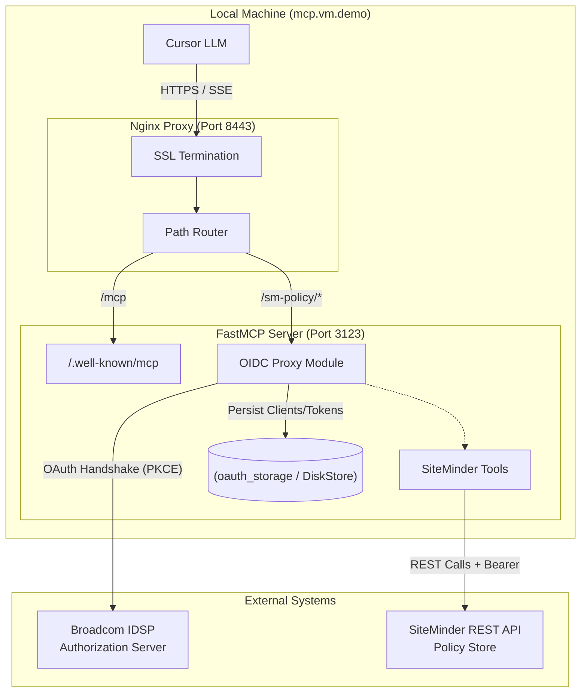
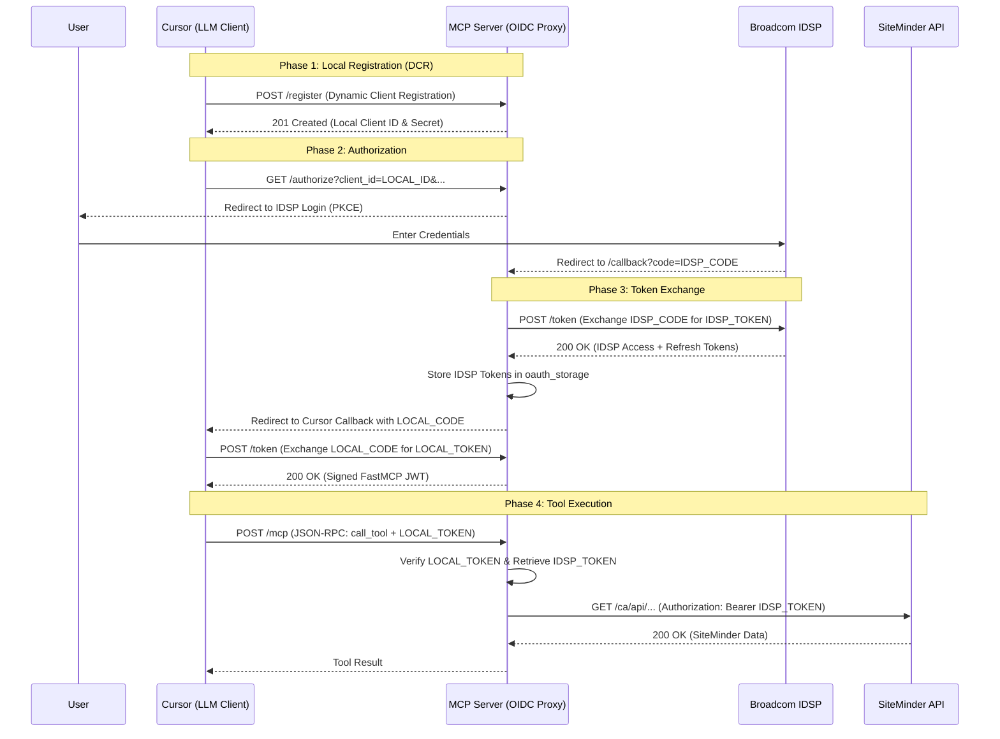

# SiteMinder MCP OAuth 2.0 Flow & Architecture

This document explains how authentication and authorization are handled in the SiteMinder Policy MCP Assistant. It details the "Identity Bridge" pattern used to connect a dynamic LLM client (Cursor) with an enterprise Identity Provider (Broadcom IDSP).

## 1. High-Level Architecture

The system uses a **Local Identity Proxy** pattern. Your MCP server acts as a "Virtual Authorization Server" for Cursor while remaining a standard, pre-registered OAuth client for Broadcom IDSP.

---

## 2. The Role of the OIDC Proxy: "The Identity Bridge"

In a standard OAuth world, roles are strictly separated. The `OIDCProxy` in FastMCP performs **"Identity Impersonation"** to bridge the gap between developer tools and enterprise security.

### A. Virtual Authorization Server (Facing Cursor)
Cursor expects a "Self-Service" OAuth model where it can register itself via Dynamic Client Registration (DCR). Most enterprise servers (like Broadcom IDSP) do not support this.
*   **The Proxy helps by:** Providing the `/register`, `/.well-known/openid-configuration`, and `/token` endpoints locally. It "adopts" Cursor as a child-client under its own pre-approved enterprise identity.

### B. Pre-Registered OAuth Client (Facing Broadcom IDSP)
Broadcom IDSP only trusts applications that have been manually onboarded by an administrator.
*   **The Proxy helps by:** Being the "one and only" client that IDSP ever sees. It uses your official `IDSP_CLIENT_ID` to "vouch" for Cursor. It handles the complex PKCE challenge and enterprise scopes (like `offline_access`) required by SiteMinder.

### C. Resource Server (The Gatekeeper)
When a tool call arrives at `/mcp`, the Proxy acts as a standard PEP (Policy Enforcement Point).
*   **The Proxy helps by:** Token Translation. Cursor uses a "local" JWT signed by your `JWT_SIGNING_KEY`. The Proxy verifies this, looks up the corresponding "real" IDSP token in its `DiskStore`, and uses that real token to call the SiteMinder API.

---

## 3. Sequence Diagram

This diagram illustrates the handshake between the user, Cursor, your MCP Proxy, and Broadcom IDSP.

---

## 4. Endpoint Analysis (Nginx Logs)

When Cursor connects, it performs a specific discovery dance. Our Nginx configuration is tuned to handle these paths by proxying them from the root to the internal FastMCP server:

| URL | Standard OAuth Role | Implementation Detail |
| :--- | :--- | :--- |
| `/.well-known/oauth-protected-resource/...` | **Resource Server** | Tells Cursor: "I am protected, here is my Auth Server URL." |
| `/.well-known/openid-configuration` | **Auth Server** | Hosted by the Proxy to provide discovery metadata to Cursor. |
| `/register` | **Auth Server** | Handled by the Proxy to "fake" DCR for Cursor. |
| `/authorize` | **Auth Server** | Received from Cursor, translated, and proxied to IDSP. |
| `/token` | **Auth Server** | Exchanged for a local JWT signed with `JWT_SIGNING_KEY`. |
| `/callback` | **OAuth Client** | The endpoint where IDSP sends the user back after login. |

---

## 5. Why this is necessary
If Cursor attempted to talk to IDSP directly:
1.  **DCR would fail:** IDSP would reject the `/register` call from an unknown client.
2.  **Redirect Mismatch:** You would have to register every developer's unique `cursor://` redirect URI in the IDSP production console.
3.  **Persistence:** By using a local `DiskStore`, we ensure that once you log in, your session persists across server restarts, providing a seamless AI experience.
